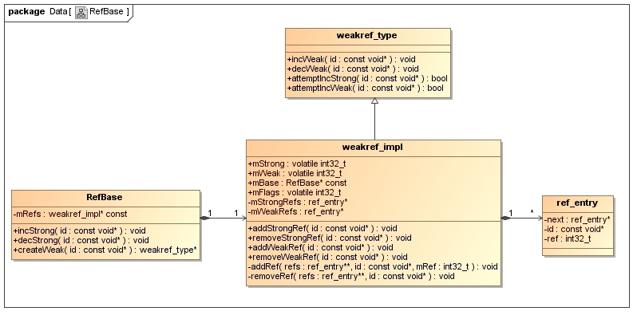

# 引用计数器

## RefBase [interface class]

要想我们的对象可以使用强弱指针提供的特性，我们在定义类的时候，首先要继承的就是　RefBase　类

```c++
// frameworks$ vim ./rs/cpp/util/RefBase.h

class RefBase
{
public:
            void            incStrong(const void* id) const;
            void            decStrong(const void* id) const;

            void            forceIncStrong(const void* id) const;

            //! DEBUGGING ONLY: Get current strong ref count.
            int32_t         getStrongCount() const;

    class weakref_type
    {   
    public:
        RefBase*            refBase() const;

        void                incWeak(const void* id);
        void                decWeak(const void* id);

        // acquires a strong reference if there is already one.
        bool                attemptIncStrong(const void* id);

        // acquires a weak reference if there is already one.
        // This is not always safe. see ProcessState.cpp and BpBinder.cpp
        // for proper use.
        bool                attemptIncWeak(const void* id);

        //! DEBUGGING ONLY: Get current weak ref count.
        int32_t             getWeakCount() const;

        //! DEBUGGING ONLY: Print references held on object.
        void                printRefs() const;

        //! DEBUGGING ONLY: Enable tracking for this object.
        // enable -- enable/disable tracking
        // retain -- when tracking is enable, if true, then we save a stack trace
        //           for each reference and dereference; when retain == false, we
        //           match up references and dereferences and keep only the
        //           outstanding ones.

        void                trackMe(bool enable, bool retain);
    };

            weakref_type*   createWeak(const void* id) const;

            weakref_type*   getWeakRefs() const;

            //! DEBUGGING ONLY: Print references held on object.
    inline  void            printRefs() const { getWeakRefs()->printRefs(); }

            //! DEBUGGING ONLY: Enable tracking of object.
    inline  void            trackMe(bool enable, bool retain)
    {
        getWeakRefs()->trackMe(enable, retain);
    }

    typedef RefBase basetype;

protected:
                            RefBase();
    virtual                 ~RefBase();

    //! Flags for extendObjectLifetime()
    enum {
        OBJECT_LIFETIME_STRONG  = 0x0000,
        OBJECT_LIFETIME_WEAK    = 0x0001,
        OBJECT_LIFETIME_MASK    = 0x0001
    };

            void            extendObjectLifetime(int32_t mode);

    //! Flags for onIncStrongAttempted()
    enum {
        FIRST_INC_STRONG = 0x0001
    };

    virtual void            onFirstRef();
    virtual void            onLastStrongRef(const void* id);
    virtual bool            onIncStrongAttempted(uint32_t flags, const void* id);
    virtual void            onLastWeakRef(const void* id);

private:
    friend class ReferenceMover;
    static void moveReferences(void* d, void const* s, size_t n,
            const ReferenceConverterBase& caster);

private:
    friend class weakref_type;
    class weakref_impl;                                                                                                                                                                                            

                            RefBase(const RefBase& o);
            RefBase&        operator=(const RefBase& o);

        weakref_impl* const mRefs;                                                                                                                                                                                 
};
```

RefBase类和LightRefBase类一样，提供了incStrong和decStrong成员函数来操作它的引用计数器；而RefBase类与LightRefBase类最大的区别是，它不像LightRefBase类一样直接提供一个整型值（mutable volatile int32_t mCount）来维护对象的引用计数，前面我们说过，复杂的引用计数技术同时支持强引用计数和弱引用计数，在RefBase类中，这两种计数功能是通过其成员变量mRefs来提供的。

### RefBase() [Construct]

```cpp
RefBase::RefBase()                 
    : mRefs(new weakref_impl(this))
{   
}
```

结论：　RefBase.mRefs中保存了weakref_impl　对象，　到后面我们会看到　weakref_impl.mBase 中保存了 RefBase

他们是互相进行关联

### ~RefBase()

```c++
RefBase::~RefBase()
{
    if (mRefs->mStrong.load(std::memory_order_relaxed)
            == INITIAL_STRONG_VALUE) {
        // 当对象被创建出来，但却从来没有被　sp 所指向过，将调用这里，此时释放　mRefs
        delete mRefs;
    } else {
        
        int32_t flags = mRefs->mFlags.load(std::memory_order_relaxed);
        // 如果本次析构是在　强引用计数为0时所触发的。此时不走下面的分支，也无法将　mRefs 释放，而是这里将　mRefs = NULL 而已。　mRefs的释放还得　在后面的逻辑中，进行释放
        
        // 如果本次析构函数是由　弱引用计数为0时所触发，此时就会执行下面的分支，此时先释放　mRefs, 在释放RefBase（我们的对象自己）　
        if ((flags & OBJECT_LIFETIME_MASK) != OBJECT_LIFETIME_STRONG) {
            
            if (mRefs->mWeak.load(std::memory_order_relaxed) == 0) {
                delete mRefs;
            }
        }
    }
    
    const_cast<weakref_impl*&>(mRefs) = NULL; // 这里虽然直接被赋值为NULL,但不是delete 但是在　weakref_type::decWeak() 函数中，　已经将　mRefs　赋值给了　impl, 
}
```


### mRefs [weakref_impl*]

weakref_impl* const mRefs;

### weakref_impl [class]

类的信息

```c++
// system/core/libutils/RefBase.cpp
class RefBase::weakref_impl : public RefBase::weakref_type{

};
```

1. weakref_impl 是　RefBase　的内部类
2. weakref_impl　继承于　RefBase::weakref_type　类

总的来说，weakref_impl类只要提供了以下四个成员变量来维护对象的引用计数：

```c
std::atomic<int32_t>    mStrong;
std::atomic<int32_t>    mWeak;
RefBase* const          mBase;
std::atomic<int32_t>    mFlags;
```

其中mStrong和mWeak分别表示对象的强引用计数和弱引用计数；RefBase类包含了一个weakref_impl类指针mRefs，而这里的weakref_impl类也有一个成员变量mBase来指向它的宿主类RefBase；mFlags是一个标志位，它指示了维护对象引用计数所使用的策略，后面我们将会分析到，它的取值为0，或者以下的枚举值：

```c++
//! Flags for extendObjectLifetime()
    enum {
        OBJECT_LIFETIME_STRONG  = 0x0000,
        OBJECT_LIFETIME_WEAK    = 0x0001,
        OBJECT_LIFETIME_MASK    = 0x0001
    };
```

   这里我们还需要注意的一点的是，从weakref_impl的类名来看，它应该是一个实现类，那么，就必然有一个对应的接口类，这个对应的接口类的就是RefBase类内部定义的weakref_type类了，这是一种把类的实现与接口定义分离的设计方法。学习过设计模式的读者应该知道，在设计模式里面，非常强调类的接口定义和类的实现分离，以便利于后续扩展和维护，这里就是用到了这种设计思想。

说了这多，RefBase类给人的感觉还是挺复杂的，不要紧，我们一步步来，先通过下面这个图来梳理一下这些类之间的关系：



 从这个类图可以看出，每一个RefBase对象包含了一个weakref_impl对象，而weakref_impl对象实现了weakref_type接口，同时它可以包含多个ref_entry对象，前面说过，ref_entry是调试用的一个结构体，实际使用中可以不关注。

        提供引用计数器的类RefBase我们就暂时介绍到这里，后面我们再结合智能指针类一起分析，现在先来看看强指针类和弱指针类的定义。强指针类的定义我们在前面介绍轻量级指针的时候已经见到了，就是sp类了，这里就不再把它的代码列出来了。我们来看看它的构造函数的实现：
### incStrong [func]

```c++
// system/core/libutils/RefBase.cpp

void RefBase::incStrong(const void* id) const
{
    weakref_impl* const refs = mRefs;
    
    refs->incWeak(id);
    refs->addStrongRef(id);
    
    const int32_t c = refs->mStrong.fetch_add(1, std::memory_order_relaxed);
    
    if (c != INITIAL_STRONG_VALUE)  {
        return;
    }   

    int32_t old = refs->mStrong.fetch_sub(INITIAL_STRONG_VALUE,
            std::memory_order_relaxed);
    
    refs->mBase->onFirstRef();
}
```

成员变量mRefs是在RefBase类的构造函数中创建的：

```cpp
// system/core/libutils/RefBase.cpp

RefBase::RefBase(): mRefs(new weakref_impl(this))
{
}
```

 在这个incStrong函数中，主要做了三件事情：

1. 增加弱引用计数：

```c++
refs->incWeak(id);
```

接着又调用了weakref_impl类的incWeak函数，真正增加弱引用计数值就是在这个函数实现的了，weakref_impl类的incWeak函数继承于其父类weakref_type的incWeak函数

```c++
void RefBase::weakref_type::incWeak(const void* id)
{
    weakref_impl* const impl = static_cast<weakref_impl*>(this);
    impl->addWeakRef(id);
    const int32_t c __unused = impl->mWeak.fetch_add(1,
            std::memory_order_relaxed); // 在这个地方，被加1 了
    ALOG_ASSERT(c >= 0, "incWeak called on %p after last weak ref", this);
}
```


2. 增加强引用计数:

```c++
refs->addStrongRef(id);
```

```c++
void addStrongRef(const void* id) {
        addRef(&mStrongRefs, id, mStrong.load(std::memory_order_relaxed));
    }
```

3. 如果发现是首次调用这个对象的incStrong函数，就会调用一个这个对象的onFirstRef函数，让对象有机会在对象被首次引用时做一些处理逻辑

```c++
	// std::atomic<int32_t>    mStrong;
	const int32_t c = refs->mStrong.fetch_add(1, std::memory_order_relaxed);	
	if (c != INITIAL_STRONG_VALUE)  {
        return;
    }   

    int32_t old = refs->mStrong.fetch_sub(INITIAL_STRONG_VALUE,
            std::memory_order_relaxed);
    
    refs->mBase->onFirstRef(); // 复写该函数，可以让我们的对象做一些前期的准备工作
```

这里的c返回的是refs->mStrong加1前的值，如果发现等于INITIAL_STRONG_VALUE，就说明这个对象的强引用计数是第一次被增加，因此，refs->mStrong就是初始化为INITIAL_STRONG_VALUE的，它的值为：

fetch_add 函数的使用　http://www.cplusplus.com/reference/atomic/atomic/fetch_add/

```c
#define INITIAL_STRONG_VALUE (1<<28)
```

 这个值加1后等于1<<28 + 1，不等于1，因此，后面要再减去-INITIAL_STRONG_VALUE，于是，refs->mStrong就等于1了，就表示当前对象的强引用计数值为1了，这与这个对象是第一次被增加强引用计数值的逻辑是一致的.


**总结**

 **这里总结一下强指针类sp在其构造函数里面所做的事情就是分别为目标对象的强引用计数和弱引和计数增加了1。**


### decStrong [func]

```c++
void RefBase::decStrong(const void* id) const
{
    weakref_impl* const refs = mRefs;
    refs->removeStrongRef(id);
    const int32_t c = refs->mStrong.fetch_sub(1, std::memory_order_release);                       
    if (c == 1) {
        std::atomic_thread_fence(std::memory_order_acquire);
        refs->mBase->onLastStrongRef(id);　// 复写该函数　可以让我们的对象做一次收尾工作
        int32_t flags = refs->mFlags.load(std::memory_order_relaxed);
        if ((flags&OBJECT_LIFETIME_MASK) == OBJECT_LIFETIME_STRONG) {
            delete this;
            // Since mStrong had been incremented, the destructor did not
            // delete refs.
        }   
    }   
    // Note that even with only strong reference operations, the thread
    // deallocating this may not be the same as the thread deallocating refs.
    // That's OK: all accesses to this happen before its deletion here,
    // and all accesses to refs happen before its deletion in the final decWeak.
    // The destructor can safely access mRefs because either it's deleting
    // mRefs itself, or it's running entirely before the final mWeak decrement.
    refs->decWeak(id);
}
```

这里的refs->removeStrongRef函数调用语句是对应前面在RefBase::incStrong函数里的refs->addStrongRef函数调用语句的，在Release版本中，这也是一个空实现函数，真正实现强引用计数减1的操作是下面语句：

```c++
const int32_t c = refs->mStrong.fetch_sub(1, std::memory_order_release);
```

如果发现减1前，此对象的强引用计数为1，就说明从此以后，就再没有地方引用这个目标对象了，这时候，就要看看是否要delete这个目标对象了：

```c++
	if (c == 1) {
        std::atomic_thread_fence(std::memory_order_acquire);
        refs->mBase->onLastStrongRef(id);
        int32_t flags = refs->mFlags.load(std::memory_order_relaxed);
        if ((flags&OBJECT_LIFETIME_MASK) == OBJECT_LIFETIME_STRONG) {
            // 这里就是　判断当前这个对象所采用的　析构的方式，当flag为　OBJECT_LIFETIME_STRONG　时，此时就　释放该自己( 我们的对象是继承于　RefBase的，所以这里也就是释放的我们对象自己)　
            delete this;
        }   
    }   
```

如果是　OBJECT_LIFETIME_STRONG　我们的　对象在 delete this 就被释放了，虽然　我们的对象被释放了，但是此时的　mRefs(weakref_impl*) 指针指向的内容却没有释放。他是在　RefBase的构造函数中new 出来的。所以此时的　refs->decWeak(id);　中的　refs并不是野指针。

继续执行; refs->decWeak(id);

```c++
void RefBase::weakref_type::decWeak(const void* id)
{
    weakref_impl* const impl = static_cast<weakref_impl*>(this);
    impl->removeWeakRef(id);// 这个和调试有关，不去关注
    const int32_t c = impl->mWeak.fetch_sub(1, std::memory_order_release);
    
    if (c != 1) return;
    atomic_thread_fence(std::memory_order_acquire);

    int32_t flags = impl->mFlags.load(std::memory_order_relaxed);
    if ((flags&OBJECT_LIFETIME_MASK) == OBJECT_LIFETIME_STRONG) {
        
        if (impl->mStrong.load(std::memory_order_relaxed)
                == INITIAL_STRONG_VALUE) {
            delete impl->mBase;
        } else {
            delete impl;
        }
    } else {
        impl->mBase->onLastWeakRef(id);
        delete impl->mBase;
    }
}
```

这里又一次调用了weakref_impl对象的removeWeakRef函数，这也是和RefBase::weakref_type::incWeak函数里面的impl->addWeakRef语句所对应的，实现弱引用计数减1的操作是下面语句：

```c++
const int32_t c = impl->mWeak.fetch_sub(1, std::memory_order_release);
```

减1前如果发现不等于1，那么就什么也不用做就返回了，如果发现等于1，就说明当前对象的弱引用计数值为0了，这时候，就要看看是否要delete这个对象了：

```c++
	int32_t flags = impl->mFlags.load(std::memory_order_relaxed);
    if ((flags&OBJECT_LIFETIME_MASK) == OBJECT_LIFETIME_STRONG) {
        
        if (impl->mStrong.load(std::memory_order_relaxed)
                == INITIAL_STRONG_VALUE) {
            delete impl->mBase;
        } else {
            delete impl;
        }
    } else {
        impl->mBase->onLastWeakRef(id);
        delete impl->mBase;
    }
```

如果目标对象的生命周期是不受弱引用计数控制的，就执行下面语句：

```c++
if (impl->mStrong.load(std::memory_order_relaxed)
                == INITIAL_STRONG_VALUE) {
            delete impl->mBase;
        } else {
            delete impl;
        }
```

 这个代码段是什么意思呢？这里是减少对象的弱引用计数的地方，如果调用到这里，那么就说明前面一定有增加过此对象的弱引用计数，而增加对象的弱引用计数有两种场景的，一种场景是增加对象的强引用计数的时候，会同时增加对象的弱引用计数，另一种场景是当我们使用一个弱指针来指向对象时，在弱指针对象的构造函数里面，也会增加对象的弱引用计数，不过这时候，就只是增加对象的弱引用计数了，并没有同时增加对象的强引用计数。因此，这里在减少对象的弱引用计数时，就要分两种情况来考虑。

如果是前一种场景，这里的impl->mStrong就必然等于0，而不会等于INITIAL_STRONG_VALUE值，因此，这里就不需要delete目标对象了（impl->mBase），因为前面的RefBase::decStrong函数会负责delete这个对象。这里唯一需要做的就是把weakref_impl对象delete掉，但是，为什么要在这里delete这个weakref_impl对象呢？这里的weakref_impl对象是在RefBase的构造函数里面new出来的，理论上说应该在在RefBase的析构函数里delete掉这个weakref_impl对象的。在RefBase的析构函数里面，的确是会做这件事情,但也是分情况的，具体看　~RefBase() 章节的分析

```c++
RefBase::~RefBase()
{
    if (mRefs->mStrong.load(std::memory_order_relaxed)
            == INITIAL_STRONG_VALUE) {
        // 这个对象被创建出来之后，　从来没有被　sp 所指向过　才会走这个分支
        delete mRefs;
    } else {
        // 如果本次析构是在　强引用计数为0时所触发的。此时不走下面的分支，也无法将　mRefs 释放，而是这里将　mRefs = NULL 而已。　mRefs的释放还得　在后面的逻辑中，进行释放
        
        // 如果本次析构函数是由　弱引用计数为0时所触发，此时就会执行下面的分支，此时先释放　mRefs, 在释放RefBase（我们的对象自己）　
        int32_t flags = mRefs->mFlags.load(std::memory_order_relaxed);
        if ((flags & OBJECT_LIFETIME_MASK) != OBJECT_LIFETIME_STRONG) {
            
            if (mRefs->mWeak.load(std::memory_order_relaxed) == 0) {
                delete mRefs;
            }
        }
    }
   
    const_cast<weakref_impl*&>(mRefs) = NULL;// 这里虽然直接被赋值为NULL,但不是delete 但是在　weakref_type::decWeak() 函数中，　已经将　mRefs　赋值给了　impl, 
}
```

但是不要忘记，在这个场景下，目标对象是前面的RefBase::decStrong函数delete掉的，这时候目标对象就会被析构，但是它的弱引用计数值尚未执行减1操作，因此，这里的mRefs->mWeak == 0条件就不成立，于是就不会delete这个weakref_impl对象，因此，就延迟到执行这里decWeak函数时再执行。　也就是这里的

```c++
if (impl->mStrong.load(std::memory_order_relaxed)
                == INITIAL_STRONG_VALUE) {
            delete impl->mBase;
        } else {
            delete impl; // 这个
        }
```

如果是后一种情景，这里的impl->mStrong值就等于INITIAL_STRONG_VALUE了，这时候由于没有地方会负责delete目标对象，因此，就需要把目标对象（imp->mBase）delete掉了，否则就会造成内存泄漏。在delete这个目标对象的时候，就会执行RefBase类的析构函数，这时候目标对象的弱引用计数等于0，于是，就会把weakref_impl对象也一起delete掉了。

```c++
if (impl->mStrong.load(std::memory_order_relaxed)
                == INITIAL_STRONG_VALUE) {
            delete impl->mBase;  // 这个
        } else {
            delete impl;
        }
```

理论上说，如果目标对象的生命周期是受弱引用计数控制的，那么当强引用计数和弱引用计数都为0的时候，这时候就应该delete目标对象了，但是这里还有另外一层控制，我们可以设置目标对象的标志值为OBJECT_LIFETIME_FOREVER，即目标对象的生命周期完全不受强引用计数和弱引用计数控制，在这种情况下，即使目标对象的强引用计数和弱引用计数都同时为0，这里也不能delete这个目标对象，那么，由谁来delete掉呢？当然是谁new出来的，就谁来delete掉了，这时候智能指针就完全退化为普通指针了，这里的智能指针设计的非常强大。**但是在android 7.1 中我们却看不到　OBJECT_LIFETIME_FOREVER，　也没有相关的逻辑了**

### 总结

```shell
    A. 如果对象的标志位被设置为0，那么只要发现对象的强引用计数值为0，那就会自动delete掉这个对象；
    
    B. 如果对象的标志位被设置为OBJECT_LIFETIME_WEAK，那么只有当对象的强引用计数和弱引用计数都为0的时候，才会自动delete掉这个对象；

    C. 如果对象的标志位被设置为OBJECT_LIFETIME_FOREVER，那么对象就永远不会自动被delete掉，谁new出来的对象谁来delete掉。

```
​    到了这里，强指针就分析完成了，最后来分析弱指针。

# 强指针类

## sp [class]

```c++
// system/core/include/utils/StrongPointer.h:59

template<typename T>
class sp {
public:
    inline sp() : m_ptr(0) { }

    sp(T* other);
    sp(const sp<T>& other);
    sp(sp<T>&& other);
    template<typename U> sp(U* other);
    template<typename U> sp(const sp<U>& other);
    template<typename U> sp(sp<U>&& other);

    ~sp();

    // Assignment

    sp& operator = (T* other);
    sp& operator = (const sp<T>& other);
    sp& operator = (sp<T>&& other);

    template<typename U> sp& operator = (const sp<U>& other);
    template<typename U> sp& operator = (sp<U>&& other);
    template<typename U> sp& operator = (U* other);

    //! Special optimization for use by ProcessState (and nobody else).
    void force_set(T* other);

    // Reset

    void clear();

    // Accessors

    inline  T&      operator* () const  { return *m_ptr; }
    inline  T*      operator-> () const { return m_ptr;  }
    inline  T*      get() const         { return m_ptr; }

    // Operators

    COMPARE(==)
    COMPARE(!=)
    COMPARE(>)
    COMPARE(<)
    COMPARE(<=)
    COMPARE(>=)

private:    
    template<typename Y> friend class sp;
    template<typename Y> friend class wp;
    void set_pointer(T* ptr);
    T* m_ptr;
};

#undef COMPARE

// ---------------------------------------------------------------------------
// No user serviceable parts below here.

template<typename T>
sp<T>::sp(T* other)
        : m_ptr(other) {
    if (other)
        other->incStrong(this);
}

template<typename T>
sp<T>::sp(const sp<T>& other)
        : m_ptr(other.m_ptr) {
    if (m_ptr)
        m_ptr->incStrong(this);
}

template<typename T>
sp<T>::sp(sp<T>&& other)
        : m_ptr(other.m_ptr) {
    other.m_ptr = nullptr;
}

template<typename T> template<typename U>
sp<T>::sp(U* other)
        : m_ptr(other) {
    if (other)
        ((T*) other)->incStrong(this);
}

template<typename T> template<typename U>
sp<T>::sp(const sp<U>& other)
        : m_ptr(other.m_ptr) {
    if (m_ptr)
        m_ptr->incStrong(this);
}

template<typename T> template<typename U>
sp<T>::sp(sp<U>&& other)
        : m_ptr(other.m_ptr) {
    other.m_ptr = nullptr;
}

template<typename T>
sp<T>::~sp() {
    if (m_ptr)
        m_ptr->decStrong(this);
}

template<typename T>
sp<T>& sp<T>::operator =(const sp<T>& other) {
    T* otherPtr(other.m_ptr);
    if (otherPtr)
        otherPtr->incStrong(this);
    if (m_ptr)
        m_ptr->decStrong(this);
    m_ptr = otherPtr;
    return *this;
}

template<typename T>
sp<T>& sp<T>::operator =(sp<T>&& other) {
    if (m_ptr)
        m_ptr->decStrong(this);
    m_ptr = other.m_ptr;
    other.m_ptr = nullptr;
    return *this;
}

template<typename T>
sp<T>& sp<T>::operator =(T* other) {
    if (other)
        other->incStrong(this);
    if (m_ptr)
        m_ptr->decStrong(this);
    m_ptr = other;
    return *this;
}

template<typename T> template<typename U>
sp<T>& sp<T>::operator =(const sp<U>& other) {
    T* otherPtr(other.m_ptr);
    if (otherPtr)
        otherPtr->incStrong(this);
    if (m_ptr)
        m_ptr->decStrong(this);
    m_ptr = otherPtr;
    return *this;
}

template<typename T> template<typename U>
sp<T>& sp<T>::operator =(sp<U>&& other) {
    if (m_ptr)
        m_ptr->decStrong(this);
    m_ptr = other.m_ptr;
    other.m_ptr = nullptr;
    return *this;
}

template<typename T> template<typename U>
sp<T>& sp<T>::operator =(U* other) {
    if (other)
        ((T*) other)->incStrong(this);
    if (m_ptr)
        m_ptr->decStrong(this);
    m_ptr = other;
    return *this;
}

template<typename T>
void sp<T>::force_set(T* other) {
    other->forceIncStrong(this);
    m_ptr = other;
}

template<typename T>
void sp<T>::clear() {
    if (m_ptr) {
        m_ptr->decStrong(this);
        m_ptr = 0;
    }
}

template<typename T>
void sp<T>::set_pointer(T* ptr) {
    m_ptr = ptr;
}
```

### sp(T* other) [Construct]

构造函数

```c++
template<typename T>
sp<T>::sp(T* other)
        : m_ptr(other) {
    if (other)
        other->incStrong(this);
}
```

 这里传进来的参数other一定是继承于RefBase类的，因此，在函数的内部，它调用的是RefBase类的incStrong函数，它定义在system/core/libutils/RefBase.cpp文件中：

```c++
void RefBase::incStrong(const void* id) const
{
    // 具体的分析见　incStrong [func] 章节
}
```

构造函数算是分析完了，　接下来分析　sp 的析构函数

### operator =

```c++
template<typename T>
sp<T>& sp<T>::operator =(T* other) {
    if (other)
        other->incStrong(this);　// 这里同样调用到了　incStrong
    if (m_ptr)
        m_ptr->decStrong(this);
    m_ptr = other;
    return *this;
}
```

我们如下的操作，将调用到如上的 code:

```c++
sp<StrongClass> spInner = pStrongClass; // pStrongClass [StrongClass *] 是个指针赋值
```

这里的执行流程如下：

```shell
1. 先调用如下的构造函数：　sp()
2. 调用如上的　= 操作符重载函数
```

```c++
// sp() 构造函数如下
inline sp() : m_ptr(0) { }
```

### ~sp()

```c++
template<typename T>
sp<T>::~sp() {                  
    if (m_ptr)
        m_ptr->decStrong(this);
}
```

```c++
void RefBase::decStrong(const void* id) const{...}
```

同样，这里的m_ptr指向的目标对象一定是继承了RefBase类的，因此，这里调用的是**RefBase类的decStrong函数，**

具体对　decStrong() 的分析，见　decStrong [func] 章节