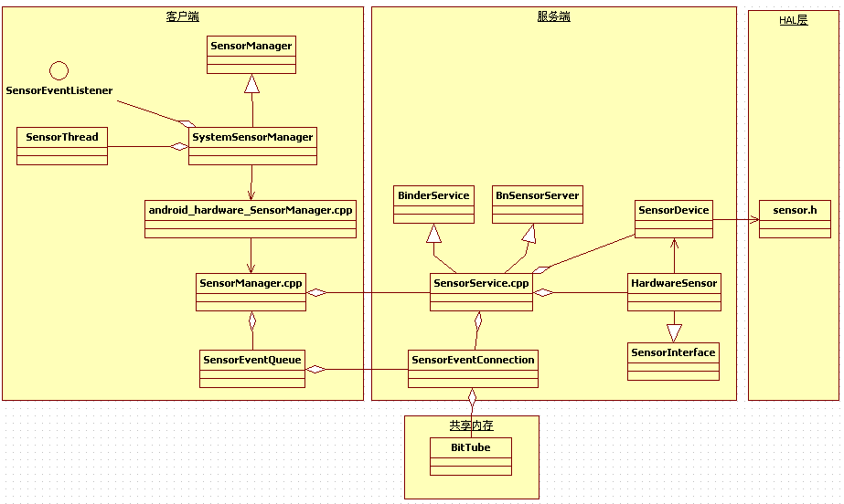
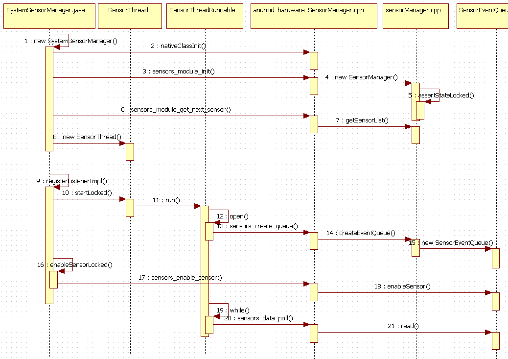
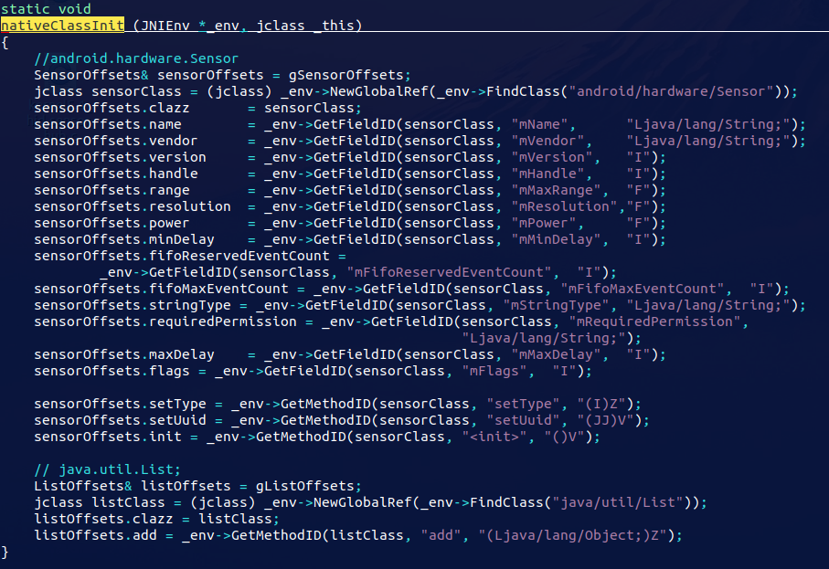
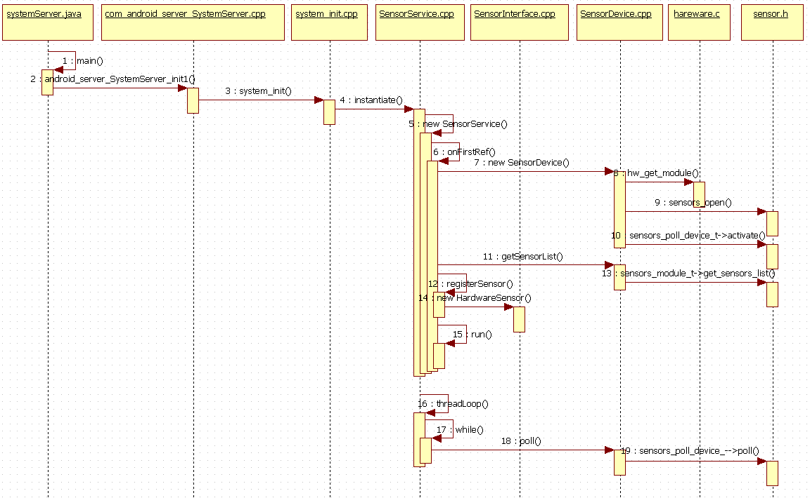
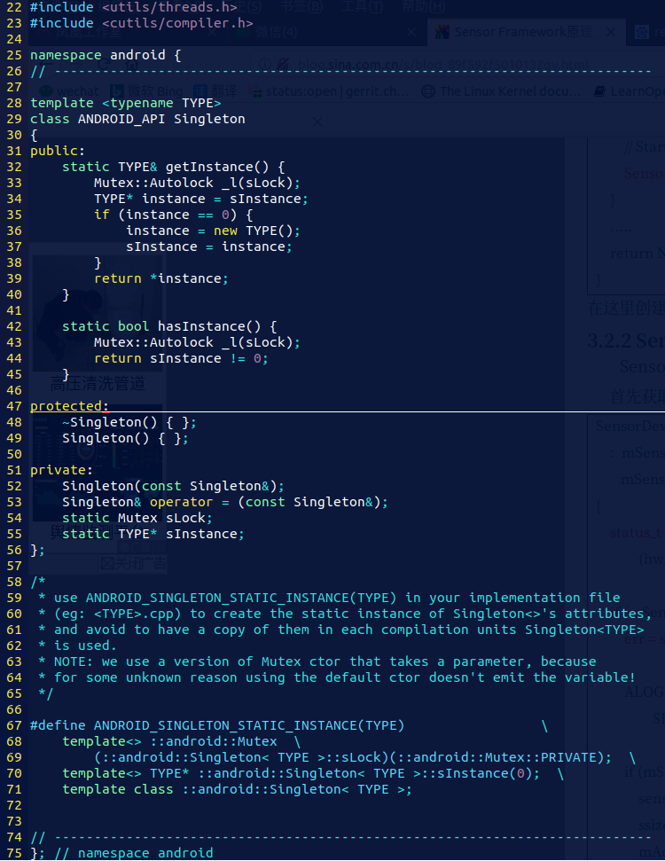

我是参照如下分析　http://blog.sina.com.cn/s/blog_89f592f5010132qy.html

对phoenixos [android7.1]进行的分析

# 1. 总体调用关系图



Sensor 
框架分为三个层次，客户度、服务端、HAL层，服务端负责从HAL读取数据，并将数据写到管道中，客户端通过管道读取服务端数据。下面简单解释类的功能

## 1.1 客户端主要类

- SensorManager.java
  - 从　android4.1 开始，把SensorManager定义为一个抽象类，定义了一些主要的方法，类主要是应用层直接使用的类，提供给应用层的接口
  
- SystemSensorManager.java
  - 继承于SensorManager，客户端消息处理的实体，应用程序通过获取其实例，并注册监听接口，获取sensor数据
  - sensorEventListener接口
    - 用于注册监听的接口
  - sensorThread
    - 是SystemSensorManager的一个内部类，开启一个新线程负责读取读取sensor数据，当注册了sensorEventListener接口的时候才会启动线程
- android_hardware_SensorManager.cpp
  - 负责与java层通信的JNI接口
- SensorManager.cpp
  - sensor在Native层的客户端，负责与服务端SensorService.cpp的通信
- SenorEventQueue.cpp
  - 消息队列

## 1.2 服务端主要类

- SensorService.cpp
  - 服务端数据处理中心
  - SensorEventConnection
    - 从BnSensorEventConnection继承来，实现接口ISensorEventConnection的一些方法，ISensorEventConnection在SensorEventQueue会保存一个指针，指向调用服务接口创建的SensorEventConnection对象
- BitTube.cpp
  - 在这个类中创建了管道，即共享内存，用于服务端与客户端读写数据
- SensorDevice.cpp
  - 负责与HAL读取数据

## 1.3 HAL层

Sensor.h是google为Sensor定义的Hal接口，这里我们主要介绍Framework层。[sensor HAL介绍](http://blog.sina.com.cn/s/blog_89f592f5010130c8.html)<http://blog.sina.com.cn/s/blog_89f592f5010130c8.html>

# 2. 客户端读取数据

## 2.1 调用时序



## 2.2 代码分析

### 2.2.1 app层

在app 层中使用　sensor 时，只需要，　在Activity中实现 SensorEventListener  接口，并注册这个接口

#### 2.2.1.1 apk例子

```java
void onCreate(){
    ...
    SensorManager  mSensorManager = (SensorManager)getSystemService(SENSOR_SERVICE);

 	Sensor mAccelerometer = mSensorManager.getDefaultSensor(Sensor.TYPE_ACCELEROMETER);
    ...
}

protected void onResume() {
	super.onResume();
    mSensorManager.registerListenerImpl(this,
                                        mAccelerometer,
                                        SensorManager.SENSOR_DELAY_NORMAL);

	}

protected void onPause() {
           super.onPause();
         	mSensorManager.unregisterListener(this);
     }

void onSensorChanged(SensorEvent event){
    ...
}

void onAccuracyChanged(Sensor sensor, int accuracy){
    ...
}
```

```java
public interface SensorEventListener {
    public void onSensorChanged(SensorEvent event);
    public void onAccuracyChanged(Sensor sensor, int accuracy);
}
```

没有把全部代码写出来，Activity实现了SensorEventListener接口，在onCreate方法中，获取SystemSensorManager，并获取到加速传感器的Sensor，在onResume方法中调用SystemSensorManager.
registerListenerImpl注册监听器，当Sensor数据有改变的时候将会回调onSensorChanged方法。

#### 2.2.1.2 屏幕翻转例子

这个例子取自，屏幕翻转的例子。虽然这个例子是从framework中拿的。但，也属于应用层编程的范畴

```java
// frameworks$ vim ./base/services/core/java/com/android/server/policy/WindowOrientationListener.java

// [WindowOrientationListener.AccelSensorJudge]
public void onSensorChanged(SensorEvent event) {
    
    ...
        
    updatePredictedRotationLocked(now, nearestRotation);
    
    mProposedRotation = mPredictedRotation; // mPredictedRotation 在　updatePredictedRotationLocked　中被赋值的
    
    proposedRotation = mProposedRotation;
    
    // CHAOZHUO BEGIN
    if (proposedRotation == Surface.ROTATION_0 || proposedRotation == Surface.ROTATION_180) {
          onProposedRotationChanged(proposedRotation); // 在这个地方实现的屏幕翻转
    }
    // CHAOZHUO END
}


# 几个继承关系
class AccelSensorJudge extends OrientationJudge 
class OrientationJudge implements SensorEventListener

public interface SensorEventListener {
    public void onSensorChanged(SensorEvent event);
    public void onAccuracyChanged(Sensor sensor, int accuracy);
}
```

这部分相当是实现了　SensorEventListener　接口中的　onSensorChanged　函数。

在哪里注册的呢？

```java
// WindowOrientationListener.java
private Sensor mSensor;
String SENSOR_SERVICE = "sensor";
private SensorManager mSensorManager;

// [WindowOrientationListener]
private WindowOrientationListener(Context context, Handler handler, int rate) {
    // 构造函数

    mSensorManager = (SensorManager)context.getSystemService(Context.SENSOR_SERVICE); 
    
    mSensor = mSensorManager.getDefaultSensor(USE_GRAVITY_SENSOR
                    ? Sensor.TYPE_GRAVITY : Sensor.TYPE_ACCELEROMETER);
    
    mOrientationJudge = new AccelSensorJudge(context); // 这个就是我们的传感器的监听
}


// 注册的地方
// [WindowOrientationListener]
public void enable() {
    mSensorManager.registerListener(mOrientationJudge, mSensor, mRate, DEFAULT_BATCH_LATENCY, mHandler);
    
    mEnabled = true;
}
```

到这里　可以对比　2.2.1.1 发现全部都可以对应上。

****

**这部分内容并不是本文分析的重点:**

这里暂时记录一下framework中调用　enable() 注册这个传感器监听的时机。

- 预备知识
  - class AudioWindowOrientationListener extends WindowOrientationListener
  - sWindowOrientationListener = new AudioWindowOrientationListener(context, handler);

```java
// RotationHelper.java

// [RotationHelper]
static void init(Context context, Handler handler) {
    sWindowOrientationListener = new AudioWindowOrientationListener(context, handler);
    sWindowOrientationListener.enable(); // 
}
```

```java
// AudioService.java

// [AudioService]　构造函数
public AudioService(Context context) {
    
    mMonitorRotation = SystemProperties.getBoolean("ro.audio.monitorRotation", false);
        if (mMonitorRotation) {
            RotationHelper.init(mContext, mAudioHandler);               
        }
}
```

从这里我们可以知道，android系统中，第一次，对屏幕方向监听的注册时机在　启动　AudioService　的时候

### 2.2.2 初始化 SystemSensorManager

1. SystemSensorManager extends SensorManager,
2. 在 app 中 (SensorManager)getSystemService(SENSOR_SERVICE);就是为了拿到　SystemSensorManager

现在来看 SystemSensorManager 的初始化。

```java
// SystemSensorManager.java
private final long mNativeInstance;

public SystemSensorManager(Context context, Looper mainLooper) {
        synchronized(sLock) {
            if (!sNativeClassInited) {
                sNativeClassInited = true;
                nativeClassInit(); // 分析
            }   
        }   

        mMainLooper = mainLooper;
        mTargetSdkLevel = context.getApplicationInfo().targetSdkVersion;
        mContext = context;
        mNativeInstance = nativeCreate(context.getOpPackageName());// 分析

        // initialize the sensor list
        for (int index = 0;;++index) {
            Sensor sensor = new Sensor(); // 在java层分配空间，却是在　c层进行填充
            if (!nativeGetSensorAtIndex(mNativeInstance, sensor, index)) break;   // 分析                                                                         
            mFullSensorsList.add(sensor);
            mHandleToSensor.put(sensor.getHandle(), sensor);
        }   
    } 
```

这里有三个函数：

1. nativeClassInit()
2. nativeCreate()
   - mNativeInstance 保存了　native 层中的　SensorManager(), 而SensorManager是用来连接SensorService的
3. nativeGetSensorAtIndex

  系统开机启动的时候，会创建SystemSensorManager的实例，在其构造函数中，主要做了四件事情：

- 初始化JNI

   	调用JNI函数nativeClassInit()进行初始化

- 初始化Sensor列表

  ​	 调用JNI函数nativeCreate，对Sensor模块进行初始化。创建了native层SensorManager的实例。

- 获取Sensor列表

   	调用JNI函数assertStateLocked()获取Sensor，并存在mSensorList列表中

- 构造SensorThread类

  ​	 构造线程的类函数，并没有启动线程，当有应用注册的时候才会启动线程

#### 2.2.2.1 nativeClassInit

```cpp
// android_hardware_SensorManager.cpp

static const JNINativeMethod gSystemSensorManagerMethods[] = { 
    {"nativeClassInit",
            "()V",
            (void*)nativeClassInit },
    {"nativeCreate",
             "(Ljava/lang/String;)J",
             (void*)nativeCreate },

    {"nativeGetSensorAtIndex",
            "(JLandroid/hardware/Sensor;I)Z",
            (void*)nativeGetSensorAtIndex },

}
```



#### 2.2.2.2 nativeCreate

```cpp
static jlong
nativeCreate
(JNIEnv *env, jclass clazz, jstring opPackageName)
{
    ScopedUtfChars opPackageNameUtf(env, opPackageName);
    return (jlong) &SensorManager::getInstanceForPackage(String16(opPackageNameUtf.c_str()));
}
```


```cpp
// SensorManager.cpp
SensorManager& SensorManager::getInstanceForPackage(const String16& packageName) {
    
    Mutex::Autolock _l(sLock);
    SensorManager* sensorManager;
    std::map<String16, SensorManager*>::iterator iterator =                         
        sPackageInstances.find(packageName);// 根据传入的包名　找到对应的 SensorManager

    if (iterator != sPackageInstances.end()) {
        sensorManager = iterator->second;
    } else {
        String16 opPackageName = packageName;

        ...
    
        sensorManager = new SensorManager(opPackageName);// 第一次创建包对应的　SensorManager

        // Stash the per package sensor manager.
        sPackageInstances.insert(std::make_pair(opPackageName, sensorManager));
    }

    return *sensorManager; // 这里在c 层创建的，却将对象保存在　java 层了，　符合动态对动态，静态对静态的思路
    
}
```


```cpp
// SensorManager.cpp 

// 构造函数
SensorManager::SensorManager(const String16& opPackageName)
    : mSensorList(0), mOpPackageName(opPackageName) {
    assertStateLocked();
}
```


```cpp
// SensorManager.cpp
status_t SensorManager::assertStateLocked() {
    ALOGE("colby %s %d\n", __func__, __LINE__);
    bool initSensorManager = false;
    if (mSensorServer == NULL) {
        initSensorManager = true;
    } else {
       ...
    }
    if (initSensorManager) {
        // try for 300 seconds (60*5(getService() tries for 5 seconds)) before giving up ...
        const String16 name("sensorservice");
        for (int i = 0; i < 60; i++) {
            status_t err = getService(name, &mSensorServer); // 获取 sensorservice 服务
            if (err == NAME_NOT_FOUND) {
                sleep(1);
                continue;
            }
            if (err != NO_ERROR) {
                return err;
            }
            break;
        }

        ...

        mSensors = mSensorServer->getSensorList(mOpPackageName);// 获取传感器列表
        size_t count = mSensors.size();
        mSensorList =
                static_cast<Sensor const**>(malloc(count * sizeof(Sensor*))); // 分配空间

        for (size_t i=0 ; i<count ; i++) {
            mSensorList[i] = mSensors.array() + i;// 填充mSensorList
        }
    }       
    return NO_ERROR;
}
```

分析到最后，我们发现 assertStateLocked , 最后获取到了传感器的列表


#### 2.2.2.3 nativeGetSensorAtIndex 

```c
// android_hardware_SensorManager.cpp
// 此时传入的　sensorManager　是在　nativeCreate 中创建的　SensorManger ，并在java层保存的

static jboolean
nativeGetSensorAtIndex(JNIEnv *env, jclass clazz, jlong sensorManager, jobject sensor, jint index)                                 
{
    SensorManager* mgr = reinterpret_cast<SensorManager*>(sensorManager);
    Sensor const* const* sensorList;
    ssize_t count = mgr->getSensorList(&sensorList); // 从sensor service 端拿到　sensorlist    的信息

    // *sensorList[index]: 拿到对应　index 对应的信息
    return translateNativeSensorToJavaSensor(env, sensor, *sensorList[index]) != NULL;
}
```


```cpp
// SensorManager.cpp
ssize_t SensorManager::getSensorList(Sensor const* const** list) {
    status_t err = assertStateLocked();// 在前面有分析过，目的是　获取传感器列表
    if (err < 0) {
        return static_cast<ssize_t>(err);
    }
    *list = mSensorList;
    return static_cast<ssize_t>(mSensors.size());
}
```


```cpp
// android_hardware_SensorManager.cpp
static jobject
translateNativeSensorToJavaSensor(JNIEnv *env, jobject sensor, const Sensor& nativeSensor) {
    const SensorOffsets& sensorOffsets(gSensorOffsets);

    if (sensor == NULL) {
        // Sensor sensor = new Sensor();
        sensor = env->NewObject(sensorOffsets.clazz, sensorOffsets.init, "");
    }

    if (sensor != NULL) {
        jstring name = env->NewStringUTF(nativeSensor.getName().string());
        jstring vendor = env->NewStringUTF(nativeSensor.getVendor().string());
        jstring requiredPermission =
                env->NewStringUTF(nativeSensor.getRequiredPermission().string());

        env->SetObjectField(sensor, sensorOffsets.name,      name);
        env->SetObjectField(sensor, sensorOffsets.vendor,    vendor);
        env->SetIntField(sensor, sensorOffsets.version,      nativeSensor.getVersion());
        env->SetIntField(sensor, sensorOffsets.handle,       nativeSensor.getHandle());
        env->SetFloatField(sensor, sensorOffsets.range,      nativeSensor.getMaxValue());
        env->SetFloatField(sensor, sensorOffsets.resolution, nativeSensor.getResolution());
        env->SetFloatField(sensor, sensorOffsets.power,      nativeSensor.getPowerUsage());
        env->SetIntField(sensor, sensorOffsets.minDelay,     nativeSensor.getMinDelay());
        env->SetIntField(sensor, sensorOffsets.fifoReservedEventCount,
                         nativeSensor.getFifoReservedEventCount());
        env->SetIntField(sensor, sensorOffsets.fifoMaxEventCount,
                         nativeSensor.getFifoMaxEventCount());
        env->SetObjectField(sensor, sensorOffsets.requiredPermission,
                            requiredPermission);
        env->SetIntField(sensor, sensorOffsets.maxDelay, nativeSensor.getMaxDelay());
        env->SetIntField(sensor, sensorOffsets.flags, nativeSensor.getFlags());

        if (env->CallBooleanMethod(sensor, sensorOffsets.setType, nativeSensor.getType())
                == JNI_FALSE) {
            jstring stringType = getInternedString(env, &nativeSensor.getStringType());
            env->SetObjectField(sensor, sensorOffsets.stringType, stringType);
        }

        // TODO(b/29547335): Rename "setUuid" method to "setId".
        int64_t id = nativeSensor.getId();
        env->CallVoidMethod(sensor, sensorOffsets.setUuid, id, 0);                         
    }
    return sensor;
}
```

translateNativeSensorToJavaSensor() 函数主要功能就是填充　java层的　sensor　对象.


### 2.2.3 注册传感器监听

应用层调用

```java
mSensorManager.registerListener(mOrientationJudge, mSensor, mRate, DEFAULT_BATCH_LATENCY, mHandler);
```

registerListener() 最终会被调用到如下的　registerListenerImpl() 代码中

对应的代码在:

```java
protected boolean registerListenerImpl(SensorEventListener listener, Sensor sensor,              
            int delayUs, Handler handler, int maxBatchReportLatencyUs, int reservedFlags) {
        synchronized (mSensorListeners) {
            SensorEventQueue queue = mSensorListeners.get(listener);// 从mSensorListeners　找到之前　add过得，　第一次这里返回 null
            if (queue == null) {
                // 这里决定用　自己的looper  还是　主线程的looper
                Looper looper = (handler != null) ? handler.getLooper() : mMainLooper;
                
                final String fullClassName = listener.getClass().getEnclosingClass() != null ?
                    listener.getClass().getEnclosingClass().getName() :
                    listener.getClass().getName();
                
                // new SensorEventQueue
                queue = new SensorEventQueue(listener, looper, this, fullClassName);
                if (!queue.addSensor(sensor, delayUs, maxBatchReportLatencyUs)) {
                    queue.dispose();
                    return false;
                }
                mSensorListeners.put(listener, queue);　// 将　SensorEventQueue　添加到　mSensorListeners
                return true;
            } else {
                ...
            }   
        }   
    }
```

注册的时候，　新建了一个　SensorEventQueue(), 将这个　listener 和 queue 加入 mSensorListeners 中。

```java
// SystemSensorManager.java

public SensorEventQueue(SensorEventListener listener, Looper looper,
                SystemSensorManager manager, String packageName) {   
            super(looper, manager, OPERATING_MODE_NORMAL, packageName);
            mListener = listener;
        }
```

继承关系　SensorEventQueue extends BaseEventQueue

```java
// SystemSensorManager.java

// 构造函数
BaseEventQueue(Looper looper, SystemSensorManager manager, int mode, String packageName) {
            if (packageName == null) packageName = "";
    
            nSensorEventQueue = nativeInitBaseEventQueue(manager.mNativeInstance,
                    new WeakReference<>(this), looper.getQueue(), 
                    packageName, mode, manager.mContext.getOpPackageName());
    
            mCloseGuard.open("dispose");
            mManager = manager;
        }
```

这里调用了　native 函数　nativeInitBaseEventQueue

```cpp
// android_hardware_SensorManager.cpp

static jlong nativeInitSensorEventQueue(JNIEnv *env, jclass clazz, jlong sensorManager, 
        jobject eventQWeak, jobject msgQ, jstring packageName, jint mode) {
    
    SensorManager* mgr = reinterpret_cast<SensorManager*>(sensorManager);
    ScopedUtfChars packageUtf(env, packageName);
    String8 clientName(packageUtf.c_str());
    
    sp<SensorEventQueue> queue(mgr->createEventQueue(clientName, mode));

    sp<MessageQueue> messageQueue = android_os_MessageQueue_getMessageQueue(env, msgQ);
    if (messageQueue == NULL) {
        jniThrowRuntimeException(env, "MessageQueue is not initialized.");
        return 0;
    }   

    sp<Receiver> receiver = new Receiver(queue, messageQueue, eventQWeak);
    receiver->incStrong((void*)nativeInitSensorEventQueue);
    return jlong(receiver.get());
}
```

这里最终　new Receiver，并最终返回到　java 层　nSensorEventQueue　进行保存

在　new Receiver 时传入了　queue　messageQueue

１．queue(mgr->createEventQueue(clientName, mode))

２．android_os_MessageQueue_getMessageQueue(env, msgQ);

#### createEventQueue

```cpp
// SensorManager.cpp

sp<SensorEventQueue> SensorManager::createEventQueue(String8 packageName, int mode) {
    
    sp<SensorEventQueue> queue;        
    
    while (assertStateLocked() == NO_ERROR) {
        sp<ISensorEventConnection> connection =
                mSensorServer->createSensorEventConnection(packageName, mode, mOpPackageName);
        if (connection == NULL) {
            // SensorService just died or the app doesn't have required permissions.
            ALOGE("createEventQueue: connection is NULL.");
            return NULL;
        }   
        queue = new SensorEventQueue(connection);　
        break;
    }   
    return queue;
}
```

1. 在native 层中　调用服务端的 createSensorEventConnection
2. 在native 层中　也同样 new SensorEventQueue 出来

****

**createSensorEventConnection**

现在来看　createSensorEventConnection　对做了些什么：

```cpp
// SensorService.cpp 
sp<ISensorEventConnection> SensorService::createSensorEventConnection(const String8& packageName,int requestedMode, const String16& opPackageName) {
      

    uid_t uid = IPCThreadState::self()->getCallingUid();
    sp<SensorEventConnection> result(new SensorEventConnection(this, uid, packageName,
            requestedMode == DATA_INJECTION, opPackageName));
    if (requestedMode == DATA_INJECTION) {
        if (mActiveConnections.indexOf(result) < 0) { 
            mActiveConnections.add(result);
        }    
        // Add the associated file descriptor to the Looper for polling whenever there is data to                                                                                                                  
        // be injected.
        result->updateLooperRegistration(mLooper);
    }    
    return result;
}
```

服务端也 new SensorEventConnection 出来

```cpp
// SensorEventConnection.cpp

// 构造函数
SensorService::SensorEventConnection::SensorEventConnection(const sp<SensorService>& service, uid_t uid, String8 packageName, bool isDataInjectionMode,const String16& opPackageName):mService(service),mUid(uid),mWakeLockRefCount(0),mHasLooperCallbacks(false),mDead(false),mDataInjectionMode(isDataInjectionMode),mEventCache(NULL),mCacheSize(0),mMaxCacheSize(0),mPackageName(packageName),mOpPackageName(opPackageName){、
    
    mChannel = new BitTube(mService->mSocketBufferSize);// 这里就有意思了
}
```

在　mChannel 中有我们　传输数据的　fd

主要是　new BitTube

```cpp
// BitTube.cpp
BitTube::BitTube(size_t bufsize):mSendFd(-1), mReceiveFd(-1)
{       
    init(bufsize, bufsize);
}

void BitTube::init(size_t rcvbuf, size_t sndbuf) {
    int sockets[2];
    if (socketpair(AF_UNIX, SOCK_SEQPACKET, 0, sockets) == 0) {
        size_t size = DEFAULT_SOCKET_BUFFER_SIZE;
        setsockopt(sockets[0], SOL_SOCKET, SO_RCVBUF, &rcvbuf, sizeof(rcvbuf));
        setsockopt(sockets[1], SOL_SOCKET, SO_SNDBUF, &sndbuf, sizeof(sndbuf));
        // sine we don't use the "return channel", we keep it small...
        setsockopt(sockets[0], SOL_SOCKET, SO_SNDBUF, &size, sizeof(size));
        setsockopt(sockets[1], SOL_SOCKET, SO_RCVBUF, &size, sizeof(size));
        fcntl(sockets[0], F_SETFL, O_NONBLOCK);
        fcntl(sockets[1], F_SETFL, O_NONBLOCK);
        mReceiveFd = sockets[0];
        mSendFd = sockets[1];
    } else {
        mReceiveFd = -errno;
        ALOGE("BitTube: pipe creation failed (%s)", strerror(-mReceiveFd));
    }                   
}
```

发现在　BitTube　中我们创建了　用于传输数据的　双向管道

****

**new SensorEventQueue**

这里在来看　new SensorEventQueue

```cpp
// SensorEventQueue.cpp

SensorEventQueue::SensorEventQueue(const sp<ISensorEventConnection>& connection)
    :mSensorEventConnection(connection), mRecBuffer(NULL), mAvailable(0), mConsumed(0),
      mNumAcksToSend(0) {
    mRecBuffer = new ASensorEvent[MAX_RECEIVE_BUFFER_EVENT_COUNT];
}
```

将　connection　放到　mSensorEventConnection　中，　new ASensorEvent

```cpp
/* NOTE: Must match hardware/sensors.h */
typedef struct ASensorEvent {         
    int32_t version; /* sizeof(struct ASensorEvent) */
    int32_t sensor;
    int32_t type;
    int32_t reserved0;
    int64_t timestamp;
    union {
        union {
            float           data[16];
            ASensorVector   vector;
            ASensorVector   acceleration;
            ASensorVector   magnetic;
            float           temperature;
            float           distance;
            float           light;
            float           pressure;
            float           relative_humidity;
            AUncalibratedEvent uncalibrated_gyro;
            AUncalibratedEvent uncalibrated_magnetic;
            AMetaDataEvent meta_data;
            AHeartRateEvent heart_rate;
            ADynamicSensorEvent dynamic_sensor_meta;
            AAdditionalInfoEvent additional_info;
        };
        union {
            uint64_t        data[8];
            uint64_t        step_counter;
        } u64;
    };

    uint32_t flags;
    int32_t reserved1[3];
} ASensorEvent;
```


ASensorEvent 这个和　hardware 中的　sensor.h　是相同的。　代表　传感器上报的数据。

#### android_os_MessageQueue_getMessageQueue

# 3. 服务端实现

## 3.1 调用时序图



## 3.2 代码分析

### 3.2.1 启动SensorService服务

在　SystemServer 进程中的　startBootstrapServices 　调用　startSensorService()　

```shell
main() # SystemServer.java
	-> run()
		-> System.loadLibrary("android_servers");
		-> startBootstrapServices()
			-> startSensorService() # native 方法
---------------------------------------------------------------------------------java
---------------------------------------------------------------------------------cpp
android_server_SystemServer_startSensorService()
	-> SensorService::instantiate(); # 此时启动了服务
```

```cpp
// com_android_server_SystemServer.cpp

static const JNINativeMethod gMethods[] = { 
    /* name, signature, funcPtr */
    { "startSensorService", "()V", (void*) android_server_SystemServer_startSensorService },
};

static void android_server_SystemServer_startSensorService(JNIEnv* /* env */, jobject /* clazz */) {
    char propBuf[PROPERTY_VALUE_MAX];
    property_get("system_init.startsensorservice", propBuf, "1");
    if (strcmp(propBuf, "1") == 0) {
        // Start the sensor service
        SensorService::instantiate();
    }   
}
```

****

System.loadLibrary("android_servers");

此时加载的　库是　libandroid_servers.so 

```makefile
# frameworks/base/services$ vim Android.mk

include $(CLEAR_VARS)

LOCAL_SRC_FILES :=
LOCAL_SHARED_LIBRARIES :=

# include all the jni subdirs to collect their sources
include $(wildcard $(LOCAL_PATH)/*/jni/Android.mk)  
LOCAL_CFLAGS += -DEGL_EGLEXT_PROTOTYPES -DGL_GLEXT_PROTOTYPES
LOCAL_MODULE:= libandroid_servers

include $(BUILD_SHARED_LIBRARY)
```

include $(wildcard $(LOCAL_PATH)/*/jni/Android.mk) 此时这句意思是　加载　当前目录下　所有jni 目录中的　Android.mk

此时就将　frameworks/base/services/core/jni/Android.mk　包含进来了。

也就是说，在SystemService.java中　 loadLibrary("android_servers")　时，就将我们想要调用的东东加入进来了。

****

#### 3.2.1.1 SensorService::instantiate

```cpp
class SensorService :          
        public BinderService<SensorService>,
        public BnSensorServer,
        protected Thread
{

}
```

```cpp
class BinderService
{
public:
    static status_t publish(bool allowIsolated = false) {
        sp<IServiceManager> sm(defaultServiceManager());
        return sm->addService(
                String16(SERVICE::getServiceName()),
                new SERVICE(), allowIsolated);
    }

    static void publishAndJoinThreadPool(bool allowIsolated = false) {
        publish(allowIsolated);
        joinThreadPool();
    }

    static void instantiate() { publish(); }

    static status_t shutdown() { return NO_ERROR; }

private:
    static void joinThreadPool() {
        sp<ProcessState> ps(ProcessState::self());
        ps->startThreadPool();
        ps->giveThreadPoolName();
        IPCThreadState::self()->joinThreadPool();
    }
};
```

从　publish()中我们可以知道：

1. new SensorService()
2. 添加到　defaultServiceManager　中

当　第一次　new　SensorService 时，回首先调用

```cpp
// SensorService.cpp

void SensorService::onFirstRef() {
    
    SensorDevice& dev(SensorDevice::getInstance()); // 这个地方就要开始访问我们的hal层了
    
    if (dev.initCheck() == NO_ERROR) { 
        sensor_t const* list;
        ssize_t count = dev.getSensorList(&list); // 获得传感器
        
        registerSensor(new OrientationSensor(), !needRotationVector, true); 
    }
    ...
    mLooper = new Looper(false);
    ...
    mAckReceiver = new SensorEventAckReceiver(this);
    mAckReceiver->run("SensorEventAckReceiver", PRIORITY_URGENT_DISPLAY);
    run("SensorService", PRIORITY_URGENT_DISPLAY);
    
}
```

 在这个方法中，主要做了4件事情：

1. 创建SensorDevice实例
2. 获取Sensor列表
   - 调用SensorDevice.getSensorList(),获取Sensor模块所有传感器列表
3. 为每个传感器注册监听器
4. new Looper 
5. 创建　SensorEventAckReceiver　对象，并启动线程，调用　SensorEventAckReceiver.threadLoop()
6. 启动　自己的线程　SensorService.threadLoop

##### SensorDevice::getInstance



```cpp
// SensorDevice.cpp
ANDROID_SINGLETON_STATIC_INSTANCE(SensorDevice) // 在这里　去　new SensorDevice()
```

```cpp
// SensorDevice.cpp 

// 构造函数如下：
SensorDevice::SensorDevice()
    :  mSensorDevice(0),
       mSensorModule(0) {
    status_t err = hw_get_module(SENSORS_HARDWARE_MODULE_ID,
            (hw_module_t const**)&mSensorModule);　// 1. 

    if (mSensorModule) {
        err = sensors_open_1(&mSensorModule->common, &mSensorDevice); // 2. 


        if (mSensorDevice) {

            sensor_t const* list;
            ssize_t count = mSensorModule->get_sensors_list(mSensorModule, &list);
            mActivationCount.setCapacity(count);
            Info model;
            for (size_t i=0 ; i<size_t(count) ; i++) {
                mActivationCount.add(list[i].handle, model);
                mSensorDevice->activate(
                        reinterpret_cast<struct sensors_poll_device_t *>(mSensorDevice),
                        list[i].handle, 0); // 3. 
            }
        }
    }
}
```

 这里主要做了三个工作：

1. 调用HAL层的hw_get_modele()方法，加载Sensor模块so文件

2. 调用sensor.h的 sensors_open_1() 方法打开设备

3. 调用sensors_poll_device_t->activate()对Sensor模块使能

##### dev.initCheck()

```c
//  SensorDevice.cpp

status_t SensorDevice::initCheck() const {
    return mSensorDevice && mSensorModule ? NO_ERROR : NO_INIT;
}
```

检查　hal层是否初始化完毕：

- 当 我们拿到hal层的　信息后，这里将返回　NO_ERROR

##### registerSensor()

```c
// SensorService.cpp

const Sensor& SensorService::registerSensor(SensorInterface* s, bool isDebug, bool isVirtual) {
    int handle = s->getSensor().getHandle();
    int type = s->getSensor().getType();
    if (mSensors.add(handle, s, isDebug, isVirtual)){
        mRecentEvent.emplace(handle, new RecentEventLogger(type));
        return s->getSensor();
    } else {
        return mSensors.getNonSensor();
    }       
}
```

##### SensorEventAckReceiver.threadLoop

```cpp
// frameworks/native/services/sensorservice/SensorService.cpp

bool SensorService::SensorEventAckReceiver::threadLoop() {          
    ALOGD("new thread SensorEventAckReceiver");
    sp<Looper> looper = mService->getLooper();
    do { 
        bool wakeLockAcquired = mService->isWakeLockAcquired();
        int timeout = -1;
        if (wakeLockAcquired) timeout = 5000;
        int ret = looper->pollOnce(timeout); // 这个地方有　epoll
        if (ret == ALOOPER_POLL_TIMEOUT) {
           mService->resetAllWakeLockRefCounts();
        }
    } while(!Thread::exitPending());
    return false;
}
```

##### SensorService.threadLoop

这个在　3.2.3 中　进行分析

### 3.2.3 在新的线程中读取HAL层数据

SensorService实现了Thread类，当在onFirstRef中调用run方法的后，将在新的线程中调用SensorService::threadLoop()方法。

```cpp
// SensorService.cpp

bool SensorService::threadLoop() {
    
    SensorDevice& device(SensorDevice::getInstance());
    
    do {
        ssize_t count = device.poll(mSensorEventBuffer, numEventMax);
        
        SortedVector< sp<SensorEventConnection> > activeConnections;
        populateActiveConnections(&activeConnections);// 将所有　已连接的　SensorEventConnection


        ...
            
            
        bool needsWakeLock = false;
        size_t numConnections = activeConnections.size();
        for (size_t i=0 ; i < numConnections; ++i) {
            if (activeConnections[i] != 0) {
                activeConnections[i]->sendEvents(mSensorEventBuffer, count, mSensorEventScratch,mMapFlushEventsToConnections); // 从这里发送出去
                
                
                needsWakeLock |= activeConnections[i]->needsWakeLock();
                if (activeConnections[i]->hasOneShotSensors()) {
                    cleanupAutoDisabledSensorLocked(activeConnections[i], mSensorEventBuffer,
                            count);
                }
            }
        }
        
    }　while (!Thread::exitPending());
}
```

在while循环中一直读取HAL层数据，再调用SensorEventConnection->sendEvents将数据写到管道中。