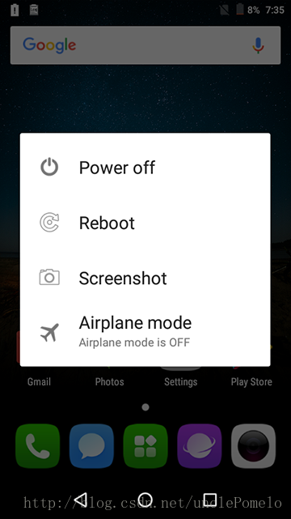
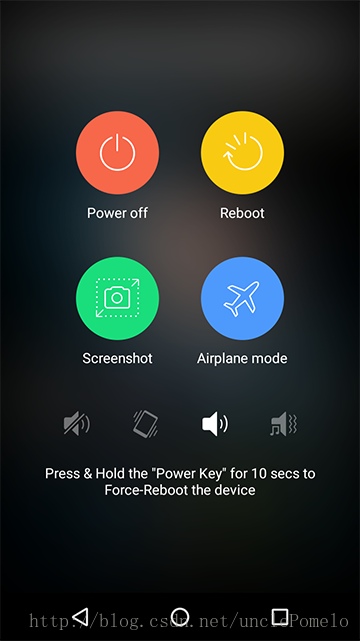

https://blog.csdn.net/unclePomelo/article/details/78375350

本文的分析基于Android官方提供的Android7.0源码

Android设备长按电源键，会弹出一个对话框。

现有一个需求，就是定制一个弹出的对话框。


Android在Frameworks下的PhoneWindowManager对电源按键和Home键的事件做了处理，不会将这些键传送到上层应用。因此，我们可以从PhoneWindowManager入手处理长按电源键的一系列事件。
PhoneWindowManager的源码路径：
frameworks/base/services/core/java/com/android/server/policy/PhoneWindowManager.java

PhoneWindowManager这个类的源码有近8000行，我们不需要从头到尾分析它。我们在源码中搜索关键字：KeyEvent.KEYCODE_POWER，发现该关键字出在“interceptKeyBeforeQueueing”方法里，这方法大概在PhoneWindowManager的5542行，从方法名大概可以猜出该方法就是在系统将事件放到队列之前进行拦截。我们看看KeyEvent.KEYCODE_POWER相关的代码：


```java
case KeyEvent.KEYCODE_POWER: {
     result &= ~ACTION_PASS_TO_USER;
     isWakeKey = false; // wake-up will be handled separately
     if (down) {
         interceptPowerKeyDown(event, interactive);
     } else {
         interceptPowerKeyUp(event, interactive, canceled);
     }
     break;
 }
```

再看看” interceptPowerKeyDown”这个方法：该方法大概100行，处理了各种情况下按下电源按键的事件，就不便贴出全部代码。在该方法的末尾，我发现了跟长按事件有关的代码片段：


```java
private void interceptPowerKeyDown(KeyEvent event, boolean interactive) {
    //省略代码……

  // If the power key has still not yet been handled, then detect short
  // press, long press, or multi press and decide what to do.
  mPowerKeyHandled = hungUp || mScreenshotChordVolumeDownKeyTriggered
          || mScreenshotChordVolumeUpKeyTriggered || gesturedServiceIntercepted;
  if (!mPowerKeyHandled) {
      if (interactive) {
          // When interactive, we're already awake.
          // Wait for a long press or for the button to be released to decide what to do.
          if (hasLongPressOnPowerBehavior()) {
              Message msg = mHandler.obtainMessage(MSG_POWER_LONG_PRESS);
              msg.setAsynchronous(true);
              mHandler.sendMessageDelayed(msg,
                      //省略代码……
          }
      } else {
        //省略代码……
              Message msg = mHandler.obtainMessage(MSG_POWER_LONG_PRESS);
              msg.setAsynchronous(true);
              mHandler.sendMessageDelayed(msg,
                      ViewConfiguration.get(mContext).getDeviceGlobalActionKeyTimeout());
              mBeganFromNonInteractive = true;
         //省略代码……
      }
  }
}
```

可以看到这里用if加了个判断，不过不管是if或者else包裹的代码里都有一个通过Handler发送MSG_POWER_LONG_PRESS消息的操作。因此我们搜索：MSG_POWER_LONG_PRESS，在之前定义好的Handler中找到了相关代码，最后通过Handler调用了“powerLongPress()”方法。

```java
private void powerLongPress() {
    final int behavior = getResolvedLongPressOnPowerBehavior();
    switch (behavior) {
    case LONG_PRESS_POWER_NOTHING:
        break;
    case LONG_PRESS_POWER_GLOBAL_ACTIONS:
        mPowerKeyHandled = true;
        if (!performHapticFeedbackLw(null, HapticFeedbackConstants.LONG_PRESS, false)) {
            performAuditoryFeedbackForAccessibilityIfNeed();
        }
        showGlobalActionsInternal();
        break;
    case LONG_PRESS_POWER_SHUT_OFF:
    case LONG_PRESS_POWER_SHUT_OFF_NO_CONFIRM:
        //省略代码……
        break;
    }
}
```

这个方法里处理了几种长按的情况，其中最有可能跟我们的需求有关的便是LONG_PRESS_POWER_GLOBAL_ACTIONS，追踪到showGlobalActionsInternal()方法

```java
void showGlobalActionsInternal() {
    sendCloseSystemWindows(SYSTEM_DIALOG_REASON_GLOBAL_ACTIONS);
    if (mGlobalActions == null) {
        mGlobalActions = new GlobalActions(mContext, mWindowManagerFuncs);
    }
    final boolean keyguardShowing = isKeyguardShowingAndNotOccluded();
    mGlobalActions.showDialog(keyguardShowing, isDeviceProvisioned());
   //省略代码……
}
```

终于在这里找到了mGlobalActions.showDialog(),我们可以看到这里创建了一个GlobalActions对象，并调用了该对象的showDialog()方法，我们所要定制的界面就是通过该方法显示出来的。GlobalActions和PhoneWindowManager在同一个包下，源码路径：
frameworks/base/services/core/java/com/android/server/policy/GlobalActions.java
我们定位到GlobalActions# showDialog()方法，看看该方法里到底做了什么骚操作；

```java
/**

- Show the global actions dialog (creating if necessary)
- @param keyguardShowing True if keyguard is showing
  */
public void showDialog(boolean keyguardShowing, boolean isDeviceProvisioned) {
  	mKeyguardShowing = keyguardShowing;
  	mDeviceProvisioned = isDeviceProvisioned;
  	if (mDialog != null) {
      mDialog.dismiss();
      mDialog = null;
      // Show delayed, so that the dismiss of the previous dialog completes
      mHandler.sendEmptyMessage(MESSAGE_SHOW);
  	} else {
      handleShow();
 	 }
}
```


这里判断了dialog是否已经创建，我们的需求是定制一个dialog，自然应该从创建dialog开始入手。因此将代码定位到handleShow()方法。

```java
private void handleShow() {
    awakenIfNecessary();
    mDialog = createDialog();
    prepareDialog();
	// If we only have 1 item and it's a simple press action, just do this action.
	if (mAdapter.getCount() == 1
        && mAdapter.getItem(0) instanceof SinglePressAction
        && !(mAdapter.getItem(0) instanceof LongPressAction)) {
    	((SinglePressAction) mAdapter.getItem(0)).onPress();
	} else {
    	WindowManager.LayoutParams attrs = mDialog.getWindow().getAttributes();
    	attrs.setTitle("GlobalActions");
    	mDialog.getWindow().setAttributes(attrs);
    	mDialog.show();
        mDialog.getWindow().getDecorView().
            setSystemUiVisibility(View.STATUS_BAR_DISABLE_EXPAND);
	}
}
```
这个方法主要做了三件事：创建dialog，准备dialog需要的数据，显示dialog
功夫不负有心人，终于定位到定制dialog相关的代码。
我们看到createDialog()返回的是GlobalActionsDialog，它是一个GlobalActions的内部类，继承了Dialog，

```java
private static final class GlobalActionsDialog extends Dialog implements DialogInterface
```

我们要做的就是自己实现一个Dialog，并替换掉GlobalActionsDialog。

GlobalActions内部定义了一个Action接口，像关机，重启，截屏等操作都是继承了Action的子类SinglePressAction，需求中有两项功能是截图，源码中没有截图和重启相关的Action，好在我们是在源码中进行修改，源码提供了一系列的方法。下面以重启为例，自己实现一个相关的Action。

```java
private final class RebootAction extends SinglePressAction implements LongPressAction {
    private RebootAction() {
        super(com.android.internal.R.drawable.ic_menu_rotate,
           R.string.factorytest_reboot);
    }
    @Override
    public boolean onLongPress() {
        return true;
    }
    @Override
    public boolean showDuringKeyguard() {
        return true;
    }
    @Override
    public boolean showBeforeProvisioning() {
        return true;
    }
    @Override
    public void onPress() {
        mWindowManagerFuncs.reboot(true /* confirm */);
    }
}
```

当我们做相应的操作就会调用相对应Action的onPress()方法，具体的操作都是在onPress()方法里实现。这里 Android源码 用了策略模式来实现。还不了解策略模式的童鞋可以点击这里：Android设计模式源码解析之策略模式

准备好需要的Action类，我们就可以着手dialog的实现。
这里我自定义了一个dialog布局，本来项目要求背景高斯模糊，我觉得这种实现方式太过麻烦，我就直接将背景设为一张图片，用FrameLayout作为最外层布局。


```xml
<?xml version="1.0" encoding="utf-8"?>
<FrameLayout xmlns:android="http://schemas.android.com/apk/res/android"
    android:layout_width="match_parent"
    android:layout_height="match_parent"
    android:gravity="center">
<ImageView
    android:scaleType="fitXY"
    android:layout_width="match_parent"
    android:layout_height="match_parent"
    android:background="@drawable/miki_power_blur_img" />

<LinearLayout
    android:id="@+id/container_miki_dialog_view"
    android:layout_width="wrap_content"
    android:layout_height="wrap_content"
    android:layout_gravity="center"
    android:gravity="center"
    android:orientation="vertical">
    <GridLayout
        android:id="@+id/gridlayout_miki_dialog_view"
        android:layout_width="wrap_content"
        android:layout_height="wrap_content"
        android:columnCount="2"
        android:rowCount="2">
    </GridLayout>
</LinearLayout>
</FrameLayout>
```
实现布局之后，还不能让dialog全屏。要想实现全屏，这里借鉴了郭霖的方法：
传送门：Android状态栏微技巧，带你真正理解沉浸式模式

除了设置沉浸式模式还不够，dialog默认是有内边距的，因此你会看到默认的dialog是无法占满全屏的，需使用我们自定义的style

```xml
<style name="custome_dialog" parent="Theme.AppCompat.Dialog">
        <!--是否浮现在activity之上-->
        <item name="android:windowIsFloating">true</item>
        <!-- 全屏 -->
        <item name="android:windowFullscreen">true</item>
        <!--无标题-->
        <item name="android:windowNoTitle">true</item>
        <item name="android:backgroundDimEnabled">true</item><!--灰度-->
        <item name="android:backgroundDimAmount">0.5</item>
        <item name="android:alpha">0.3</item>
</style>
```

同时还需要将dialog的window的布局设为WindowManager.LayoutParams.MATCH_PARENT

除了使用Dialog，我们还可以用Activity来替换。只需将GlobalActions的showDialog方法替换为showActivity，自己实现一些操作即可，这里就不再描述。

另外需要注意的是，由于我们的修改是在framework下进行，需要添加一些资源文件，这里就不重复造轮子了，直接贴上链接，有兴趣的可以去看。
点我跳转：android源码framework下添加新资源的方法

至此整个功能就完成了。不过最后还有个小问题，就是将dialog窗口的布局设为
WindowManager.LayoutParams.MATCH_PARENT的时候，旋转屏幕dialog是不会消失掉的，我们竖屏的布局可能切换到横屏就会出现适配问题，好在项目不需要适配其他型号的机子，只需要在布局的时候调整好横竖屏的布局即可。

若有实现dialog全屏更好的方法，请给我留言。谢谢阅读！
