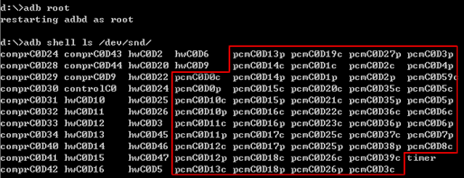
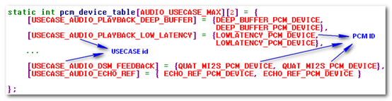
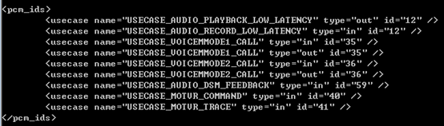

Android上的应用一般都是通过AudioTrack类来播放音频，通过AudioRecord类来录制音频。AudioTrack类和AudioRecord类是Android
Frameworks封装提供给应用使用的音频接口类。这些类经过层层的Binder、JNI等调用后会调用Audio 
HAL层提供的相关接口。这些接口实现了对音频设备、通路等一系列操作。就这样最终完成Android App和硬件的交互，实现声音的播放或者录制。
我们知道，在Linux系统中，所有的设备最终都是抽象成一个或者多个用户空间可以访问的设备文件，用户空间的进程通过这些设备文件的读写来达到控制硬件的目的。而这些设备文件都是由内核空间中的驱动程序创建、实现的。手机上的音频设备、接口比较多，对应的设备文件自然也比较多。对于播放声音或者录制声音来说，Audio
HAL层是通过对PCM设备文件的读写来实现的。

### 查看PCM设备列表

如果手机的音频系统正常工作，我们可以通过adb去查看系统中的所有音频设备文件。如下图所示：

那些以pcm打头的设备就是提供播放或录音的设备即本文要探讨的PCM设备，其他的设备提供效果、合成等功能。
 音频设备的命名规则为 [device type]C[card index]D[device index][capture/playback]，即名字中含有4部分的信息：

1. device type
    设备类型，通常只有compr/hw/pcm这3种。从上图可以看到声卡会管理很多设备，PCM设备只是其中的一种设备。
2. card index
    声卡的id，代表第几块声卡。通常都是0，代表第一块声卡。手机上通常都只有一块声卡。
3. device index
    设备的id，代表这个设备是声卡上的第几个设备。设备的ID只和驱动中配置的DAI link的次序有关。如果驱动没有改变，那么这些ID就是固定的。
4. capture/playback
    只有PCM设备才有这部分，只有c和p两种。c代表capture，说明这是一个提供录音的设备，p代表palyback，说明这是一个提供播放的设备。
    系统会在/proc/asound/pcm文件中列出所有的音频设备的信息，如果是肉眼查看，/proc/asound/pcm中的信息会更直观一些：

### PCM设备文件的访问

查看PCM设备文件的属性，可看到它们都是字符型设备：

对于普通的字符型设备，我们都是通过系统调用open/read/write/close来访问，有些设备支持随机访问，我们还可以使用lseek调用。PCM设备文件也是类似，不一样的是，我们可以使用open/close来打开/关闭设备，读取/写入文件却不是通过read/write，而都是通过ioctl来操作的。
 在Android Audio HAL层中，是通过TinyAlsa来访问PCM设备文件的。TinyAlsa封装了一系列接口用于PCM设备的访问，这些接口被Audio Hal调用以后，最终又会被Frameworks调用。接口包括：

1. struct pcm *pcm_open(unsigned int card, unsigned int device, unsinged int flags, struct pcm_config* config)
2. int pcm_close(struct pcm* pcm)
3. int pcm_write(struct pcm *pcm, const void* data, unsigned int count)
4. int pcm_read(struct pcm* pcm, void* data, unsigned int count)

还有很多其他接口，但我们不需要关心那些细节，除非想要再造一遍轮子。
 从pcm_open这个接口可以看到，它通过几个参数获得了一个句柄，之后所有的操作都通过这个句柄来完成。这些参数里面，card代表第几块声卡，device就是上面提到的device  index，它跟驱动中配置的DAI  link的次序有关，flags参数中会指明这个设备是capture类型还是playback类型。通过这3个参数，就可以找到对应的PCM设备文件，例如  /dev/snd/pcmC0D5p，然后就可以去获取操作它的句柄，然后做更多的操作。

### PCM设备的管理 —— PCM ID

如果我们查看不同型号的手机上的音频设备列表，可以看到它们几乎都是不一样的，有的手机设备文件多，有的手机设备文件少。实际上不只是设备文件个数的差别，还有可能出现在A型号手机上speaker对应的PCM设备文件是/dev/snd/pcmC0D4p，而在B型号手机上speaker对应的PCM设备文件却是/dev/snd/pcmC0D7P。因此，Audio  HAL中需要考虑到这种场景差异的影响。
 我们已经知道，使用TinyAlsa接口访问PCM设备的时候，需要知道设备的id，这个id我们称为PCM  ID，那么如何知道某一个设备例如speaker的PCM  ID呢？另外，在不接耳机的时候，我们希望声音从speaker出来，这时候需要知道的是speaker的PCM  ID，如果接了耳机，我们又希望声音从耳机出来，这时候需要知道的是耳机的PCM ID。
 针对这些问题、需求，Audio  HAL的设计是根据使用场景（USECASE）来决定要使用哪些设备的，即为各个USECASE分别定义好要使用的PCM设备的ID。Frameworks通过USECASE来指定PCM设备，而Audio  HAL通过USECASE来找到PCM设备文件路径。
 如下图所示，Audio HAL通过pcm_device_table这张表完成USECASE到PCM ID的映射。因此，PCM设备的管理实际上就是管理这张映射表。

USECASE与PCM  ID的映射关系可以通过配置文件来修改，这样的好处就是所有产品可以使用同一套代码，差异的地方可以通过控制配置文件的内容就可以简单的区分开来，Audio  HAL会解析这个配置文件，然后更新映射表内容。使用adb shell cat  /system/etc/audio_platform_info.xml可以看到如下配置：

如上图，就会把USECASE_AUDIO_PLAYBACK_LOW_LATENCY这个使用场景的PCM ID更新为12。其他应用场景的PCM ID更新也是类似。

