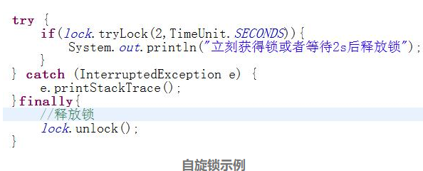

之前讲到了多线程死锁的一些条件，那么要解决死锁就要从条件入手，一般情况下可以按照以下两种方式来解决。

# 1.减少或者避免资源共享

一个资源被多个线程共享，若采用了同步机制，则产生的死锁可能性很大，特别是在项目比较庞大的情况下，很难杜绝死锁，对此最好的解决方法就是减少资源共享。
例如一个B/S结构的办公系统可以完全忽略资源共享，这是因为此类系统有三类特征：一是并发访问不会太高，二是读操作多于写操作，三是数据质量要求比较低，因此即使出现数据资源不同步的情况也不可能产生太大的影响，完全可以不采用同步技术。但是如果是一个支付清算系统就必须慎重考虑资源同步问题了，因此此类系统一是数据质量要求非常高（如果产生数据不同步的情况那可是重大生产事故），而是并发量大，不设置数据同步则会非常多的运算逻辑失效的情况，这会导致交易失败，产生大量的“脏”数据，系统可靠性将大大降低。

# 2.使用自旋锁

比如线程A在等待线程B释放资源，而线程B又在等待线程A释放资源，僵持不下，那如果线程B设置了超时时间是不是就可以解决该死锁问题了呢？比如线程B在等待2秒后还是无法获得资源，则自行终结该任务，代码如下：

上面的代码中使用tryLock实现了自旋锁（Spin Lock），它跟互斥锁一样，如果一个执行单元要想访问被自旋锁保护的共享资源，则必须先得到锁，在访问完共享资源后，也必须释放锁。如果在获取自旋锁时，没有任何执行单元保持该锁，那么将立即得到锁；如果在获取锁操作将“自旋”在那里，直到该自旋锁的保持着释放了锁为止。在上面的代码中，2s内不断尝试能否获得锁，达到2s还不能获得锁资源的话，自旋锁所在的线程就结束运行，另外的线程将获得资源继续运行，死锁解除。

对于死锁的描述最经典的案例是哲学家进餐（五位哲学家围坐在一张圆形餐桌旁，人手一根筷子，做以下两件事情：吃饭和思考。要求吃东西的时候停止思考，思考的时候停止吃东西，而且必须使用两个筷子才能吃东西）。解决此问题的方法很多，比如引入服务生（资源调度），资源分级等方法都可以很好的解决此类死锁问题。

在我们java多线程并发编程中，死锁很难避免，也不容易预防，对付它的最好办法是测试：提高测试覆盖率，建立有效的边界测试，加强资源监控，这些方法也能使死锁无所遁形，即使发生了死锁现象也能迅速查找到原因，提高系统的可靠性。

