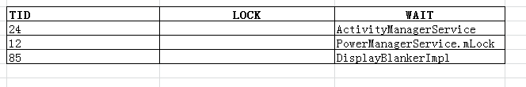
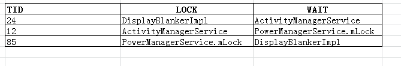

https://blog.csdn.net/oujunli/article/details/9102101#reply

对于从事Android开发的人来说，遇到ANR(Application Not Responding)是比较常见的问题。一般情况下，如果有ANR发生，系统都会在/data/anr/目录下生成trace文件，通过分析trace文件，可以定位产生ANR的原因。产生ANR的原因有很多，比如CPU使用过高、事件没有得到及时的响应、死锁等，下面将通过一次因为死锁导致的ANR问题，来说明如何通过trace文件分析ANR问题。

对应的部分trace文件内容如下：

```shell
"PowerManagerService" prio=5 tid=24 MONITOR
  | group="main" sCount=1 dsCount=0 obj=0x41dd0eb0 self=0x5241b218
  | sysTid=567 nice=0 sched=0/0 cgrp=apps handle=1380038664
  | state=S schedstat=( 6682116007 11324451214 33313 ) utm=450 stm=219 core=1
  at com.android.server.am.ActivityManagerService.broadcastIntent(ActivityManagerService.java:~13045)

  - waiting to lock <0x41a874a0> (a com.android.server.am.ActivityManagerService) held by tid=12 (android.server.ServerThread)
    at android.app.ContextImpl.sendBroadcast(ContextImpl.java:1144)
      at com.android.server.power.PowerManagerService$DisplayBlankerImpl.unblankAllDisplays(PowerManagerService.java:3442)
      at com.android.server.power.DisplayPowerState$PhotonicModulator$1.run(DisplayPowerState.java:456)
      at android.os.Handler.handleCallback(Handler.java:800)
      at android.os.Handler.dispatchMessage(Handler.java:100)
      at android.os.Looper.loop(Looper.java:194)
      at android.os.HandlerThread.run(HandlerThread.java:60)

  "Binder_B" prio=5 tid=85 MONITOR
  | group="main" sCount=1 dsCount=0 obj=0x42744770 self=0x58329e88
  | sysTid=3700 nice=-20 sched=0/0 cgrp=apps handle=1471424616
  | state=S schedstat=( 1663727513 2044643318 6806 ) utm=132 stm=34 core=1
  at com.android.server.power.PowerManagerService$DisplayBlankerImpl.toString(PowerManagerService.java:~3449)

  - waiting to lock <0x41a7e420> (a com.android.server.power.PowerManagerService$DisplayBlankerImpl) held by tid=24 (PowerManagerService)
    at java.lang.StringBuilder.append(StringBuilder.java:202)
      at com.android.server.power.PowerManagerService.dump(PowerManagerService.java:3052)
      at android.os.Binder.dump(Binder.java:264)
      at android.os.Binder.onTransact(Binder.java:236)
      at android.os.IPowerManager$Stub.onTransact(IPowerManager.java:373)
      at android.os.Binder.execTransact(Binder.java:351)
      at dalvik.system.NativeStart.run(Native Method)

"android.server.ServerThread" prio=5 tid=12 MONITOR
  | group="main" sCount=1 dsCount=0 obj=0x41a76178 self=0x507837a8
  | sysTid=545 nice=-2 sched=0/0 cgrp=apps handle=1349936616
  | state=S schedstat=( 15368096286 21707846934 69485 ) utm=1226 stm=310 core=0
  at com.android.server.power.PowerManagerService.isScreenOnInternal(PowerManagerService.java:~2529)

 waiting to lock <0x41a7e2e8> (a java.lang.Object) held by tid=85 (Binder_B)
    at com.android.server.power.PowerManagerService.isScreenOn(PowerManagerService.java:2522)
      at com.android.server.wm.WindowManagerService.sendScreenStatusToClientsLocked(WindowManagerService.java:7749)
      at com.android.server.wm.WindowManagerService.setEventDispatching(WindowManagerService.java:7628)
      at com.android.server.am.ActivityManagerService.updateEventDispatchingLocked(ActivityManagerService.java:8083)
      at com.android.server.am.ActivityManagerService.wakingUp(ActivityManagerService.java:8077)
      at com.android.server.power.Notifier.sendWakeUpBroadcast(Notifier.java:474)
      at com.android.server.power.Notifier.sendNextBroadcast(Notifier.java:455)
      at com.android.server.power.Notifier.access$700(Notifier.java:62)
      at com.android.server.power.Notifier$NotifierHandler.handleMessage(Notifier.java:600)
      at android.os.Handler.dispatchMessage(Handler.java:107)
      at android.os.Looper.loop(Looper.java:194)
      at com.android.server.ServerThread.run(SystemServer.java:1328)
```


​      

   从trace文件看，是因为TID为24的线程等待一个TID为12的线程持有的锁，TID为12的线程等待一个TID为85的线程持有的锁，而TID为85的线程确等待一个TID为24的线程持有的锁，导致了循环等待的现象，对应的trace文件的语句如下：

TID 24：- waiting to lock <0x41a874a0> (a com.android.server.am.ActivityManagerService) held by tid=12 (android.server.ServerThread)

TID 12： - waiting to lock <0x41a7e2e8> (a java.lang.Object) held by tid=85 (Binder_B)

TID 85：- waiting to lock <0x41a7e420> (a com.android.server.power.PowerManagerService$DisplayBlankerImpl) held by tid=24 (PowerManagerService)


   既然是死锁，那么先看各线程都有那些锁。

先看TID=24的线程的栈顶，ActivityManagerService的broadcastIntent函数代码如下:

```java
public final int broadcastIntent(IApplicationThread caller,
        Intent intent, String resolvedType, IIntentReceiver resultTo,
        int resultCode, String resultData, Bundle map,
        String requiredPermission, boolean serialized, boolean sticky, int userId) {
    enforceNotIsolatedCaller("broadcastIntent");
    synchronized(this) {
        intent = verifyBroadcastLocked(intent);
        
        final ProcessRecord callerApp = getRecordForAppLocked(caller);
        final int callingPid = Binder.getCallingPid();
        final int callingUid = Binder.getCallingUid();
        final long origId = Binder.clearCallingIdentity();
        int res = broadcastIntentLocked(callerApp,
                callerApp != null ? callerApp.info.packageName : null,
                intent, resolvedType, resultTo,
                resultCode, resultData, map, requiredPermission, serialized, sticky,
                callingPid, callingUid, userId);
        Binder.restoreCallingIdentity(origId);
        return res;
    }
```

可以看到TID=24需要ActivityManagerService这个锁。再看TID=12线程的栈顶，

PowerManagerService的isScreenOnInternal函数代码如下：

```java

   private boolean isScreenOnInternal() {
        synchronized (mLock) {
            return !mSystemReady
                    || mDisplayPowerRequest.screenState != DisplayPowerRequest.SCREEN_STATE_OFF;
                    }

    }
```


可以看到需要PowerManagerService的mlock这个锁。最后看TID=85线程的栈顶，同样在PowerManagerService里面，内部类DisplayBlankerImpl的toString函数：

```java
    public String toString() {
        synchronized (this) {
            return "blanked=" + mBlanked;
        }
    }
```

这是在内部类DisplayBlankerImpl里面实现的，所以需要DisplayBlankerImpl这个锁。

对应的表格如下：

​                                                                   

表一 各线程等待的锁情况


从表一来看，没有出现死锁现象，似乎并不是我们所想的那样。难道不是死锁？开始有点小怀疑自己了，难道别的原因导致的。也许只看调用堆栈的顶端可能不行，栈顶只能看出各线程需要的锁，不能仅看自己要什么吧！一味索取可不好！人不是这样做的！看一下整个的堆栈调用流程，看看自己拥有了那些锁。


跟踪TID=24线程的堆栈，在PowerManagerService内部类DisplayBlankerImpl的unblankAllDisplays函数中持有锁：

        public void unblankAllDisplays() {
            synchronized (this) {
                nativeSetAutoSuspend(false);
                nativeSetInteractive(true);
                mDisplayManagerService.unblankAllDisplaysFromPowerManager();
                mBlanked = false;
                ///M: add for tvout and hdmi
                mTvOut.tvoutPowerEnable(true); 
                mHDMI.hdmiPowerEnable(true); 
                ///@}
                if (DEBUG) {
                    Slog.d(TAG_P, "unblankAllDisplays out ...");
                }
        if (mBootCompleted) {
               Intent intent = new Intent(ACTION_LOCK_SCREEN_SHOW);
               mContext.sendBroadcast(intent);
       } 
            }
        }
最后发送广播的代码，是我们自己添加的。根据unblankAllDisplays函数和broadcastIntent函数，可以看到TID=24的线程此时持有了DisplayBlankerImpl锁(unblankAllDisplays)，等待ActivityManagerService锁(broadcastIntent)释放。

同样，跟踪TID=12线程的堆栈，在ActivityManagerService的wake_up函数中持有锁：

    public void wakingUp() {
        if (checkCallingPermission(android.Manifest.permission.DEVICE_POWER)
                != PackageManager.PERMISSION_GRANTED) {
            throw new SecurityException("Requires permission "
                    + android.Manifest.permission.DEVICE_POWER);
        }


        synchronized(this) {
            Slog.i(TAG, "wakingUp");
            mWentToSleep = false;
            updateEventDispatchingLocked();
            comeOutOfSleepIfNeededLocked();
        }
    }

根据wakingUp函数和isScreenOnInternal函数，可以看到TID=12的线程持有ActivityManagerService锁(wakingUp)，等待PowerManagerService.mLock锁(isScreenOnInternal)。到这，似乎看到了希望，迷雾要拨开了，有点小自信是死锁导致的，但还不能最终下结论。

一鼓作气，跟踪TID=85线程的堆栈，在PowerManagerService的dump有持有锁的操作：

protected void dump(FileDescriptor fd, PrintWriter pw, String[] args) {
....
        synchronized (mLock) {

...

}

根据toString函数和dump函数，可以看到TID=85线程此时持有PowerManagerService.mLock锁(dump)，需要DisplayBlankerImpl(toString)。


      似乎谜底已经揭晓了，如果你还没有看出来（其实我也没看出来），来个表看看吧！



表二 各线程锁的情况


清楚了吗？多么清晰的循环等待呀！死锁都死的这么完美，还是图表效果好，看来有时候在纸上画画还是有用的！

