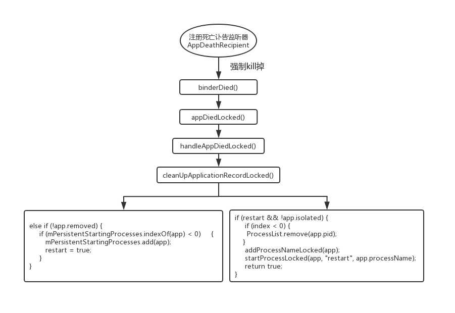

在我们开发系统级的App时，很有可能就会用persistent属性。当在AndroidManifest.xml中将persistent属性设置为true时，那么该App就会具有如下两个特性：

    在系统刚起来的时候，该App也会被启动起来
    
    该App被强制杀掉后，系统会重启该App。这种情况只针对系统内置的App，第三方安装的App不会被重启。

# 1. persistent属性的定义

persistent属性定义在frameworks/base/core/res/res/values/attrs_manifest.xml中：


```xml
<!-- Flag to control special persistent mode of an application.  This should
     not normally be used by applications; it requires that the system keep
     your application running at all times. -->
<attr name="persistent" format="boolean" />
```

官方解释：

是一个用于控制应用程序特殊持久模式的标志。通常情况下不应被应用程序使用，它要求系统始终保持应用程序的运行。

# 2. persistent属性的使用

persistent用在AndroidManifest.xml的application标签上：

```xml
<application
    android:persistent="true|false">
</application>
```

默认值为false。
# 3. persistent属性的原理分析

下面我们就从源码的角度来分析persistent属性的工作原理。

备注：本文的源码是Android6.0，不同的Android版本可能略有所不同。

## 3.1 persistent属性的解析

属性的解析主要发生在App安装或者系统启动的时候，解析代码的位置在：

    /frameworks/base/core/java/android/content/pm/PackageParser.java

深入到PackageParser.java的parseBaseApplication中：

  

```java
 private boolean parseBaseApplication(Package owner, Resources res,
            XmlPullParser parser, AttributeSet attrs, int flags, String[] outError)
        throws XmlPullParserException, IOException {
        
final ApplicationInfo ai = owner.applicationInfo;
final String pkgName = owner.applicationInfo.packageName;

TypedArray sa = res.obtainAttributes(attrs,
        com.android.internal.R.styleable.AndroidManifestApplication);

...省略...

	if ((flags&PARSE_IS_SYSTEM) != 0) {
            if (sa.getBoolean(
                    com.android.internal.R.styleable.AndroidManifestApplication_persistent,
                    false)) {
                ai.flags |= ApplicationInfo.FLAG_PERSISTENT;
            }
        }

...省略...
}
```
在解析完系统中App的包信息后，会将解析好的信息保存在PMS中的mPackages的map中，ApplicationInfo的flag中有一个bit位用于保存该App是否是persistent。

这里主要是将persistent的flag设置为ApplicationInfo.FLAG_PERSISTENT。

## 3.2 系统启动persistent为true的App

在系统启动时，会启动persistent属性为true的App，代码位置在：

    /frameworks/base//services/core/java/com/android/server/am/ActivityManagerService.java

在系统启动时，AMS中的systemReady()方法会将所有在AndroidManifest中设置了persistent为true的App进程拉起来。

深入到AMS的systemReady()方法中：


```java
public void systemReady(final Runnable goingCallback) {
...省略...

synchronized (this) {
    if (mFactoryTest != FactoryTest.FACTORY_TEST_LOW_LEVEL) {
        try {
            List apps = AppGlobals.getPackageManager().
                getPersistentApplications(STOCK_PM_FLAGS);//注释1
            if (apps != null) {
                int N = apps.size();
                int i;
                for (i=0; i<N; i++) {
                    ApplicationInfo info
                        = (ApplicationInfo)apps.get(i);
                    if (info != null &&
                            !info.packageName.equals("android")) {
                        addAppLocked(info, false, null /* ABI override */);//注释2
                    }
                }
            }
        } catch (RemoteException ex) {
            // pm is in same process, this will never happen.
        }
    }
	...省略...
}

...省略...
```

注释说明：

注释1：调用PackageManagerServices的getPersistentApplications方法获取所有在AndroidManifest中设置了persistent属性为true的App

注释2：调用ActivityManagerServcies的addAppLocked方法去启动App

深入到PackageManagerServices的getPersistentApplications方法中：


```java
public List<ApplicationInfo> getPersistentApplications(int flags) {
    final ArrayList<ApplicationInfo> finalList = new ArrayList<ApplicationInfo>();
// reader
synchronized (mPackages) {
    final Iterator<PackageParser.Package> i = mPackages.values().iterator();
    final int userId = UserHandle.getCallingUserId();
    while (i.hasNext()) {
        final PackageParser.Package p = i.next();
        if (p.applicationInfo != null
                && (p.applicationInfo.flags&ApplicationInfo.FLAG_PERSISTENT) != 0
                && (!mSafeMode || isSystemApp(p))) {
            PackageSetting ps = mSettings.mPackages.get(p.packageName);
            if (ps != null) {
                ApplicationInfo ai = PackageParser.generateApplicationInfo(p, flags,
                        ps.readUserState(userId), userId);
                if (ai != null) {
                    finalList.add(ai);
                }
            }
        }
    }
}

return finalList;
}
```
getPersistentApplications方法会遍历mPackages中所有的App，从判断条件中可以看到只有当在解析persistent属性时，ApplicationInfo的flag设置成了FLAG_PERSISTENT，且是系统App；或者是在非安全模式下，才会被选中。

可以看出被选中的情形有两种：

    系统App，只要ApplicationInfo的flag设置成了FLAG_PERSISTENT
    
    第三方安装的App，不仅要ApplicationInfo的flag设置成了FLAG_PERSISTENT，还需要在非安全模式下

继续回到ActivityManagerServcies的addAppLocked方法中：


```java
final ProcessRecord addAppLocked(ApplicationInfo info, boolean isolated,
        String abiOverride) {
    ProcessRecord app;
	
//传进来的isolated是false，所以就会调用getProcessRecordLocked方法，
//但由于是第一次启动，所以所有的返回都是app = null
if (!isolated) {
    app = getProcessRecordLocked(info.processName, info.uid, true);
} else {
    app = null;
}

if (app == null) {
	//为新的app创建新的ProcessRecord对象
    app = newProcessRecordLocked(info, null, isolated, 0);
    updateLruProcessLocked(app, false, null);
    updateOomAdjLocked();
}

// This package really, really can not be stopped.
try {
	//因为是开机第一次启动，所以新的App的启动状态就是将要被启动的状态
	//所以将App的停止状态stoped设置为false
    AppGlobals.getPackageManager().setPackageStoppedState(
            info.packageName, false, UserHandle.getUserId(app.uid));
} catch (RemoteException e) {
} catch (IllegalArgumentException e) {
    Slog.w(TAG, "Failed trying to unstop package "
            + info.packageName + ": " + e);
}

//如果是系统App，且persistent属性为true，则异常死亡后会重启
if ((info.flags & PERSISTENT_MASK) == PERSISTENT_MASK) {
    app.persistent = true;
    app.maxAdj = ProcessList.PERSISTENT_PROC_ADJ;
}

//如果App已启动，则不处理，否则调用startProcessLocked方法启动App
//启动App是异步的，因此会将正在启动，但还没启动完成的App添加到mPersistentStartingProcesses列表中，当启动完成后再移除
if (app.thread == null && mPersistentStartingProcesses.indexOf(app) < 0) {
    mPersistentStartingProcesses.add(app);
	//启动App
    startProcessLocked(app, "added application", app.processName, abiOverride,
            null /* entryPoint */, null /* entryPointArgs */);
}

return app;
}
```
在App启动完成后，会在ActivityThread中调用ActivityManagerService的attachApplicationLocked()方法，将该App从mPersistentStartingProcesses移除，并注册一个死亡讣告监听器AppDeathRecipient，用于在App异常被杀后的处理工作。

深入到ActivityManagerService的attachApplicationLocked()方法中：


```java
private final boolean attachApplicationLocked(IApplicationThread thread,
        int pid) {
...省略...

final String processName = app.processName;
try {
	//注册死亡讣告监听器AppDeathRecipient
    AppDeathRecipient adr = new AppDeathRecipient(
            app, pid, thread);
    thread.asBinder().linkToDeath(adr, 0);
    app.deathRecipient = adr;
} catch (RemoteException e) {
    app.resetPackageList(mProcessStats);
	//如果注册死亡讣告监听器失败，也会重新启动App进程
    startProcessLocked(app, "link fail", processName);
    return false;
}

...省略...
// Remove this record from the list of starting applications.
mPersistentStartingProcesses.remove(app);

...省略...
```

到此，persistent属性为true的App在开机时就会启动，并且会注册死亡讣告监听器AppDeathRecipient。

## 3.3 系统重新启动被强制kill掉的带有persistent属性的App

上面可知，进程在启动时，会为App注册一个死亡讣告，当App被杀掉后，就会调用AppDeathRecipient的binderDied方法：


```java
private final class AppDeathRecipient implements IBinder.DeathRecipient {
    final ProcessRecord mApp;
    final int mPid;
    final IApplicationThread mAppThread;

AppDeathRecipient(ProcessRecord app, int pid,
        IApplicationThread thread) {
    if (DEBUG_ALL) Slog.v(
        TAG, "New death recipient " + this
        + " for thread " + thread.asBinder());
    mApp = app;
    mPid = pid;
    mAppThread = thread;
}

@Override
public void binderDied() {
    if (DEBUG_ALL) Slog.v(
        TAG, "Death received in " + this
        + " for thread " + mAppThread.asBinder());
    synchronized(ActivityManagerService.this) {
        appDiedLocked(mApp, mPid, mAppThread, true);
    }
}
}
```
binderDied又会调用appDiedLocked()方法：


```java
final void appDiedLocked(ProcessRecord app, int pid, IApplicationThread thread,
        boolean fromBinderDied) {
...省略...
 // Clean up already done if the process has been re-started.
if (app.pid == pid && app.thread != null &&
        app.thread.asBinder() == thread.asBinder()) {
    boolean doLowMem = app.instrumentationClass == null;
    boolean doOomAdj = doLowMem;
    ...省略...

    handleAppDiedLocked(app, false, true);

    ...省略...
    }
```
handleAppDiedLocked又会调用handleAppDiedLocked()方法：


```java
private final void handleAppDiedLocked(ProcessRecord app,
        boolean restarting, boolean allowRestart) {
    int pid = app.pid;
    boolean kept = cleanUpApplicationRecordLocked(app, restarting, allowRestart, -1,
            false /*replacingPid*/);
...省略...
}
```
继续调用cleanUpApplicationRecordLocked()方法：


```java
private final boolean cleanUpApplicationRecordLocked(ProcessRecord app,
        boolean restarting, boolean allowRestart, int index, boolean replacingPid) {
...省略...

//非persistent的App被kill后，就会被清理掉
if (!app.persistent || app.isolated) {
    if (DEBUG_PROCESSES || DEBUG_CLEANUP) Slog.v(TAG_CLEANUP,
            "Removing non-persistent process during cleanup: " + app);
    if (!replacingPid) {
        removeProcessNameLocked(app.processName, app.uid);
    }
    if (mHeavyWeightProcess == app) {
        mHandler.sendMessage(mHandler.obtainMessage(CANCEL_HEAVY_NOTIFICATION_MSG,
                mHeavyWeightProcess.userId, 0));
        mHeavyWeightProcess = null;
    }
} else if (!app.removed) {
    // This app is persistent, so we need to keep its record around.
    // If it is not already on the pending app list, add it there
    // and start a new process for it.

	//该app是persistent的，需要对其进行重启，并把它添加到正在启动的列表中
	//设置restart=true
    if (mPersistentStartingProcesses.indexOf(app) < 0) {
        mPersistentStartingProcesses.add(app);
        restart = true;
    }
}

...省略...

//通过这个判断添加决定是否重启App进程
//通过前面的过滤，persistent属性的App，restart=true，!app.isolated=true
if (restart && !app.isolated) {
    // We have components that still need to be running in the
    // process, so re-launch it.
    if (index < 0) {
        ProcessList.remove(app.pid);
    }
    addProcessNameLocked(app);
	//启动App进程
    startProcessLocked(app, "restart", app.processName);
    return true;
} else if (app.pid > 0 && app.pid != MY_PID) {
    // Goodbye!
    boolean removed;
    synchronized (mPidsSelfLocked) {
        mPidsSelfLocked.remove(app.pid);
        mHandler.removeMessages(PROC_START_TIMEOUT_MSG, app);
    }
    mBatteryStatsService.noteProcessFinish(app.processName, app.info.uid);
    if (app.isolated) {
        mBatteryStatsService.removeIsolatedUid(app.uid, app.info.uid);
    }
    app.setPid(0);
}
return false;
}
```

到此，带有persistent属性为true的App，就会在强制kill掉进程后，还会重启。

重启persistent应用的调用关系图如下：


