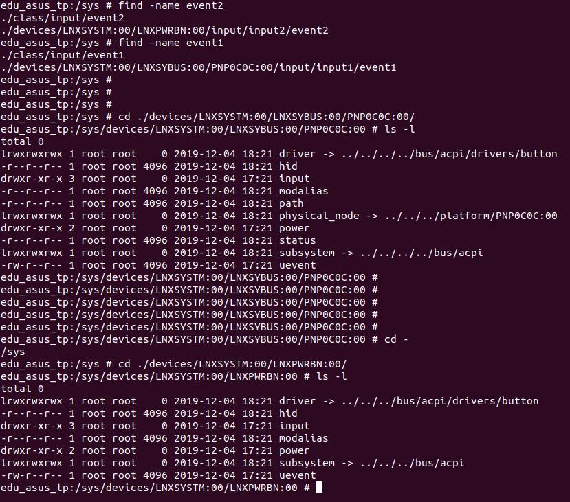
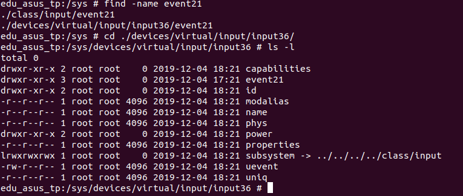

# 1. 环境

phoenixos 

android 7.1.2

遇到一个问题：　休眠需要按两下　powerbtn,  而唤醒只需要一下？　我们想要最终实现的效果是：　休眠时只需要按一下电源键，唤醒时，也只需要按一下电源键。

# 2. 分析

按动电源键，发现 event1 event2 event21 都上报值

```shell
$edu_asus_tp:/ # getevent  -lt                                                                                                                                                                                     

add device 1: /dev/input/event21
  name:     "Android Power Button"
add device 2: /dev/input/event2
  name:     "Power Button"
add device 3: /dev/input/event1
  name:     "Power Button"
```


从下图中，我们找　对应的 /dev/input/event1  和　event2  还有　event21 所对应的驱动：



从上图中我们很容易找到　event1 和　event2 所对应的驱动都是　bus/acpi/drivers/button

而在找 event21 的时候



从这个图中，我们并没有找到　event21所对应的驱动，　此时我就有点怀疑人生了。　自己观察所对应的目录结构：

/sys/devices/virtual/input/input36，　居然有一个　virtual/input/　而　event1 event2 的目录结构并不是这样哈。

此时产生一个疑问：　为啥event21 会挂在　virtual/input/ 下。

## 1.　为啥会挂在virtual/input/ 下　？

答案，看　当前目录下的　02.uinput驱动分析.md 吧

### 1. Android Power Button

虚拟输入设备　"Android Power Button"　是怎么来的，参考当前目录下的　03.uinput的使用.mk 中的内容进行分析。

```shell
phoenixos_edu/hardware/libhardware_legacy/power/
```

```c
// powerbtnd.c


/**
 * A daemon to simulate power button of Android
 *
 * Copyright (C) 2011-2012 The Android-x86 Open Source Project
 *
 * by Chih-Wei Huang <cwhuang@linux.org.tw>
 *
 * Licensed under GPLv2 or later
 *
 **/

#define LOG_TAG "powerbtn"

#include <sys/stat.h>
#include <poll.h>
#include <fcntl.h>
#include <errno.h>
#include <dirent.h>
#include <string.h>
#include <cutils/log.h>
#include <linux/input.h>
#include <linux/uinput.h>
#include <cutils/properties.h>

const int MAX_POWERBTNS = 2;

int openfds(struct pollfd pfds[])
{
	int cnt = 0;
	const char *dirname = "/dev/input";
	DIR *dir;
	if ((dir = opendir(dirname))) {
		int fd;
		struct dirent *de;
		while ((de = readdir(dir))) {
			if (de->d_name[0] != 'e') // eventX
				continue;
			char name[PATH_MAX];
			snprintf(name, PATH_MAX, "%s/%s", dirname, de->d_name);
			fd = open(name, O_RDWR | O_NONBLOCK);
			if (fd < 0) {
				ALOGE("could not open %s, %s", name, strerror(errno));
				continue;
			}
			name[sizeof(name) - 1] = '\0';
			if (ioctl(fd, EVIOCGNAME(sizeof(name) - 1), &name) < 1) {
				ALOGE("could not get device name for %s, %s", name, strerror(errno));
				name[0] = '\0';
			}

			// TODO: parse /etc/excluded-input-devices.xml
			if (!strcmp(name, "Power Button")) {
				ALOGI("open %s(%s) ok fd=%d", de->d_name, name, fd);
				pfds[cnt].events = POLLIN;
				pfds[cnt++].fd = fd; // 将 fd 加入监听中
				if (cnt < MAX_POWERBTNS)
					continue;
				else
					break;
			}
			close(fd);
		}
		closedir(dir);
	}

	return cnt;
}

void send_power(int ufd, int down)
{
	struct input_event iev;
	iev.type  = EV_KEY;
	iev.code  = KEY_POWER;
	iev.value = down;
	write(ufd, &iev, sizeof(iev));
	iev.type  = EV_SYN;
	iev.code  = SYN_REPORT;
	iev.value = 0;
	write(ufd, &iev, sizeof(iev));
}

void simulate_powerkey(int ufd, int longpress)
{
	send_power(ufd, 1);
	if (longpress)
		sleep(2);
	send_power(ufd, 0);
}

int main()
{
	struct pollfd pfds[MAX_POWERBTNS];
	int cnt = openfds(pfds);
	int timeout = -1;
	int longpress = 1;
	char prop[PROPERTY_VALUE_MAX];

	int ufd = open("/dev/uinput", O_WRONLY | O_NDELAY);
	if (ufd >= 0) {
		struct uinput_user_dev ud;
		memset(&ud, 0, sizeof(ud));
		strcpy(ud.name, "Android Power Button");
		write(ufd, &ud, sizeof(ud));
		ioctl(ufd, UI_SET_EVBIT, EV_KEY);
		ioctl(ufd, UI_SET_KEYBIT, KEY_POWER);
		ioctl(ufd, UI_DEV_CREATE, 0); // 这里就是创建  "Android Power Button" input 输入设备
	} else {
		ALOGE("could not open uinput device: %s", strerror(errno));
		return -1;
	}

	property_get("poweroff.doubleclick", prop, NULL);
	prop[0]='1'; // 将这里的值 设置为 1 就是我们解决   唤醒和休眠 只需要按一下 powerbtn

	for (;;) {
		int i;
		int pollres = poll(pfds, cnt, timeout) ;  // 这里就开始监听了
		ALOGV("pollres=%d %d\n", pollres, timeout);
		if (pollres < 0) {
			ALOGE("poll error: %s", strerror(errno));
			break;
		}
		if (pollres == 0) {
            // 这个是始终没有被调用
			ALOGI("timeout, send one power key");
			simulate_powerkey(ufd, 0);
			timeout = -1;
			longpress = 1;
			continue;
		}
		for (i = 0; i < cnt; ++i) {
			if (pfds[i].revents & POLLIN) {
				struct input_event iev;
				size_t res = read(pfds[i].fd, &iev, sizeof(iev));
				if (res < sizeof(iev)) {
					ALOGW("insufficient input data(%zd)? fd=%d", res, pfds[i].fd);
					continue;
				}
				ALOGW("type=%d scancode=%d value=%d from fd=%d", iev.type, iev.code, iev.value, pfds[i].fd);
				if (iev.type == EV_KEY && iev.code == KEY_POWER && !iev.value) {
					if (prop[0] != '1' || timeout > 0) {
						ALOGW("1.");
						simulate_powerkey(ufd, longpress);
						timeout = -1;
					} else {
					ALOGW("2.");
						timeout = 1000; // one second
					}
				} else if (iev.type == EV_SYN && iev.code == SYN_REPORT && iev.value) {
					ALOGW("3.");
					ALOGW("got a resuming event");
					longpress = 0;
					timeout = 1000; // one second
				}
			}
		}
	}

	return 0;
}
```

为啥将这里的  prop[0]='1';  之后，就可以达到预期的效果呢：

这里我们的打印log如下：

```shell
# 此时睡眠  powerbtn 灯闪  --> 按一次powerbtn的 log

W/powerbtn( 1370): type=1 scancode=116 value=1 from fd=6 
W/powerbtn( 1370): type=0 scancode=0 value=0 from fd=6 
W/powerbtn( 1370): type=1 scancode=116 value=0 from fd=6 
W/powerbtn( 1370): 2.
W/powerbtn( 1370): type=0 scancode=0 value=0 from fd=6

# 中间有时间间隔

W/powerbtn( 1370): type=1 scancode=116 value=1 from fd=6
W/powerbtn( 1370): type=0 scancode=0 value=0 from fd=6
W/powerbtn( 1370): type=1 scancode=116 value=0 from fd=6
W/powerbtn( 1370): 1.

# 中间有时间间隔

Waking up from sleep (uid 1000)... WAKEFULNESS_ASLEEP # 此时系统才开始唤醒

# 中间有时间间隔

W/powerbtn( 1370): type=0 scancode=0 value=0 from fd=6
```


```shell
# 此时系统处于 唤醒状态，  按一次 powerbtn 系统开始进入 睡眠

W/powerbtn( 1370): type=1 scancode=116 value=1 from fd=6
W/powerbtn( 1370): type=0 scancode=0 value=0 from fd=6
W/powerbtn( 1370): type=1 scancode=116 value=0 from fd=6
W/powerbtn( 1370): 2.
W/powerbtn( 1370): type=0 scancode=0 value=0 from fd=6
W/powerbtn( 1370): type=1 scancode=116 value=1 from fd=4
W/powerbtn( 1370): type=0 scancode=0 value=0 from fd=4
W/powerbtn( 1370): type=1 scancode=116 value=0 from fd=4
W/powerbtn( 1370): 1.

# 中间有时间间隔

W/powerbtn( 1370): type=0 scancode=0 value=0 from fd=4

# 没有调用 唤醒相关的 函数
```

从打的log 中，有如下不同：

在唤醒的log中，  fd 全部是 6  而 在休眠的时候， fd 有6也有4

而且代码的执行流程也不一样。 

