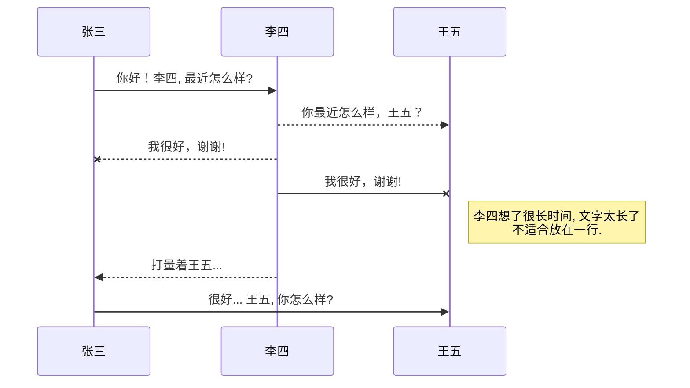

鸿洋：<http://blog.csdn.net/lmj623565791> 

​    爱哥：<http://blog.csdn.net/aigestudio> 

​    老罗(源码分析)：<http://blog.csdn.net/luoshengyang> 

​    阿拉神农(源码分析)：<http://blog.csdn.net/innost>

​    小巫：<http://blog.csdn.net/wwj_748> 

​    Mr.Simple：<http://blog.csdn.net/bboyfeiyu> 

​    任玉刚：<http://blog.csdn.net/singwhatiwanna> 

​    夏安明：<http://blog.csdn.net/xiaanming> 

​    徐医生：<http://blog.csdn.net/eclipsexys> 

​    郭神：<http://blog.csdn.net/sinyu890807/> 

​    张兴业：<http://blog.csdn.net/xyz_lmn/> 

​    咪当系欧巴(非常有天赋的Coder)：<http://blog.csdn.net/hellogv>

 

​    胡凯([**Android**](http://lib.csdn.net/base/15)官方开发教程中文译文项目发起者)：<http://hukai.me/blog/archives/> 

​    码农明明桑（有审美细胞的开发者）：<http://blog.isming.me/>

​    stormzhang（收到FaceBook面试邀请的大神）：<http://stormzhang.com/posts.html> 

​    Coder Robin：<http://coderrobin.com/>

​    Trinea：<http://www.trinea.cn/> 

​    农民伯伯：<http://www.cnblogs.com/over140/> 

​    daimajia(SwipeLayout是ZListView产生的源头)：<http://blog.daimajia.com/> 

​    stay4it：<http://www.cnblogs.com/stay/>

​    张明云：<http://zmywly8866.github.io/pages/archive.html>

​    严振杰：<http://blog.csdn.net/yanzhenjie1003>

​    江清清：[http://blog.csdn.net/developer_jiangqq（React Native）](http://blog.csdn.net/developer_jiangqq)

   lfdfhl：<http://blog.csdn.net/lfdfhl>

   亓斌：<http://blog.csdn.net/qibin0506>

​    你要时常去看的网站

​    [ Android](http://lib.csdn.net/base/android)开发者官网(你必须熟练使用翻墙)：<http://developer.android.com/index.html> 

​    GitHub(开源项目就在这里找)：<https://github.com/> 

​    开源项目解析：<http://www.codekk.com/open-source-project-analysis> 

​    Android代码查找：<https://www.codota.com/> 

​    chenzujie：（包含okhttp源码分析）:<http://blog.csdn.net/chenzujie?viewmode=contents>

​    sp不会玩sp（各种设计模式）：<http://blog.csdn.net/u010649376?viewmode=contents>

   继续微笑lsj(拥有很多关于[算法](http://lib.csdn.net/base/datastructure)[机器人](http://lib.csdn.net/base/robot)的文章):<http://blog.csdn.net/lsjseu>

   雷霄骅(视音频技术的研究):<http://blog.csdn.net/leixiaohua1020?viewmode=contents>

   算法与 [ 数据结构](http://lib.csdn.net/base/datastructure)（CSDN专栏）：<http://lib.csdn.net/base/31>

   skywang12345(天空不死鸟):<http://www.cnblogs.com/skywang12345/>

   启舰（自定义控件、贝塞尔曲线）：<http://blog.csdn.net/harvic880925?viewmode=contents>

​     MrSimp1e(各种原创内容较新)：<http://blog.csdn.net/bboyfeiyu?viewmode=contents>

Sean_帅恩（studio的讲解）：<http://blog.csdn.net/yy1300326388?viewmode=contents>

这个人，也很牛逼啊

http://www.360doc.com/userhome.aspx?userid=18578054&cid=3

http://blog.sina.com.cn/s/blog_89f592f5010132qy.html

http://gityuan.com/

系统死机

https://blog.csdn.net/pashanhu6402/article/details/79611307

Android 干货，强烈推荐

https://mp.weixin.qq.com/s/zOTO6z7bvHGhN0lhTMvR8w

https://www.jianshu.com/u/ea1bd4a0705b

