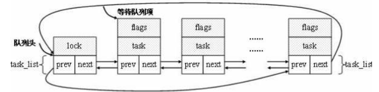

根据内核4.19.50版本源码、书籍和网上资料，对几个函数进行分析

​        介绍这几个函数，不得不先介绍等待队列wait_queue_head_t

​        等待队列用于使得进程等待某一特定事件的发生，无需频繁的轮询，进程在等待周期中睡眠，当事件发生后由内核自动唤醒。

 等待队列

​        （一）数据结构

​        等待队列结构如下，因为每个等待队列都可以再中断时被修改，因此，在操作等待队列之前必须获得一个自旋锁。

```c
struct wait_queue_head {                    
    spinlock_t      lock;
    struct list_head    head;
};
typedef struct wait_queue_head wait_queue_head_t;
```

  等待队列是通过task_list双链表来实现，其数据成员是以下数据结构：

```c
typedef struct wait_queue_entry wait_queue_entry_t;


/* wait_queue_entry::flags */
#define WQ_FLAG_EXCLUSIVE   0x01
#define WQ_FLAG_WOKEN       0x02
#define WQ_FLAG_BOOKMARK    0x04
                                                                                                                                                                                                                   
/*
 * A single wait-queue entry structure:
 */
struct wait_queue_entry {
    unsigned int        flags;
    void            *private;  /* 指向等待进程的task_struct实例 */  
    wait_queue_func_t   func; /* 用于唤醒等待进程              */  
    struct list_head    entry; /* 用于链表元素，将wait_queue_entry_t链接到 wait_queue_head_t */  
};
```



等待队列如何使用哪？分两步:

​        1. 为了使得等待进程在一个等待队列中睡眠，需要调用函数wait_event()函数。进程进入睡眠，将控制权释放给调度器。

​        2. 在内核中另一处，调用wake_up()函数唤醒等待队列中的睡眠进程。

 注：使用wait_event()函数使得进程睡眠；而在内核另一处有一个对应的wake_up()函数被调用。

```c
#define wait_event(wq_head, condition)                      \                        
do {                                        \
    might_sleep();                              \
    if (condition)                              \
        break;                              \
    __wait_event(wq_head, condition);                   \
} while (0)
    
    
#define __wait_event(wq_head, condition)                    \                    
    (void)___wait_event(wq_head, condition, TASK_UNINTERRUPTIBLE, 0, 0, \
                schedule()) // 最后这个是调度


#define ___wait_event(wq_head, condition, state, exclusive, ret, cmd)       \             ({                                      \
    __label__ __out;                            \
    struct wait_queue_entry __wq_entry;                 \
    long __ret = ret;   /* explicit shadow */               \
                                        \
    init_wait_entry(&__wq_entry, exclusive ? WQ_FLAG_EXCLUSIVE : 0);    \
    for (;;) {                              \
        long __int = prepare_to_wait_event(&wq_head, &__wq_entry, state);\
                                        \
        if (condition)                          \
            break;                          \
                                        \
        if (___wait_is_interruptible(state) && __int) {         \
            __ret = __int;                      \
            goto __out;                     \
        }                               \
                                        \
        cmd;                                \ // 这个就是调度
    }                                   \
    finish_wait(&wq_head, &__wq_entry);                 \
__out:  __ret;                                  \
})
```

​     

------

往下我在没看，抽空可以看看

（二）初始化等待队列元素

​         有两种方法初始化队列：

​         \1. 动态初始化init_waitqueue_entry()

1.  **static** **inline** **void** init_waitqueue_entry(wait_queue_t *q, **struct** task_struct *p)  
2.  {  
3. ​     q->flags = 0;  
4. ​     q->**private** = p;  
5. ​     q->func = default_wake_function;  
6.  }  

​        \2. 静态初始化DEFINE_WAIT()

1.  **#define DEFINE_WAIT_FUNC(name, function)                \**  
2. ​     wait_queue_t name = {                       \  
3. ​         .**private**    = current,              \  
4. ​         .func       = function,             \  
5. ​         .task_list  = LIST_HEAD_INIT((name).task_list), \  
6. ​     }  
7.    
8.  **#define DEFINE_WAIT(name) DEFINE_WAIT_FUNC(name, autoremove_wake_function)**  

​        其中函数autoremove_wake_function()是用来唤醒进程的，该函数不经调用default_wake_function()，还将所属等待队列成员从等待队列删除。   

​        （三）进程睡眠

​         \1. 通过add_wait_queue()函数将一个进程添加到等待队列，首先获得队列的自旋锁，然后调用__add_wait_queue()实现将新的等待进程添加等待队列（添加到等待队列的头部），然后解锁；代码如下：

1.  **static** **inline** **void** __add_wait_queue(wait_queue_head_t *head, wait_queue_t ***new**)  
2.  {  
3. ​     list_add(&**new**->task_list, &head->task_list);  
4.  }  

​         另一个函数add_wait_queue_exclusive()的含义与add_wait_queue()函数类似，但是将等待进程添加到等待队列的尾部，并设置WQ_EXCLUSIXE标志。

​         使得进程在等待队列上睡眠的另一种方法是：prepare_to_wait()，除了有add_wait_queue()函数的参数外，还要设置进程的状态。

​         另一个函数prepare_to_wait_exclusive()语义类似。        

​         通常情况下，add_wait_queue()函数不会直接使用,因为add_wait_queue()函数不与具体的逻辑相管理，单纯的一个等待队列的模型是没有意义的，因此通常使用的是wait_event()函数：

1.  /** 
2.   \* wait_event - sleep until a condition gets true 
3.   \* @wq: the waitqueue to wait on 
4.   \* @condition: a C expression for the event to wait for 
5.   \* 
6.   \* The process is put to sleep (TASK_UNINTERRUPTIBLE) until the 
7.   \* @condition evaluates to true. The @condition is checked each time 
8.   \* the waitqueue @wq is woken up. 
9.   \* 
10.   \* wake_up() has to be called after changing any variable that could 
11.   \* change the result of the wait condition. 
12.   */  
13.  **#define wait_event(wq, condition)                   \**  
14.  **do** {                                    \  
15. ​     **if** (condition)                          \  
16. ​         **break**;                          \  
17. ​     __wait_event(wq, condition);                    \  
18.  } **while** (0)  

函数__wait_event()

1.  **#define __wait_event(wq, condition)                     \**  
2.  **do** {                                    \  
3. ​     DEFINE_WAIT(__wait);                        \  
4. ​                                     \  
5. ​     **for** (;;) {                          \  
6. ​         prepare_to_wait(&wq, &__wait, TASK_UNINTERRUPTIBLE);    \  
7. ​         **if** (condition)                      \  
8. ​             **break**;                      \  
9. ​         schedule();                     \  
10. ​     }                               \  
11. ​     finish_wait(&wq, &__wait);                  \  
12.  } **while** (0)  

​          其中wq是等待进程需要加入的等待队列，而condition是通过与所等待时间有关的一个C表达式形式给出。表示，条件满足时，可以立即停止处理。

 主要工作由__wait_event()来完成：

​        (1) 调用DEFINE_WAIT宏创建等待队列成员；

​        (2) 使用一个无线循环，在循环体内，

​                 (a) 调用prepare_to_wait()使得进程在等待队列上等待,并将进程状态置为不可中断TASK_UNINTERRUPTIBLE；

​                 (b) 当进程被唤醒时，检查指定的条件condition是否满足，如果满足则跳出循环，否则将控制权交给调度器，然后进程继续睡眠。

​         (3) 调用函数finish_wait()将进程状态设置为TASK_RUNNING，并从等待队列的链表中移除对应的成员。

​        其他与wait_event类似的函数：

​        \1. wait_event_interrupable()函数 ，使得进程处于可中断(TASK_INTERRUPTIBLE)状态，从而睡眠进程可以通过接收信号被唤醒；

​        \2. wait_event_timeout()函数，等待满足指定的条件，但是如果等待时间超过指定的超时限制则停止睡眠，可以防止进程永远睡眠；

​        \3. wait_event_interruptible_timeout() 使得进程睡眠，不但可以通过接收信号被唤醒，也具有超时限制。

 

 __wait_event 具体实现过程 
         wait_event() & wait_event_interruptible() & prepare_to_wait() finish_wait()

 点击(此处)折叠或打开

1.  \#define __wait_event(wq, condition)
2. ​         do {
3. ​                 DEFINE_WAIT(__wait);
4.  
5. ​                 for (;;) {
6. ​                         prepare_to_wait(&wq, &__wait, TASK_UNINTERRUPTIBLE);
7. ​                         if (condition)
8. ​                                 break;
9. ​                         schedule();
10. ​                 }
11. ​                 finish_wait(&wq, &__wait);
12. ​         } while (0)

 在DEFINE_WAIT(__wait)中

 点击(此处)折叠或打开

1.  \#define DEFINE_WAIT(name)
2. ​         wait_queue_t name = {
3. ​                 .task = current,
4. ​                 .func = autoremove_wake_function,
5. ​                 .task_list = { .next = &(name).task_list,
6. ​                 .prev = &(name).task_list,
7. ​         }
8.  
9.  int autoremove_wake_function(wait_queue_t *wait, unsigned  mode, int sync, void *key)
10.  {
11. ​         int ret = default_wake_function(wait, mode, sync, key);
12.  
13. ​         if (ret)
14. ​                 list_del_init(&wait->task_list); //注意，等待节点在这里被摘下，并设为空
15. ​         return ret;
16.   }

 

 prepare_to_wait()和finish_wait()并不是进程睡眠的地方，进程睡眠的地方是schedule()。

 prepare_to_wait()只是进行一些链表的操作，以确保自己在等待队列中，不会漏掉事件。

 进程在确信自己已经在队列中后，再次检查条件， 这里，如果不检查，可能条件已经满足，直接去睡眠的话，可能再也没有人来唤醒它了。

 然后，如果条件不满足，就调用schedule()去睡眠，这里，进程的状态在prepare_to_wait()里设置为TASK_UNINTERRUPTIBLE， 所以，以后调度时就看不到该进程了，因此，该进程将没有机会运行，这就是睡眠。

 注意，这里，该进程自己已经无能为力了，因为它自己已经不可能运行了。 只有等待他人来唤醒了。

 当条件满足后，会有一个人（或者是其他进程，或者内核本身，等等）来唤醒某个等待队列上的进程。

 具体是唤醒全部等待队列中的所有进程，还是只唤醒第一个进程，完全取决于该唤醒者， 等待在队列中的睡眠进程是无能为力的，与它们是没有关系的（呵呵，确切说，有一点关系）。

 总是唤醒所有等待该事件的进程并不一定是合适的。比如考虑这样一种情况：如果队列中的多个进程等待的资  源是要互斥访问的，一定时间内只允许一个进程去访问的话，这时候，只需要唤醒一个进程就可以了，其他进程继续睡眠。如果唤醒所有的进程，最终也只有一个进程获得该资源，其他进程还需返回睡眠。

 因此，等待队列中的睡眠进程可被划分为互斥、非互斥进程。

 互斥进程：等待的资源是互斥访问的；互斥进程由内核有选择的唤醒，等待队列项的flag字段为1；
         非互斥进程：等待的资源是可多进程同时访问的。非互斥进程在事件发生时，总是被内核唤醒，等待队列元素的flag字段为0。

 唤醒者通常调用__wake_up_common()，这样，依次取下等待队列中的__wait_queue_t结构， 调用该睡眠进程设置的func函数，即这里的autoremove_wake_function()， 将该进程的状态重新设置为RUNNING。

 注意，此时该睡眠进程并不会立刻执行，只有等到下次调度的时候，该进程才有机会运行， 即醒来了。醒来是从schedule()回来，继续运行__wait_event()

 总结一下， 睡眠是自己设置好进程状态（TASK_UNINTERRUPTIBLE，等等），加入等待队列， 并调用schedule()去睡眠。 睡眠是自己的动作。

 唤醒是别人发现条件满足，调用__wake_up_common()，将睡眠进程从等待队列取下， 调用该睡眠进程设置的唤醒func，重新设置该睡眠进程为RUNNING。 从而可以在下次调度时运行。 唤醒是别人的动作。


 

​        （四）进程唤醒

​        内核中虽然定义了很多唤醒等待队列中进程的函数，但是最终调用的都是__wake_up()

1.  **#define wake_up(x)          __wake_up(x, TASK_NORMAL, 1, NULL)**  
2.  **#define wake_up_nr(x, nr)       __wake_up(x, TASK_NORMAL, nr, NULL)**  
3.  **#define wake_up_all(x)          __wake_up(x, TASK_NORMAL, 0, NULL)**  
4.  **#define wake_up_locked(x)       __wake_up_locked((x), TASK_NORMAL)**  
5.    
6.  **#define wake_up_interruptible(x)    __wake_up(x, TASK_INTERRUPTIBLE, 1, NULL)**  
7.  **#define wake_up_interruptible_nr(x, nr) __wake_up(x, TASK_INTERRUPTIBLE, nr, NULL)**  
8.  **#define wake_up_interruptible_all(x)    __wake_up(x, TASK_INTERRUPTIBLE, 0, NULL)**  
9.  **#define wake_up_interruptible_sync(x)   __wake_up_sync((x), TASK_INTERRUPTIBLE, 1)**  

​        而__wake_up()函数在加锁之后调用的是__wake_up_common()

1.  static void __wake_up_common(wait_queue_head_t *q, unsigned int mode,  
2. ​             int nr_exclusive, int wake_flags, void *key)  
3.  {  
4. ​     wait_queue_t *curr, *next;  
5.    
6. ​     list_for_each_entry_safe(curr, next, &q-**>**task_list, task_list) {  
7. ​         unsigned flags = curr-**>**flags;  
8.    
9. ​         if (curr-**>**func(curr, mode, wake_flags, key) &&  
10. ​                 (flags & WQ_FLAG_EXCLUSIVE) && !--nr_exclusive)  
11. ​             break;  
12. ​     }  
13.  }  

​         其中：q是等待队列，mode指定进程的状态，用于控制唤醒进程的条件，nr_exclusive表示将要唤醒的设置了WQ_FLAG_EXCLUSIVE标志的进程的数目。 

​         然后扫描链表，调用func(注册的进程唤醒函数，默认为default_wake_function)唤醒每一个进程，直至队列为空，或者没有更多的进程被唤醒，或者被唤醒的的独占进程数目已经达到规定数目。

 简单的demo：

 

 点击(此处)折叠或打开

1.  /*a simple wait_queue demo
2.   *task_1,task_2 added into the wait_queue, if condition is 0.
3.   *task_3 change condition to 1, and task_1 task_2 will be wake up
4.   */
5.  
6.  \#include <linux/kernel.h>
7.  \#include <linux/init.h>
8.  \#include <linux/module.h>
9.  \#include <linux/sched.h>
10.  \#include <linux/kthread.h>
11.  \#include <linux/delay.h>
12.  
13.  MODULE_LICENSE("GPL");
14.  MODULE_AUTHOR("cengku@gmail.com");
15.  
16.  static int condition;
17.  static struct task_struct *task_1;
18.  static struct task_struct *task_2;
19.  static struct task_struct *task_3;
20.  
21.  DECLARE_WAIT_QUEUE_HEAD(wq);
22.  
23.  
24.  static int thread_func_1(void *data)
25.  {
26. ​     int i = 0;
27. ​     while (i++ < 100) {
28. ​         wait_event(wq, condition == 1);
29. ​         msleep(1000);
30. ​         printk(">>>>>this task 1\n");
31. ​     }
32. ​     return 0;
33.  }
34.  
35.  static int thread_func_2(void *data)
36.  {
37. ​     int i = 0;
38. ​     while (i++ < 100) {
39. ​         wait_event(wq, condition == 1);
40. ​         msleep(1000);
41. ​         printk(">>>>>this task 2\n");
42. ​     }
43. ​     return 0;
44.  }
45.  static int thread_func_3(void *data)
46.  {
47. ​     int i = 0;
48. ​     while (i++ < 10) {
49. ​         condition = 0;
50. ​         msleep(2000);
51. ​         printk(">>>>>this task 3\n");
52. ​         condition = 1;
53. ​         wake_up(&wq);
54. ​         msleep(2000);
55. ​     }
56. ​     return 0;
57.  }
58.  
59.  
60.  
61.  static int __init mod_init(void)
62.  {
63. ​     printk("=====mod set up===\n");
64. ​     condition = 0;
65.  
66. ​     task_1 = kthread_run(thread_func_1, NULL, "thread%d", 1);
67. ​     if (IS_ERR(task_1))
68. ​         printk("**********create thread 1 failed\n");
69. ​     else
70. ​         printk("======success create thread 1\n");
71.  
72. ​     task_2 = kthread_run(thread_func_2, NULL, "thread%d", 2);
73. ​     if (IS_ERR(task_2))
74. ​         printk("**********create thread 2 failed\n");
75. ​     else
76. ​         printk("======success create thread 2\n");
77.  
78. ​     task_3 = kthread_run(thread_func_3, NULL, "thread%d", 3);
79. ​     if (IS_ERR(task_3))
80. ​         printk("**********create thread 3 failed\n");
81. ​     else
82. ​         printk("======success create thread 3\n");
83. ​     return 0;
84.  }
85.  
86.  static void __exit mod_exit(void)
87.  {
88. ​     int ret;
89. ​     if (!IS_ERR(task_1)) {
90. ​         ret = kthread_stop(task_1);
91. ​         if (ret > 0)
92. ​             printk("<<<<<<<<<thread 1="" has="" run="" %ds\n"<="" span="" style="word-wrap: break-word;">, ret);
93. ​     }
94. ​         
95. ​     if (!IS_ERR(task_2)) {
96. ​         ret = kthread_stop(task_2);
97. ​         if (ret > 0)
98. ​             printk("<<<<<<<<<thread 2="" has="" run="" %ds\n"<="" span="" style="word-wrap: break-word;">, ret);
99. ​     }
100.  
101. ​     if (!IS_ERR(task_3)) {
102. ​         ret = kthread_stop(task_3);
103. ​         if (ret > 0)
104. ​             printk("<<<<<<<<<thread 3="" has="" run="" %ds\n"<="" span="" style="word-wrap: break-word;">, ret);
105. ​     }
106.  }
107.  module_init(mod_init);
108.  module_exit(mod_exit);

Makefile:

 点击(此处)折叠或打开

1.  KERNEL_DIR:=/lib/modules/`uname -r`/build
2.  PWD:=`pwd`
3.  obj-m:= wq_mod.o
4.  default:
5.  make -C $(KERNEL_DIR) M=$(PWD) modules
6.  clean:
7.  make -C $(KERNEL_DIR) M=$(PWD) clean


 Linux内核里的等待队列机制在做驱动开发时用的非常多，多用来实现阻塞式访问，下面简单总结了等待队列的四种用法，希望对读者有所帮助。

 \1. 睡眠等待某个条件发生(条件为假时睡眠)：

​     睡眠方式：wait_event, wait_event_interruptible
​             唤醒方式：wake_up (唤醒时要检测条件是否为真，如果还为假则继续睡眠，唤醒前一定要把条件变为真)

 \2. 手工休眠方式一：

​     1)建立并初始化一个等待队列项
​                 DEFINE_WAIT(my_wait) <==> wait_queue_t my_wait; init_wait(&my_wait);
​             2)将等待队列项添加到等待队列头中，并设置进程的状态
​                 prepare_to_wait(wait_queue_head_t *queue, wait_queue_t *wait, int state)
​             3)调用schedule()，告诉内核调度别的进程运行
​             4)schedule返回，完成后续清理工作
​                 finish_wait()

 \3. 手工休眠方式二：

​     1)建立并初始化一个等待队列项：
​                 DEFINE_WAIT(my_wait) <==> wait_queue_t my_wait; init_wait(&my_wait);
​             2)将等待队列项添加到等待队列头中：
​                 add_wait_queue
​             3)设置进程状态
​                 __set_current_status(TASK_INTERRUPTIBLE);
​             4)schedule()
​             5)将等待队列项从等待队列中移除
​                 remove_wait_queue()

 其实，这种休眠方式相当于把手工休眠方式一中的第二步prepare_to_wait拆成两步做了，即prepare_to_wait <====>add_wait_queue + __set_current_status，其他都是一样的。