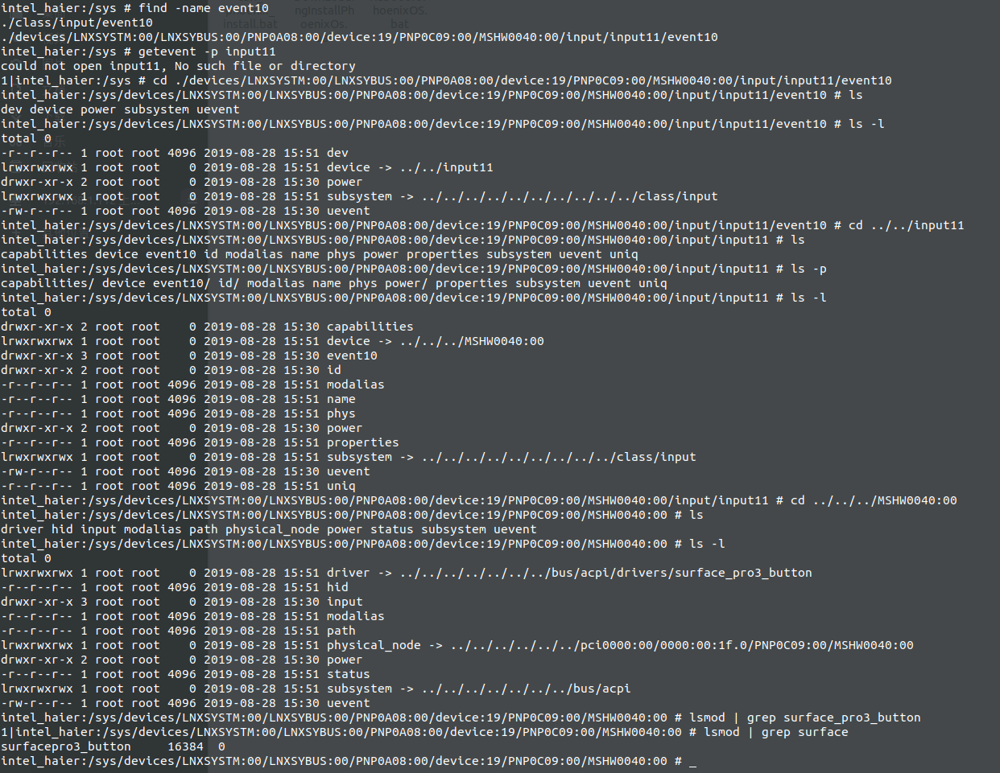

查找设备的驱动

参照/home/colby/work/myntai_work_note/201908/01.surfacePro4/04.无法唤醒.md


```shell
intel_haier:/ # getevent -p 

add device 33: /dev/input/event10
  name:     "Surface Pro 3/4 Buttons"
  events:
    KEY (0001): 0072  0073  0074  007d 
  input props:
    <none>
```




1. 这里已知 powerbtn和音量按键　是 event10 事件
2. 先找到　device
3. 然后在找到　driver目录的链接目录

**关键是：看sys目录下面的　软链接的情况去决定**

找到这个驱动　

```shell
intel_haier:/system # find -name surfacepro3_button.ko

./lib/modules/4.19.50-PhoenixOS-x86_64-g8b1fe08554f0/kernel/drivers/platform/x86/surfacepro3_button.ko
```


找到源代码：

```shell
colby@pc:~/ssd_480/phoenix-n/kernel$ find -name surfacepro3_button.c
./drivers/platform/x86/surfacepro3_button.c
```

注意看：目录关系

