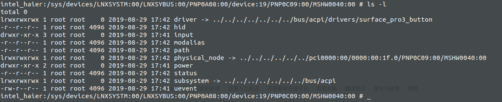
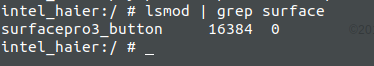
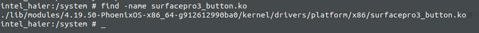
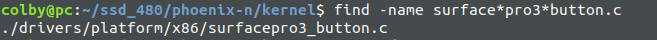
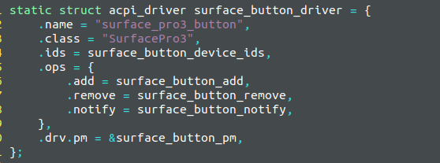

# env:

当我们在内核中lsmod的时候，会看到驱动的名字，当这个驱动的名字有的时候会和对应的文件名产生差异。

**最直接的一个问题就是，lsmod知道驱动名，如何快速定位出，源码文件?**

# 答案：

１．找到对应设备对应的　驱动　surface_pro3_button

２．lsmod　搜索对应的内容　发现为　surfacepro3_button

３．找到对应的ko,　起始能找到对应的ko,就已经算是能确定源码的位置了　kernel/drivers/platform/x86/surfacepro3_button.ko

４．搜索源码就可以看到了

５．这里我们看到　name 实际是对应于　sys的软连接的名字

到现在我们算是搞明白了他们的关系了

1. 文件的名字(*.c)对应：　lsmod　和　*.ko中的名字
2. 驱动中name字段，对应了 sys/ 中的软链接的名字