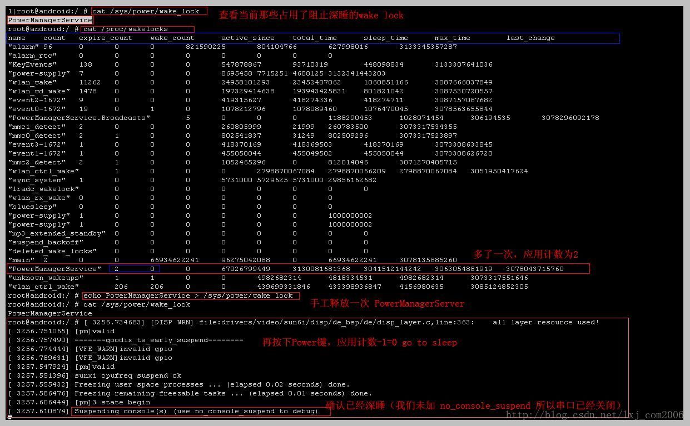

在[Android](http://lib.csdn.net/base/android)移动设备中，有时按下Power键（未接电源，USB）时，因其它apk程序获取了wake_up锁未释放或程序BUG导致未释放，造成未能进入深度睡眠，

从而加大了耗电量，减少了待机时间，参考如下图，可以根据 wake lock的名称搜索代码问题，去找原因：

cat /sys/power/state                                                                           查看当前睡眠情况

echo "on/mem/standby" >  /sys/power/state                                 手动更改睡眠状态 ，on - 唤醒睡眠，  mem - 深度睡眠 （全关）， standby - 浅度睡眠（关背光，不关外是）

cat /sys/power/wake_lock                                                                 查看当前那些占用了阻止深度睡眠的wake lock

cat /sys/proc/wakelocks                                                                     wake lock 状态情况

cat "PowerManagerService" > /sys/power/wake_unlock             手动释放一次名称为“PowerManagerSerivce”的wake lock引用次数-1，为0时进入睡眠

