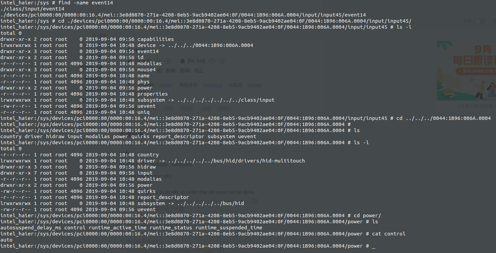

# 案例

这里拿关闭surfacepro4 中的Runtime_PM为说明

```shell
intel_haier:/sys/devices # getevent -p

add device 12: /dev/input/event14
  name:     "ipts 1B96:006A Touchscreen"
```



找到 power/下的control  

写入"on" 

```shell
echo on > control
```

这样就关闭成功


# code分析：

```c
static const char ctrl_auto[] = "auto";
static const char ctrl_on[] = "on";

static ssize_t control_show(struct device *dev, struct device_attribute *attr,
                char *buf)
{
    return sprintf(buf, "%s\n",                                                                                                                                                                                    
                dev->power.runtime_auto ? ctrl_auto : ctrl_on);
}

static ssize_t control_store(struct device * dev, struct device_attribute *attr,
                 const char * buf, size_t n)
{
    device_lock(dev);
    if (sysfs_streq(buf, ctrl_auto))
        pm_runtime_allow(dev);
    else if (sysfs_streq(buf, ctrl_on))
        pm_runtime_forbid(dev);　// 写入 on 时，将关闭 runtime　功能
    else
        n = -EINVAL;
    device_unlock(dev);
    return n;
}

static DEVICE_ATTR_RW(control);
```


```c
void pm_runtime_forbid(struct device *dev) // 关闭
{               
    spin_lock_irq(&dev->power.lock);
    if (!dev->power.runtime_auto)
        goto out;
                 
    dev->power.runtime_auto = false;　// 这里是将　runtime_auto 
    atomic_inc(&dev->power.usage_count);
    rpm_resume(dev, 0); // 这里会激活设备
        
 out:
    spin_unlock_irq(&dev->power.lock);
}   
EXPORT_SYMBOL_GPL(pm_runtime_forbid);
```

