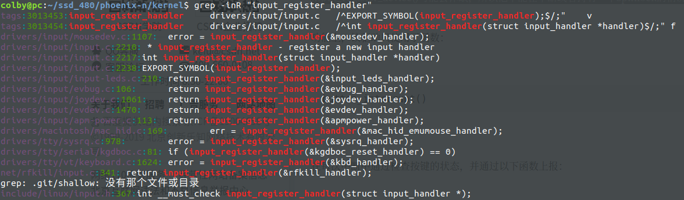

1. 设备的所支持的上报事件种类也可以通过sysfs的class/input/event*/device/capabilities/来获取，设备的特性和可以通过class/input/event*/device/properties来获取。
2. EV_SW事件用于描述一个两态开关的状态，比如，SW_LID code用来指出笔记本电脑的屏幕已经合上了。
3.  不过，因为设备实在是太过于多样性了，你可能遇到某些设备工作的不好。这时你可以在hid-core.c的开始加上 #define DEBUG，把syslog traces发给我。
4. 敲入命令："cat /dev/input/mouse0" (c, 13, 32)可以验证鼠标是否被正确地枚举，当你移动鼠标时，屏幕会显示一些字符。

5. 在evdev.c 和 input.c 文件的前面　加#define DEBUG


# 关键的几个注册点：

## event1

公共的：

这里我们只拿input 中的evdev 处理为说面

```c
static struct input_handler evdev_handler = {
    .event      = evdev_event,
    .events     = evdev_events,
    .connect    = evdev_connect,
    .disconnect = evdev_disconnect,
    .legacy_minors  = true,
    .minor      = EVDEV_MINOR_BASE,
    .name       = "evdev",
    .id_table   = evdev_ids,
};

static int __init evdev_init(void)
{
    return input_register_handler(&evdev_handler);   
}
```


```c
static const struct file_operations evdev_fops = {                  
    .owner      = THIS_MODULE,
    .read       = evdev_read,
    .write      = evdev_write,
    .poll       = evdev_poll,
    .open       = evdev_open,
    .release    = evdev_release,
    .unlocked_ioctl = evdev_ioctl,
#ifdef CONFIG_COMPAT
    .compat_ioctl   = evdev_ioctl_compat,
#endif
    .fasync     = evdev_fasync,
    .flush      = evdev_flush,
    .llseek     = no_llseek,
};
```


event%d 的注册点

```c
 evdev_connect()->
```

```c
int evdev_connect(){
    evdev = kzalloc(sizeof(struct evdev), GFP_KERNEL);
    init_waitqueue_head(&evdev->wait);
    dev_set_name(&evdev->dev, "event%d", dev_no);
    
    evdev->dev.devt = MKDEV(INPUT_MAJOR, minor);
    
    evdev->dev.release = evdev_free;
    
    device_initialize(&evdev->dev);
    
    error = input_register_handle(&evdev->handle);
    
    cdev_init(&evdev->cdev, &evdev_fops);
    
    error = cdev_device_add(&evdev->cdev, &evdev->dev);
}
```

生么时候会调用　evdev_connect　？

答案：　

​	在调用　input_register_device(&xxx_dev);时，会被调用：

1. input_register_device 会引起休眠，所以不能在中断上下文中去调用。
2. 调用流程：

```shell
input_register_device ->
	input_attach_handler ->
		handler->connect(handler, dev, id);
```


```c
int input_register_device(struct input_dev *dev)                                           {
    struct input_devres *devres = NULL;
    struct input_handler *handler;
    
    devres = devres_alloc(devm_input_device_unregister,
                      sizeof(*devres), GFP_KERNEL);
    
    error = device_add(&dev->dev);
    
    list_add_tail(&dev->node, &input_dev_list);
    
    list_for_each_entry(handler, &input_handler_list, node)
        input_attach_handler(dev, handler);
    
    // input_handler_list 这里是从中去拿，　
}

```

input_handler_list　谁加到它里面了？

```c
int input_register_handler(struct input_handler *handler){
    list_add_tail(&handler->node, &input_handler_list);
}
```



所以在说明event 注册的时候，是拿　./drivers/input/evdev.c　做的分析:

总结：　从这里我们也知道，首先是我们在dri中调用　input_register_device　去注册一个input_dev设备，然后在是由事件处理层去注册　event%d节点的。这里有个先后顺序。

------

event%d 的注销点

```c
void evdev_disconnect(){
    cdev_device_del(&evdev->cdev, &evdev->dev);
    
    input_unregister_handle(handle);
}
```


## input dev的注册点：

```c

```

