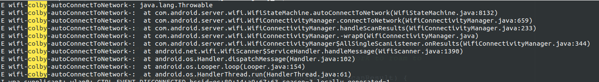

1. 启动　wpa_supplicant 执行 setprop ctl.start wpa_supplicant 
2. 关闭　执行setprop ctl.stop wpa_supplicant
3. wpa_cli  -iwlan0  IFNAME=wlan0  scan_result 显示搜索结果
4. 　wpa_cli  -iwlan0  IFNAME=wlan0  reconfigure　重启　wpa_supplicant
5. 启动wpa_supplicant 以及设置ip 关闭的流程

```shell
# 开启的逻辑 ---- >

# 在启动wpa_supplicant之前需要启动一下网络
netcfg wlan0 up

setprop ctl.start wpa_supplicant 

# 启动DHCP，当已经连接到AP时，这里需要设置一下IP，一般情况下是使用动态IP的
netcfg wlan0 dhcp


# 关闭的逻辑　---- >

setprop ctl.stop wpa_supplicant

# 关闭wpa_supplicant后这里需要同时关闭网卡网络
执行netcfg wlan0 down
```


使用如下的方式去查看当前的wpa_supplicant的运行状态：

```shell
intel_haier:/ # getprop | grep wpa                                                         
[init.svc.wpa_supplicant]: [running]
```


6. WIFI_SUSPEND_OPTIMIZATIONS_ENABLED 这个值　可以去设置　系统休眠后，可以不断开wifi

7. 　当wifi 图标上有小感叹号　使用如下命令可以　关闭　能否上网的检测

   adb shell settings put global captive_portal_detection_enabled 0


## 备注

### linux下的案例

这里记录一个实际的调试案例：不过这个是在linux下进行的调试

本文是在正确安装好wifi驱动后对系统进行的配置。

1. 配置wpa_supplicant的配置文件

在加载驱动之前在/etc下新建目录/wpa_supplicant/wpa_supplicant.con

配置好需要的wifi的ssid及psk即可

具体配置如下 ：

\#vi  wpa_supplicant.conf

```shell
ctrl_interface=/var/run/wpa_supplicant

update_config=1

eapol_version=1

fast_reauth=1

network={

​                    ssid="wifi名称"

​                    psk="密码"

​                    priority=1

​                }


```


2．加载驱动： insmod     /lib/modules/3.4.39/8723au.ko

3．启动wifi:

​     \# ifconfig  获取wifi名称 一般是wlan0

​     \# ifconfig wlan0 up

4．后台运行wpa_supplicant:

​      wpa_supplicant-d -Dnl80211 -iwlan0 -c/etc/wpa_supplicant/wpa_supplicant.conf  &

​      其中 ：

wpa_supplicant：可执行程序

​                      –d ：增加打印信息

​         -Dnl80211： 驱动名称

​               -iwlan0：wlan0，网络接口名称

 /etc/wpa_supplicant/wpa_supplicant.conf：wpa_supplicant的配置文件path

5. 为wlan0动态分配ip地址：udhcpc -iwlan0

打印如下： 

```shell
udhcpc (v1.18.3)started

Sending discover...

Sending select for 192.168.1.110...

Lease of 192.168.1.110 obtained, lease time 7200

deleting routers

route: SIOCDELRT: No such process

adding dns 192.168.14.12

adding dns 192.168.1.1
```


6. 查看wlan0状态：# ifconfig

打印如下：

```shell
wlan0      Link encap:Ethernet  HWaddr CC:D2:9B:6E:6C:00 

inet addr:192.168.1.110  Bcast:255.255.255.255  Mask:255.255.255.0  inet6 addr: fe80::ced2:9bff:fe6e:6c00/64Scope:Link

UP BROADCAST RUNNINGMULTICAST  MTU:1500  Metric:1

 RX packets:242 errors:0dropped:1 overruns:0 frame:0

 TX packets:25 errors:0 dropped:2overruns:0 carrier:0

 collisions:0 txqueuelen:1000

RX bytes:36120 (35.2KiB)  TX bytes:3851 (3.7 KiB)


```


7. ping 网络[测试](http://lib.csdn.net/base/softwaretest)

\# ping www.baidu.com

```shell
PING www.baidu.com (112.80.248.73): 56 data bytes

64 bytes from 112.80.248.73: seq=0 ttl=50 time=104.026 ms

64 bytes from 112.80.248.73: seq=1 ttl=50 time=190.992 ms

64 bytes from 112.80.248.73: seq=2 ttl=50 time=316.463 ms

64 bytes from 112.80.248.73: seq=3 ttl=50 time=135.019 ms

64 bytes from 112.80.248.73: seq=4 ttl=50 time=156.059 ms

64 bytes from 112.80.248.73: seq=5 ttl=50 time=79.399 ms

64 bytes from 112.80.248.73: seq=6 ttl=50 time=100.952 ms

64 bytes from 112.80.248.73: seq=7 ttl=50 time=255.441 ms

64 bytes from 112.80.248.73: seq=8 ttl=50 time=143.440 ms

64 bytesfrom 112.80.248.73: seq=9 ttl=50 time=64.766 ms
```


临时记录：

打开　debug = true;

com/android/tv/settings/connectivity/ConnectToWifiFragment.java

```
private static final String TAG = "ConnectToWifiFragment";
private static final boolean DEBUG = true;
```


com/android/settingslib/wifi/WifiTracker.java

```java
private static final String TAG = "WifiTracker";
    private static final boolean DBG = true;

updateAccessPoints(); 更新热点
```


```shell
wpa_supplicant: wlan0: CTRL-EVENT-DISCONNECTED bssid=78:44:fd:7a:66:50 reason=3 locally_generated=1
E wpa_supplicant: WMM AC: Missing IEs
```



```java
Log.e("wifi-colby-autoConnectToNetwork-",Log.getStackTraceString(new Throwable()));
```