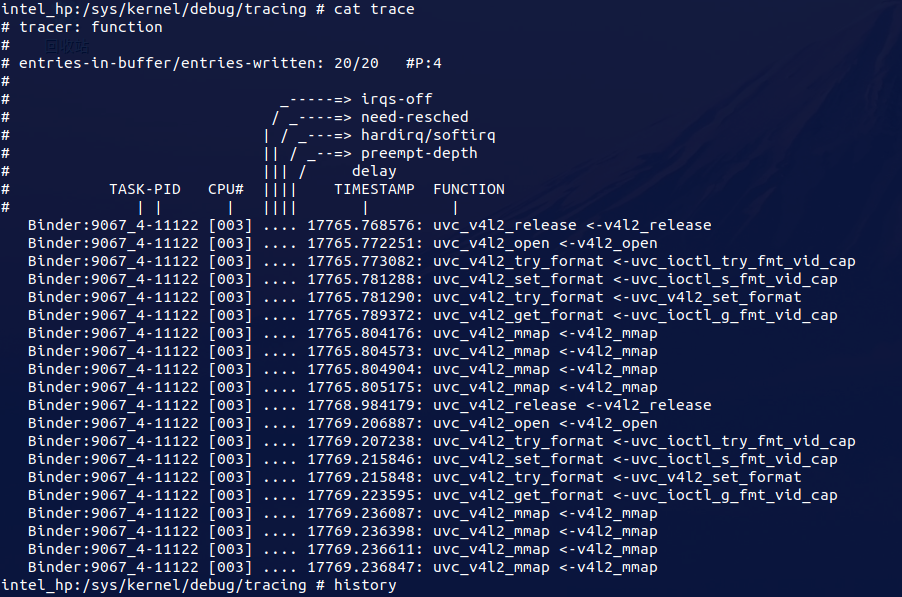

```shell
echo 0xffff > /sys/module/uvcvideo/parameters/trace //打开
echo 0 > /sys/module/uvcvideo/parameters/trace //关闭
```


利用内核中的跟踪 去梳理，函数的调用：

```shell
intel_hp:/sys/kernel/debug/tracing # 

echo '*uvc_v4l2*' > set_ftrace_filter

echo function > current_tracer 

echo 1 > tracing_on

echo 0 > tracing_on

cat trace
```

顾虑的结果如下：



