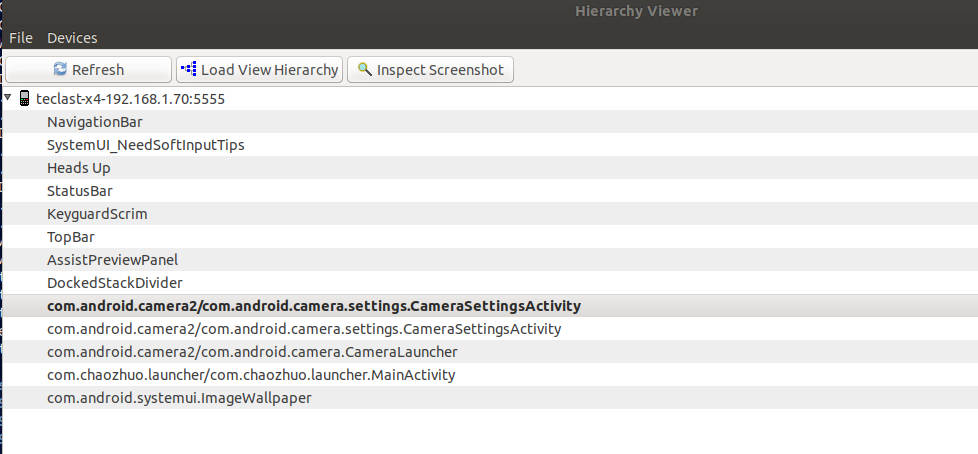
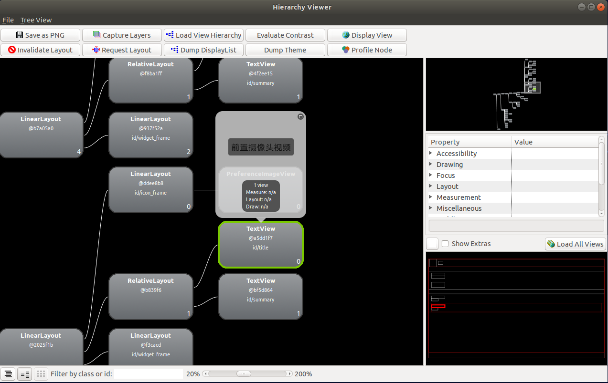

```shell
# 在源码目录下面 执行这个 
hp-4.19$ hierarchyviewer
```

可以用这个debug 获得当前 最顶层的Activity 的名字， 然后，在查错

这里记录几个，可以获取当前活动的Activity的方法:

```shell
# 获得聚焦的 activity
adb shell dumpsys activity | grep "mFoc"
```


这里在记录一个 android-studio 的 调试技巧  ， ctril + u 可以考到想看的东西

## 实际调试案例：

这里记录一个找camera2 中对应控件的例子：



从中我们知道，当前我们活动的Activity 是 CameraSettingsActivity.java 文件



我们找的就是 "前置摄像头视频" 这几个关键字：

在源码中搜索： 

```shell
hp-4.19$ grep -inR "前置摄像头视频" --include=*.xml

# 如下是搜索结果：
packages/apps/Camera2/res/values-zh-rCN/strings.xml:347 
<string name="setting_front_camera_video" msgid="2178799452805359752">"前置摄像头视频"</string>


packages/apps/Camera2$ grep -inR "setting_front_camera_video"
# 搜索结果：
res/xml/camera_preferences.xml:53:          android:title="@string/setting_front_camera_video" /> # 这个就是使用的地方


```

```xml
<ListPreference
          android:defaultValue="@string/pref_video_quality_large"
          android:entryValues="@array/pref_video_quality_entryvalues"
          android:key="pref_video_quality_front_key"                                       
          android:title="@string/setting_front_camera_video" />

```

这里如果要找对应中java中的用法，就要搜索  android:key="..." 中的内容了

```shell
packages/apps/Camera2$ grep -inR "pref_video_quality_front_key"

src/com/android/camera/settings/Keys.java:38:
```

这样就找到源码中对应的地方了， 开心吧