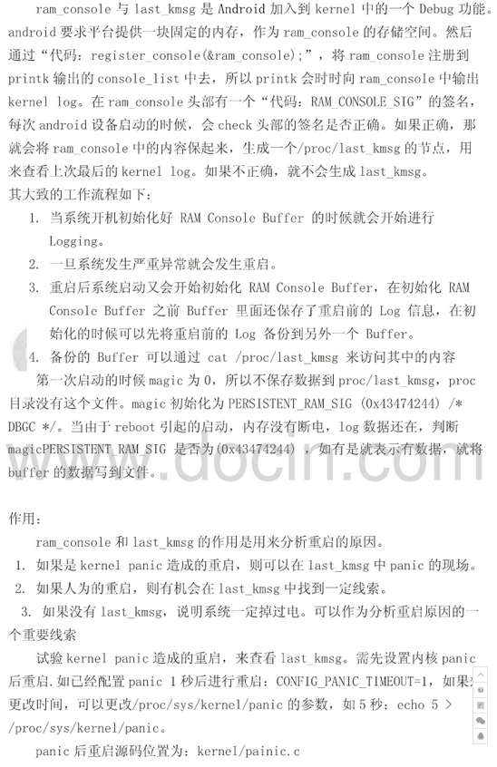
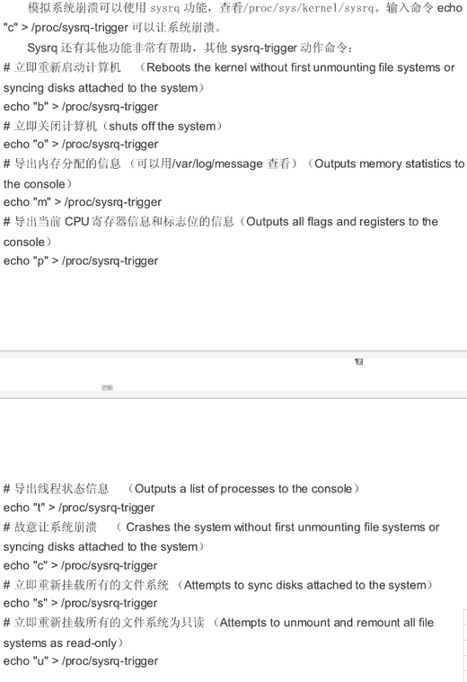

```c
void panic(const char *fmt, ...)
{

	...
        
    if (panic_timeout > 0) {
        /*
         * Delay timeout seconds before rebooting the machine.
         * We can't use the "normal" timers since we just panicked.
         */
        pr_emerg("Rebooting in %d seconds..\n", panic_timeout);

        for (i = 0; i < panic_timeout * 1000; i += PANIC_TIMER_STEP) {
            touch_nmi_watchdog();
            if (i >= i_next) {
                i += panic_blink(state ^= 1);
                i_next = i + 3600 / PANIC_BLINK_SPD;
            }
            mdelay(PANIC_TIMER_STEP);
        }
    }
    if (panic_timeout != 0) {
        /*
         * This will not be a clean reboot, with everything
         * shutting down.  But if there is a chance of
         * rebooting the system it will be rebooted.
         */
        emergency_restart();
    }
    
    ...
}
```



