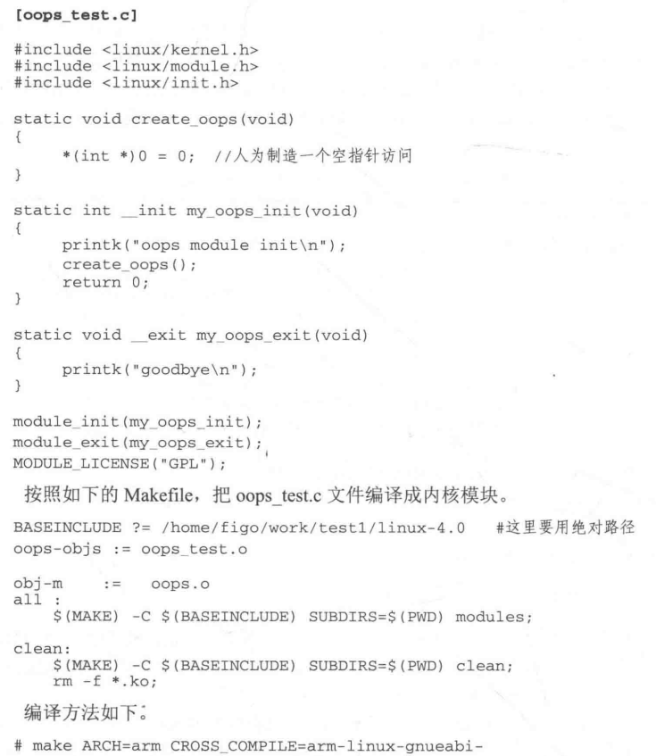
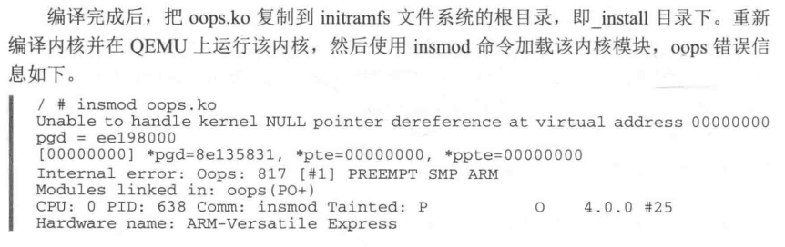
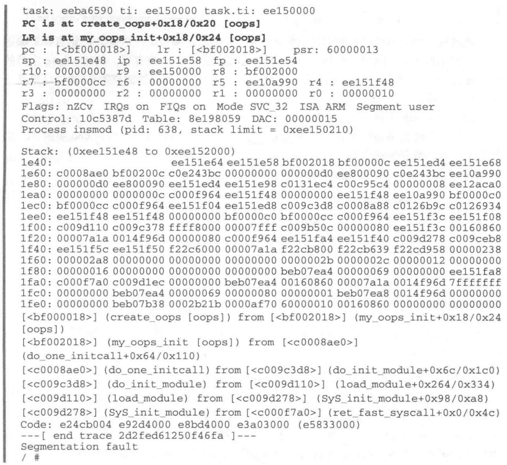
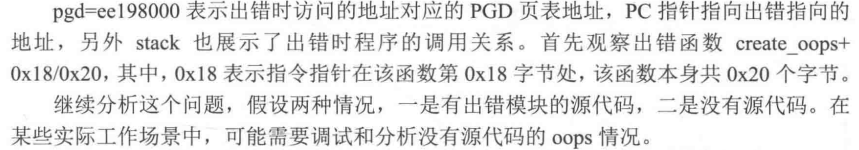
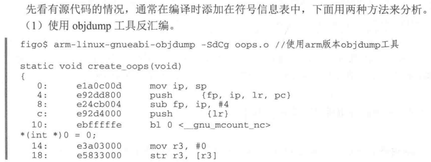
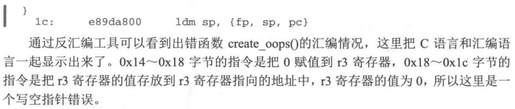
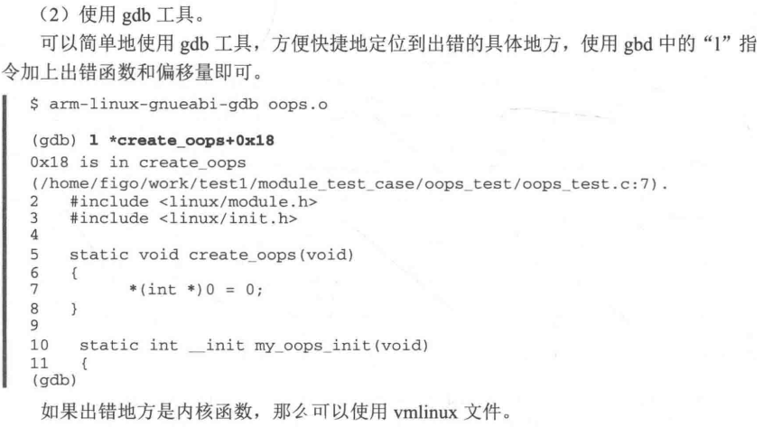

**段错误产生的原因：**

在编写驱动程序或者是内核模块时，常常会显示或者隐示地对非法取值或使用不正确的指针，导致内核发生一个oops错误。当处理器在内核空间访问一个非法的指针时，因为虚拟地址到物理地址的映射关系没有建立，触发一个缺页中断，在缺页中断中因为该地址是非法的，内核无法正确地为该地址建立映射关系，因此内核触发一个oops错误。

## 1. 有源码

## 2. 无源码

