## 1. 介绍

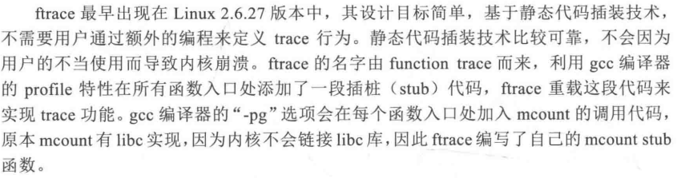

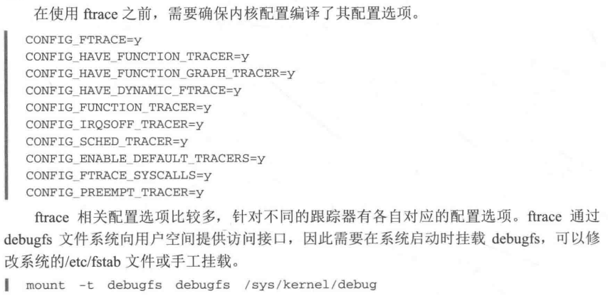

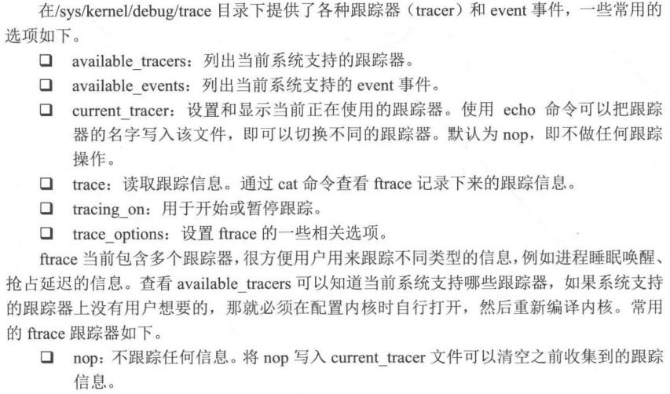


## 2. irqs 跟踪器

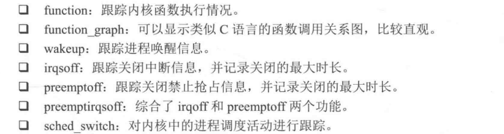

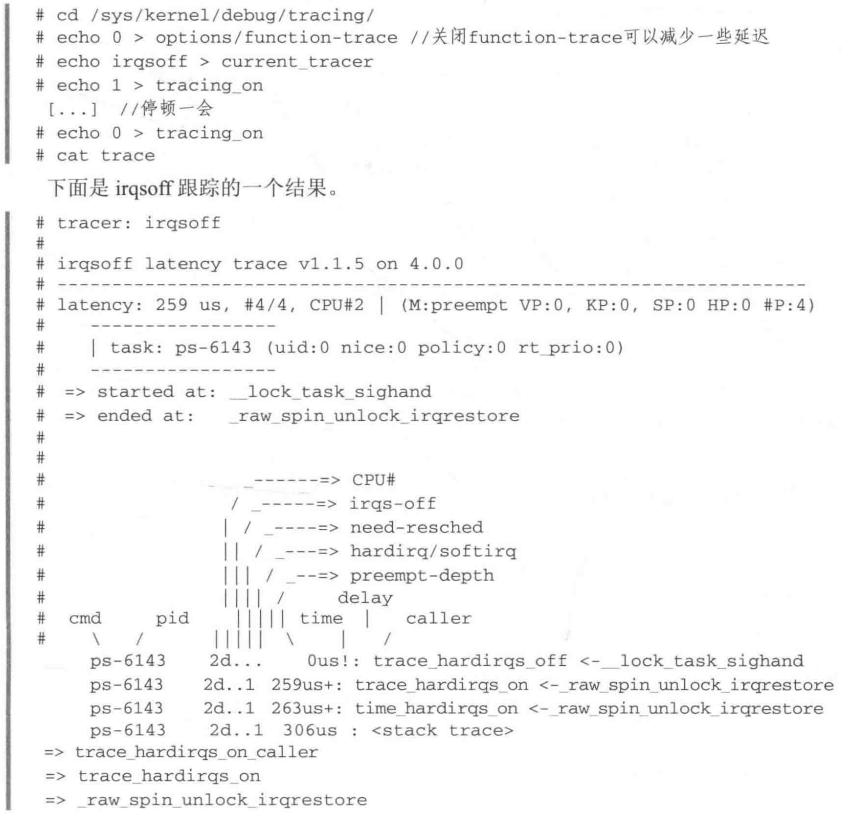


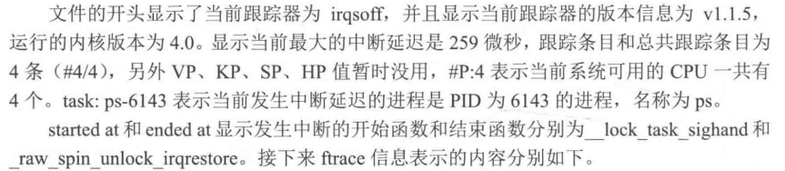

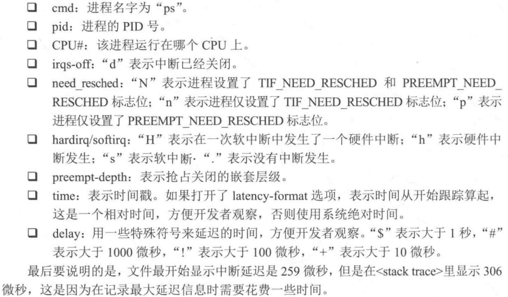

## 3. function 跟踪器

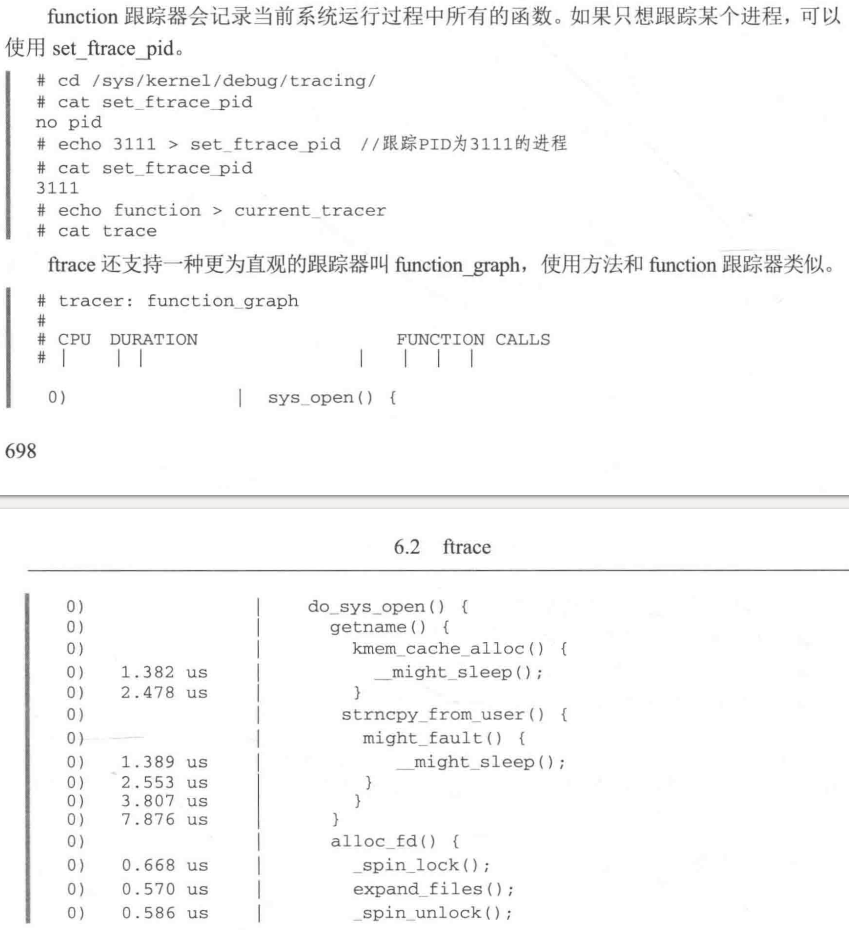

```shell
1	ps | grep camera # 获取到 camera2 相关的进程的pid
2	cd /sys/kernel/debug/tracing/
3	cat set_ftrace_pid 
4	echo 6412 > set_ftrace_pid 
5	echo function_graph > current_tracer 
6	cat trace
7	echo 1 > tracing_on 
8	echo 0 > tracing_on 
9	cat trace # 打出抓到的函数调用关系
```

## 4. 动态 ftrace

傻瓜式的跟踪  kernel 中的函数调用， 每个函数都会被记录在案

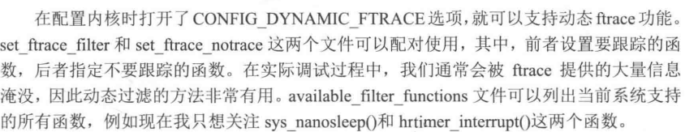


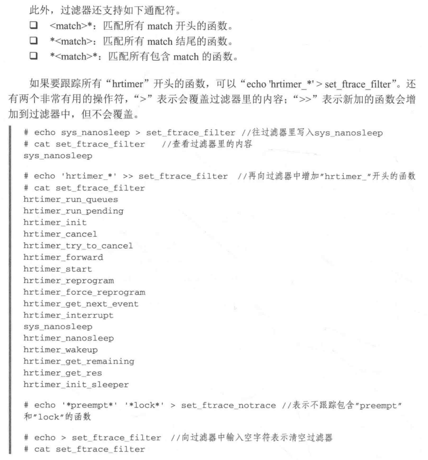

```shell
44	echo "*uvc*" > set_ftrace_filter  # 记录 uvc 相关的函数
45	cat set_ftrace_filter 
46	echo 1 > tracing_on
47	echo 0 > tracing_on
48	cat trace
49	echo > trace
50	echo "*video_decode*" > set_ftrace_notrace # 不记录 video_decode 相关的
51	cat set_ftrace_notrace 
52	echo 1 > tracing_on
53	echo 0 > tracing_on
54	cat trace
```


### 电源btn长按例子：

这里记录一个跟踪电源键长短按的例子：

首先，我们大概定位到了，代码在　kernel$ vim drivers/platform/x86/intel-hid.c 在　notify_handler　中触发的电源长按事件的上报，

此时我们为了验证，是否调用过该函数，就可以使用这种方式去判断：

```shell
intel_hp:/sys/kernel/debug/tracing # 

3	echo function > current_tracer 
4	echo "*notify_handler*" > set_ftrace_filter 
6	echo 1 > tracing_on
7	echo 0 > tracing_on
8	cat trace
```

此时长按台电x4的电源键，有如下打印：

```shell
intel_hp:/sys/kernel/debug/tracing # cat trace                                 
# tracer: function
#
# entries-in-buffer/entries-written: 2/2   #P:4
#
#                              _-----=> irqs-off
#                             / _----=> need-resched
#                            | / _---=> hardirq/softirq
#                            || / _--=> preempt-depth
#                            ||| /     delay
#           TASK-PID   CPU#  ||||    TIMESTAMP  FUNCTION
#              | |       |   ||||       |         |
     kworker/0:2-4657  [000] ....  9231.815684: notify_handler <-acpi_ev_notify_dispatch
     kworker/0:2-4657  [000] ....  9233.427688: notify_handler <-acpi_ev_notify_dispatch
```

证明我们的代码分析是对的：


## 5. 事件跟踪

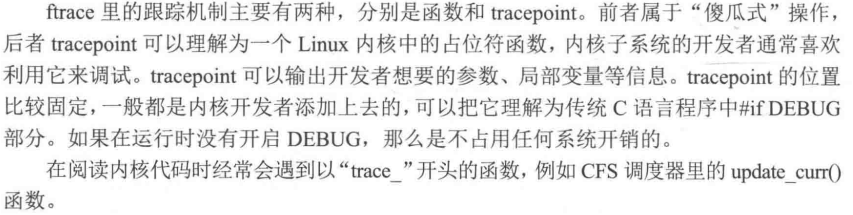

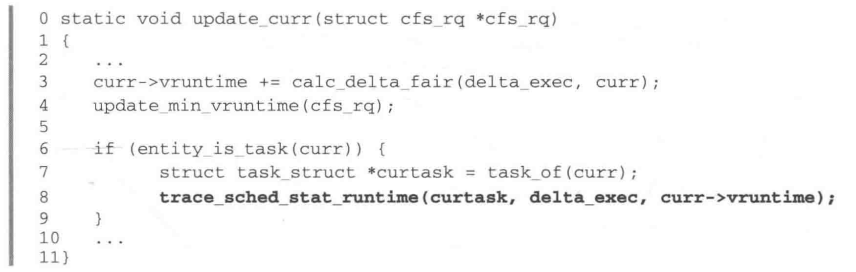

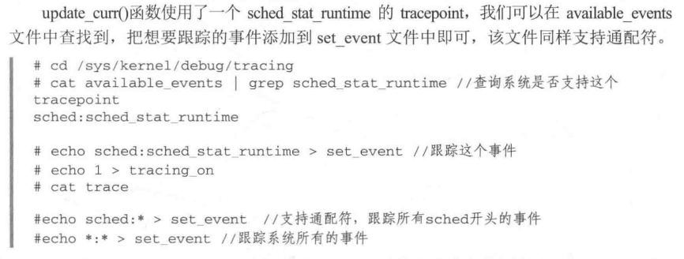

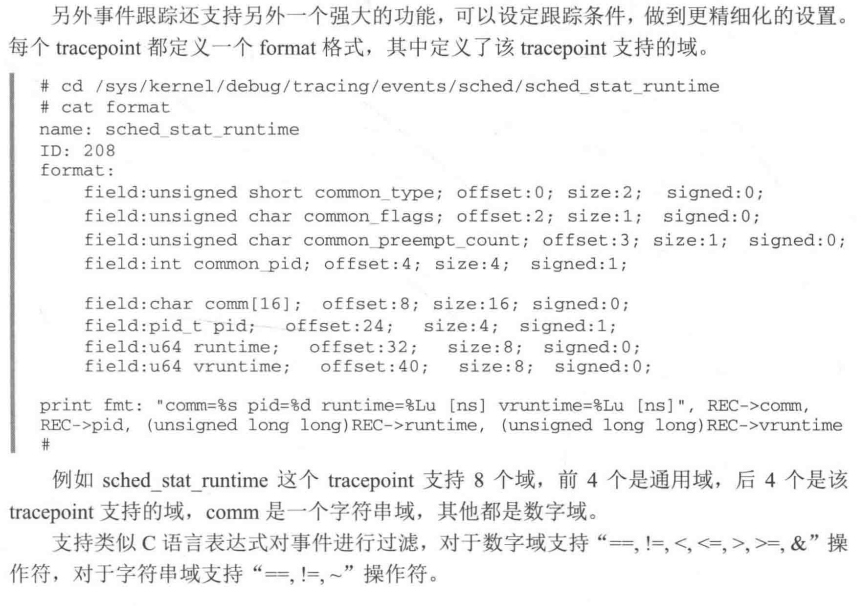

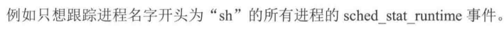

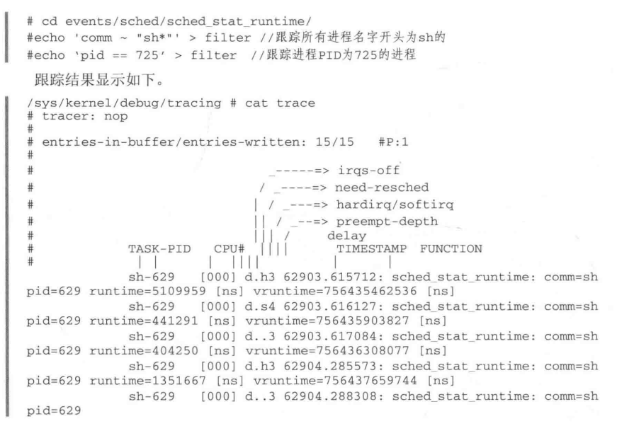

