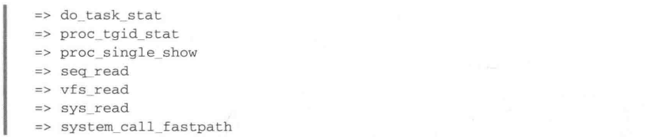
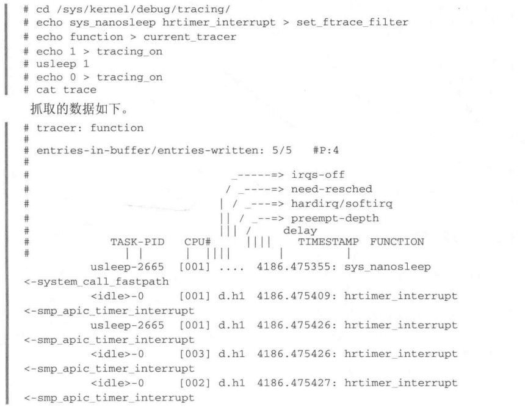

## 1. 介绍


## 2. irqs 跟踪器





## 3. function 跟踪器


```shell
1	ps | grep camera # 获取到 camera2 相关的进程的pid
2	cd /sys/kernel/debug/tracing/
3	cat set_ftrace_pid 
4	echo 6412 > set_ftrace_pid 
5	echo function_graph > current_tracer 
6	cat trace
7	echo 1 > tracing_on 
8	echo 0 > tracing_on 
9	cat trace # 打出抓到的函数调用关系
```

## 4. 动态 ftrace

傻瓜式的跟踪  kernel 中的函数调用， 每个函数都会被记录在案





```shell
44	echo "*uvc*" > set_ftrace_filter  # 记录 uvc 相关的函数
45	cat set_ftrace_filter 
46	echo 1 > tracing_on
47	echo 0 > tracing_on
48	cat trace
49	echo > trace
50	echo "*video_decode*" > set_ftrace_notrace # 不记录 video_decode 相关的
51	cat set_ftrace_notrace 
52	echo 1 > tracing_on
53	echo 0 > tracing_on
54	cat trace
```


## 5. 事件跟踪


