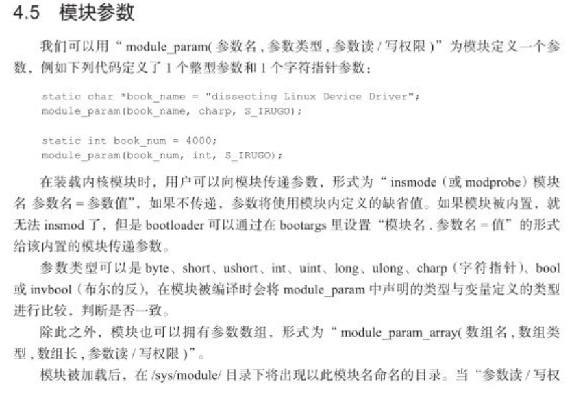
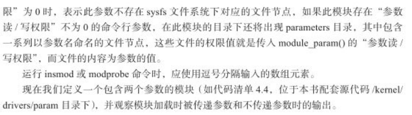
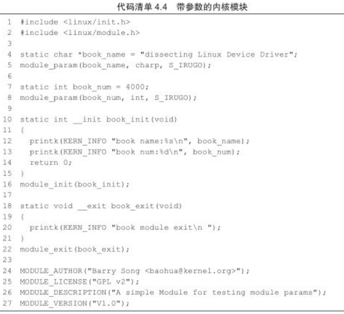
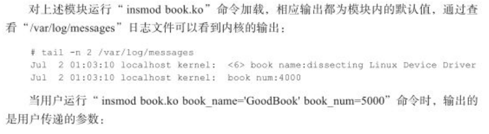
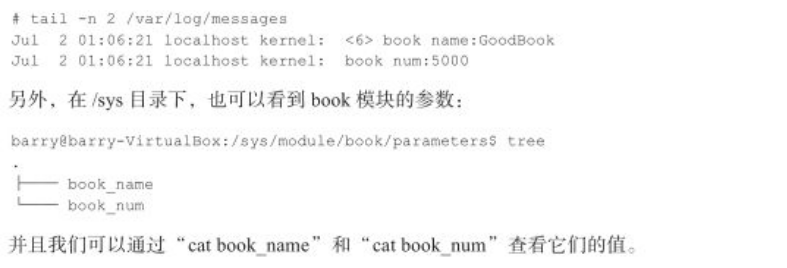

总结：

1. 能否在sys 文件系统中，看到参数对应的文件节点，取决于 module_param_named(trace, uvc_trace_param, uint, S_IRUGO|S_IWUSR); 中，第四个参数，是否具有可读可写的权限。权限位不为空，才会显示。

2. 加载模块后 ，会在 /sys/module/ 目录下出现，对应模块的名字。

3. 给模块的参数赋值的几种形式：

   ```shell
   module_param_named(trace, uvc_trace_param, uint, S_IRUGO|S_IWUSR); # 在sys以 trace 显示出， 在code 中对应的是 uvc_trace_param
   
   # 编译成模块.ko 
   insmod uvcvideo.ko trace=0xffff 
   modprobe uvcvideo.ko trace=0xffff 
   
   # 直接编译进 kernel
   # 启动传递参数时传入： 模块名.参数名=值  
   
   xxx uvcvideo.trace=0xffff 
   
   # 直接赋值
   echo 0xffff > /sys/module/uvcvideo/parameters/trace #打开
   ```

4. 

