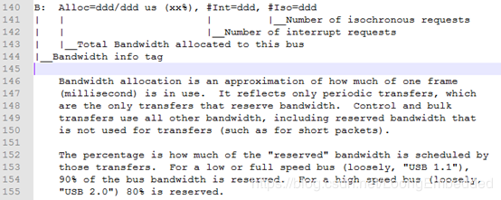
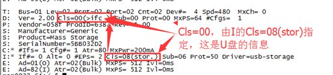

cat /sys/kernel/debug/usb/devices得到的信息如下

下图是我们产品USB 拓扑图 

USB设备通过debugfs导出/sys/kernel/debug/usb/devices显示内核已知的每个USB设备及其配置描述符，比如下面EHCI控制器的信息

每个设备debugfs文件系统对应的文件内容包含有如下内容：

T = Topology (etc.)拓扑结构

B = Bandwidth (applies only to USB host controllers, which are

    virtualized as root hubs)带宽信息，只用于USB Host控制器，它被虚拟为一个root hub

D = Device descriptor info.设备描述符信息

P = Product ID info. (from Device descriptor, but they won't fit

    together on one line)产品ID信息，来至于设备描述符。

S = String descriptors.字符串描述符

C = Configuration descriptor info. (* = active configuration)配置描述符信息

I = Interface descriptor info.接口描述符信息

E = Endpoint descriptor info.端点描述符信息

 

    T拓扑结构信息

T:  Bus=01 Lev=00 Prnt=00 Port=00 Cnt=00 Dev#=  1 Spd=480  MxCh= 1

Bus：表示总线号。

Lev：表示此USB设备位于所在总线拓扑结构的层次，见图1，EHCI控制器对应的Lev=00，其下面挂接的HUB的Lev=01，挂载在HUB下的USB网卡的Lev=02。

Prnt：表示父设备数量，比如EHCI控制器是root，位于最顶层，其Prnt=0，其下面挂接的HUB的Prnt=01，挂载在HUB下的USB网卡的Prnt=02(包括EHCI控制器和HUB)。

Port：此USB设备的父设备上的连接器/端口，比如HUB的父设备是EHCI控制器

For reasons lost in the mists of time, the Port number is always

    too low by 1(意思是从0开始).  For example, a device plugged into port 4 will
    
    show up with "Port=03".

EHCI是第1层：Port=00。

HUB是第2层：为Port=00：其父设备是EHCI，而且只有一个，根据规则(端口号从0开始编号)，所以也是0

USB摄像头、USB网卡和U盘是第3层：port的值分别是00、01、02。

 

Cnt：这层的枚举到的第几个USB设备，比如USB摄像头的Cnt=01，USB网卡的Cnt=02，U盘的Cnt=03。

 

Dev：表示设备编号，EHCI为1，HUB为2，USB网卡为3，U盘为4，按顺序排列的，一个总线上最多挂127个；可以有多个总线。

Spd：设备速率，单位为Mbps

可能的速率为

    1.5   Mbit/s for low speed USB
    
       12    Mbit/s for full speed USB
    
       480  Mbit/s for high speed USB (added for USB 2.0);
    
                also used for Wireless USB, which has no fixed speed
    
       5000       Mbit/s for SuperSpeed USB (added for USB 3.0)

MxCh：当前设备可连接的子设备最大数量，比如EHCI的MxCh=1表示EHCI下可以连接一个USB设备；HUB的MxCh=4表示此HUB可最多连接4个USB设备；USB网卡的MxCh=0表示它下面不能连接USB设备了，也就是最底层。

 

2.B带宽信息

Alloc：该总线分配得到的带宽。宽带分配在使用中是一个近似值，此值表示一帧需要多少ms。

Int：中断请求数

Iso：同步请求数，USB有四大传输，中断、控制、批量和同步。

 

3. D设备描述符信息

Ver：USB协议版本，比如Ver=2.00。

Cls：由USB-IF(USB Implementers Forum)分配的设备类类码，Hub对应09；厂家自定义的为ff；如果该字段为0x00，表示由接口描述符bInterfaceClass来指定。

 

官方链接：https://www.usb.org/defined-class-codes

 

Cls=08h，可知是Mass Storage类

Sub：设备子类，USB子类代码，由USB-IF分配。

Prot：设备协议码，由USB-IF分配。如果D的Cls和Sub都为00，则该字段也必须为00，采用I的Prot=50。

MxPs：默认断电的最大包大小，只有8、16、32或64有效。

Cfgs：表示设备支持的配置数量。仅表示当前运行速度下的配置数量。计数中不包括其他运行速度的配置。 如果特定速度的设备有特定配置，则bNumConfigurations字段仅反映单个速度的配置数量，而不是两个速度的配置总数量。这里的EHCI、HUB、USB网卡和U盘下的Cfgs都是1，因为只使用了一个配置，所以设置为1

 

4. P产品ID信息

Vendor：厂商ID，比如ECHI的vendor=1d6b

ProdID：厂商产品的ID，比如ECHI的ProdID=0002表示支持USB2.0的产品。

Rev：产品版本号，比如3.18这里指linux内核版本。

USB-IF为厂商分配的vendor和product ID的链接http://www.linux-usb.org/usb.ids。

5. S字符串描述符信息

Manufacturer：从设备中读到的生产商描述性信息，比如USB网卡Manufacturer=ASIX Elec. Corp.

Product：从设备中读取的产品描述性信息，比如USB网卡Product=AX88772B，比如EHCI控制器的Product=EHCI Host Controller，这在kernel\msm-3.18\drivers\usb\host\ehci-hcd.c中定义。

SerialNumber：从设备中读取的产品序列号

 

6. C配置描述符信息

Ifs：此配置支持的USB接口数量，每个配置有一个或多个接口组成，每个接口具有独特的功能，并且绑定到不同的USB设备驱动。一个常见的例子是一个USB播放器，它带有一个播放的音频接口和一个用于音量控制的HID接口。EHCI、HUB，HUB下的U盘和USB网卡的Ifs都是1，说明它们支持1个USB接口。HUB下的USB摄像头的Ifs是2，说明它支持2个USB接口。

Cfg：此配置配置数量，这里我们的都是01。

Atr：属性，供电配置，位详细定义如下：

                          D7              保留，必须置1
    
                          D6              自供电模式
    
                          D5              远程唤醒
    
                          D4～D0      保留

MPwr：最大功耗，以2mA为单位，例如0x32为50*2=100mA。 USB设备供电有两种方式，self-powered和bus-powered两种方式，驱动代码会判断设备标志寄存器是否过流的。最大500mA。

 

7.I接口描述符信息

If：该接口编号，接口编号从0开始分配，当一个配置有多个接口时，就用该字段来区分不同的接口。我们这里的If都为0

Alt：USB设备配置与USB配置描述符是一一对应的, 即一个配置只能有一个配置描述符。虽然由bInterfaceNumber字段可知, 每一个接口都有一个惟一确定的接口编号, 但是一个接口却可以由不只一个接口描述符来描述它。USB 允许多个接口描述符来描述同一个接口, 且这些描述符都可通过命令切换。此字段就是每一个这类描述符惟一的编号。USB可通过调用这个字段来切换描述同一个接口的不同描述符。控制传输中的Get_Inter face 命令可以用来得到目前正在使用的描述一个确定接口的接口描述符的编号, 即此字段。而Set_Inte rface 命令则以此字段值为参数, 用来使相应的接口描述符描述某个确定的接口。我们这里的Alt都为0。

Eps：端点数量，不包括端点0。USB网卡AX88772C这里的Alt=3(不包括Endpoint0)

AX88772C关于端点的说明

Cls：接口类码，比如HUB的为09h，USB-IF分配的类代码，0预览未来使用，0xFF表示接口类是厂家自定义，其他值由USB-IF指定。

Sub：接口子类码。USB-IF分配的子类代码，由Cls限制

Prot：接口的协议，如果一个接口支持特定类请求，此代码标识由特定设备类定义的协议，如果该字段为0，设备部在此接口不使特定类的协议，如果该字段为0xFF，设备为此接口使用厂家自定义协议。

Driver：驱动名字

 

8.E端点描述符信息。

Ad：端点地址(I=In，O=out)

Atr：端点属性。

MxPS：端点所支持最大数据包的长度。

Ivl：端点数据传输的访问时间间隔。对于全速/低速的中断端点，取值范围为 1~255，对于高速中断端点，取值范围为1~16，详细定义可以参考USB协议。比如HUB的Ivl=256ms。

 

参考链接：

/sys/kernel/debug/usb/devices解析

https://www.cnblogs.com/hellokitty2/p/9418895.html

 

Linux下，查看USB设备信息

https://blog.csdn.net/zouli415/article/details/79886084

 

linux下的ehci控制器调试

https://blog.csdn.net/xiaojsj111/article/details/41864597

 

lsusb、usbfs查看usb拓扑结构

https://blog.csdn.net/shichaog/article/details/42269483
