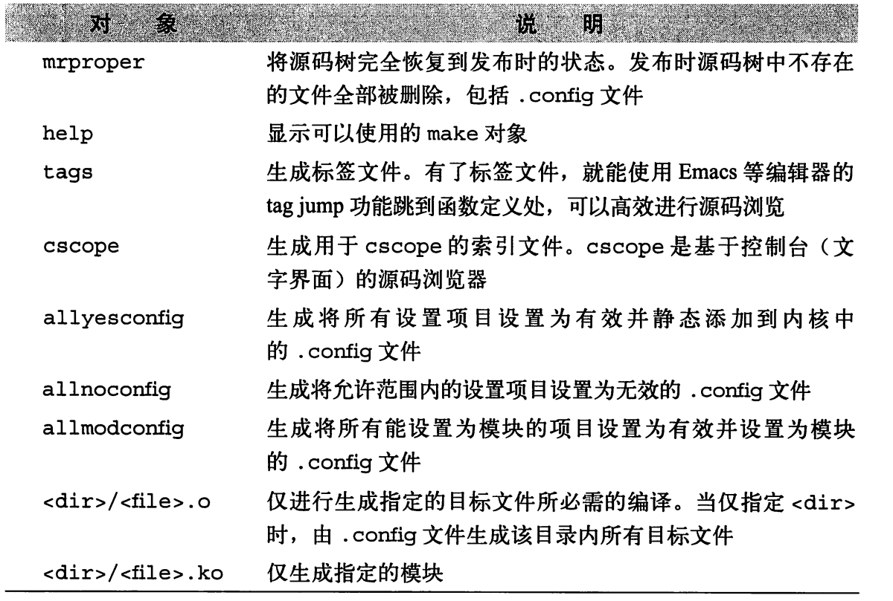
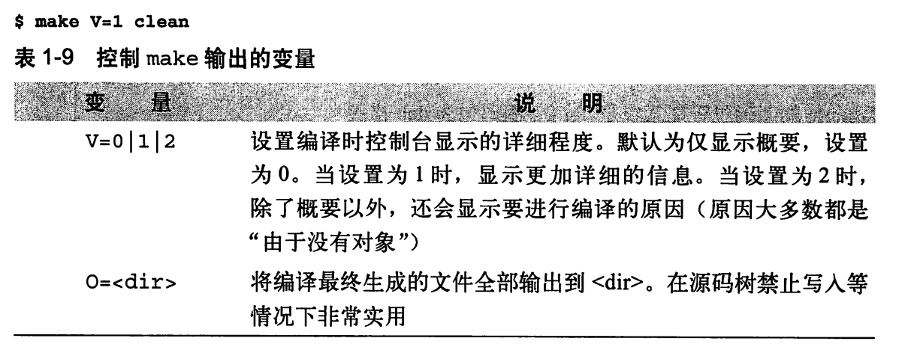

在phoenixos 的源码根目录直接：

```shell
/bin/bash -c "make -j4 -C ~/sd_480/edu_tec_x4/out/target/product/x86_64/obj/kernel O=/home/colby/sd_480/edu_tec_x4/out/target/product/x86_64/obj/kernel ARCH=x86_64 CROSS_COMPILE=\" /home/colby/sd_480/edu_tec_x4/prebuilts/gcc/linux-x86/host/x86_64-linux-glibc2.15-4.8/bin/x86_64-linux-\"  bzImage modules"
```


kernel/drivers$ vim ./ptp/ptp_dte.c


这里记录一个事，例如将单独文件修改后，只编译修改部分，如何编译，在phoenix中：

```shell
# 修改 如下文件
drivers/net/wireless/intel/iwlwifi/cfg/22000.c
```


此时编译时，我们只需要编译如下：

```shell
/bin/bash -c "make  -j4 -C /home/colby/phoenixos_edu/out/target/product/x86_64/obj/kernel  O=/home/colby/phoenixos_edu/out/target/product/x86_64/obj/kernel ARCH=x86_64 CROSS_COMPILE=\" /home/colby/phoenixos_edu/prebuilts/gcc/linux-x86/host/x86_64-linux-glibc2.15-4.8/bin/x86_64-linux-\"  drivers/net/wireless/intel/iwlwifi/"
```

**这里只需要指定  drivers/net/wireless/intel/iwlwifi/cfg/22000.c 最近的那个 Makefile所在的目录即可**

例如这里是  drivers/net/wireless/intel/iwlwifi/

此时编译时，就会将 drivers/net/wireless/intel/iwlwifi/ 该目录下所有的都会重新进行编译


答案就在这个里面：






```shell
# 在这里编译时，可以打印出编译的理由
colby@colby-pc:~/phoenixos_edu$

/bin/bash -c "make  -j4 -C /home/colby/phoenixos_edu/out/target/product/x86_64/obj/kernel  O=/home/colby/phoenixos_edu/out/target/product/x86_64/obj/kernel ARCH=x86_64 CROSS_COMPILE=\" /home/colby/phoenixos_edu/prebuilts/gcc/linux-x86/host/x86_64-linux-glibc2.15-4.8/bin/x86_64-linux-\" V=2  drivers/net/wireless/intel/iwlwifi/"
```


# INSTALL_MOD_STRIP=1

内核编译模块 时  INSTALL_MOD_STRIP=1 的含义

如果在build ko的时候加上INSTALL_MOD_STRIP=1的话，则build ko的时候
会加上--strip-debug 这样会让build出的ko size大幅缩小。

具体是在kernel 根目录下面的有对INSTALL_MOD_STRIP=1 进行处理
ifdef INSTALL_MOD_STRIP
ifeq ($(INSTALL_MOD_STRIP),1)
mod_strip_cmd = $(STRIP) --strip-debug
else
mod_strip_cmd = $(STRIP) $(INSTALL_MOD_STRIP)
endif # INSTALL_MOD_STRIP=1
else
mod_strip_cmd = true
endif # INSTALL_MOD_STRIP
export mod_strip_cmd

最终会在scripts/Makefile.modinst中用到mod_strip_cmd，可见build ko的时候会加上mod_strip_cmd

quiet_cmd_modules_install = INSTALL $@
      cmd_modules_install = \
    mkdir -p $(2) ; \
    cp $@ $(2) ; \
    $(mod_strip_cmd) $(2)/$(notdir $@) ; \
    $(mod_sign_cmd) $(2)/$(notdir $@) $(patsubst %,|| true,$(KBUILD_EXTMOD)) && \
$(mod_compress_cmd) $(2)/$(notdir $@) 
————————————————
版权声明：本文为CSDN博主「tiantao2012」的原创文章，遵循 CC 4.0 BY-SA 版权协议，转载请附上原文出处链接及本声明。
原文链接：https://blog.csdn.net/tiantao2012/article/details/54582606

