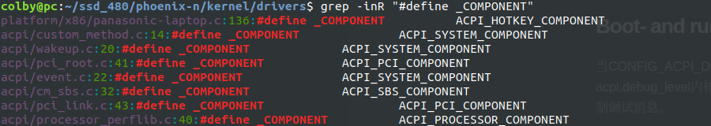

00.debug

# ACPI Debug Output

ACPICA、LinuxACPI核心和一些ACPI驱动程序可以生成调试输出。本文档描述了如何使用此设施。

## Compile-time configuration

ACPI调试输出由配置“CONFIG_ACPI_DEBUG”全局启用。如果关闭此配置选项，调试消息甚至不会内置到内核中。

## Boot- and run-time configuration

当CONFIG_ACPI_DEBUG=y时，您可以选择您感兴趣的消息的组件和级别。在引导时，使用acpi.debug_layer和acpi.debug_level内核命令行选项。引导后，可以使用/sys/module/acpi/parameters/中的debug_layer和debug_level来控制调试消息。

## debug_layer (component)

调试层

“debug_layer”是一个选择感兴趣的组件的掩码，例如特定的驱动程序或ACPI解释器的一部分。要构建debug_layer位掩码，请在ACPI源文件中查找"#define _COMPONENT"组件。



可以使用acpi.debug层命令行参数在启动时设置debug_layer掩码，并且可以在启动后通过将值写入/sys/module/acpi/parameters/debug_layer来更改它。

可能的组件在include/acpi/acoutput.h和include/acpi/acpi_drivers.h中定义。读　/sys/module/acpi/parameters/debug-layer显示支持的掩码值，目前这些值：

```shell
ACPI_UTILITIES                  0x00000001
ACPI_HARDWARE                   0x00000002
ACPI_EVENTS                     0x00000004
ACPI_TABLES                     0x00000008
ACPI_NAMESPACE                  0x00000010
ACPI_PARSER                     0x00000020
ACPI_DISPATCHER                 0x00000040
ACPI_EXECUTER                   0x00000080
ACPI_RESOURCES                  0x00000100
ACPI_CA_DEBUGGER                0x00000200
ACPI_OS_SERVICES                0x00000400
ACPI_CA_DISASSEMBLER            0x00000800
ACPI_COMPILER                   0x00001000
ACPI_TOOLS                      0x00002000
ACPI_BUS_COMPONENT              0x00010000
ACPI_AC_COMPONENT               0x00020000
ACPI_BATTERY_COMPONENT          0x00040000
ACPI_BUTTON_COMPONENT           0x00080000
ACPI_SBS_COMPONENT              0x00100000
ACPI_FAN_COMPONENT              0x00200000
ACPI_PCI_COMPONENT              0x00400000
ACPI_POWER_COMPONENT            0x00800000
ACPI_CONTAINER_COMPONENT        0x01000000
ACPI_SYSTEM_COMPONENT           0x02000000
ACPI_THERMAL_COMPONENT          0x04000000
ACPI_MEMORY_DEVICE_COMPONENT    0x08000000
ACPI_VIDEO_COMPONENT            0x10000000
ACPI_PROCESSOR_COMPONENT        0x20000000
```

## debug_level

调试级别

“debug_level”是一个掩码，用于选择不同类型的消息，例如与初始化、方法执行、信息消息等相关的消息。要构建调试级别，请查看ACPI_DEBUG_PRINT() 语句中指定的级别。

ACPI解释器使用几个不同的级别，但是LinuxACPI核心和ACPI驱动程序通常只使用ACPI_LV_INFO

您可以使用 acpi.debug_level 的命令行参数在启动时设置debug_level的掩码，并且可以在启动后通过将值写入 /sys/module/acpi/parameters/debug_level 来更改它

The possible levels are defined in include/acpi/acoutput.h.  Reading
/sys/module/acpi/parameters/debug_level shows the supported mask values,
currently these:

```shell
ACPI_LV_INIT                    0x00000001
ACPI_LV_DEBUG_OBJECT            0x00000002
ACPI_LV_INFO                    0x00000004
ACPI_LV_INIT_NAMES              0x00000020
ACPI_LV_PARSE                   0x00000040
ACPI_LV_LOAD                    0x00000080
ACPI_LV_DISPATCH                0x00000100
ACPI_LV_EXEC                    0x00000200
ACPI_LV_NAMES                   0x00000400
ACPI_LV_OPREGION                0x00000800
ACPI_LV_BFIELD                  0x00001000
ACPI_LV_TABLES                  0x00002000
ACPI_LV_VALUES                  0x00004000
ACPI_LV_OBJECTS                 0x00008000
ACPI_LV_RESOURCES               0x00010000
ACPI_LV_USER_REQUESTS           0x00020000
ACPI_LV_PACKAGE                 0x00040000
ACPI_LV_ALLOCATIONS             0x00100000
ACPI_LV_FUNCTIONS               0x00200000
ACPI_LV_OPTIMIZATIONS           0x00400000
ACPI_LV_MUTEX                   0x01000000
ACPI_LV_THREADS                 0x02000000
ACPI_LV_IO                      0x04000000
ACPI_LV_INTERRUPTS              0x08000000
ACPI_LV_AML_DISASSEMBLE         0x10000000
ACPI_LV_VERBOSE_INFO            0x20000000
ACPI_LV_FULL_TABLES             0x40000000
ACPI_LV_EVENTS                  0x80000000
```

## Examples

For example, drivers/acpi/bus.c contains this:

```c
#define _COMPONENT              ACPI_BUS_COMPONENT
...
ACPI_DEBUG_PRINT((ACPI_DB_INFO, "Device insertion detected\n"));
```

要打开此消息，请在acpi.debug_layer中设置ACPI_BUS_COMPONENT 位，并在acpi.debug_level层中设置ACPI_LV_INFO位。（ACPI_DEBUG_PRINT语句使用ACPI_DB_INFO，它是基于acpi_lv_info定义的宏。）

Enable all AML "Debug" output (stores to the Debug object while interpreting AML) during boot:　启动期间启用所有AML“调试”输出（在解释AML时存储到调试对象）：

```shell
# 内核传参
acpi.debug_layer=0xffffffff acpi.debug_level=0x2
```


Enable PCI and PCI interrupt routing debug messages:

```shell
acpi.debug_layer=0x400000 acpi.debug_level=0x4
```


Enable all ACPI hardware-related messages: 启用所有与ACPI硬件相关的消息：

```c
acpi.debug_layer=0x2 acpi.debug_level=0xffffffff
```


Enable all ACPI_DB_INFO messages after boot:

```shell
# echo 0x4 > /sys/module/acpi/parameters/debug_level
```


Show all valid component values:

```shell
# cat /sys/module/acpi/parameters/debug_layer
```

