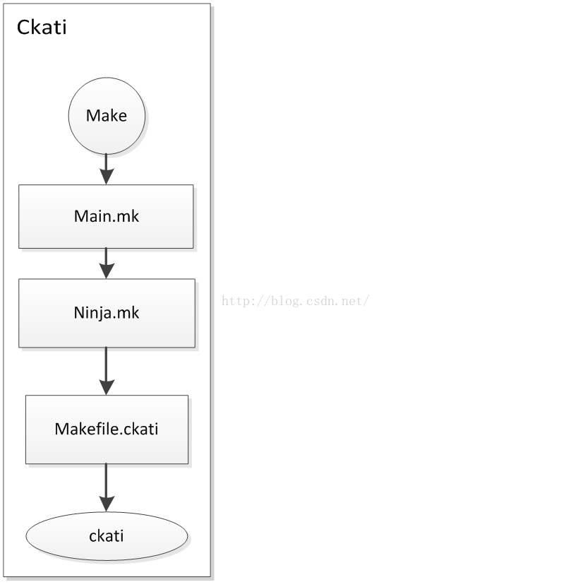
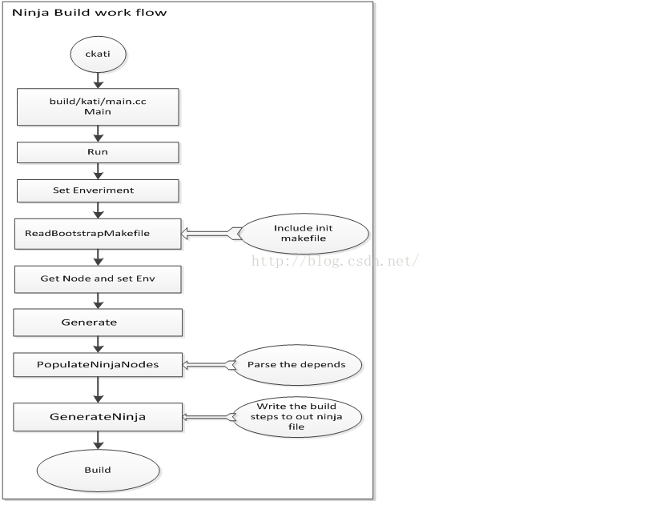

# 引言

使在Android N的系统上，初次使用了Ninja的编译系统。对于Ninja，最初的印象是用在了Chromium open source code的编译中，在chromium的编译环境中，使用ninja -C out/Default chrome命令，就可以利用源码编译出chrome的apk。对使用者而言，抛开对原理的探究，最直观的印象莫过于可以清楚的看到自己当前编译的进度。同时，对android而言，也可以感受到编译速度的提升带来的便捷。本文将深入分析Ninja的编译原理，以及android上面的编译改变。

正因为这个改变，所以在编译android N的code的时候需要使用OpenJDK8

编译系统的内存最少需要12G，建议16G，否则会出现JVM不足的错误。

8G内存的机器可以通过增大JVM默认值的方法来解决，但是经过测试，还是会偶尔出现JVM不足的错误

exportJAVA_OPTS='-Xmx4096M'


概念简介

名词：

Ninja
	

Blueprint
	

Soong

 

Ninja

Ninja是一个致力于速度的小型编译系统（类似于Make）；

如果把其他编译系统比做高级语言的话，Ninja就是汇编语言

主要有两个特点：

1、可以通过其他高级的编译系统生成其输入文件；

2、它的设计就是为了更快的编译；

使用Kati把makefile转换成Ninja files，然后用Ninja编译

在不久的将来，当不再用Makefile（Android.mk）时，Kati将被去掉

ninja核心是由C/C++编写的，同时有一部分辅助功能由python和shell实现。由于其开源性，所以可以利用ninja的开源代码进行各种个性化的编译定制。

 

Github地址： https://github.com/ninja-build/ninja


Blueprint, Soong

 

Blueprint和Soong是用于一起把Blueprint 文件转换为Ninja文件。 将来需要写Blueprint文件（Android.bp），转换为Android.soong.mk（也可以直接写），然后转换为Ninja文件（build.ninja）然后用Ninja编译。

如果Android.mk和Android.bp同时存在，Android.mk会被忽略。

如果Android.bp的同级目录下有Android.soong.mk也会被include

 

## 1.ckati可执行文件的生成

 

在android系统中，目前还未完全切换到Ninja编译，编译的入口仍然是make命令, 如下commands以nexus为例：

source build/envsetup.sh

choosecombo

make -j4

在这边可以看到，最终编译使用的命令仍然是make.

既然是make，那就在编译中首先include到的就是build/core/main.mk了，在main.mk中，我们可以清楚的看到对Ninja的调用：

```makefile
relaunch_with_ninja :=
ifneq ($(USE_NINJA),false)
ifndef BUILDING_WITH_NINJA
relaunch_with_ninja := true
endif
endif 
```

由于USE_NINJA默认没有定义，所以一定会进入到这个选项中，并且将relaunch_with_ninja置为true。这样的话，就会进入到下面的重要操作语句，去include ninja的makefile.  并且在out目录下生成ninja_build的文件，显示当前是使用了ninja的编译系统。

 ```makefile
ifeq ($(relaunch_with_ninja),true)    
# 这里会走这个分支
$(shell mkdir -p $(OUT_DIR) && touch $(OUT_DIR)/ninja_build)
include build/core/ninja.mk

else # !relaunch_with_ninja

ifndef BUILDING_WITH_NINJA
$(shell rm -f $(OUT_DIR)/ninja_build)

endif
 ```

在include build/core/ninja.mk的语句执行后，我们就可以看到真正定义ninja的地方了。由于前面简介讲了ninjia是基于开源项目编译出来的轻便的编译工具，所以这边google肯定也对ninjia进行了修改，编译，并且最终生成了一个可执行的应用程序。在simba6项目中，我们可以在prebuilts/ninja/linux-x86下面找到这个可执行的应用程序ninja。我们可以简单的运行这个ninja的命令，比如ninja –h, 就可以了解到这个command的基本用法, 也可以看到本版本的ninja使用的base version为1.6.0。

```shell
phoenix-n/prebuilts/ninja/linux-x86$ ./ninja -h
usage: ninja [options] [targets...]

if targets are unspecified, builds the 'default' target (see manual).

options:
  --version  print ninja version ("1.6.0")

  -C DIR   在做其他事情之前切换到dir
  -f FILE  指定输入生成文件[default=build.ninja]

  -j N     并行运行n个作业[默认值为10，从可用的CPU派生]
  -k N     继续，直到n个作业失败[默认值=1]
  -l N     如果平均负载大于n，则不要启动新作业
  -n       试运行（不要运行命令，而是像成功一样）
  -v       生成时显示所有命令行

  -d MODE  启用调试（使用-d list to list模式）
  -t TOOL  运行子集合（使用-t list列出子集合）终止顶级选项；其他标志将传递给工具
  -w FLAG  调整警告（使用-w list列出警告） 
```

```makefile
# ninja.mk 
NINJA ?= prebuilts/ninja/$(HOST_PREBUILT_TAG)/ninja

# 当我们启用 Android.bp 去编译android的时候， 需要这样做：  
# mesa-phoenix-n-update$ make iso_img -j8 'USE_SOONG=true'

ifeq ($(USE_SOONG),true) 
USE_SOONG_FOR_KATI := true             
endif
```

在声明了 ninjia 可执行程序的目录之后，紧接着在ninja.mk中就提及了kati的定义。

KATI ?= $(HOST_OUT_EXECUTABLES)/ckati

目标KATI是利用源码编译生成的一个可执行的程序。源码在build/kati文件夹中。这同样是一个开源的代码。

开源网站的地址为：

https://github.com/google/kati

 

我们可以clone下来最新的code，或者在源码build/kati中直接按下面的步骤来编译ckati的可执行程序。

一、添加软件源

 sudo add-apt-repository ppa:ubuntu-toolchain-r/test

 sudo apt-get update

二、安装版本的命令：

sudo apt-get install gcc-4.8 g++-4.8 

三、查看本地版本

四、切换版本

sudo update-alternatives --install /usr/bin/gcc gcc /usr/bin/gcc-4.660 

sudo update-alternatives --install /usr/bin/gcc gcc/usr/bin/gcc-4.8 40 

sudo update-alternatives --install /usr/bin/g++ g++/usr/bin/g++-4.6 60 

sudo update-alternatives --install /usr/bin/g++ g++/usr/bin/g++-4.8 40 

 这里的4.6是你本机之前的版本。

sudo update-alternatives --config gcc 

sudo update-alternatives --config g++ 

选择你需要的版4.8.

在选择好了之后，执行make，即可开始编译。编译後会在根目录生成ckati的可执行程序。

 

当然，android源码是利用makefile来做的，我们可以看到ninja.mk中对ckati的makefile进行了调用。

文件地址：include build/kati/Makefile.ckati

在kati的makefile中，我们可以看到真正去编译kati的过程。

```makefile
# Rule to build ckati into KATI_BIN_PATH
$(KATI_BIN_PATH)/ckati: $(KATI_CXX_OBJS) $(KATI_CXX_GENERATED_OBJS)                       
    @mkdir -p $(dir $@)
    $(KATI_LD) -std=c++11 $(KATI_CXXFLAGS) -o $@ $^ $(KATI_LIBS)
    
 # Rule to build normal source files into object files in KATI_INTERMEDIATES_PATH
$(KATI_CXX_OBJS) $(KATI_CXX_TEST_OBJS): $(KATI_INTERMEDIATES_PATH)/%.o: $(KATI_SRC_PATH)/%.cc
    @mkdir -p $(dir $@)
    $(KATI_CXX) -c -std=c++11 $(KATI_CXXFLAGS) -o $@ $<

# Rule to build generated source files into object files in KATI_INTERMEDIATES_PATH
$(KATI_CXX_GENERATED_OBJS): $(KATI_INTERMEDIATES_PATH)/%.o: $(KATI_INTERMEDIATES_PATH)/%.cc
    @mkdir -p $(dir $@)
    $(KATI_CXX) -c -std=c++11 $(KATI_CXXFLAGS) -o $@ $<   
```

这个调用简单解释一下，就是编译kati是需要依赖与KATI_CXX_OBJS和 KATI_CXX_GENERATED_OBJS这两个变量。 KATI_CXX_OBJS的生成依赖于 KATI_INTERMEDIATES_PATH下的.o，而.o文件的生成又依赖与KATI_INTERMEDIATES_PATH下的.cc文件。在生成了所有依赖的.o文件之后，会link成编译所需的ckati文件。具体的命令为：$(KATI_LD) -std=c++11$(KATI_CXXFLAGS) -o $@ $^ $(KATI_LIBS)

这样的话，就完成了ckati可执行文件的生成。

流程图可以简单归结如下：

 

## 2. 解析并使用ninja

ckati文件生成之后，我们接着来看是如何使用的。

接着回到ninja.mk文件中，如下是具体的调用。

 

```makefile
$(KATI_BUILD_NINJA): $(KATI) $(MAKEPARALLEL)$(DUMMY_OUT_MKS) $(SOONG_ANDROID_MK) FORCE
	@echo Running kati to generatebuild$(KATI_NINJA_SUFFIX).ninja...  
    
    +$(hide)$(KATI_MAKEPARALLEL) $(KATI) --ninja --ninja_dir=$(OUT_DIR)--ninja_suffix=$(KATI_NINJA_SUFFIX) --regen --ignore_dirty=$(OUT_DIR)/%--no_ignore_dirty=$(SOONG_ANDROID_MK) --ignore_optional_    include=$(OUT_DIR)/%.P--detect_android_echo $(KATI_FIND_EMULATOR) -f build/core/main.mk $(KATI_GOALS)--gen_all_targets BUILDING_WITH_NINJA=true SOONG_ANDROID_MK=$(SOONG_ANDROID_MK)
```


可以看到使用kati，并且将很多的参数传入到了ckati中。

在kati文件的main函数中，可以看到接受了这些参数并且进行处理。

文件地址：build/kati/main.cc

main函数：

```c
int main(int argc, char* argv[]) {
  if (argc >= 2 && !strcmp(argv[1], "--realpath")) {
    HandleRealpath(argc - 2, argv + 2); 
    return 0;
  }
  Init();
  string orig_args;
  for (int i = 0; i < argc; i++) {
    if (i) 
      orig_args += ' ';
    orig_args += argv[i];
  }
  g_flags.Parse(argc, argv);
  FindFirstMakefie();
  if (g_flags.makefile == NULL)
    ERROR("*** No targets specified and no makefile found.");
  // This depends on command line flags.
  if (g_flags.use_find_emulator)
    InitFindEmulator();
  int r = Run(g_flags.targets, g_flags.cl_vars, orig_args);
  Quit();
  return r;
}
```


argv接受到了传入的参数後，经过处理，转化为了string，传入orig_args变量，并且调用Run函数来进行后续的处理。Run函数是kati程序的核心，用于各种文件的生成，流程的执行以及处理。我们这边只对重点内容进行分析。

任何的编译都脱离不了环境变量的支持，在编译的第一步，肯定要对环境变量进行设置。

在run函数的开始，就利用Linux标准C接口来进行了环境变量的读取和设置。

具体操作为：

```c
extern "C" char** environ;

static int Run() {
    ...
    for (char** p = environ; *p; p++) {
        printf("*p = %s \n", *p); // 如果我们prinf打印*p的值，可以很清楚的看到该环境变量的设置。这边只截取部分环境变量用于说明该问题：
    	SetVar(*p, VarOrigin::ENVIRONMENT);
  } 
    
    ReadBootstrapMakefile(targets, &bootstrap_asts);
    ...
}                                                                 
```

```c
/*                                                                                         
 *p =XDG_SESSION_PATH=/org/freedesktop/DisplayManager/Session0                            

*p =BUILD_ENV_SEQUENCE_NUMBER=10                                                         

*p =XDG_SEAT_PATH=/org/freedesktop/DisplayManager/Seat0                                  

*p =ANDROID_BUILD_PATHS=/data/android_N/out/host/linux-x86/bin:/data/android_N/prebuilts/gcc/linux-x86/aarch64/aarch64-linux-android-4.9/bin:/data/android_N/prebuilts/gcc/linux-x86/arm/arm-linux-androideabi-4.9/bin:/data/android_N/development/scripts:/data/android_N/prebuilts/devtools/tools:/data/android_N/external/selinux/prebuilts/bin:/data/android_N/prebuilts/android-emulator/linux-x86_64:

*p = SSH_AUTH_SOCK=/tmp/keyring-941KY1/ssh                                                

 *p =MAKELEVEL=1                                                                          

*p =DEFAULTS_PATH=/usr/share/gconf/ubuntu.default.path                                    

 *p =SESSION_MANAGER=local/chao:@/tmp/.ICE-unix/1835,unix/chao:/tmp/.ICE-unix/1835        

*p =TARGET_BUILD_APPS=   
*/  
```

在设置完环境变量以后，就会开始对makefile进行部分的解析。这边有个重要函数为

```c
static void ReadBootstrapMakefile(const vector<Symbol>& targets,
                                  vector<Stmt*>* stmts) {
  string bootstrap = (
      "CC?=cc\n"
#if defined(__APPLE__)                                                                                                                                                                                             
      "CXX?=c++\n"
#else
      "CXX?=g++\n"
#endif
      "AR?=ar\n"
      // Pretend to be GNU make 3.81, for compatibility.
      "MAKE_VERSION?=3.81\n"
      "KATI?=ckati\n"
      // Overwrite $SHELL environment variable.
      "SHELL=/bin/sh\n"
      // TODO: Add more builtin vars.

      // http://www.gnu.org/software/make/manual/make.html#Catalogue-of-Rules
      // The document above is actually not correct. See default.c:
      // http://git.savannah.gnu.org/cgit/make.git/tree/default.c?id=4.1
      ".c.o:\n"
      "\t$(CC) $(CFLAGS) $(CPPFLAGS) $(TARGET_ARCH) -c -o $@ $<\n"
      ".cc.o:\n"
      "\t$(CXX) $(CXXFLAGS) $(CPPFLAGS) $(TARGET_ARCH) -c -o $@ $<\n"
      // TODO: Add more builtin rules.
                      );
  if (g_flags.generate_ninja) {
    bootstrap += StringPrintf("MAKE?=make -j%d\n",
                              g_flags.num_jobs <= 1 ? 1 : g_flags.num_jobs / 2);
  } else {
    bootstrap += StringPrintf("MAKE?=%s\n",
                              JoinStrings(g_flags.subkati_args, " ").c_str());
  }
  bootstrap += StringPrintf("MAKECMDGOALS?=%s\n",
                            JoinSymbols(targets, " ").c_str());

  char cwd[PATH_MAX];
  if (!getcwd(cwd, PATH_MAX)) {
    fprintf(stderr, "getcwd failed\n");
    CHECK(false);
  }
  bootstrap += StringPrintf("CURDIR:=%s\n", cwd);
  Parse(Intern(bootstrap).str(), Loc("*bootstrap*", 0), stmts);
}
```

函数初始定义了一些基本的变量，比如GCC，G++，SHELL，MAKE等。并且会去解析当前编译机器所拥有的cpu的核数，且进行合理分配。

以下是一些具体初始化的变量：

```shell
- bootstrap =                                                                             
- CC?=cc                                                                                   
- CXX?=g++                                                                                 
- AR?=ar                                                                                   
- MAKE_VERSION?=3.81                                                                       
- KATI?=ckati                                                                             
- SHELL=/bin/sh                                                                           
- .c.o:                                                                                   
- $(CC) $(CFLAGS) $(CPPFLAGS) $(TARGET_ARCH) -c -o $@ $<                                   
- .cc.o:                                                                                   
- $(CXX) $(CXXFLAGS) $(CPPFLAGS) $(TARGET_ARCH) -c -o $@ $<                              
- MAKE?=make -j2                                                                         
- MAKECMDGOALS?=                                                                         
- CURDIR:=/data/android_N  
```


并且会将这些字符串转换为对应的node结构体，保存在内存变量中，方便编译的时候使用。

```c
int Run(){
    
    ...
  for (Stmt* stmt : bootstrap_asts) {
    LOG("%s", stmt->DebugString().c_str());
    stmt->Eval(ev);
  }
    ...
        
  if (g_flags.generate_ninja) {
    ScopedTimeReporter tr("generate ninja time");
    GenerateNinja(nodes, ev, orig_args, start_time); // 这个也是很关键的
    return 0;
  }
}
```


以下截取部分log：                                                                               

```c
/*                                                                                                 
  stmt =AssignStmt(lhs=CC rhs=cc (cc) opstr=QUESTION_EQ dir= loc=*bootstrap*:0)                                                                                                                    

stmt = AssignStmt(lhs=CXX rhs=g++ (g++) opstr=QUESTION_EQ dir=loc=*bootstrap*:0)            

  stmt =AssignStmt(lhs=AR rhs=ar (ar) opstr=QUESTION_EQ dir= loc=*bootstrap*:0)               

  stmt =AssignStmt(lhs=MAKE_VERSION rhs=3.81 (3.81) opstr=QUESTION_EQ dir= loc=*bootstrap*:0) 

stmt = AssignStmt(lhs=KATI rhs=ckati (ckati) opstr=QUESTION_EQ dir=loc=*bootstrap*:0)       

  stmt =AssignStmt(lhs=SHELL rhs=/bin/sh (/bin/sh) opstr=EQ dir=loc=*bootstrap*:0)           

  stmt =RuleStmt(expr=.c.o: term=0 after_term=(null) loc=*bootstrap*:0)                       

  stmt =CommandStmt(Expr(SymRef(CC),  ,SymRef(CFLAGS),  , SymRef(CPPFLAGS),  , SymRef(TARGET_ARCH),  -c -o , SymRef(@),  , SymRef(<)), loc=*bootstrap*:0)

  stmt =RuleStmt(expr=.cc.o: term=0 after_term=(null) loc=*bootstrap*:0)

*/
```


在环境变量，编译参数都设置成功後，就会开始GenerateNinja的重要操作。

GenerateNinja的函数定义在了ninja.cc中，以下是函数的具体实现。

```c
void GenerateNinja() {
    NinjaGenerator ng(ev, start_time); 
  	ng.Generate(nodes, orig_args);  
}
```
该函数初始化了一个 NinjaGenerator的结构体，并且继续调用 Generate的方法。

```c
void Generate(const vector<DepNode*>&nodes,const string& orig_args){                                                     
	unlink(GetNinjaStampFilename().c_str());                                          
	PopulateNinjaNodes(nodes);                                                             
	GenerateNinja();                                                                       
	GenerateShell();
	GenerateStamp(orig_args);                                                                 

}
```


Generate 函数非常的重要， PopulateNinjaNodes会对前面include的makefile进行解析，并且将node进行整理。正如前面分析的link的程序会依赖.o一样，这里基本会将所依赖的.o;.a; .so进行归类，包含了所有文件下面的目录。这里举一些简单截取的例子：

node =out/host/linux-x86/obj/STATIC_LIBRARIES/libcutils_intermediates/strlcpy.                    

node =out/host/linux-x86/obj/STATIC_LIBRARIES/libcutils_intermediates/threads.o                     

node =out/host/linux-x86/obj/STATIC_LIBRARIES/libcutils_intermediates/dlmalloc_stubs.o

…..

node =out/host/linux-x86/obj/SHARED_LIBRARIES/libcryptohost_intermediates/src/crypto/evp/sign.o

node =out/host/linux-x86/obj/SHARED_LIBRARIES/libcrypto-host_intermediates/src/crypto/ex_data.o

node = out/host/linux-x86/obj/SHARED_LIBRARIES/libcrypto-host_intermediates/src/crypto/hkdf/hkdf.o

node = out/host/linux-x86/obj/SHARED_LIBRARIES/libcrypto-host_intermediates/src/crypto/hmac/hmac.o

….

node = out/target/common/obj/JAVA_LIBRARIES/framework_intermediates/src/core/java/android/app/IBackupAgent.java

node = out/target/common/obj/JAVA_LIBRARIES/framework_intermediates/src/core/java/android/app/IInstrumentationWatcher.java

node = out/target/common/obj/JAVA_LIBRARIES/framework_intermediates/src/core/java/android/app/INotificationManager.java

node = out/target/common/obj/JAVA_LIBRARIES/framework_intermediates/src/core/java/android/app/IProcessObserver.java

node = out/target/common/obj/JAVA_LIBRARIES/framework_intermediates/src/core/java/android/app/ISearchManager.java

….

node = out/host/linux-x86/obj32/SHARED_LIBRARIES/libchrome_intermediates/base/base64.o      

node = out/host/linux-x86/obj32/SHARED_LIBRARIES/libchrome_intermediates/base/base64url.o  

node = out/host/linux-x86/obj32/SHARED_LIBRARIES/libchrome_intermediates/base/base_switches.o

node = out/host/linux-x86/obj32/SHARED_LIBRARIES/libchrome_intermediates/base/bind_helpers.o

node = out/host/linux-x86/obj32/SHARED_LIBRARIES/libchrome_intermediates/base/build_time.o

…

node = out/target/product/generic/obj/SHARED_LIBRARIES/libhardware_intermediates/hardware.o

node = out/target/product/generic/obj/SHARED_LIBRARIES/libhardware_intermediates/import_includes

node = out/target/product/generic/obj/lib/libandroidfw.so.to                                

node = out/target/product/generic/obj/lib/libandroidfw.so                                     

node = out/target/product/generic/symbols/system/lib/libandroidfw.so                          ...

 

在整理好了依赖之后，会将所有的步骤写入文件中。具体的操作为 GenerateNinja函数所实现。

```c
GenerateNinja() {
	....
	fp_ = fopen(GetNinjaFilename().c_str(), "wb");                                                 ...
	fprintf(fp_, "# Generated by kati %s\n",kGitVersion);                                     
	fprintf(fp_, "\n");                                                                       

	for (const ostringstream& buf : bufs) {                                               
		fprintf(fp_, "%s", buf.str().c_str());                                                 }                                                                                         
	fclose(fp_);                             
}
```


在GenerateNinja函数中，会创建并写入一个文件, 这个文件依赖于build target的制定。比如在nexus的编译中，会在out目录下生成

Build-aosp_arm.ninja文件，

该文件会非常大，但是这个也就是编译的基础和ninja可以明确知道自己所编译的操作步数的由来。

具体的流程图：

 

3.   总结

Ninja编译带来的改变是巨大的，但是通过本文的分析，可以预见到后续的变化会更大且会一直存在。Android.bp何时可以完全取代makefile，ninja编译时的test目录的编译其实对普通开发者来说都有些优化的空间。对这部分的研究将会持续存在