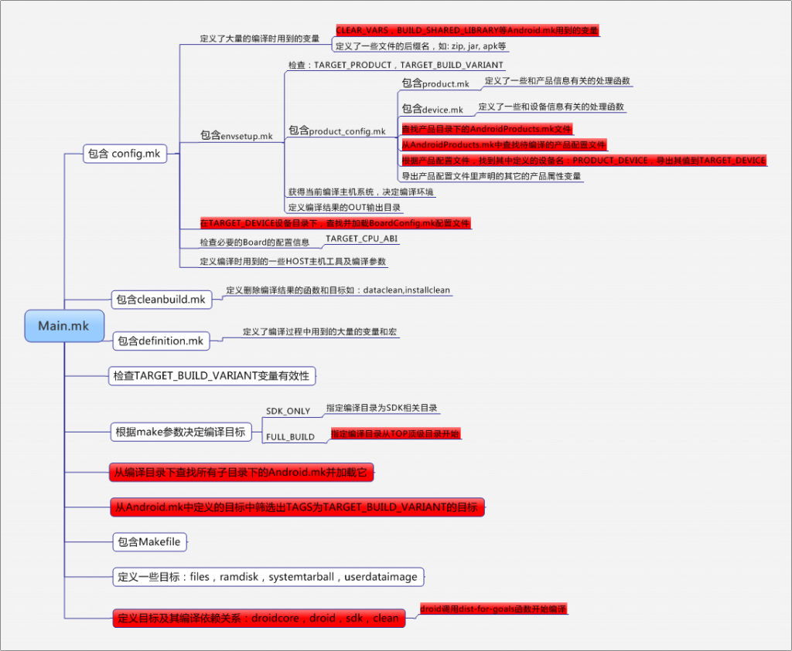

# 一、 概述

## 1.1 编译系统变化

从Android 7.0开始，android的编译系统发生了变化，之前依赖Makefile组织编译系统，从7.0开始逐步引入了kati soong(optional未正式使用，需要USE_SOONG=true开启)，将Android.mk文件转化成ninja文件，使用ninja文件对编译系统进行管理。

从8.0开始，android 引入了Android.bp文件来替代之前的Android.mk文件，不同于Android.mk，Android.bp只是纯粹的配置文件，不包括分支、循环等流程控制。在android项目上如何进行选择编译、解析配置、转换成ninja等，Soong就被创造出来，将Android.bp转换为ninja文件进行管理。

同时，Soong还会编译长生一个androidmk命令可以手动将Android.mk转换成Android.bp文件。

## 1.2 代码位置

Kati的位置是在build/kati/中，平台也自带编译好的ckati

Soong的位置在build/soong,它和build/blueprint同时期作用，他们之间的系统关系如下：

Android.bp --> Blueprint --> Soong --> Ninja

Makefile or Android.mk --> kati --> Ninja

Blueprint是生成、解析Android.bp 的工具，是Soong的一部分。Soong是专门为Android的编译而设计的工具，blueprint只是解析文件的形式，而soong则解释内容的含义。

Blueprint和Soong都是有Go语言写的项目，从7.0开始在prebuilts/go/目录下新增了go语言的运行环境，在编译是使用。

## 1.3 Android ninja组织

在编译过程中，将所有的android.bp文件搜集成out\soong\build.ninja.d , 并以此为基础生成out\soong\build.ninja规则。

由所有的Android.mk生成build-aosp_arm.ninja文件。通过combined-aosp_arm.ninja将两个文件组织起来。

builddir = out

include out/build-aosp_arm.ninja

include out/soong/build.ninja

build out/combined-aosp_arm.ninja: phony out/soong/build.ninja

通过编译的LOG，首先搜集所有的bp文件生成build.ninja，然后搜集所有的mk文件生成build-aosp-arm.ninja文件。

out/soong/.bootstrap/bin/soong_build out/soong/build.ninja

out/build-aosp_arm-cleanspec.ninja is missing, regenerating...

out/build-aosp_arm.ninja is missing, regenerating...

[1/894] including out/soong/Android-aosp_arm.mk ...

经过试验表明，soong处理后的bp文件生成build.ninja的同时还包含out/soong/Android-aosp_arm.mk，这个文件是编译完成后模块的安装脚本，负责将模块安装到对应位置。比如我们现在处理的vndk相关vendor处理就是在这个目录下进行的。

在out/soong目录下有两个文件.minibootstrap/build.ninja 和.bootstrap/build.ninja两个目录。.minibootstrap/build.ninja 主要是用来编译blueprint和生成.bootstrap/build.ninja。而.bootstrap/build.ninja主要是生成 soong相关工具和out/soong/build.ninja文件。

# 二 、编译流程

编译步骤如下：

   1、 source build/envsetup.sh:加载命令

   2、 lunch：选择平台编译选项

   3、 make：执行编译

## 2.1 source build/envsetup.sh

这个命令是用来将envsetup.sh里的所有用到的命令加载到环境变量里去，我们来分析下它。

envsetup.sh里的所有命令如下：

```shell
function hmm() #显示编译命令的帮助信息
function build_build_var_cache()#获取所需的所有构建变量
function destroy_build_var_cache()#删除构建变量的缓存
function get_abs_build_var()#获取构建变量的值昨晚绝对路径
function check_product()#检查提供的产品是否是我们可以构建的产品
function check_variant()#检查构建变量的确切值
function setpaths()#设置文件路径
function printconfig()#打印配置
function set_stuff_for_environment()#设置环境变量
function set_sequence_number()#设置序号
function settitle()#设置标题
function addcompletions()#将sdk/bash_completion目录下所有的*.bash文件通过’.’操作导入到当前环境中来
function choosetype()#根据传入选项或读取用户输入设置编译版本是release还是debug版
function chooseproduct()#根据预先设置的变量或读取用户输入设置TARGET_PRODUCT
function choosevariant()#读取用户输入设置TARGET_BUILD_VARIANT为user,userdebug或eng
function choosecombo()#根据传入的3个参数，分别设置type(release, debug), product和variant(user, userdebug, eng)参数
function add_lunch_combo()#将提供的编译选项参数添加到LUNCH_MENU_CHOICES列表中
function print_lunch_menu()#打印编译选项列表LUNCH_MENU_CHOICES的所有项
function lunch()#操作根据传入参数选项设置TARGET_PRODUCT, TARGET_BUILD_VARIANT和TARGET_BUILD_TYPE
function _lunch()#提供lunch命令的补全操作
function tapas()#以交互方式设置单个app编译的build环境变量
function gettop#函数从指定的$TOP目录或当前目录开始查找build/core/envsetup.mk文件，并将能找到该文件的目录返回给调用函数作为操作的根目录
function getdriver()#在定义了WITHSTATICANALYZER的情况下，返回用于代码分析工具的一些参数默认编译下WITH_STATIC_ANALYZER没有定义，所以getdriver调用返回空
function m()#从根目录开始编译
function findmakefile()#查找当前模块的Android.mk并输出文件的详细路径
function mm()#编译当前目录下的所有模块，不编译外部依赖
function mmm()#编译当前目录下的所有模块，编译外部依赖
function mma()#相当于mm执行相应目录下的all_modules参数
function mmma()#相当于mmm执行相应目录下的all_modules参数
function croot()#返回根目录
function cproj()#用于切换到当前模块的编译目录下（含有Android.mk）
function qpid()#adb调试类
function pid()#adb调试类
function coredump_setup()
function coredump_enable()
function core()
function systemstack()
function stacks()
function is64bit()
function sgrep()#基于(c|h|cc|cpp|S|java|xml|sh|mk|aidl|vts)文件查找
function gettargetarch#函数返回编译目标系统的CPU架构，如arm
function ggrep()#基于(.gradle)的文件查找
function jgrep()#基于(.java)文件查找
function cgrep()#基于(c|cc|cpp|h|hpp)文件查找
function resgrep()#基于res目录下(xml)文件查找
function mangrep()#基于AndroidManifest.xml文件查找
function sepgrep()#基于sepolicy目录下查找
function rcgrep()#基于*.rc*文件查找
function mgrep()#基于(Makefile|Makefile\..*|.*\.make|.*\.mak|.*\.mk)的Makefile文件查找
function treegrep()#基于代码的文件(c|h|cpp|S|java|xml)进行查找
function getprebuilt#返回ANDROID_PREBUILTS的路径
function tracedmdump()
function runhat()#
function getbugreports()#得到bug报告
function getsdcardpath()#得到sd卡路径
function getscreenshotpath()#得到屏幕路径
function getlastscreenshot()#得到屏幕焦点
function startviewserver()#开启view服务
function stopviewserver()#停止view服务
function isviewserverstarted()#判断view服务是否开启
function key_home()#输入键值
function key_back()#输入键值
function key_menu()#输入键值
function smoketest()#冒烟测试
function runtest()#自动化测试
function godir ()#函数的用法为”Usage: godir ”，在编译路径下搜索匹配模式的目录，然后跳转到此目录
function set_java_home()#设置$ANDROID_SET_JAVA_HOME变量
function pez#函数的参数”$@”是一条可执行命令，通过执行结果来决定打印FAILUE和SUCCESS的颜色，失败打印红色的FAILURE，成功打印绿色的SUCCESS
function get_make_command()#将make命令转换为command make调用
function make()
function provision()
```

add_lunch_combo函数被多次调用，就是它来添加Android编译选项

```shell
515 unset LUNCH_MENU_CHOICES # 清空LUNCH_MENU_CHOICES变量，用来存在编译选项
516 function add_lunch_combo()
517 {
518    local new_combo=$1 # 获得add_lunch_combo被调用时的参数
519    local c
520    for c in ${LUNCH_MENU_CHOICES[@]} ; do # 依次遍历LUNCH_MENU_CHOICES里的值，其实该函数第一次调用时，该值为空
521        if [ "$new_combo" = "$c" ] ; then # 如果参数里的值已经存在于LUNCH_MENU_CHOICES变量里，则返回
522            return
523        fi
524    done
525    LUNCH_MENU_CHOICES=(${LUNCH_MENU_CHOICES[@]} $new_combo) # 如果参数的值不存在，则添加到LUNCH_MENU_CHOICES变量里
526}
```


这是系统自动增加的默认编译项

```shell
# add the default one here
add_lunch_combo aosp_arm-eng
add_lunch_combo aosp_arm64-eng
add_lunch_combo aosp_mips-eng
add_lunch_combo aosp_mips64-eng
add_lunch_combo aosp_x86-eng                     
add_lunch_combo aosp_x86_64-eng

```

从device,vendor,product目录下查找vendorsetup.sh文件，如果查到了，就加载它

```shell
# Execute the contents of any vendorsetup.sh files we can find.
for f in `test -d device && find -L device -maxdepth 4 -name 'vendorsetup.sh' 2> /dev/null | sort` \
         `test -d vendor && find -L vendor -maxdepth 4 -name 'vendorsetup.sh' 2> /dev/null | sort` \
         `test -d product && find -L product -maxdepth 4 -name 'vendorsetup.sh' 2> /dev/null | sort`
do                                                                 
    echo "including $f"
    . $f # 执行找到的脚本，其实里面就是厂商自己定义的编译选项
done
unset f
```

envsetup.sh其主要作用如下：

　　1. 加载了编译时使用到的函数命令，如：lunch，m，mm，mmm等
　　2. 添加编译选项
　　3. 查找厂商目录下的vendorsetup.sh，如果存在的话，加载执行它，添加厂商自己定义产品的编译选项
 其实，上述第3条是向编译系统添加了厂商自己定义产品的编译选项，里面的代码就是：add_lunch_combo xxx-xxx。

根据上面的内容，可以推测出，如果要想定义自己的产品编译项，简单的办法是直接在envsetup.sh最后，添加上add_lunch_combo myProduct-eng，当然这么做，不太符合上面代码最后的本意，我们还是老实的在vendor目录下创建自己公司名字，然后在公司目录下创建一个新的vendorsetup.sh，在里面添加上自己的产品编译项

```shell
mkdir vendor/farsight/
touch vendor/farsight/vendorsetup.sh
echo "add_lunch_combo fs100-eng" > vendor/farsight/vendorsetup.sh
```

这样，当我们在执行source build/envsetup.sh命令的时候，可以在shell上看到下面的信息：

 including vendor/farsight/vendorsetup.sh

## 2.2 lunch

当然如果你按上述命令执行，它编译的还是通用的eng版本系统，不是我们个性系统，我们可以执行lunch命令，它会打印出一个选择菜单，列出可用的编译选项
如果你按照第一步中添加了vendorsetup.sh那么，你的选项中会出现：
 You're building on Linux
Lunch menu... pick a combo:
     1. aosp_arm-eng
     2. aosp_arm64-eng
     3. aosp_mips-eng
lunch命令是envsetup.sh里定义的一个命令，用来让用户选择编译项，来定义Product和编译过程中用到的全局变量。
eng是产品的编译类型，除了eng外，还有user, userdebug，分别表示：
eng: 工程机，
user:最终用户机
userdebug:调试测试机
tests:测试机 

eng:  默认的特征. 一个简单的”make”等同于”make eng”. droid 是eng的别名.
	安装标记为: eng, debug, user, 以及/或者 development的模块。
	安装没有特殊标签的非apk模块。
	通过产品定义的文件安装未标记的apk.
	ro.secure=0
	ro.debuggable=1
	ro.kernel.android.checkjni=1
	adb默认开启。
user:为release版本的代码特征
	安装标签为user的模块.
	安装没有特殊标签的非apk模块。
	通过产品定义文件安装apk; 对于apk模块来说标签是被忽略的。
	ro.secure=1
	ro.debuggable=0
	adb默认关闭。
userdebug:其他与user相同, 除了:
	也安装标签为 debug的模块。
	ro.debuggable=1
	adb默认开启。

由此可见，除了eng和user外，另外两个一般不能交给最终用户的
那么这四个类型是干什么用的呢？其实，在main.mk里有说明，在Android的源码里，每一个目标（也可以看成工程）目录都有一个Android.mk的makefile，每个目标的Android.mk中有一个类型声明：LOCAL_MODULE_TAGS，这个TAGS就是用来指定，当前的目标编译完了属于哪个分类里。
 PS:Android.mk和Linux里的makefile不太一样，它是Android编译系统自己定义的一个makefile来方便编译成：c,c++的动态、静态库或可执行程序，或java库或android的程序，

lunch命令:

```shell
555 function lunch()
556{
557    local answer
558
559    if [ "$1" ] ; then
560        answer=$1 # lunch后面直接带参数
561    else
562        print_lunch_menu # lunch后面不带参数，则打印处所有的target product和variant菜单提供用户选择
563        echo -n "Which would you like? [aosp_arm-eng] "
564        read answer
565    fi
566
567    local selection=
568
569    if [ -z "$answer" ]
570    then
571        selection=aosp_arm-eng # 如果用户在菜单中没有选择，直接回车，则为系统缺省的aosp_arm-eng
572    elif (echo -n $answer | grep -q -e "^[0-9][0-9]*$")
573    then  # 如果answer是选择菜单的数字，则获取该数字对应的字符串
574        if [ $answer -le ${#LUNCH_MENU_CHOICES[@]} ]
575        then
576            selection=${LUNCH_MENU_CHOICES[$(($answer-1))]}
577        fi
578    else
579        selection=$answer
580    fi
581
582    export TARGET_BUILD_APPS=
583
584    local product variant_and_version variant version
585
586    product=${selection%%-*} # Trim everything up to first dash
587    variant_and_version=${selection#*-} # Trim everything up to first dash
588    if [ "$variant_and_version" != "$selection" ]; then
589        variant=${variant_and_version%%-*}
590        if [ "$variant" != "$variant_and_version" ]; then
591            version=${variant_and_version#*-}
592        fi
593    fi
594
595    if [ -z "$product" ]
596    then
597        echo
598        echo "Invalid lunch combo: $selection"
599        return 1
600    fi
601
602    TARGET_PRODUCT=$product \
603    TARGET_BUILD_VARIANT=$variant \
604    TARGET_PLATFORM_VERSION=$version \
605    build_build_var_cache
606    if [ $? -ne 0 ]
607    then
608        return 1
609    fi
610    #  导出环境变量，这里很重要，因为后面的编译系统都是依赖于这里定义的几个变量的
611    export TARGET_PRODUCT=$(get_build_var TARGET_PRODUCT)
612    export TARGET_BUILD_VARIANT=$(get_build_var TARGET_BUILD_VARIANT)
613    export TARGET_PLATFORM_VERSION=$(get_build_var TARGET_PLATFORM_VERSION)
614    export TARGET_BUILD_TYPE=release
615
616    echo
617    # 设置到环境变量
618    set_stuff_for_environment
619    printconfig  # 打印一些主要的变量, 调用关系 printconfig()->get_build_var()->build/core/config.mk->build/core/envsetup.mk
620    destroy_build_var_cache
621}
622
```

lunch命令可以带参数和不带参数，最终导出一些重要的环境变量，从而影响编译系统的编译结果

## 2.3 make 流程

### 2.3.1 Makefile文件

执行make命令的结果就是去执行当前目录下的Makefile文件

```shell
### DO NOT EDIT THIS FILE ###
include build/core/main.mk
### DO NOT EDIT THIS FILE ###
```


main.mk文件里虽然脚本不多，但是却定义了整个Android的编译关系，它主要引入了下列几个重要的mk文件

```shell
include $(BUILD_SYSTEM)/config.mk

include $(BUILD_SYSTEM)/cleanbuild.mk

include $(BUILD_SYSTEM)/definitions.mk
```




所有的Makefile都通过build/core/main.mk这个文件组织在一起，它定义了一个默认goals：droid，当在根目录下，输入make实际上就等同于我们执行make droid。

当Make include所有的文件，完成对所有make文件的解析以后就会寻找生成droid的规则，依次生成它的依赖，直到所有满足的模块被编译好，然后使用相应的工具打包成相应的img。其中，config.mk，envsetup.mk，product_config.mk文件是编译用户指定平台系统的关键文件。上图中红色部分是用户指定平台产品的编译主线，下面config.mk的主要作用

### 2.3.2 build/core/config.mk

该文件被main.mk包含
定义了以下环境变量：

```makefile
ORIGINAL_MAKECMDGOALS := $(MAKECMDGOALS)

dist_goal := $(strip $(filter dist,$(MAKECMDGOALS)))
MAKECMDGOALS := $(strip $(filter-out dist,$(MAKECMDGOALS)))

UNAME := $(shell uname -sm)

SRC_TARGET_DIR := $(TOPDIR)build/target
SRC_API_DIR := $(TOPDIR)prebuilts/sdk/api
SRC_SYSTEM_API_DIR := $(TOPDIR)prebuilts/sdk/system-api
SRC_TEST_API_DIR := $(TOPDIR)prebuilts/sdk/test-api

# Some specific paths to tools
SRC_DROIDDOC_DIR := $(TOPDIR)build/make/tools/droiddoc

# Set up efficient math functions which are used in make.
# Here since this file is included by envsetup as well as during build.
include $(BUILD_SYSTEM)/math.mk

# Various mappings to avoid hard-coding paths all over the place
include $(BUILD_SYSTEM)/pathmap.mk

# Allow projects to define their own globally-available variables
include $(BUILD_SYSTEM)/project_definitions.mk

# ###############################################################
# Build system internal files
# ###############################################################

BUILD_COMBOS:= $(BUILD_SYSTEM)/combo

CLEAR_VARS:= $(BUILD_SYSTEM)/clear_vars.mk
BUILD_HOST_STATIC_LIBRARY:= $(BUILD_SYSTEM)/host_static_library.mk
BUILD_HOST_SHARED_LIBRARY:= $(BUILD_SYSTEM)/host_shared_library.mk
BUILD_STATIC_LIBRARY:= $(BUILD_SYSTEM)/static_library.mk
BUILD_HEADER_LIBRARY:= $(BUILD_SYSTEM)/header_library.mk
BUILD_AUX_STATIC_LIBRARY:= $(BUILD_SYSTEM)/aux_static_library.mk
BUILD_AUX_EXECUTABLE:= $(BUILD_SYSTEM)/aux_executable.mk
BUILD_SHARED_LIBRARY:= $(BUILD_SYSTEM)/shared_library.mk
BUILD_EXECUTABLE:= $(BUILD_SYSTEM)/executable.mk
BUILD_HOST_EXECUTABLE:= $(BUILD_SYSTEM)/host_executable.mk
BUILD_PACKAGE:= $(BUILD_SYSTEM)/package.mk
BUILD_PHONY_PACKAGE:= $(BUILD_SYSTEM)/phony_package.mk
BUILD_RRO_PACKAGE:= $(BUILD_SYSTEM)/build_rro_package.mk
BUILD_HOST_PREBUILT:= $(BUILD_SYSTEM)/host_prebuilt.mk
BUILD_PREBUILT:= $(BUILD_SYSTEM)/prebuilt.mk
BUILD_MULTI_PREBUILT:= $(BUILD_SYSTEM)/multi_prebuilt.mk
BUILD_JAVA_LIBRARY:= $(BUILD_SYSTEM)/java_library.mk
BUILD_STATIC_JAVA_LIBRARY:= $(BUILD_SYSTEM)/static_java_library.mk
BUILD_HOST_JAVA_LIBRARY:= $(BUILD_SYSTEM)/host_java_library.mk
BUILD_DROIDDOC:= $(BUILD_SYSTEM)/droiddoc.mk
BUILD_APIDIFF:= $(BUILD_SYSTEM)/apidiff.mk
BUILD_COPY_HEADERS := $(BUILD_SYSTEM)/copy_headers.mk
BUILD_NATIVE_TEST := $(BUILD_SYSTEM)/native_test.mk
BUILD_NATIVE_BENCHMARK := $(BUILD_SYSTEM)/native_benchmark.mk
BUILD_HOST_NATIVE_TEST := $(BUILD_SYSTEM)/host_native_test.mk
BUILD_FUZZ_TEST := $(BUILD_SYSTEM)/fuzz_test.mk
BUILD_HOST_FUZZ_TEST := $(BUILD_SYSTEM)/host_fuzz_test.mk

BUILD_SHARED_TEST_LIBRARY := $(BUILD_SYSTEM)/shared_test_lib.mk
BUILD_HOST_SHARED_TEST_LIBRARY := $(BUILD_SYSTEM)/host_shared_test_lib.mk
BUILD_STATIC_TEST_LIBRARY := $(BUILD_SYSTEM)/static_test_lib.mk
BUILD_HOST_STATIC_TEST_LIBRARY := $(BUILD_SYSTEM)/host_static_test_lib.mk

BUILD_NOTICE_FILE := $(BUILD_SYSTEM)/notice_files.mk
BUILD_HOST_DALVIK_JAVA_LIBRARY := $(BUILD_SYSTEM)/host_dalvik_java_library.mk
BUILD_HOST_DALVIK_STATIC_JAVA_LIBRARY := $(BUILD_SYSTEM)/host_dalvik_static_java_library.mk

BUILD_HOST_TEST_CONFIG := $(BUILD_SYSTEM)/host_test_config.mk
BUILD_TARGET_TEST_CONFIG := $(BUILD_SYSTEM)/target_test_config.mk

INSTRUMENTATION_TEST_CONFIG_TEMPLATE := $(BUILD_SYSTEM)/instrumentation_test_config_template.xml
NATIVE_TEST_CONFIG_TEMPLATE := $(BUILD_SYSTEM)/native_test_config_template.xml
EMPTY_TEST_CONFIG := $(BUILD_SYSTEM)/empty_test_config.xml

# Tool to generate TradeFed test config file automatically.
AUTOGEN_TEST_CONFIG_SCRIPT := build/make/tools/auto_gen_test_config.py

# ###############################################################
# Parse out any modifier targets.
# ###############################################################

hide := @


...
include $(BUILD_SYSTEM)/envsetup.mk
...
```

上述命令变量其实是对应的mk文件名，所有的Android.mk文件里基本上都包含上述命令变量，如

```makefile
     CLEAR_VARS：用来清除之前定义的环境变量
     BUILD_SHARED_LIBRARY：用来指定编译动态库过程
```

现在分析：

include $(BUILD_SYSTEM)/envsetup.mk

### 2.3.3 build/core/envsetup.mk

```makefile
# Variables we check:
#     HOST_BUILD_TYPE = { release debug }
#     TARGET_BUILD_TYPE = { release debug }
# and we output a bunch of variables, see the case statement at
# the bottom for the full list
#     OUT_DIR is also set to "out" if it's not already set.
#         this allows you to set it to somewhere else if you like
#     SCAN_EXCLUDE_DIRS is an optional, whitespace separated list of
#         directories that will also be excluded from full checkout tree
#         searches for source or make files, in addition to OUT_DIR.
#         This can be useful if you set OUT_DIR to be a different directory
#         than other outputs of your build system.

# Returns all words in $1 up to and including $2
define find_and_earlier
  $(strip $(if $(1),
    $(firstword $(1))
    $(if $(filter $(firstword $(1)),$(2)),,
      $(call find_and_earlier,$(wordlist 2,$(words $(1)),$(1)),$(2)))))
endef

#$(warning $(call find_and_earlier,A B C,A))
#$(warning $(call find_and_earlier,A B C,B))
#$(warning $(call find_and_earlier,A B C,C))
#$(warning $(call find_and_earlier,A B C,D))

define version-list
$(1)PR1 $(1)PD1 $(1)PD2 $(1)PM1 $(1)PM2
endef

ALL_VERSIONS := O P Q R S T U V W X Y Z
ALL_VERSIONS := $(foreach v,$(ALL_VERSIONS),$(call version-list,$(v)))

# Filters ALL_VERSIONS down to the range [$1, $2], and errors if $1 > $2 or $3 is
# not in [$1, $2]
# $(1): min platform version
# $(2): max platform version
# $(3): default platform version
define allowed-platform-versions
$(strip \
  $(if $(filter $(ALL_VERSIONS),$(1)),,
    $(error Invalid MIN_PLATFORM_VERSION '$(1)'))
  $(if $(filter $(ALL_VERSIONS),$(2)),,
    $(error Invalid MAX_PLATFORM_VERSION '$(2)'))
  $(if $(filter $(ALL_VERSIONS),$(3)),,
    $(error Invalid DEFAULT_PLATFORM_VERSION '$(3)'))

  $(eval allowed_versions_ := $(call find_and_earlier,$(ALL_VERSIONS),$(2)))

  $(if $(filter $(allowed_versions_),$(1)),,
    $(error MIN_PLATFORM_VERSION '$(1)' must be before MAX_PLATFORM_VERSION '$(2)'))

  $(eval allowed_versions_ := $(1) \
    $(filter-out $(call find_and_earlier,$(allowed_versions_),$(1)),$(allowed_versions_)))

  $(if $(filter $(allowed_versions_),$(3)),,
    $(error DEFAULT_PLATFORM_VERSION '$(3)' must be between MIN_PLATFORM_VERSION '$(1)' and MAX_PLATFORM_VERSION '$(2)'))

  $(allowed_versions_))
endef

#$(warning $(call allowed-platform-versions,OPR1,PPR1,OPR1))
#$(warning $(call allowed-platform-versions,OPM1,PPR1,OPR1))

# Set up version information.
include $(BUILD_SYSTEM)/version_defaults.mk

ENABLED_VERSIONS := $(call find_and_earlier,$(ALL_VERSIONS),$(TARGET_PLATFORM_VERSION))

$(foreach v,$(ENABLED_VERSIONS), \
  $(eval IS_AT_LEAST_$(v) := true))

# ---------------------------------------------------------------
# If you update the build system such that the environment setup
# or buildspec.mk need to be updated, increment this number, and
# people who haven't re-run those will have to do so before they
# can build.  Make sure to also update the corresponding value in
# buildspec.mk.default and envsetup.sh.
CORRECT_BUILD_ENV_SEQUENCE_NUMBER := 13

# ---------------------------------------------------------------
# The product defaults to generic on hardware
# NOTE: This will be overridden in product_config.mk if make
# was invoked with a PRODUCT-xxx-yyy goal.
ifeq ($(TARGET_PRODUCT),)
TARGET_PRODUCT := aosp_arm
endif


# the variant -- the set of files that are included for a build
ifeq ($(strip $(TARGET_BUILD_VARIANT)),)
TARGET_BUILD_VARIANT := eng
endif

# ---------------------------------------------------------------
# Set up configuration for host machine.  We don't do cross-
# compiles except for arm/mips, so the HOST is whatever we are
# running on

# HOST_OS
ifneq (,$(findstring Linux,$(UNAME)))
  HOST_OS := linux
endif
ifneq (,$(findstring Darwin,$(UNAME)))
  HOST_OS := darwin
endif
ifneq (,$(findstring Macintosh,$(UNAME)))
  HOST_OS := darwin
endif

HOST_OS_EXTRA := $(shell uname -rsm)
ifeq ($(HOST_OS),linux)
  ifneq ($(wildcard /etc/os-release),)
    HOST_OS_EXTRA += $(shell source /etc/os-release; echo $$PRETTY_NAME)
  endif
else ifeq ($(HOST_OS),darwin)
  HOST_OS_EXTRA += $(shell sw_vers -productVersion)
endif
HOST_OS_EXTRA := $(subst $(space),-,$(HOST_OS_EXTRA))

# BUILD_OS is the real host doing the build.
BUILD_OS := $(HOST_OS)

HOST_CROSS_OS :=
# We can cross-build Windows binaries on Linux
ifeq ($(HOST_OS),linux)
ifeq ($(BUILD_HOST_static),)
HOST_CROSS_OS := windows
HOST_CROSS_ARCH := x86
HOST_CROSS_2ND_ARCH := x86_64
2ND_HOST_CROSS_IS_64_BIT := true
endif
endif

ifeq ($(HOST_OS),)
$(error Unable to determine HOST_OS from uname -sm: $(UNAME)!)
endif

# HOST_ARCH
ifneq (,$(findstring x86_64,$(UNAME)))
  HOST_ARCH := x86_64
  HOST_2ND_ARCH := x86
  HOST_IS_64_BIT := true
else
ifneq (,$(findstring i686,$(UNAME))$(findstring x86,$(UNAME)))
$(error Building on a 32-bit x86 host is not supported: $(UNAME)!)
endif
endif

BUILD_ARCH := $(HOST_ARCH)
BUILD_2ND_ARCH := $(HOST_2ND_ARCH)

ifeq ($(HOST_ARCH),)
$(error Unable to determine HOST_ARCH from uname -sm: $(UNAME)!)
endif

# the host build defaults to release, and it must be release or debug
ifeq ($(HOST_BUILD_TYPE),)
HOST_BUILD_TYPE := release
endif

ifneq ($(HOST_BUILD_TYPE),release)
ifneq ($(HOST_BUILD_TYPE),debug)
$(error HOST_BUILD_TYPE must be either release or debug, not '$(HOST_BUILD_TYPE)')
endif
endif

# We don't want to move all the prebuilt host tools to a $(HOST_OS)-x86_64 dir.
HOST_PREBUILT_ARCH := x86
# This is the standard way to name a directory containing prebuilt host
# objects. E.g., prebuilt/$(HOST_PREBUILT_TAG)/cc
HOST_PREBUILT_TAG := $(BUILD_OS)-$(HOST_PREBUILT_ARCH)

# TARGET_COPY_OUT_* are all relative to the staging directory, ie PRODUCT_OUT.
# Define them here so they can be used in product config files.
TARGET_COPY_OUT_SYSTEM := system
TARGET_COPY_OUT_SYSTEM_OTHER := system_other
TARGET_COPY_OUT_DATA := data
TARGET_COPY_OUT_ASAN := $(TARGET_COPY_OUT_DATA)/asan
TARGET_COPY_OUT_OEM := oem
TARGET_COPY_OUT_ODM := odm
TARGET_COPY_OUT_PRODUCT := product
TARGET_COPY_OUT_ROOT := root
TARGET_COPY_OUT_RECOVERY := recovery

# Returns the non-sanitized version of the path provided in $1.
define get_non_asan_path
$(patsubst $(PRODUCT_OUT)/$(TARGET_COPY_OUT_ASAN)/%,$(PRODUCT_OUT)/%,$1)
endef

###########################################
# Define TARGET_COPY_OUT_VENDOR to a placeholder, for at this point
# we don't know if the device wants to build a separate vendor.img
# or just build vendor stuff into system.img.
# A device can set up TARGET_COPY_OUT_VENDOR to "vendor" in its
# BoardConfig.mk.
# We'll substitute with the real value after loading BoardConfig.mk.
_vendor_path_placeholder := ||VENDOR-PATH-PH||
TARGET_COPY_OUT_VENDOR := $(_vendor_path_placeholder)
###########################################

###########################################
# Define TARGET_COPY_OUT_PRODUCT to a placeholder, for at this point
# we don't know if the device wants to build a separate product.img
# or just build product stuff into system.img.
# A device can set up TARGET_COPY_OUT_PRODUCT to "product" in its
# BoardConfig.mk.
# We'll substitute with the real value after loading BoardConfig.mk.
_product_path_placeholder := ||PRODUCT-PATH-PH||
TARGET_COPY_OUT_PRODUCT := $(_product_path_placeholder)
###########################################

#################################################################
# Set up minimal BOOTCLASSPATH list of jars to build/execute
# java code with dalvikvm/art.
TARGET_CORE_JARS := core-oj core-libart conscrypt okhttp bouncycastle apache-xml
ifeq ($(EMMA_INSTRUMENT),true)
  ifneq ($(EMMA_INSTRUMENT_STATIC),true)
    # For instrumented build, if Jacoco is not being included statically
    # in instrumented packages then include Jacoco classes into the
    # bootclasspath.
    TARGET_CORE_JARS += jacocoagent
  endif # EMMA_INSTRUMENT_STATIC
endif # EMMA_INSTRUMENT
HOST_CORE_JARS := $(addsuffix -hostdex,$(TARGET_CORE_JARS))
#################################################################

# Read the product specs so we can get TARGET_DEVICE and other
# variables that we need in order to locate the output files.
include $(BUILD_SYSTEM)/product_config.mk

build_variant := $(filter-out eng user userdebug,$(TARGET_BUILD_VARIANT))
ifneq ($(build_variant)-$(words $(TARGET_BUILD_VARIANT)),-1)
$(warning bad TARGET_BUILD_VARIANT: $(TARGET_BUILD_VARIANT))
$(error must be empty or one of: eng user userdebug)
endif

SDK_HOST_ARCH := x86

# Boards may be defined under $(SRC_TARGET_DIR)/board/$(TARGET_DEVICE)
# or under vendor/*/$(TARGET_DEVICE).  Search in both places, but
# make sure only one exists.
# Real boards should always be associated with an OEM vendor.
board_config_mk := \
	$(strip $(sort $(wildcard \
		$(SRC_TARGET_DIR)/board/$(TARGET_DEVICE)/BoardConfig.mk \
		$(shell test -d device && find -L device -maxdepth 4 -path '*/$(TARGET_DEVICE)/BoardConfig.mk') \
		$(shell test -d vendor && find -L vendor -maxdepth 4 -path '*/$(TARGET_DEVICE)/BoardConfig.mk') \
	)))
ifeq ($(board_config_mk),)
  $(error No config file found for TARGET_DEVICE $(TARGET_DEVICE))
endif
ifneq ($(words $(board_config_mk)),1)
  $(error Multiple board config files for TARGET_DEVICE $(TARGET_DEVICE): $(board_config_mk))
endif
include $(board_config_mk)
ifeq ($(TARGET_ARCH),)
  $(error TARGET_ARCH not defined by board config: $(board_config_mk))
endif
ifneq ($(MALLOC_IMPL),)
  $(warning *** Unsupported option MALLOC_IMPL defined by board config: $(board_config_mk).)
  $(error Use `MALLOC_SVELTE := true` to configure jemalloc for low-memory)
endif
TARGET_DEVICE_DIR := $(patsubst %/,%,$(dir $(board_config_mk)))
board_config_mk :=

###########################################
# Now we can substitute with the real value of TARGET_COPY_OUT_VENDOR
ifeq ($(TARGET_COPY_OUT_VENDOR),$(_vendor_path_placeholder))
TARGET_COPY_OUT_VENDOR := system/vendor
else ifeq ($(filter vendor system/vendor,$(TARGET_COPY_OUT_VENDOR)),)
$(error TARGET_COPY_OUT_VENDOR must be either 'vendor' or 'system/vendor', seeing '$(TARGET_COPY_OUT_VENDOR)'.)
endif
PRODUCT_COPY_FILES := $(subst $(_vendor_path_placeholder),$(TARGET_COPY_OUT_VENDOR),$(PRODUCT_COPY_FILES))

BOARD_USES_VENDORIMAGE :=
ifdef BOARD_PREBUILT_VENDORIMAGE
BOARD_USES_VENDORIMAGE := true
endif
ifdef BOARD_VENDORIMAGE_FILE_SYSTEM_TYPE
BOARD_USES_VENDORIMAGE := true
endif
ifeq ($(TARGET_COPY_OUT_VENDOR),vendor)
BOARD_USES_VENDORIMAGE := true
else ifdef BOARD_USES_VENDORIMAGE
$(error TARGET_COPY_OUT_VENDOR must be set to 'vendor' to use a vendor image)
endif

###########################################
# Now we can substitute with the real value of TARGET_COPY_OUT_PRODUCT
ifeq ($(TARGET_COPY_OUT_PRODUCT),$(_product_path_placeholder))
TARGET_COPY_OUT_PRODUCT := system/product
else ifeq ($(filter product system/product,$(TARGET_COPY_OUT_PRODUCT)),)
$(error TARGET_COPY_OUT_PRODUCT must be either 'product' or 'system/product', seeing '$(TARGET_COPY_OUT_PRODUCT)'.)
endif
PRODUCT_COPY_FILES := $(subst $(_product_path_placeholder),$(TARGET_COPY_OUT_PRODUCT),$(PRODUCT_COPY_FILES))

BOARD_USES_PRODUCTIMAGE :=
ifdef BOARD_PREBUILT_PRODUCTIMAGE
BOARD_USES_PRODUCTIMAGE := true
endif
ifdef BOARD_PRODUCTIMAGE_FILE_SYSTEM_TYPE
BOARD_USES_PRODUCTIMAGE := true
endif
ifeq ($(TARGET_COPY_OUT_PRODUCT),product)
BOARD_USES_PRODUCTIMAGE := true
else ifdef BOARD_USES_PRODUCTIMAGE
$(error TARGET_COPY_OUT_PRODUCT must be set to 'product' to use a product image)
endif

###########################################
# Ensure that only TARGET_RECOVERY_UPDATER_LIBS *or* AB_OTA_UPDATER is set.
TARGET_RECOVERY_UPDATER_LIBS ?=
AB_OTA_UPDATER ?=
.KATI_READONLY := TARGET_RECOVERY_UPDATER_LIBS AB_OTA_UPDATER
ifeq ($(AB_OTA_UPDATER),true)
  ifneq ($(strip $(TARGET_RECOVERY_UPDATER_LIBS)),)
    $(error Do not use TARGET_RECOVERY_UPDATER_LIBS when using AB_OTA_UPDATER)
  endif
endif

# Check BOARD_VNDK_VERSION
define check_vndk_version
  $(eval vndk_path := prebuilts/vndk/v$(1)) \
  $(if $(wildcard $(vndk_path)/*/Android.bp),,$(error VNDK version $(1) not found))
endef

ifdef BOARD_VNDK_VERSION
  ifneq ($(BOARD_VNDK_VERSION),current)
    $(error BOARD_VNDK_VERSION: Only "current" is implemented)
  endif

  TARGET_VENDOR_TEST_SUFFIX := /vendor
else
  TARGET_VENDOR_TEST_SUFFIX :=
endif

ifdef PRODUCT_EXTRA_VNDK_VERSIONS
  $(foreach v,$(PRODUCT_EXTRA_VNDK_VERSIONS),$(call check_vndk_version,$(v)))
endif

# Ensure that BOARD_SYSTEMSDK_VERSIONS are all within PLATFORM_SYSTEMSDK_VERSIONS
_unsupported_systemsdk_versions := $(filter-out $(PLATFORM_SYSTEMSDK_VERSIONS),$(BOARD_SYSTEMSDK_VERSIONS))
ifneq (,$(_unsupported_systemsdk_versions))
  $(error System SDK versions '$(_unsupported_systemsdk_versions)' in BOARD_SYSTEMSDK_VERSIONS are not supported.\
          Supported versions are $(PLATFORM_SYSTEMSDK_VERSIONS))
endif

# ---------------------------------------------------------------
# Set up configuration for target machine.
# The following must be set:
# 		TARGET_OS = { linux }
# 		TARGET_ARCH = { arm | x86 | mips }

TARGET_OS := linux
# TARGET_ARCH should be set by BoardConfig.mk and will be checked later
ifneq ($(filter %64,$(TARGET_ARCH)),)
TARGET_IS_64_BIT := true
endif

# the target build type defaults to release
ifneq ($(TARGET_BUILD_TYPE),debug)
TARGET_BUILD_TYPE := release
endif

# ---------------------------------------------------------------
# figure out the output directories

ifeq (,$(strip $(OUT_DIR)))
ifeq (,$(strip $(OUT_DIR_COMMON_BASE)))
OUT_DIR := $(TOPDIR)out
else
OUT_DIR := $(OUT_DIR_COMMON_BASE)/$(notdir $(PWD))
endif
endif

SOONG_OUT_DIR := $(OUT_DIR)/soong

TARGET_OUT_ROOT := $(OUT_DIR)/target

HOST_OUT_ROOT := $(OUT_DIR)/host

# We want to avoid two host bin directories in multilib build.
HOST_OUT := $(HOST_OUT_ROOT)/$(HOST_OS)-$(HOST_PREBUILT_ARCH)
SOONG_HOST_OUT := $(SOONG_OUT_DIR)/host/$(HOST_OS)-$(HOST_PREBUILT_ARCH)
# TODO: remove
BUILD_OUT := $(HOST_OUT)

HOST_CROSS_OUT := $(HOST_OUT_ROOT)/windows-$(HOST_PREBUILT_ARCH)

TARGET_PRODUCT_OUT_ROOT := $(TARGET_OUT_ROOT)/product

TARGET_COMMON_OUT_ROOT := $(TARGET_OUT_ROOT)/common
HOST_COMMON_OUT_ROOT := $(HOST_OUT_ROOT)/common

PRODUCT_OUT := $(TARGET_PRODUCT_OUT_ROOT)/$(TARGET_DEVICE)

OUT_DOCS := $(TARGET_COMMON_OUT_ROOT)/docs
OUT_NDK_DOCS := $(TARGET_COMMON_OUT_ROOT)/ndk-docs

BUILD_OUT_EXECUTABLES := $(BUILD_OUT)/bin
SOONG_HOST_OUT_EXECUTABLES := $(SOONG_HOST_OUT)/bin

HOST_OUT_EXECUTABLES := $(HOST_OUT)/bin
HOST_OUT_SHARED_LIBRARIES := $(HOST_OUT)/lib64
HOST_OUT_RENDERSCRIPT_BITCODE := $(HOST_OUT_SHARED_LIBRARIES)
HOST_OUT_JAVA_LIBRARIES := $(HOST_OUT)/framework
HOST_OUT_SDK_ADDON := $(HOST_OUT)/sdk_addon
HOST_OUT_NATIVE_TESTS := $(HOST_OUT)/nativetest64
HOST_OUT_COVERAGE := $(HOST_OUT)/coverage
HOST_OUT_TESTCASES := $(HOST_OUT)/testcases

HOST_CROSS_OUT_EXECUTABLES := $(HOST_CROSS_OUT)/bin
HOST_CROSS_OUT_SHARED_LIBRARIES := $(HOST_CROSS_OUT)/lib
HOST_CROSS_OUT_NATIVE_TESTS := $(HOST_CROSS_OUT)/nativetest
HOST_CROSS_OUT_COVERAGE := $(HOST_CROSS_OUT)/coverage
HOST_CROSS_OUT_TESTCASES := $(HOST_CROSS_OUT)/testcases

HOST_OUT_INTERMEDIATES := $(HOST_OUT)/obj
HOST_OUT_INTERMEDIATE_LIBRARIES := $(HOST_OUT_INTERMEDIATES)/lib
HOST_OUT_NOTICE_FILES := $(HOST_OUT_INTERMEDIATES)/NOTICE_FILES
HOST_OUT_COMMON_INTERMEDIATES := $(HOST_COMMON_OUT_ROOT)/obj
HOST_OUT_FAKE := $(HOST_OUT)/fake_packages

# Nano environment config
include $(BUILD_SYSTEM)/aux_config.mk

HOST_CROSS_OUT_INTERMEDIATES := $(HOST_CROSS_OUT)/obj
HOST_CROSS_OUT_INTERMEDIATE_LIBRARIES := $(HOST_CROSS_OUT_INTERMEDIATES)/lib
HOST_CROSS_OUT_NOTICE_FILES := $(HOST_CROSS_OUT_INTERMEDIATES)/NOTICE_FILES

HOST_OUT_GEN := $(HOST_OUT)/gen
HOST_OUT_COMMON_GEN := $(HOST_COMMON_OUT_ROOT)/gen

HOST_CROSS_OUT_GEN := $(HOST_CROSS_OUT)/gen

HOST_OUT_TEST_CONFIG := $(HOST_OUT)/test_config

# Out for HOST_2ND_ARCH
HOST_2ND_ARCH_VAR_PREFIX := 2ND_
HOST_2ND_ARCH_MODULE_SUFFIX := _32
$(HOST_2ND_ARCH_VAR_PREFIX)HOST_OUT_INTERMEDIATES := $(HOST_OUT)/obj32
$(HOST_2ND_ARCH_VAR_PREFIX)HOST_OUT_INTERMEDIATE_LIBRARIES := $($(HOST_2ND_ARCH_VAR_PREFIX)HOST_OUT_INTERMEDIATES)/lib
$(HOST_2ND_ARCH_VAR_PREFIX)HOST_OUT_SHARED_LIBRARIES := $(HOST_OUT)/lib
$(HOST_2ND_ARCH_VAR_PREFIX)HOST_OUT_EXECUTABLES := $(HOST_OUT_EXECUTABLES)
$(HOST_2ND_ARCH_VAR_PREFIX)HOST_OUT_JAVA_LIBRARIES := $(HOST_OUT_JAVA_LIBRARIES)
$(HOST_2ND_ARCH_VAR_PREFIX)HOST_OUT_NATIVE_TESTS := $(HOST_OUT)/nativetest
$(HOST_2ND_ARCH_VAR_PREFIX)HOST_OUT_TESTCASES := $(HOST_OUT_TESTCASES)

# The default host library path.
# It always points to the path where we build libraries in the default bitness.
HOST_LIBRARY_PATH := $(HOST_OUT_SHARED_LIBRARIES)

# Out for HOST_CROSS_2ND_ARCH
HOST_CROSS_2ND_ARCH_VAR_PREFIX := 2ND_
HOST_CROSS_2ND_ARCH_MODULE_SUFFIX := _64
$(HOST_CROSS_2ND_ARCH_VAR_PREFIX)HOST_CROSS_OUT_INTERMEDIATES := $(HOST_CROSS_OUT)/obj64
$(HOST_CROSS_2ND_ARCH_VAR_PREFIX)HOST_CROSS_OUT_INTERMEDIATE_LIBRARIES := $($(HOST_CROSS_2ND_ARCH_VAR_PREFIX)HOST_CROSS_OUT_INTERMEDIATES)/lib
$(HOST_CROSS_2ND_ARCH_VAR_PREFIX)HOST_CROSS_OUT_SHARED_LIBRARIES := $(HOST_CROSS_OUT)/lib64
$(HOST_CROSS_2ND_ARCH_VAR_PREFIX)HOST_CROSS_OUT_EXECUTABLES := $(HOST_CROSS_OUT_EXECUTABLES)
$(HOST_CROSS_2ND_ARCH_VAR_PREFIX)HOST_CROSS_OUT_NATIVE_TESTS := $(HOST_CROSS_OUT)/nativetest64

ifneq ($(filter address,$(SANITIZE_TARGET)),)
  TARGET_OUT_INTERMEDIATES := $(PRODUCT_OUT)/obj_asan
else
  TARGET_OUT_INTERMEDIATES := $(PRODUCT_OUT)/obj
endif
TARGET_OUT_HEADERS := $(TARGET_OUT_INTERMEDIATES)/include
TARGET_OUT_INTERMEDIATE_LIBRARIES := $(TARGET_OUT_INTERMEDIATES)/lib

ifneq ($(filter address,$(SANITIZE_TARGET)),)
  TARGET_OUT_COMMON_INTERMEDIATES := $(TARGET_COMMON_OUT_ROOT)/obj_asan
else
  TARGET_OUT_COMMON_INTERMEDIATES := $(TARGET_COMMON_OUT_ROOT)/obj
endif

TARGET_OUT_GEN := $(PRODUCT_OUT)/gen
TARGET_OUT_COMMON_GEN := $(TARGET_COMMON_OUT_ROOT)/gen

TARGET_OUT := $(PRODUCT_OUT)/$(TARGET_COPY_OUT_SYSTEM)
ifneq ($(filter address,$(SANITIZE_TARGET)),)
target_out_shared_libraries_base := $(PRODUCT_OUT)/$(TARGET_COPY_OUT_ASAN)/system
ifeq ($(SANITIZE_LITE),true)
# When using SANITIZE_LITE, APKs must not be packaged with sanitized libraries, as they will not
# work with unsanitized app_process. For simplicity, generate APKs into /data/asan/.
target_out_app_base := $(PRODUCT_OUT)/$(TARGET_COPY_OUT_ASAN)/system
else
target_out_app_base := $(TARGET_OUT)
endif
else
target_out_shared_libraries_base := $(TARGET_OUT)
target_out_app_base := $(TARGET_OUT)
endif

TARGET_OUT_EXECUTABLES := $(TARGET_OUT)/bin
TARGET_OUT_OPTIONAL_EXECUTABLES := $(TARGET_OUT)/xbin
ifeq ($(TARGET_IS_64_BIT),true)
# /system/lib always contains 32-bit libraries,
# and /system/lib64 (if present) always contains 64-bit libraries.
TARGET_OUT_SHARED_LIBRARIES := $(target_out_shared_libraries_base)/lib64
else
TARGET_OUT_SHARED_LIBRARIES := $(target_out_shared_libraries_base)/lib
endif
TARGET_OUT_RENDERSCRIPT_BITCODE := $(TARGET_OUT_SHARED_LIBRARIES)
TARGET_OUT_JAVA_LIBRARIES := $(TARGET_OUT)/framework
TARGET_OUT_APPS := $(target_out_app_base)/app
TARGET_OUT_APPS_PRIVILEGED := $(target_out_app_base)/priv-app
TARGET_OUT_KEYLAYOUT := $(TARGET_OUT)/usr/keylayout
TARGET_OUT_KEYCHARS := $(TARGET_OUT)/usr/keychars
TARGET_OUT_ETC := $(TARGET_OUT)/etc
TARGET_OUT_NOTICE_FILES := $(TARGET_OUT_INTERMEDIATES)/NOTICE_FILES
TARGET_OUT_FAKE := $(PRODUCT_OUT)/fake_packages
TARGET_OUT_TESTCASES := $(PRODUCT_OUT)/testcases
TARGET_OUT_TEST_CONFIG := $(PRODUCT_OUT)/test_config

ifeq ($(SANITIZE_LITE),true)
# When using SANITIZE_LITE, APKs must not be packaged with sanitized libraries, as they will not
# work with unsanitized app_process. For simplicity, generate APKs into /data/asan/.
TARGET_OUT_SYSTEM_OTHER := $(PRODUCT_OUT)/$(TARGET_COPY_OUT_ASAN)/$(TARGET_COPY_OUT_SYSTEM_OTHER)
else
TARGET_OUT_SYSTEM_OTHER := $(PRODUCT_OUT)/$(TARGET_COPY_OUT_SYSTEM_OTHER)
endif

# Out for TARGET_2ND_ARCH
TARGET_2ND_ARCH_VAR_PREFIX := $(HOST_2ND_ARCH_VAR_PREFIX)
ifeq ($(TARGET_TRANSLATE_2ND_ARCH),true)
# With this you can reference the arm binary translation library with libfoo_arm in PRODUCT_PACKAGES.
TARGET_2ND_ARCH_MODULE_SUFFIX := _$(TARGET_2ND_ARCH)
else
TARGET_2ND_ARCH_MODULE_SUFFIX := $(HOST_2ND_ARCH_MODULE_SUFFIX)
endif

ifneq ($(filter address,$(SANITIZE_TARGET)),)
  $(TARGET_2ND_ARCH_VAR_PREFIX)TARGET_OUT_INTERMEDIATES := $(PRODUCT_OUT)/obj_$(TARGET_2ND_ARCH)_asan
else
  $(TARGET_2ND_ARCH_VAR_PREFIX)TARGET_OUT_INTERMEDIATES := $(PRODUCT_OUT)/obj_$(TARGET_2ND_ARCH)
endif
$(TARGET_2ND_ARCH_VAR_PREFIX)TARGET_OUT_INTERMEDIATE_LIBRARIES := $($(TARGET_2ND_ARCH_VAR_PREFIX)TARGET_OUT_INTERMEDIATES)/lib
ifeq ($(TARGET_TRANSLATE_2ND_ARCH),true)
$(TARGET_2ND_ARCH_VAR_PREFIX)TARGET_OUT_SHARED_LIBRARIES := $(target_out_shared_libraries_base)/lib/$(TARGET_2ND_ARCH)
else
$(TARGET_2ND_ARCH_VAR_PREFIX)TARGET_OUT_SHARED_LIBRARIES := $(target_out_shared_libraries_base)/lib
endif
$(TARGET_2ND_ARCH_VAR_PREFIX)TARGET_OUT_RENDERSCRIPT_BITCODE := $($(TARGET_2ND_ARCH_VAR_PREFIX)TARGET_OUT_SHARED_LIBRARIES)
$(TARGET_2ND_ARCH_VAR_PREFIX)TARGET_OUT_EXECUTABLES := $(TARGET_OUT_EXECUTABLES)
$(TARGET_2ND_ARCH_VAR_PREFIX)TARGET_OUT_APPS := $(TARGET_OUT_APPS)
$(TARGET_2ND_ARCH_VAR_PREFIX)TARGET_OUT_APPS_PRIVILEGED := $(TARGET_OUT_APPS_PRIVILEGED)
$(TARGET_2ND_ARCH_VAR_PREFIX)TARGET_OUT_TESTCASES := $(TARGET_OUT_TESTCASES)

TARGET_OUT_DATA := $(PRODUCT_OUT)/$(TARGET_COPY_OUT_DATA)
TARGET_OUT_DATA_EXECUTABLES := $(TARGET_OUT_EXECUTABLES)
TARGET_OUT_DATA_SHARED_LIBRARIES := $(TARGET_OUT_SHARED_LIBRARIES)
TARGET_OUT_DATA_JAVA_LIBRARIES := $(TARGET_OUT_DATA)/framework
TARGET_OUT_DATA_APPS := $(TARGET_OUT_DATA)/app
TARGET_OUT_DATA_KEYLAYOUT := $(TARGET_OUT_KEYLAYOUT)
TARGET_OUT_DATA_KEYCHARS := $(TARGET_OUT_KEYCHARS)
TARGET_OUT_DATA_ETC := $(TARGET_OUT_ETC)
ifeq ($(TARGET_IS_64_BIT),true)
TARGET_OUT_DATA_NATIVE_TESTS := $(TARGET_OUT_DATA)/nativetest64
TARGET_OUT_DATA_METRIC_TESTS := $(TARGET_OUT_DATA)/benchmarktest64
TARGET_OUT_VENDOR_NATIVE_TESTS := $(TARGET_OUT_DATA)/nativetest64$(TARGET_VENDOR_TEST_SUFFIX)
TARGET_OUT_VENDOR_METRIC_TESTS := $(TARGET_OUT_DATA)/benchmarktest64$(TARGET_VENDOR_TEST_SUFFIX)
else
TARGET_OUT_DATA_NATIVE_TESTS := $(TARGET_OUT_DATA)/nativetest
TARGET_OUT_DATA_METRIC_TESTS := $(TARGET_OUT_DATA)/benchmarktest
TARGET_OUT_VENDOR_NATIVE_TESTS := $(TARGET_OUT_DATA)/nativetest$(TARGET_VENDOR_TEST_SUFFIX)
TARGET_OUT_VENDOR_METRIC_TESTS := $(TARGET_OUT_DATA)/benchmarktest$(TARGET_VENDOR_TEST_SUFFIX)
endif
TARGET_OUT_DATA_FAKE := $(TARGET_OUT_DATA)/fake_packages

$(TARGET_2ND_ARCH_VAR_PREFIX)TARGET_OUT_DATA_EXECUTABLES := $(TARGET_OUT_DATA_EXECUTABLES)
$(TARGET_2ND_ARCH_VAR_PREFIX)TARGET_OUT_DATA_SHARED_LIBRARIES := $($(TARGET_2ND_ARCH_VAR_PREFIX)TARGET_OUT_SHARED_LIBRARIES)
$(TARGET_2ND_ARCH_VAR_PREFIX)TARGET_OUT_DATA_APPS := $(TARGET_OUT_DATA_APPS)
ifeq ($(TARGET_TRANSLATE_2ND_ARCH),true)
$(TARGET_2ND_ARCH_VAR_PREFIX)TARGET_OUT_DATA_NATIVE_TESTS := $(TARGET_OUT_DATA)/nativetest/$(TARGET_2ND_ARCH)
$(TARGET_2ND_ARCH_VAR_PREFIX)TARGET_OUT_DATA_METRIC_TESTS := $(TARGET_OUT_DATA)/benchmarktest/$(TARGET_2ND_ARCH)
$(TARGET_2ND_ARCH_VAR_PREFIX)TARGET_OUT_VENDOR_NATIVE_TESTS := $(TARGET_OUT_DATA)/nativetest/$(TARGET_2ND_ARCH)$(TARGET_VENDOR_TEST_SUFFIX)
$(TARGET_2ND_ARCH_VAR_PREFIX)TARGET_OUT_VENDOR_METRIC_TESTS := $(TARGET_OUT_DATA)/benchmarktest/$(TARGET_2ND_ARCH)$(TARGET_VENDOR_TEST_SUFFIX)
else
$(TARGET_2ND_ARCH_VAR_PREFIX)TARGET_OUT_DATA_NATIVE_TESTS := $(TARGET_OUT_DATA)/nativetest
$(TARGET_2ND_ARCH_VAR_PREFIX)TARGET_OUT_DATA_METRIC_TESTS := $(TARGET_OUT_DATA)/benchmarktest
$(TARGET_2ND_ARCH_VAR_PREFIX)TARGET_OUT_VENDOR_NATIVE_TESTS := $(TARGET_OUT_DATA)/nativetest$(TARGET_VENDOR_TEST_SUFFIX)
$(TARGET_2ND_ARCH_VAR_PREFIX)TARGET_OUT_VENDOR_METRIC_TESTS := $(TARGET_OUT_DATA)/benchmarktest$(TARGET_VENDOR_TEST_SUFFIX)
endif

TARGET_OUT_CACHE := $(PRODUCT_OUT)/cache

TARGET_OUT_VENDOR := $(PRODUCT_OUT)/$(TARGET_COPY_OUT_VENDOR)
ifneq ($(filter address,$(SANITIZE_TARGET)),)
target_out_vendor_shared_libraries_base := $(PRODUCT_OUT)/$(TARGET_COPY_OUT_ASAN)/vendor
ifeq ($(SANITIZE_LITE),true)
# When using SANITIZE_LITE, APKs must not be packaged with sanitized libraries, as they will not
# work with unsanitized app_process. For simplicity, generate APKs into /data/asan/.
target_out_vendor_app_base := $(PRODUCT_OUT)/$(TARGET_COPY_OUT_ASAN)/vendor
else
target_out_vendor_app_base := $(TARGET_OUT_VENDOR)
endif
else
target_out_vendor_shared_libraries_base := $(TARGET_OUT_VENDOR)
target_out_vendor_app_base := $(TARGET_OUT_VENDOR)
endif

TARGET_OUT_VENDOR_EXECUTABLES := $(TARGET_OUT_VENDOR)/bin
TARGET_OUT_VENDOR_OPTIONAL_EXECUTABLES := $(TARGET_OUT_VENDOR)/xbin
ifeq ($(TARGET_IS_64_BIT),true)
TARGET_OUT_VENDOR_SHARED_LIBRARIES := $(target_out_vendor_shared_libraries_base)/lib64
else
TARGET_OUT_VENDOR_SHARED_LIBRARIES := $(target_out_vendor_shared_libraries_base)/lib
endif
TARGET_OUT_VENDOR_RENDERSCRIPT_BITCODE := $(TARGET_OUT_VENDOR_SHARED_LIBRARIES)
TARGET_OUT_VENDOR_JAVA_LIBRARIES := $(TARGET_OUT_VENDOR)/framework
TARGET_OUT_VENDOR_APPS := $(target_out_vendor_app_base)/app
TARGET_OUT_VENDOR_APPS_PRIVILEGED := $(target_out_vendor_app_base)/priv-app
TARGET_OUT_VENDOR_ETC := $(TARGET_OUT_VENDOR)/etc

$(TARGET_2ND_ARCH_VAR_PREFIX)TARGET_OUT_VENDOR_EXECUTABLES := $(TARGET_OUT_VENDOR_EXECUTABLES)
ifeq ($(TARGET_TRANSLATE_2ND_ARCH),true)
$(TARGET_2ND_ARCH_VAR_PREFIX)TARGET_OUT_VENDOR_SHARED_LIBRARIES := $(target_out_vendor_shared_libraries_base)/lib/$(TARGET_2ND_ARCH)
else
$(TARGET_2ND_ARCH_VAR_PREFIX)TARGET_OUT_VENDOR_SHARED_LIBRARIES := $(target_out_vendor_shared_libraries_base)/lib
endif
$(TARGET_2ND_ARCH_VAR_PREFIX)TARGET_OUT_VENDOR_RENDERSCRIPT_BITCODE := $($(TARGET_2ND_ARCH_VAR_PREFIX)TARGET_OUT_VENDOR_SHARED_LIBRARIES)
$(TARGET_2ND_ARCH_VAR_PREFIX)TARGET_OUT_VENDOR_APPS := $(TARGET_OUT_VENDOR_APPS)
$(TARGET_2ND_ARCH_VAR_PREFIX)TARGET_OUT_VENDOR_APPS_PRIVILEGED := $(TARGET_OUT_VENDOR_APPS_PRIVILEGED)

TARGET_OUT_OEM := $(PRODUCT_OUT)/$(TARGET_COPY_OUT_OEM)
TARGET_OUT_OEM_EXECUTABLES := $(TARGET_OUT_OEM)/bin
ifeq ($(TARGET_IS_64_BIT),true)
TARGET_OUT_OEM_SHARED_LIBRARIES := $(TARGET_OUT_OEM)/lib64
else
TARGET_OUT_OEM_SHARED_LIBRARIES := $(TARGET_OUT_OEM)/lib
endif
# We don't expect Java libraries in the oem.img.
# TARGET_OUT_OEM_JAVA_LIBRARIES:= $(TARGET_OUT_OEM)/framework
TARGET_OUT_OEM_APPS := $(TARGET_OUT_OEM)/app
TARGET_OUT_OEM_ETC := $(TARGET_OUT_OEM)/etc

$(TARGET_2ND_ARCH_VAR_PREFIX)TARGET_OUT_OEM_EXECUTABLES := $(TARGET_OUT_OEM_EXECUTABLES)
ifeq ($(TARGET_TRANSLATE_2ND_ARCH),true)
$(TARGET_2ND_ARCH_VAR_PREFIX)TARGET_OUT_OEM_SHARED_LIBRARIES := $(TARGET_OUT_OEM)/lib/$(TARGET_2ND_ARCH)
else
$(TARGET_2ND_ARCH_VAR_PREFIX)TARGET_OUT_OEM_SHARED_LIBRARIES := $(TARGET_OUT_OEM)/lib
endif
$(TARGET_2ND_ARCH_VAR_PREFIX)TARGET_OUT_OEM_APPS := $(TARGET_OUT_OEM_APPS)

TARGET_OUT_ODM := $(PRODUCT_OUT)/$(TARGET_COPY_OUT_ODM)
TARGET_OUT_ODM_EXECUTABLES := $(TARGET_OUT_ODM)/bin
ifeq ($(TARGET_IS_64_BIT),true)
TARGET_OUT_ODM_SHARED_LIBRARIES := $(TARGET_OUT_ODM)/lib64
else
TARGET_OUT_ODM_SHARED_LIBRARIES := $(TARGET_OUT_ODM)/lib
endif
TARGET_OUT_ODM_APPS := $(TARGET_OUT_ODM)/app
TARGET_OUT_ODM_ETC := $(TARGET_OUT_ODM)/etc

$(TARGET_2ND_ARCH_VAR_PREFIX)TARGET_OUT_ODM_EXECUTABLES := $(TARGET_OUT_ODM_EXECUTABLES)
ifeq ($(TARGET_TRANSLATE_2ND_ARCH),true)
$(TARGET_2ND_ARCH_VAR_PREFIX)TARGET_OUT_ODM_SHARED_LIBRARIES := $(TARGET_OUT_ODM)/lib/$(TARGET_2ND_ARCH)
else
$(TARGET_2ND_ARCH_VAR_PREFIX)TARGET_OUT_ODM_SHARED_LIBRARIES := $(TARGET_OUT_ODM)/lib
endif
$(TARGET_2ND_ARCH_VAR_PREFIX)TARGET_OUT_ODM_APPS := $(TARGET_OUT_ODM_APPS)

TARGET_OUT_PRODUCT := $(PRODUCT_OUT)/$(TARGET_COPY_OUT_PRODUCT)
ifneq ($(filter address,$(SANITIZE_TARGET)),)
target_out_product_shared_libraries_base := $(PRODUCT_OUT)/$(TARGET_COPY_OUT_ASAN)/product
ifeq ($(SANITIZE_LITE),true)
# When using SANITIZE_LITE, APKs must not be packaged with sanitized libraries, as they will not
# work with unsanitized app_process. For simplicity, generate APKs into /data/asan/.
target_out_product_app_base := $(PRODUCT_OUT)/$(TARGET_COPY_OUT_ASAN)/product
else
target_out_product_app_base := $(TARGET_OUT_PRODUCT)
endif
else
target_out_product_shared_libraries_base := $(TARGET_OUT_PRODUCT)
target_out_product_app_base := $(TARGET_OUT_PRODUCT)
endif

ifeq ($(TARGET_IS_64_BIT),true)
TARGET_OUT_PRODUCT_SHARED_LIBRARIES := $(target_out_product_shared_libraries_base)/lib64
else
TARGET_OUT_PRODUCT_SHARED_LIBRARIES := $(target_out_product_shared_libraries_base)/lib
endif
TARGET_OUT_PRODUCT_JAVA_LIBRARIES:= $(TARGET_OUT_PRODUCT)/framework
TARGET_OUT_PRODUCT_APPS := $(target_out_product_app_base)/app
TARGET_OUT_PRODUCT_APPS_PRIVILEGED := $(target_out_product_app_base)/priv-app
TARGET_OUT_PRODUCT_ETC := $(TARGET_OUT_PRODUCT)/etc

ifeq ($(TARGET_TRANSLATE_2ND_ARCH),true)
$(TARGET_2ND_ARCH_VAR_PREFIX)TARGET_OUT_PRODUCT_SHARED_LIBRARIES := $(target_out_product_shared_libraries_base)/lib/$(TARGET_2ND_ARCH)
else
$(TARGET_2ND_ARCH_VAR_PREFIX)TARGET_OUT_PRODUCT_SHARED_LIBRARIES := $(target_out_product_shared_libraries_base)/lib
endif
$(TARGET_2ND_ARCH_VAR_PREFIX)TARGET_OUT_PRODUCT_APPS := $(TARGET_OUT_PRODUCT_APPS)
$(TARGET_2ND_ARCH_VAR_PREFIX)TARGET_OUT_PRODUCT_APPS_PRIVILEGED := $(TARGET_OUT_PRODUCT_APPS_PRIVILEGED)

TARGET_OUT_BREAKPAD := $(PRODUCT_OUT)/breakpad

TARGET_OUT_UNSTRIPPED := $(PRODUCT_OUT)/symbols
TARGET_OUT_EXECUTABLES_UNSTRIPPED := $(TARGET_OUT_UNSTRIPPED)/system/bin
TARGET_OUT_SHARED_LIBRARIES_UNSTRIPPED := $(TARGET_OUT_UNSTRIPPED)/system/lib
TARGET_OUT_VENDOR_SHARED_LIBRARIES_UNSTRIPPED := $(TARGET_OUT_UNSTRIPPED)/$(TARGET_COPY_OUT_VENDOR)/lib
TARGET_ROOT_OUT_UNSTRIPPED := $(TARGET_OUT_UNSTRIPPED)
TARGET_ROOT_OUT_SBIN_UNSTRIPPED := $(TARGET_OUT_UNSTRIPPED)/sbin
TARGET_ROOT_OUT_BIN_UNSTRIPPED := $(TARGET_OUT_UNSTRIPPED)/bin
TARGET_OUT_COVERAGE := $(PRODUCT_OUT)/coverage

TARGET_ROOT_OUT := $(PRODUCT_OUT)/$(TARGET_COPY_OUT_ROOT)
TARGET_ROOT_OUT_BIN := $(TARGET_ROOT_OUT)/bin
TARGET_ROOT_OUT_SBIN := $(TARGET_ROOT_OUT)/sbin
TARGET_ROOT_OUT_ETC := $(TARGET_ROOT_OUT)/etc
TARGET_ROOT_OUT_USR := $(TARGET_ROOT_OUT)/usr

TARGET_RECOVERY_OUT := $(PRODUCT_OUT)/$(TARGET_COPY_OUT_RECOVERY)
TARGET_RECOVERY_ROOT_OUT := $(TARGET_RECOVERY_OUT)/root

TARGET_SYSLOADER_OUT := $(PRODUCT_OUT)/sysloader
TARGET_SYSLOADER_ROOT_OUT := $(TARGET_SYSLOADER_OUT)/root
TARGET_SYSLOADER_SYSTEM_OUT := $(TARGET_SYSLOADER_OUT)/root/system

TARGET_INSTALLER_OUT := $(PRODUCT_OUT)/installer
TARGET_INSTALLER_DATA_OUT := $(TARGET_INSTALLER_OUT)/data
TARGET_INSTALLER_ROOT_OUT := $(TARGET_INSTALLER_OUT)/root
TARGET_INSTALLER_SYSTEM_OUT := $(TARGET_INSTALLER_OUT)/root/system

COMMON_MODULE_CLASSES := TARGET-NOTICE_FILES HOST-NOTICE_FILES HOST-JAVA_LIBRARIES
PER_ARCH_MODULE_CLASSES := SHARED_LIBRARIES STATIC_LIBRARIES EXECUTABLES GYP RENDERSCRIPT_BITCODE NATIVE_TESTS HEADER_LIBRARIES

ifeq (,$(strip $(DIST_DIR)))
  DIST_DIR := $(OUT_DIR)/dist
endif

ifeq ($(CALLED_FROM_SETUP),true)
PRINT_BUILD_CONFIG ?= true
endif
```


envsetup.mk文件主要包含了product_config.mk文件，然后指定了编译时要输出的所有文件的OUT目录

### 2.3.4 build/core/product_config.mk

173# ---------------------------------------------------------------
174# Include the product definitions.
175# We need to do this to translate TARGET_PRODUCT into its
176# underlying TARGET_DEVICE before we start defining any rules.
177#
178include $(BUILD_SYSTEM)/node_fns.mk
179include $(BUILD_SYSTEM)/product.mk
180include $(BUILD_SYSTEM)/device.mk
181
182ifneq ($(strip $(TARGET_BUILD_APPS)),)
183# An unbundled app build needs only the core product makefiles.
184all_product_configs := $(call get-product-makefiles,\
185    $(SRC_TARGET_DIR)/product/AndroidProducts.mk)
186else
187# Read in all of the product definitions specified by the AndroidProducts.mk
188# files in the tree.
189all_product_configs := $(get-all-product-makefiles)
190endif
191
192all_named_products :=
193
194# Find the product config makefile for the current product.
195# all_product_configs consists items like:
196# <product_name>:<path_to_the_product_makefile>
197# or just <path_to_the_product_makefile> in case the product name is the
198# same as the base filename of the product config makefile.
199current_product_makefile :=
200all_product_makefiles :=
201$(foreach f, $(all_product_configs),\
202    $(eval _cpm_words := $(subst :,$(space),$(f)))\
203    $(eval _cpm_word1 := $(word 1,$(_cpm_words)))\
204    $(eval _cpm_word2 := $(word 2,$(_cpm_words)))\
205    $(if $(_cpm_word2),\
206        $(eval all_product_makefiles += $(_cpm_word2))\
207        $(eval all_named_products += $(_cpm_word1))\
208        $(if $(filter $(TARGET_PRODUCT),$(_cpm_word1)),\
209            $(eval current_product_makefile += $(_cpm_word2)),),\
210        $(eval all_product_makefiles += $(f))\
211        $(eval all_named_products += $(basename $(notdir $(f))))\
212        $(if $(filter $(TARGET_PRODUCT),$(basename $(notdir $(f)))),\
213            $(eval current_product_makefile += $(f)),)))
214_cpm_words :=
215_cpm_word1 :=
216_cpm_word2 :=
217current_product_makefile := $(strip $(current_product_makefile))
218all_product_makefiles := $(strip $(all_product_makefiles))
219
220load_all_product_makefiles :=
221ifneq (,$(filter product-graph, $(MAKECMDGOALS)))
222ifeq ($(ANDROID_PRODUCT_GRAPH),--all)
223load_all_product_makefiles := true
224endif
225endif
226ifneq (,$(filter dump-products,$(MAKECMDGOALS)))
227ifeq ($(ANDROID_DUMP_PRODUCTS),all)
228load_all_product_makefiles := true
229endif
230endif
231
232ifeq ($(load_all_product_makefiles),true)
233# Import all product makefiles.
234$(call import-products, $(all_product_makefiles)) #读取指定的目录下所有的AndrodProducts.mk文件中定义的产品信息
235else
236# Import just the current product.
237ifndef current_product_makefile
238$(error Can not locate config makefile for product "$(TARGET_PRODUCT)")
239endif
240ifneq (1,$(words $(current_product_makefile)))
241$(error Product "$(TARGET_PRODUCT)" ambiguous: matches $(current_product_makefile))
242endif
243$(call import-products, $(current_product_makefile))
244endif  # Import all or just the current product makefile
245
246# Sanity check
247$(check-all-products)
248
249ifneq ($(filter dump-products, $(MAKECMDGOALS)),)
250$(dump-products)
251$(error done)
252endif
253
254# Convert a short name like "sooner" into the path to the product
255# file defining that product.
256#
257INTERNAL_PRODUCT := $(call resolve-short-product-name, $(TARGET_PRODUCT)) #调用了resolve-short-product-name函数，它将返回TARGET_PRODUCT产品的配置文件目录，并赋给INTERNAL_PRODUCT
258ifneq ($(current_product_makefile),$(INTERNAL_PRODUCT))
259$(error PRODUCT_NAME inconsistent in $(current_product_makefile) and $(INTERNAL_PRODUCT))
260endif
261current_product_makefile :=
262all_product_makefiles :=
263all_product_configs :=

product_config.mk主要读取vendor目录下不同厂商自己定义的AndrodProducts.mk文件，从该文件里取得所有产品的配置文件，然后再根据lunch选择的编译项TARGET_PRODUCT，找到与之对应的配置文件，然后设置TARGET_DEVICE变量，用于后续编译。

### 2.3.5 build/core/product.mk

26# Search for AndroidProducts.mks in the given dir.
27# $(1): the path to the dir
28define _search-android-products-files-in-dir
29$(sort $(shell test -d $(1) && find -L $(1) \
30  -maxdepth 6 \
31  -name .git -prune \
32  -o -name AndroidProducts.mk -print))
33endef
34
35#
36# Returns the list of all AndroidProducts.mk files.
37# $(call ) isn't necessary.
38#
39define _find-android-products-files
40$(foreach d, device vendor product,$(call _search-android-products-files-in-dir,$(d))) \
41  $(SRC_TARGET_DIR)/product/AndroidProducts.mk
42endef
43
44#
45# Returns the sorted concatenation of PRODUCT_MAKEFILES
46# variables set in the given AndroidProducts.mk files.
47# $(1): the list of AndroidProducts.mk files.
48#
49define get-product-makefiles
50$(sort \
51  $(foreach f,$(1), \
52    $(eval PRODUCT_MAKEFILES :=) \
53    $(eval LOCAL_DIR := $(patsubst %/,%,$(dir $(f)))) \
54    $(eval include $(f)) \
55    $(PRODUCT_MAKEFILES) \
56   ) \
57  $(eval PRODUCT_MAKEFILES :=) \
58  $(eval LOCAL_DIR :=) \
59 )
60endef

要是一些用来处理AndroidProduct.mk的函数
_find-android-products-files:用来获得vendor目录下，所有名字为AndroidProduct.mk的文件列表。
get-all-product-makefiles：用来获得所有AndroidProduct.mk文件里定义的PRODUCT_MAKEFILES的值（其实是产品文件路径名）。
在vendor目录下，每个公司目录下都会存在一个AndroidProduct.mk文件，这个文件是用来定义这个公司的产品列表，每个产品用<product_name>.mk来表示
如Android给的示例：vendor/sample/products/AndroidProduct.mk

总结：
如果用户想个性定制自己的产品，应该有以下流程，包含上一节内容：
1. 创建公司目录
    #mkdir vendor/farsight
2. 创建一个vendorsetup.sh文件，将当前产品编译项添加到lunch里，让lunch能找到用户个性定制编译项
    #echo "add_lunch_combo fs100-eng" > vendor/farsight/vendorsetup.sh
3. 仿着Android示例代码，在公司目录下创建products目录
    #mkdir -p vendor/farsight/products
4. 仿着Android示例代码，在products目录下创建两个mk文件
    #touch vendor/farsight/products/AndroidProduct.mk vendor/farsight/products/fs100.mk
在AndroidProduct.mk里添加如下内容：
PRODUCT_MAKEFILES := $(LOCAL_DIR)/fs100.mk
表示只有一个产品fs100，它对应的配置文件在当前目录下的fs100.mk。
5. 在产品配置文件里添加最基本信息

PRODUCT_PACKAGES := \
    IM \
    VoiceDialer
$(call inherit-product, build/target/product/generic.mk)  ##从某一默认配置开始派生余下内容参考派生起点

Overrides

PRODUCT_MANUFACTURER := farsight
PRODUCT_NAME := fs100
PRODUCT_DEVICE := fs100

除了编译和定义产品相关环境变量外，还需要定义Board相关环境变量

总结：
build/core/main.mk   包含了config.mk，它主要定义了编译全部代码的依赖关系
build/core/config.mk 定义了大量的编译脚本命令，编译时用到的环境变量，引入了envsetup.mk 文件，加载board相关配置文件。
build/core/envsetup.mk   定义了编译时用到的大量OUT输出目录，加载product_config.mk文件
build/core/product_config.mk 定义了Vendor目录下Product相关配置文件解析脚本，读取AndrodProducts.mk生成TARGET_DEVICE变量
      build/target/product          product config
      build/target/board            board config
      build/core/combo             build flags config 
这里解释下这里的board和product。borad主要是设计到硬件芯片的配置，比如是否提供硬件的某些功能，比如说GPU等等，或者芯片支持浮 点运算等等。product是指针对当前的芯片配置定义你将要生产产品的个性配置，主要是指APK方面的配置，哪些APK会包含在哪个product中， 哪些APK在当前product中是不提供的。
config.mk是一个总括性的东西，它里面定义了各种module编译所需要使用的HOST工具以及如何来编译各种模块，比如说 BUILT_PREBUILT就定义了如何来编译预编译模块。envsetup.mk主要会读取由envsetup.sh写入环境变量中的一些变量来配置编译过程中的输出目录，combo里面主要定义了各种Host和Target结合的编译器和编译选项。

## 2.4 mm流程

当我们单独编译某个模块时，在这个模块目录下输入mm命令进行编译，在build/envsetup.sh看一下具体实现过程：

```shell
function mm()

{

local T=$(gettop)

local DRV=$(getdriver $T)

If we're sitting in the root of the build tree, just do a

normal build.

if [ -f build/soong/soong_ui.bash ]; then

_wrap_build $DRV $T/build/soong/soong_ui.bash --make-mode $@

else

ONE_SHOT_MAKEFILE=$M _wrap_build $DRV $T/build/soong/soong_ui.bash --make-mode $MODULES $ARGS
# 流程上同make差不多只不过目标，是单独模块组成。同时在mm一个单独模块是，生成独立的ninja文件 combined--aosp_arm-frameworks_native_libs_gui_Android.mk.ninja 和 build- aosp_arm-frameworks_native_libs_gui_Android.mk.ninja

```

```shell
function mm() 
{
    local T=$(gettop)
    # If we're sitting in the root of the build tree, just do a
    # normal build.
    if [ -f build/soong/soong_ui.bash ]; then 
        _wrap_build $T/build/soong/soong_ui.bash --make-mode $@
    else 
        # Find the closest Android.mk file.
        local M=$(findmakefile)
        local MODULES=
        local GET_INSTALL_PATH=
        local ARGS=
        # Remove the path to top as the makefilepath needs to be relative
        local M=`echo $M|sed 's:'$T'/::'`
        if [ ! "$T" ]; then 
            echo "Couldn't locate the top of the tree.  Try setting TOP."
            return 1
        elif [ ! "$M" ]; then 
            echo "Couldn't locate a makefile from the current directory."
            return 1
        else 
            local ARG
            for ARG in $@; do
                case $ARG in
                  GET-INSTALL-PATH) GET_INSTALL_PATH=$ARG;;
                esac 
            done 
            if [ -n "$GET_INSTALL_PATH" ]; then 
              MODULES=
              ARGS=GET-INSTALL-PATH-IN-$(dirname ${M})
              ARGS=${ARGS//\//-}
            else 
              MODULES=MODULES-IN-$(dirname ${M})
              # Convert "/" to "-".
              MODULES=${MODULES//\//-}
              ARGS=$@
            fi   
            if [ "1" = "${WITH_TIDY_ONLY}" -o "true" = "${WITH_TIDY_ONLY}" ]; then 
              MODULES=tidy_only
            fi   
            ONE_SHOT_MAKEFILE=$M _wrap_build $T/build/soong/soong_ui.bash --make-mode $MODULES $ARGS
        fi   
    fi   
}
```


## 2.5 Soong流程

在介绍soong编译流程之前，先介绍几个命令以便我们后续编译流程的理解，在out/soong/host/linux-x86/bin目录下，有几个命令是soong用到的，

```makefile
soong_ui : soong编译的入口

androidmk : 后面的Android.bp用到，Android.mk一键转换为android.bp
```


在out/soong/.bootstrap/bin目录下有几个

```shell
out/soong/.bootstrap/bin$ ls

bpglob gotestmain gotestrunner loadplugins minibp soong_build soong_env

minibp： 在bootstrap是用到

soong_build ：这个很重要，主要是将bp文件转换为ninja文件
```


通过上文的分析，当我们make命令敲下去的时候，主要是执行

prebuilts/build-tools/$(host_prebuilts)/bin/makeparallel --ninja build/soong/soong_ui.bash --make-mode $(MAKECMDGOALS)

soong_ui.bash脚本主要是执行如下：

build_go soong_ui android/soong/cmd/soong_ui //生成soong_ui命令

cd ${TOP}

exec "$(getoutdir)/soong_ui" "$@" //soong_ui入口，执行soong流程

比如我们执行make systemimage，到这边就变成了soong_ui –make-mode systemimage

soong_ui代码在build/soong/cmd/soong_ui/main.go 下，主要流程如下：

```go
func main() {

log := logger.New(os.Stderr)

defer log.Cleanup()

if len(os.Args) < 2 || !inList("--make-mode", os.Args) {

log.Fatalln("The `soong` native UI is not yet available.")

}

build.Build(buildCtx, config, build.BuildAll)
```


主要执行soong/ui/build/build.go，从build.go就可以看到执行soong的大体流程

看一下各个流程

Step 1: runMakeProductConfig 主要配置编译参数

Step 2: runSoongBootstrap 这个主要是为后面编译工具的使用 ckati soong做环境搭建

runSoong 对工具进行编译

/.minibootstrap/build.ninja

- Run minibp to generate .bootstrap/build.ninja (Primary stage) - Run minibp to generate .minibootstrap/build.ninja.in

/.bootstrap/build.ninja

- Build any bootstrap_go_binary rules and dependencies -- usually the primary builder and any build or runtime dependencies. - Run the primary builder to generate build.ninja

同时还会生成out/soong/build.ninja

Step 3: 运行step2生成的ckati，搜集所有的Android.mk文件生成ninja文件，也就是前面提到的 out/build-aosp_arm.ninja

Step4: 将out/soong/build.ninja 和out/build-aosp_arm.ninja 合成为combined-aosp_arm.ninja

Step5： 运行runNinja 解释combined-aosp_arm.ninja 运行编译过程

# 三 ninja使用


  我们可以使用ninja 和生成的combined-aosp_arm.ninja 编译工程或者某一个module.

```shell
$ ./prebuilts/build-tools/linux-x86/bin/ninja -f out/combined-aosp_arm.ninja
```

**同在工程中make一个效果**


编译systemimage或者bootimage

```shell
$ ./prebuilts/build-tools/linux-x86/bin/ninja -f out/combined-aosp_arm.ninja  systemimage
```

上面这样做的目的是，不用重新生成ninja文件，直接进行编译，节省部分时间。这是在没有修改Makefile的前提
