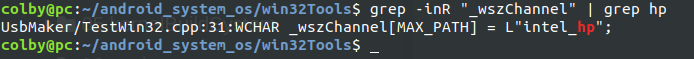
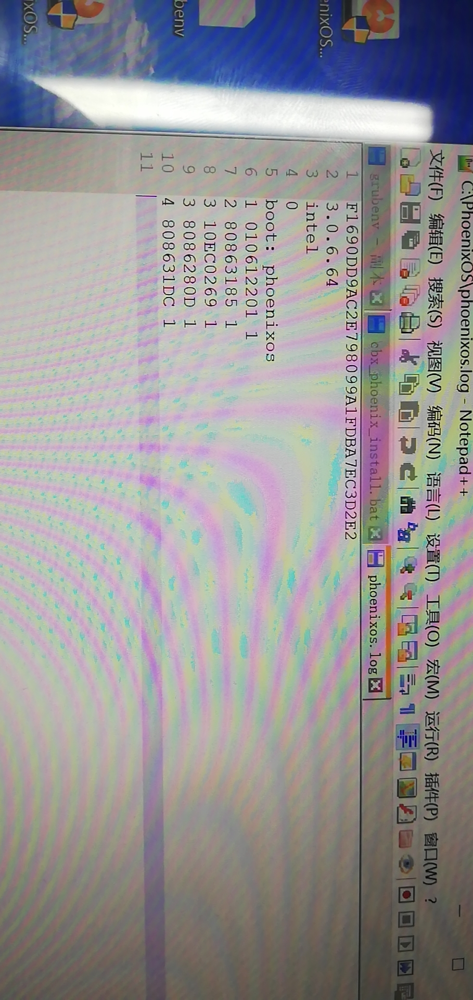
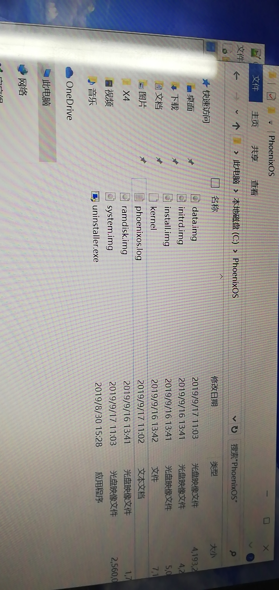

## 1. 分析功能

具体分析，phoenix如何拿到版本通道，并上报云端的过程。

## 2. 背景

在安装包的制作程序中，保存了我们的主通道(渠道)的字符串：



打包程序会在最后，生成  phoenixos.log 文件





android 系统启动后会去分析这个   phoenixos.log 文件

这篇文章就是记录，androidos怎么去分析这个文件的。

## 3. androidOs前期的准备工作

我们的phoenixos.log 问价是放在 windows中的 c:PhoenixOs目录下面的.那我们如何才能在andoridos中能访问的到呢?

这里的思路是: 文件是存放在磁盘上的。磁盘只要能成功的挂载到android中，我们就可以访问得到其中的文件。


### 3.1 挂载windows C：

这里我死活没有找到，啥时候挂载的，也是尴尬了

我这里猜测的是， android一上来， 就把 c盘给全部挂载在/mnt/目录下面了， 不然，也就没有  cp -f /mnt/$SRC/phoenixos.log data/system/  这么一说了。  因为我们的phoenixos.log是放在 c: /PhoenixOS 下面的。只有一种情况就是， mount /dev/block/sda3 /mnt

### 3.2 拷贝c 盘下的 phoenixos.log

```shell
# hp-4.19/bootable/newinstaller$ vim initrd/scripts/2-mount +15

phoenixos_compat()
{
    if [ ! -d "data/system" ]; then
        mkdir -p data/system
    fi  

    cp -f /mnt/$SRC/phoenixos.log data/system/ # 这个地方是 将  c 盘下的  phoenixos.log 拷贝到 data/system 中的                                                                                                                                                        
    if [ $? -eq 0 ]; then 
        cat data/system/phoenixos.log | grep boot > /dev/null
        if [ $? -eq 0 ]; then
            sed -i '5s/^.*$/boot: initrd/' data/system/phoenixos.log 
        else
            sed -i '4 aboot: initrd' data/system/phoenixos.log
        fi

        cp -f data/system/phoenixos.log /mnt/$SRC/
    fi  

    mkdir data/system/tmp
    mount | grep mnt | awk '{print $1}' > data/system/phoenixlog.addr # 这个文件中保存了 c盘所对应的盘
}
```


根据grub.cfg.install 文件中可知  $SRC =  /PhoenixOS

```shell
set timeout=3

menuentry 'Phoenix OS' --class android-x86 {
    search --set=root --file /efi/PhoenixOS/kernel
    linux /efi/PhoenixOS/kernel quiet root=/dev/ram0 androidboot.hardware=android_x86 SRC=/PhoenixOS vga=788                                                                                                   
    initrd /efi/PhoenixOS/initrd.img
}
```


```shell
intel_hp:/data/system # cat phoenixlog.addr                                               /dev/block/sda3

mkdir -p /mnt/phoenix
mount /dev/block/sda3 /mnt/phoenix

intel_hp:/mnt/phoenix/PhoenixOS # ls
data.img initrd.img install.img kernel phoenixos.log ramdisk.img system.img uninstaller.exe 

```

到这里为止： data/system/phoenixos.log  Android就能通过解析这个文件中的内容了，将 exe中配置的渠道，上报给android了。

