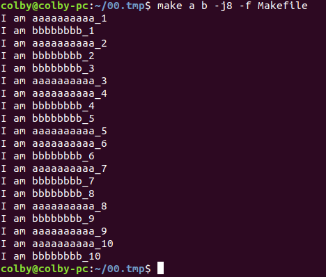
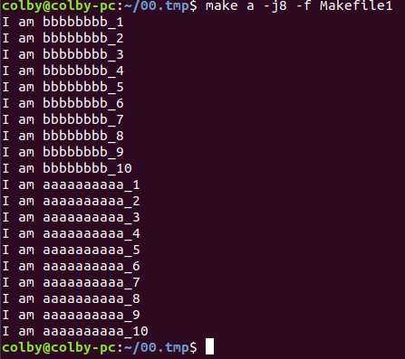
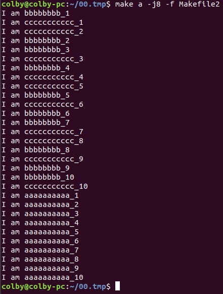

测试Makefile 并行执行时的情况

```makefile
# Makefile
file=1 2 3 4 5 6 7 8 9 10
a:
	@for name in $(file); \
	do \
	sleep 1; \
	echo I am aaaaaaaaaa_$$name;  \
	done


b:
	@for name in $(file); \
	do \
	sleep 1; \
	echo I am bbbbbbbb_$$name;  \
	done
```


当执行：

```shell
make a b -j8 -f Makefile
```




当有依赖关系时：

```makefile
# Makefile1

file=1 2 3 4 5 6 7 8 9 10
a:b
	@for name in $(file); \
	do \
	sleep 1; \
	echo I am aaaaaaaaaa_$$name;  \
	done


b:
	@for name in $(file); \
	do \
	sleep 1; \
	echo I am bbbbbbbb_$$name;  \
	done
```




当有 并行依赖 时：

```makefile
# Makefile2
file=1 2 3 4 5 6 7 8 9 10
a: b c
	@for name in $(file); \
	do \
	sleep 1; \
	echo I am aaaaaaaaaa_$$name;  \
	done


b:
	@for name in $(file); \
	do \
	sleep 1; \
	echo I am bbbbbbbb_$$name;  \
	done


c:
	@for name in $(file); \
	do \
	sleep 1; \
	echo I am ccccccccccc_$$name;  \
	done
```




