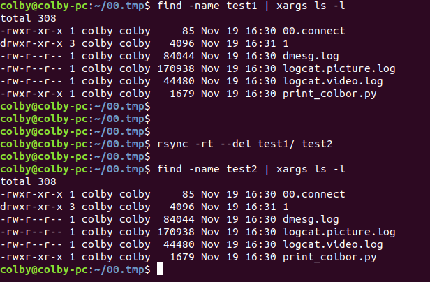

# 1. 参考

https://blog.csdn.net/u010339879/article/details/54987880

rsync，remote synchronize顾名思意就知道它是一款实现远程同步功能的软件，它在同步文件的同时，可以保持原来文件的权限、时间、软硬链接等附加信息。 rsync是用 “rsync 算法”提供了一个客户机和远程文件服务器的文件同步的快速方法，而且可以通过ssh方式来传输文件，这样其保密性也非常好，另外它还是免费的软件。

　　rsync 包括如下的一些特性：

　　能更新整个目录和树和文件系统；

　　有选择性的保持符号链链、硬链接、文件属于、权限、设备以及时间等；
　　对于安装来说，无任何特殊权限要求；
　　对于多个文件来说，内部流水线减少文件等待的延时；
　　能用rsh、ssh 或直接端口做为传输入端口；
　　支持匿名rsync 同步文件，是理想的镜像工具；

```shell
    这里一般常用的选项

    rsync命令的一些选项如下：

                        -a, --archive 归档模式，表示以递归方式传输文件，并保持所有文件属性，等于-rlptgoD

                        -r, --recursive 对子目录以递归模式处理

                        -l, --links 保留软链接

                        -p, --perms 保持文件权限

                        -t, --times 保持文件时间信息

                        -g, --group 保持文件属组信息

                        -o, --owner 保持文件属主信息

                        -D, --devices 保持设备文件信息

                        -v, --verbose 详细模式输出

                        -P, --partial保留那些因故没有完全传输的文件，以加快随后的再次传输

    -q --quiet静默模式，传输没有任何信息，即使出错了，也没有信息。

                        -z, --compress 对备份的文件在传输时进行压缩处理

                        -L, --copy-links 像对待常规文件一样处理软链接

                        --port=PORT 指定其他的rsync服务端口

                        --password-file=FILE 从FILE中得到密码

     –-delete：如果源端没有此文件，那么目的端也别想拥有，删除之


     –delete-excluded：专门指定一些要在目的端删除的文件。
```

## 1.  -a -v 选项

> -a 递归模式，如果同步文件夹 ，这个要有的.

> -v 把详细的信息打印在 shell 终端

```shell
colby@colby-pc:~/00.tmp$ tree
.
|-- 00.connect
|-- dmesg.log
|-- logcat.picture.log
|-- logcat.video.log
|-- print_colbor.py
|-- test1
|   |-- 00.connect
|   |-- 1
|   |   `-- 2
|   |       `-- 3
|   |           `-- 4
|   |               `-- 5
|   |-- dmesg.log
|   |-- logcat.picture.log
|   |-- logcat.video.log
|   `-- print_colbor.py
`-- test2

7 directories, 10 files
colby@colby-pc:~/00.tmp$
```

### 例子：

将 test1 目录下的内容 同步到 test2 中。

```shell
#colby@colby-pc:~/00.tmp$ rsync test1 test2
skipping directory test1 # 这样是不能同步， 可以加上 -a

#colby@colby-pc:~/00.tmp$ rsync -av test1/* test2
sending incremental file list
00.connect
dmesg.log
logcat.picture.log
logcat.video.log
print_colbor.py
1/
1/2/
1/2/3/
1/2/3/4/
1/2/3/4/5/

sent 301,798 bytes  received 135 bytes  603,866.00 bytes/sec
total size is 301,226  speedup is 1.00
#colby@colby-pc:~/00.tmp$ 
```

## 2. 选项 -l--links 保留软链接

比如在test1 目录有一个1.link 的软连接，如果我们不加 -l rsync 是默认不会同步的。

如果同步的时候 加上 选项 -l 此时同步的时候， 就会把软连接 同步过去

## 3.  -p 选项 就是要保持文件权限

## 4. -t 选项 保持文件的时间

如果直接 rsync -rv test1/* test2 这样去同步的话， 在test2 中文件的时间是，同步时候的时间，并不是源文件的时间

```shell
rsync -rtv test1/* test2  # 此时test2中文件的时间为 源文件的时间
rsync -av test1/* test2 # 此时不加 -t    test2中文件的时间也为 源文件的时间（cbx）  
```

## 5.  -o 保持文件所属主

> 现在 把1.txt 所属主 改为abiao

> chown abiao 1.txt

rsync 后 发现 1.txt 所属主 并没有变成abiao ,这个时候 如果想保持文件的所属组，就是加一个 -o

## 6.  -g 保持文件属组

> -g, --group 保持文件属组信息

> 还拿1.txt 说事情， 把 1.txt 的所属组 改为dp 组

> chown :dp 1.txt

> rsync 所属组 并没有变成 dp ，

> 此时 可以用 -g 选项.

## 7. -z  压缩

-z 这个就是传输的时候，压缩一下。

## 8. --delete

 –-delete：如果源端没有此文件，那么目的端也别想拥有，删除之

## 9.  --exclude

--exclude 同步时候排除一些文件。

此时发现 同步的时候可以 排除一些 文件，防止被同步，也是对 源文件的一种保护。

## 10. --delete-excluded 这个选项

    这个选项 要和 --exclude 配合起来，比如我开始同步 111/ 到test/ 一开始我完全同步了。
    
    后来 我不想 完全同步了，我不想把 1.txt 同步 ，我该 怎么办呢？
    
    此时可以加上 --exclude 这个选项。 但是之前已经把 1.txt 进行了同步，所以此时 要想把目标文件夹中 删除 1.txt ， 这个时候 ，就可以加上 。 --delete-excluded 这个选项， 此时目标文件夹，就删除了 1.txt. 看下面的例子。
    第一步，完全同步。
    
    [root@MysqlServer ~]# rsync -rvl 111/ test/
    
    sending incremental file list
    
    1.txt
    
    3.txt
    
    4.txt
    
    5.txt
    
    222/22.txt
    
    333/33.txt


    第二步，不想同步 1.txt
    
    [root@MysqlServer ~]# rsync -rvl --exclude="1.txt" 111/ test/
    
    sending incremental file list
    
    3.txt
    
    4.txt
    
    5.txt
    
    222/22.txt
    
    333/33.txt


    sent 372 bytes received 109 bytes 962.00 bytes/sec
    
    total size is 5 speedup is 0.01
    
    第三步， 此时想删除 同步过的文件 1.txt ,这个时候，就可以用 --delete-excluded 这个选项了， 此时就删除了 目标文件中，exclude 的文件了。
    
    [root@MysqlServer ~]# rsync -rvl --exclude="1.txt" --delete-excluded 111/ test/
    
    sending incremental file list
    
    deleting 1.txt
    
    3.txt
    
    4.txt
    
    5.txt
    
    222/22.txt
    
    333/33.txt


    其实rsync 命令 是一个非常好用的命令，用法也非常丰富，当然这里只是介绍了一些 常用的一些用法.
# 2. 实际例子:

```shell
rsync -rt --del test1/ test2
```



发现同步前后，时间戳没有发生变化

