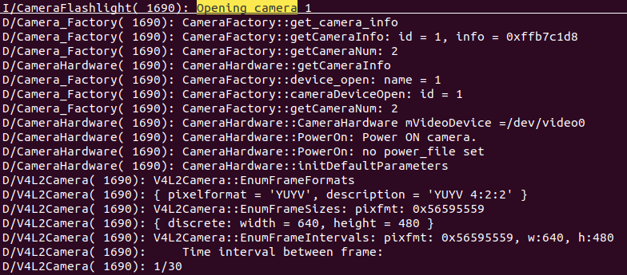
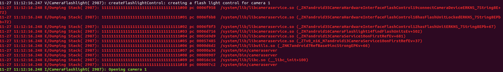

这里的分析手段是利用，函数调用栈，从hal层着手，回溯出上层的调用关系：

# 1. hal 入口

这里只回溯一下几个功能的框架：

1. 打开摄像头
2. 预览
3. 拍照
4. 录像
5. data 的数据流向

# 2. 打开摄像头

## 1. hal层

### 1. 分析入口

根据 02.v4l2-hal层分析.md 文件，我们可以知道 在 hal层打开摄像头的逻辑是：

```shell
CameraHardware::CameraHardware() # 构造函数
	->  initDefaultParameters()
		->  camera.Open(mVideoDevice) # 这里打开了摄像头  V4L2Camera   camera;
```

回溯的入口找的原则是： 先独立分析code;在出现多个调用路口，人为不能区分的时候，在打印函数的调用栈。

```shell
# 谁new 了 CameraHardware ？
CameraFactory::cameraDeviceOpen(const hw_module_t* module,int camera_id, hw_device_t** device)
	-> mCamera[camera_id] = new CameraHardware(module, mCameraDevices[camera_id]); # 打开摄像头
	-> mCamera[camera_id]->connectCamera(device)
```


```shell
# 谁调用了 cameraDeviceOpen ？
CameraFactory::device_open()
	-> gCameraFactory.cameraDeviceOpen(module, camera_id, device);
```

谁调用了  CameraFactory::device_open() ？

```cpp
/* Entry point for camera HAL API. */
struct hw_module_methods_t CameraFactory::mCameraModuleMethods = {
    open: CameraFactory::device_open
};

//  这里的 hw_module_methods_t 告诉我们是在 get_hw_module_t 后 (找到 hal层的库后，有一个open()), 但这个open函数是用来返回 hal层的接口的(hw_device_t) hal层的接口的。 具体看 2.1.1.1 中的分析
```

总结：

从上述的分析中，我们可以知道，是在 native 层中调用:  open 函数的时候  就同时 打开了底层的 /dev/video0 了

#### 1. 获得 hw_device_t

既然已经分析到这里，那就搞明白，什么时候，拿到的 hal层提供的接口(hw_device_t)

```cpp
// CameraHal.cpp
camera_module_t HAL_MODULE_INFO_SYM = { 
    common: {
         tag:           HARDWARE_MODULE_TAG,
         version_major: 1,
         version_minor: 0,
         id:            CAMERA_HARDWARE_MODULE_ID,
         name:          "Camera Module",
         author:        "The Android Open Source Project",
         methods:       &android::CameraFactory::mCameraModuleMethods,                                                                                                                                             
         dso:           NULL,
         reserved:      {0},
    },  
    get_number_of_cameras:  android::CameraFactory::get_number_of_cameras,
    get_camera_info:        android::CameraFactory::get_camera_info,
};


struct hw_module_methods_t CameraFactory::mCameraModuleMethods = {
    open: CameraFactory::device_open
};

int CameraFactory::device_open(const hw_module_t* module,
                                       const char* name,
                                       hw_device_t** device){
    ...
    // 这里只关注     hw_device_t  这是在什么时候进行填充的
    return gCameraFactory.cameraDeviceOpen(module, camera_id, device);
}


int CameraFactory::cameraDeviceOpen(const hw_module_t* module,int camera_id, hw_device_t** device)                              {
    ...
	    return mCamera[camera_id]->connectCamera(device);
}

status_t CameraHardware::connectCamera(hw_device_t** device)
{
    ALOGD("CameraHardware::connectCamera");
    
    *device = &common; // 在这里进行填充的
    return NO_ERROR;
}

// 那这个 common 是在哪里进行赋值的????

// 构造函数
CameraHardware::CameraHardware(const hw_module_t* module, char* devLocation) :
        mWin(0),...{
            
        ...    
            /* Common header */
    		common.tag = HARDWARE_DEVICE_TAG;
    		common.version = 0;
    		common.module = const_cast<hw_module_t*>(module);
    		common.close = CameraHardware::close;
    
            /* camera_device fields. */
   			 ops = &mDeviceOps;  // 在这里进行赋值的
    		priv = this;
        }
```


这里先要搞清楚几个结构体：

```c
// ./libhardware/include/hardware/camera.h
typedef struct camera_device {
    hw_device_t common; // 这里只要知道 这个地址，然后利用 强制类型转换，就可以 找到下面的camera_device_ops_t, 
    camera_device_ops_t *ops;  // 这个就是 上层所需要的 ops
    void *priv;
} camera_device_t;
```


小结：

```shell
从上述的分析中我们可以知道：
1. 在 CameraHardware 的构造函数中，对 ops 和 common 进行赋值了， 从这里我们也可以知道， 先  new CameraHardware, 然后才在 native层中  获得的 hal层的接口(hw_device_t)。 # 这里是猜测，需要后续去验证。  在 CameraFactory::cameraDeviceOpen 函数中得到了证实
```

上述仅仅是分析了向下的调用流程， 在 native 层的调用时机，并没有分析。

## 2. native 层

#### 1. native open 入口

我们从上述小节中，我们知道 了如下：

```c
camera_module_t HAL_MODULE_INFO_SYM = { 
    common: {
         id:            CAMERA_HARDWARE_MODULE_ID, // 这个是关键
         methods:       &android::CameraFactory::mCameraModuleMethods,                                                                                                                                             
         dso:           NULL,
         reserved:      {0},
    },  
    get_number_of_cameras:  android::CameraFactory::get_number_of_cameras,
    get_camera_info:        android::CameraFactory::get_camera_info,
};
```


那我们在找 native 的代码，应该拿   id:  CAMERA_HARDWARE_MODULE_ID,为切入点。

```shell
#phoenixos_edu/frameworks$ grep -inR "CAMERA_HARDWARE_MODULE_ID"

CameraService.cpp:174:    int err = hw_get_module(CAMERA_HARDWARE_MODULE_ID,
```

这里很轻松找到了  入口点哦：

```cpp
// ~/phoenixos_edu/frameworks$ vim av/services/camera/libcameraservice/CameraService.cpp +174
void CameraService::onFirstRef() 
{
    int err = hw_get_module(CAMERA_HARDWARE_MODULE_ID, (const hw_module_t **)&rawModule);
    
    mModule = new CameraModule(rawModule);
}
// 从这里我们就知道  当我们第一次去  new CameraService() 的时候, 我们就去加载 hal层的模块了。
```

那是什么时候从hal层中 拿到的 hal层库中的接口呢( camera_device_ops_t) ? 根据2.1.1.1小节的分析我们知道是在open中 放回的，那是在哪儿调用 open函数的。

```shell
# 是在哪里调用的 open函数 获取的 hal层的接口
CameraModule::open()
	->  filterOpenErrorCode(mModule->common.methods->open(&mModule->common, id, device))
```

```shell
# 是在哪里调用的 CameraModule::open() ?
status_t initialize(CameraModule *module) # CameraHardwareInterface.h
	-> module->open(mName.string(), (hw_device_t **)&mDevice);
```

在这里继续回溯的话，就会有好多个 分支，所以这里最适合使用  函数调用栈的回溯了。

不过这里也可以查看 logcat 的方式去查看： 我们看到了  CameraFlashlight 那么就去看这个类即可



```shell
# 谁调用了 CameraHardwareInterface 的 initialize ？？？
CameraHardwareInterfaceFlashControl::connectCameraDevice() # CameraFlashlight.cpp
	-> device = new CameraHardwareInterface(cameraId.string())
	-> device->initialize(mCameraModule);

```

#### 2. 调用栈打印

这里非得 进行 函数调用栈的回溯了，不然，没法进行了。分析了：

这里我们就找到了，我们打印回溯的点：

```cpp
// CameraFlashlight.cpp
status_t CameraHardwareInterfaceFlashControl::connectCameraDevice(
        const String8& cameraId) {         
    
    // 在这里添加 回溯点
    sp<CameraHardwareInterface> device =
            new CameraHardwareInterface(cameraId.string());

    status_t res = device->initialize(mCameraModule);

}
```

打印回溯并开启 调试：

```diff
diff --git a/services/camera/libcameraservice/Android.mk b/services/camera/libcameraservice/Android.mk
index ced1232b0..09fc73005 100644
--- a/services/camera/libcameraservice/Android.mk
+++ b/services/camera/libcameraservice/Android.mk
@@ -79,6 +79,7 @@ LOCAL_EXPORT_C_INCLUDE_DIRS := \
     frameworks/av/services/camera/libcameraservice
 
 LOCAL_CFLAGS += -Wall -Wextra -Werror
+LOCAL_CFLAGS += -DLOG_NDEBUG=0
 
 ifneq ($(BOARD_NUMBER_OF_CAMERAS),)
     LOCAL_CFLAGS += -DMAX_CAMERAS=$(BOARD_NUMBER_OF_CAMERAS)
diff --git a/services/camera/libcameraservice/CameraFlashlight.cpp b/services/camera/libcameraservice/CameraFlashlight.cpp
index 05c8277b9..e72b16d32 100644
--- a/services/camera/libcameraservice/CameraFlashlight.cpp
+++ b/services/camera/libcameraservice/CameraFlashlight.cpp
@@ -28,6 +28,7 @@
 #include "gui/BufferQueue.h"
 #include "camera/camera2/CaptureRequest.h"
 #include "device3/Camera3Device.h"
+#include <utils/CallStack.h>
 
 
 namespace android {
@@ -860,6 +861,12 @@ static void dataCallbackTimestamp(nsecs_t, int32_t, const sp<IMemory>&, void*) {
 
 status_t CameraHardwareInterfaceFlashControl::connectCameraDevice(
         const String8& cameraId) {
+
+       android::CallStack stack;
+       stack.update();
+       stack.dump(1);
+       stack.log("Dumping Stack",ANDROID_LOG_ERROR ,"111111111111111111111111111111111");
+
     sp<CameraHardwareInterface> device =
             new CameraHardwareInterface(cameraId.string());

```

打印如下：

```shell
make libcameraservice
mmm frameworks/av/services/camera/libcameraservice
```



```shell
00 pc 0006f958  /system/lib/libcameraservice.so  (_ZN7android35CameraHardwareInterfaceFlashControl19connectCameraDeviceERKNS_7String8E+72)    
# CameraFlashlight.cpp:866

01 pc 0006f6b8  /system/lib/libcameraservice.so (_ZN7android35CameraHardwareInterfaceFlashControl18hasFlashUnitLockedERKNS_7String8EPbb+72)
# CameraFlashlight.cpp:738

02 pc 0006f8f3  /system/lib/libcameraservice.so 
(_ZN7android35CameraHardwareInterfaceFlashControl12hasFlashUnitERKNS_7String8EPb+67)
# CameraFlashlight.cpp:724

03 pc 0006d716  /system/lib/libcameraservice.so (_ZN7android16CameraFlashlight14findFlashUnitsEv+502)
# CameraFlashlight.cpp:175

04 pc 000569d9  /system/lib/libcameraservice.so (_ZN7android13CameraService10onFirstRefEv+681)
# CameraService.cpp:206

05 pc 00057485  /system/lib/libcameraservice.so (_ZTv0_n16_N7android13CameraService10onFirstRefEv+37)
# CameraService.cpp:162

06 pc 0000d6d2  /system/lib/libutils.so (_ZNK7android7RefBase9incStrongEPKv+66)
# RefBase.cpp:407

07 pc 00000a36  /system/bin/cameraserver
# StrongPointer.h:140

08 pc 00000907  /system/bin/cameraserver
# BinderService.h:49

09 pc 00016c16  /system/lib/libc.so (__libc_init+100)
# libc_init_dynamic.cpp:109

10 pc 000007c2  /system/bin/cameraserver
# main_cameraserver.cpp
```

这里记录一个回溯的手法：

```shell
cd out/target/product/x86_64/symbols/
find -name libcameraservice.so

addr2line -e ./system/lib/libcameraservice.so 0006f958
```

这里根据 回溯结果， 给出

## 3. 打开总结

```shell
main_cameraserver.cpp
1.-> CameraService::instantiate()
	2.-> publish() # BinderService
		3.-> sm->addService(String16(SERVICE::getServiceName()), new SERVICE(), allowIsolated)
		
# ------------------------------ new SERVICE() 的时候 就会自动调用到这里的 onFirstRef()

4.->onFirstRef() # CameraService::
	5.-> findFlashUnits()
		6.->hasFlashUnit()
			7.-> hasFlashUnitLocked() # CameraHardwareInterfaceFlashControl:
				8.-> connectCameraDevice()
					8.1 -> device = new CameraHardwareInterface(cameraId.string())
					8.2 -> device->initialize(mCameraModule);
							9. -> module->open(mName.string(), (hw_device_t **)&mDevice);
								10. -> filterOpenErrorCode(mModule->common.methods->open(&mModule->common, id, device))

# --------------------------  调用hal 层的 open() 返回 hal 层 提供的 接口

11 -> CameraFactory::device_open()
	12 -> gCameraFactory.cameraDeviceOpen()
		13 -> CameraHardware::connectCamera(hw_device_t** device)
			14.1 -> mCamera[camera_id] = new CameraHardware(module, mCameraDevices[camera_id]); # 打开摄像头
					14.1.1 ->  initDefaultParameters()
					14.1.2 ->  camera.Open(mVideoDevice)
										-> fd = open(device, O_RDWR)  # 这里打开了摄像头  V4L2Camera   camera;
			14.2 -> mCamera[camera_id]->connectCamera(device);
					14.2.1 -> *device = &common;  # 此时回传了 hal 层中 关于摄像头的 接口
```

这里根据这份调用记录：

# 2. 预览

