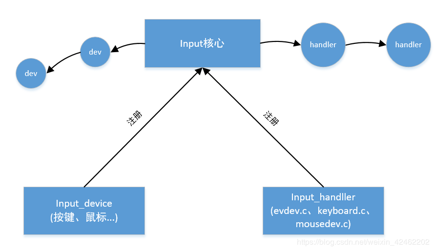
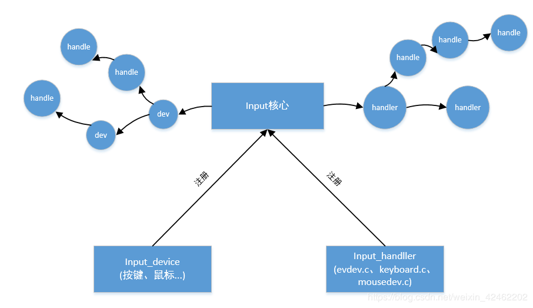
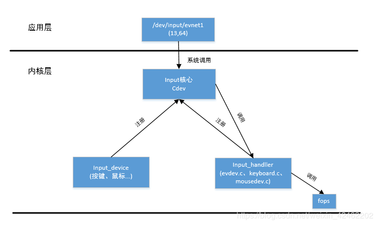
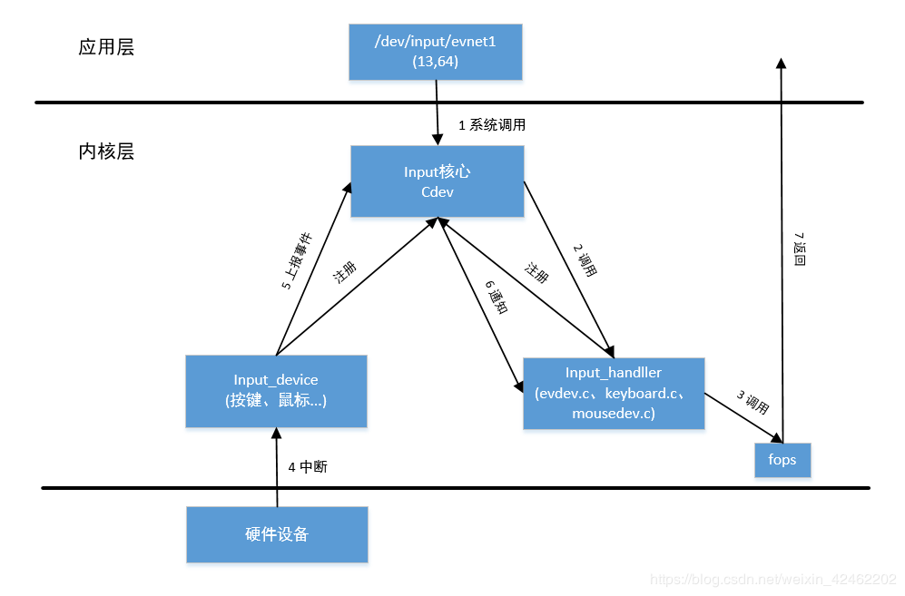

https://blog.csdn.net/weixin_42462202/article/details/100062657

**文章目录**

    Linux input子系统（二）input子系统驱动
        一、input子系统驱动框架
            1.1 input子系统的主要对象
            1.2 input子系统的驱动框架
        二、input设备驱动编写
            2.1 分配一个input设备
            2.2 设置input设备
            2.3 注册input设备
            2.4 上报input事件
            按键驱动源码
        三、input子系统源码剖析
            3.1 input核心层
            3.2 input_handler
            3.3 input_device
            3.4 上报input事件


上一片文章我们讲解了input设备应用编程，其中主要目的是搞清楚input_event的各项含义，这对编写驱动程序非常重要，本文我们将深入地讲解input子系统驱动

# 一、input子系统驱动框架

## 1.1 input子系统的主要对象

input子系统中有三个重要的对象input_device、input_handler、input_hanle

其中input_device直接面向驱动开发者，input_handler和input_hanle是input子系统的幕后工作者

### input_device

input_device表明一个具体的硬件设备，直接面向驱动开发者，其主要完成的任务是事件的设置和事件的上报

input_device的结构体定义如下

```c
struct input_dev {
	...
    /* 一系列的位图 */
	unsigned long evbit[BITS_TO_LONGS(EV_CNT)]; //该设备支持的事件
	unsigned long keybit[BITS_TO_LONGS(KEY_CNT)]; //按键事件键值
	unsigned long relbit[BITS_TO_LONGS(REL_CNT)]; //相对位置事件键值
	unsigned long absbit[BITS_TO_LONGS(ABS_CNT)]; //绝对位置事件键值
	...
    
	struct device dev; //表明这是一个设备

	struct list_head	h_list; //存放handle链表
	struct list_head	node; //用于加入input子系统的设备链表
};
```

上一篇文章中讲到读取一个input设备，可以获取不同的事件类型，还有事件对应不同的键值

一个input设备有什么事件，有什么事件对应的键值，都在input_dev的位图中设置

### input_handler

input_handler是input设备的处理者，用于处理与之匹配的input_device

其结构体定义如下

```c
struct input_handler {
	void (*event)(...); //用于input_device上报事件
	int (*connect)(...); //用于链表input_device和input_handler
	void (*disconnect)(struct input_handle *handle);
	const struct file_operations *fops; //处理input_device的fops
	int minor; //次设备号基址

	const struct input_device_id *id_table; //匹配规则

	struct list_head	h_list; //用于维护hanle链表
	struct list_head	node; //用于加入input核心层的handler链表中
};
```

input_handler不直接面向驱动开发者，它是input子系统的幕后工作者，为其匹配的input设备提供服务，内核中的input_handler并不多（evdev.c、keyboad.c、mousedev.c等）

**input_device和input_handler是一种多对多的概念**，一个input_device可以有多个匹配它的input_handler，一个input_handler也可以有多个匹配它的input_device

### input_hanle

input_hanle称它为句柄并不能突显它的价值，使用**连接器**来描述它更加直白

input_hanle用于连接input_device和input_handler，当向内核注册input_device或input_hanlder的时候，如果有input_device和input_hanlder匹配，就会生成一个input_hanle，将二者连接起来

上面介绍了input子系统的三个重要对象，下面来讲一下input子系统的驱动框架

## 1.2 input子系统的驱动框架

input子系统驱动框架可以分为两层，第一层为input核心，第二层为input_device和input_handler

input核心层维护一个input_device链表和一个input_handler链表，input核心提供input_register_device接口注册设备，提供input_register_handler注册设备处理者，如下图所示



当注册一个input_device的时候，会遍历input_hanlder链表，查看是否匹配，如果匹配，就会创建一个input_hanle连接器，然后分别存放到对应的input_devide和input_handler中的input_handle链表中，注册input_handler的时候也是同理

由于input_devide和input_handler是多对多的，也就意味着一个input_device可以有多个匹配的input_handler，一个input_hanlder可以有多个匹配的input_device，也就是说会生成多个input_hanle连接器，这些连接器就保存在input_device和``input_handler各自维护的一个input_handle`链表中，如下图所示



input核心其实注册了一个字符设备，主设备号为INPUT_MAJOR(13)

每一个input_handler都管理着一个范围的次设备号，例如evdev.c管理64-96的次设备号

每注册一个input_device时，如果有匹配的input_handler，input_handler会为其注册生成一个设备节点，主设备号为INPUT_MAJOR(13)，次设备号为input_handler所管理的范围

当应用层操作input设备节点时，会先到达input核心层，input核心层根据input设备的次设备号从它维护的input_handler中找到相应的input_handler，调用其提供的fops



当硬件设备产生中断的时候，input_device会向input核心层上报事件，input核心层再通知到input_handler，然后再将结果返回给用户空间



以上就是input子系统的驱动框架

# 二、input设备驱动编写

对于驱动开发者来说，只需要编写input_device就行，input_handler和input_hanle是input子系统的幕后工作者，不需要驱动开发者实现

## 2.1 分配一个input设备

```c
struct input_dev *input_allocate_device(void);
```

## 2.2 设置input设备

设置input设备支持的事件类型和事件键值

```c
void set_bit(int nr, volatile unsigned long *addr);
```

例如

```c
set_bit(EV_KEY, input_dev->evbit); //支持按键事件
set_bit(KEY_L, input_dev->keybit); //支持的按键键值
set_bit(EV_ABS, input_dev->evbit); //支持绝对位置事件
set_bit(ABS_X, input_dev->absbit); //支持绝对事件的键值
```

## 2.3 注册input设备

```c
int input_register_device(struct input_dev *);
```

## 2.4 上报input事件

```c
/*
- dev：input设备
- type：事件类型
- code：事件键值
- value：事件键值对应的值
  */
  void input_event(struct input_dev *dev, unsigned int type, unsigned int code, int value);
```

### 按键驱动源码

```c
#include <linux/module.h>
#include <linux/version.h>

#include <linux/init.h>
#include <linux/fs.h>
#include <linux/interrupt.h>
#include <linux/irq.h>
#include <linux/sched.h>
#include <linux/pm.h>
#include <linux/sysctl.h>
#include <linux/proc_fs.h>
#include <linux/delay.h>
#include <linux/platform_device.h>
#include <linux/input.h>
#include <linux/irq.h>

#include <asm/gpio.h>
#include <asm/io.h>
#include <asm/arch/regs-gpio.h>

struct pin_desc{
	int irq;
	char *name;
	unsigned int pin;
	unsigned int key_val;
};

struct pin_desc pins_desc[1] = {
	{IRQ_EINT2,  "SW1", S5PV210_GPH0(2), KEY_L},
};

static struct input_dev *buttons_dev;

static irqreturn_t buttons_irq(int irq, void *dev_id)
{
	struct pin_desc *pindesc = (struct pin_desc *)dev_id;
	int pinval;
	pinval = gpio_get_value(pindesc->pin);

	if (pinval)
	{
		/* 上报按键值 */
		input_event(buttons_dev, EV_KEY, pindesc->key_val, 0); /* 0表示松开 */
		input_sync(buttons_dev); /* 同步类事件，用于分隔开两件事件 */
	}
	else
	{
		input_event(buttons_dev, EV_KEY, pindesc->key_val, 1);
		input_sync(buttons_dev);
	}
	return IRQ_RETVAL(IRQ_HANDLED);
}

static int buttons_init(void)
{
	int i;
	/* 1. 分配一个输入设备 */
	buttons_dev = input_allocate_device();;

	/* 2.设置 */
	/* 2.1 设置支持的输入事件 */
	set_bit(EV_KEY, buttons_dev->evbit);

	/* 2.2 设置支持的按键值 */
	set_bit(KEY_L, buttons_dev->keybit);

	/* 3. 注册 */
	input_register_device(buttons_dev);

	/* 申请按键中断 */
	request_irq(pins_desc[0].irq, buttons_irq, 
			IRQF_TRIGGER_RISING | IRQF_TRIGGER_FALLING, 
			pins_desc[0].name, &pins_desc[0]);

	return 0;
}
static void buttons_exit(void)
{
	free_irq(pins_desc[0].irq, &pins_desc[0]);
	input_unregister_device(buttons_dev);
	input_free_device(buttons_dev);	
}
module_init(buttons_init);

module_exit(buttons_exit);

MODULE_LICENSE("GPL");
```

# 三、input子系统源码剖析

## 3.1 input核心层

首先打开drivers\input\input.c文件

input核心层维护了一个input_device链表，一个input_handler链表还有一个input_handler数组

查看驱动入口，创建了一个input类，这将在/sys/class目录下生成一个目录，然后注册了一个字符设备，此字符设备用于转发系统调用到相应的input_handler


    
```c
static LIST_HEAD(input_dev_list); //input_device链表
static LIST_HEAD(input_handler_list); //input_handler链表

static struct input_handler *input_table[8]; //input_handler数组

static int __init input_init(void)
{
    /* 注册一个类 */
    class_register(&input_class);
	/* 创建了字符设备 */
	register_chrdev(INPUT_MAJOR, "input", &input_fops);
}
```
查看其中input_fops

```c
static const struct file_operations input_fops = {
	.owner = THIS_MODULE,
	.open = input_open_file,
};
```

只实现了一个open函数，没错这就是input核心层转发的实现

input_open_file将根据打开设备的次设备号从input_table中得到对应的input_handler，然后得到其fops，将该打开文件对应的fops设置为指定input_handler的fops，此后对设备进行系统调用都会调用到这个新的fops，这就实现了转发功能

```c
static int input_open_file(struct inode *inode, struct file *file)
{
    struct input_handler *handler;
	handler = input_table[iminor(inode) >> 5];
	new_fops = fops_get(handler->fops);

	file->f_op = new_fops;

	new_fops->open(inode, file);
}
```
其中的疑惑就是input_table中的数据是怎么来的，伴随这个问题我们来看input_handler的实现与注册

## 3.2 input_handler

内核中有几个input_handler的实现（evdev.c、keyboard.c、mousedev.c等）

我们来分析evdev.c，文件位于drivers\input\evdev.c

evdev.c中实现了一个input_handler，并通过input_register_handler向input核心层注册

```c
static struct input_handler evdev_handler = {
	.event		= evdev_event, //用于上报事件
	.connect	= evdev_connect, //用于和input_device建立连接
	.disconnect	= evdev_disconnect,
	.fops		= &evdev_fops, //fops
	.minor		= EVDEV_MINOR_BASE, //次设备号基址
	.name		= "evdev",
	.id_table	= evdev_ids, //用于与input_device匹配
};

static int __init evdev_init(void)
{
	return input_register_handler(&evdev_handler);
}
```

其中的evdev_event用于上报事件，evdev_connect用于与input_device建立连接，evdev_fops为处理input_device的文件操作集，EVDEV_MINOR_BASE表示次设备号基址，evdev_ids表示匹配的input_device至少应该满足这些功能

查看EVDEV_MINOR_BASE的定义

```c
#define EVDEV_MINOR_BASE	64
```

表明evdev管理的次设备号范围为64-92(input核心层规定每个input_handler管理的范围为32)

查看evdev_ids

```c
static const struct input_device_id evdev_ids[] = {
	{ .driver_info = 1 },	/* Matches all devices */
	{ },			/* Terminating zero entry */
};
```

从注释中可以看出evdev匹配所有的input_device，那为什么这么设置就是匹配所有的设备呢？

首先明确evdev_ids表示什么，它表示匹配的input_device的功能至少满足这些数组中的一项

再看看input_device_id结构体的定义

```c
struct input_device_id {
	kernel_ulong_t flags;

	__u16 bustype;
	__u16 vendor;
	__u16 product;
	__u16 version;

	/* 功能位图 */
	kernel_ulong_t evbit[INPUT_DEVICE_ID_EV_MAX / BITS_PER_LONG + 1];
	kernel_ulong_t keybit[INPUT_DEVICE_ID_KEY_MAX / BITS_PER_LONG + 1];
	kernel_ulong_t relbit[INPUT_DEVICE_ID_REL_MAX / BITS_PER_LONG + 1];
	kernel_ulong_t absbit[INPUT_DEVICE_ID_ABS_MAX / BITS_PER_LONG + 1];
	kernel_ulong_t mscbit[INPUT_DEVICE_ID_MSC_MAX / BITS_PER_LONG + 1];
	kernel_ulong_t ledbit[INPUT_DEVICE_ID_LED_MAX / BITS_PER_LONG + 1];
	kernel_ulong_t sndbit[INPUT_DEVICE_ID_SND_MAX / BITS_PER_LONG + 1];
	kernel_ulong_t ffbit[INPUT_DEVICE_ID_FF_MAX / BITS_PER_LONG + 1];
	kernel_ulong_t swbit[INPUT_DEVICE_ID_SW_MAX / BITS_PER_LONG + 1];

	kernel_ulong_t driver_info;
};
```
有一系列的功能位图，这不是更input_device中的位图一样吗

input_device通过设置位图来标记设备具有什么功能

input_handler通过设置input_device_id中的位图来标记匹配的设备至少要满足什么功能

应该evdev的input_device_id中的位图全为0，则它表示它不需要input_device满足什么功能，因此它匹配所有的input_device

下面再来看看input_register_handler注册函数，此函数会将input_handler添加到input核心的input_table数组中和input_handler链表中，然后遍历input_device链表，调用input_attach_handler

```c
int input_register_handler(struct input_handler *handler)
{
    input_table[handler->minor >> 5] = handler; //添加到数组
    list_add_tail(&handler->node, &input_handler_list); //添加到链表
	/* 遍历设备链表 */
	list_for_each_entry(dev, &input_dev_list, node)
		input_attach_handler(dev, handler);
}
```
其中

```c
input_table[handler->minor >> 5] = handler;
```

根据次设备号右移5位就是确定数组下表，就是除以32，这就验证了每个input_handler管理32位的次设备号

在遍历设备是会调用input_attach_handler，此函数会判断设备和处理者是否匹配，如果匹配就连接二者

```c
static int input_attach_handler(struct input_dev *dev, struct input_handler *handler)
{
    /* 判断是否匹配 */
	id = input_match_device(handler, dev);
	if (!id)
		return -ENODEV;
	/* 如果匹配就调用handler的connect函数连接 */
	handler->connect(handler, dev, id);
}
```
首先查看input_match_device，此函数就是匹配input_device和input_handler的id_table数组的功能位图

```c
input_match_device(struct input_handler *handler,
							struct input_dev *dev)
{
    /* 遍历hanler的id_table */
    for (id = handler->id_table; id->flags || id->driver_info; id++)
    {
        /* 判断是否匹配 */
		MATCH_BIT(evbit,  EV_MAX);
		MATCH_BIT(keybit, KEY_MAX);
		MATCH_BIT(relbit, REL_MAX);
		MATCH_BIT(absbit, ABS_MAX);
		MATCH_BIT(mscbit, MSC_MAX);
		MATCH_BIT(ledbit, LED_MAX);
		MATCH_BIT(sndbit, SND_MAX);
		MATCH_BIT(ffbit,  FF_MAX);
		MATCH_BIT(swbit,  SW_MAX);
    }
}
```

将MATCH_BIT展开就知道它在匹配位图了

```c
#define MATCH_BIT(bit, max) \
		for (i = 0; i < BITS_TO_LONGS(max); i++) \
			if ((id->bit[i] & dev->bit[i]) != id->bit[i]) \
				break; \
		if (i != BITS_TO_LONGS(max)) \
			continue;
```

如果发现input_device和input_handler匹配的话，就会调用handler的connect函数

我们来查看evdev的connect函数，此函数会为input_device分配设备号，创建设备节点，注册handle连接器

```c
int evdev_connect(struct input_handler *handler, struct input_dev *dev,
			 const struct input_device_id *id)
{
    struct evdev *evdev;
	evdev = kzalloc(sizeof(struct evdev), GFP_KERNEL);

	/* 设置设备名 */
	dev_set_name(&evdev->dev, "event%d", minor);

	/* 设置handle */
	evdev->handle.dev = input_get_device(dev); //input_dev
	evdev->handle.handler = handler; //handler

	evdev->dev.devt = MKDEV(INPUT_MAJOR, EVDEV_MINOR_BASE + minor); //设备号

	input_register_handle(&evdev->handle); //注册handle

	/* 创建设备节点 */
	device_add(&evdev->dev);
}
```
input_register_handle是向input核心层注册handle连接器，其中就将handle加入到对应的input_device和input_handler各自维护的handle链表

```c
int input_register_handle(struct input_handle *handle)
{
	struct input_handler *handler = handle->handler;
	struct input_dev *dev = handle->dev;
    
 	list_add_rcu(&handle->d_node, &dev->h_list); //将handle添加到dev的链表中
    list_add_tail_rcu(&handle->h_node, &handler->h_list); //将handle添加到handler的链表中
}
```

此后dev和handler都可以通过handle找到对方

## 3.3 input_device

上面分析了input_handler的注册，对于input_device的注册也是类似的

首先驱动程序先分配input_device，然后设置其功能位图，再调用input_register_device注册它

input_register_device会将其添加到input核心层维护的input_device链表中，然后遍历链表中所有的input_handler，调用input_attach_handler函数

```c
int input_register_device(struct input_dev *dev)
{
    list_add_tail(&dev->node, &input_dev_list);
	list_for_each_entry(handler, &input_handler_list, node)
	input_attach_handler(dev, handler);
}
```
input_attach_handler就是和上述input_handler的注册过程一样，这里不重述

## 3.4 上报input事件

当应用层调用open函数打开输入设备时时，首先会调用到input核心层的字符设备的open函数，此函数根据次设备号找到input_device对应的input_handler，重新设置了打开文件的fops为input_handler的fops，之后对该输入设备进行read、ioctl等系统调用时，都会调用到input_handler的ioctl

```c
static int input_open_file(struct inode *inode, struct file *file)
{
    handler = input_table[iminor(inode) >> 5]; //得到对应的handler
	new_fops = fops_get(handler->fops); //获取handler的fops

	file->f_op = new_fops; //设置新的fops
	new_fops->open(inode, file);
}
```
如果handler是evdev的话，那么fops就是，其open函数这里就不分析了

```c
static const struct file_operations evdev_fops = {
	.owner		= THIS_MODULE,
	.read		= evdev_read,
	.write		= evdev_write,
	.poll		= evdev_poll,
	.open		= evdev_open,
	.release	= evdev_release,
	.unlocked_ioctl	= evdev_ioctl,
#ifdef CONFIG_COMPAT
	.compat_ioctl	= evdev_ioctl_compat,
#endif
	.fasync		= evdev_fasync,
	.flush		= evdev_flush
};
```

当应用层对此输入设备调用read函数时，就会调用到evdev_read，此函数会加入等待队列睡眠等待，当被唤醒时会将缓存区里的输入事件拷贝回用户空间

```c
static ssize_t evdev_read(struct file *file, char __user *buffer,
			  size_t count, loff_t *ppos)
{
    /* 睡眠 */
     wait_event_interruptible(evdev->wait,
		client->head != client->tail || !evdev->exist);
	/* 将缓存区里的输入事件一个一个地拷贝会用户空间 */
	while (retval + input_event_size() <= count &&
      	 evdev_fetch_next_event(client, &event)) {

		if (input_event_to_user(buffer + retval, &event))
		return -EFAULT;

		retval += input_event_size();
	}
}
```
那么谁来唤醒呢？

我猜应该是在input_device上报事件的时候将其唤醒，下面来看一看input_event，此函数回通过input_dev的handle链表通知到每个handler，调用handler的event函数

```c
void input_event(struct input_dev *dev,
		 unsigned int type, unsigned int code, int value)
{
    input_handle_event(dev, type, code, value);
}
```

```c
static void input_handle_event(struct input_dev *dev,
			       unsigned int type, unsigned int code, int value)
{
    input_pass_event(dev, type, code, value);
}
```

```c
static void input_pass_event(struct input_dev *dev,
			     unsigned int type, unsigned int code, int value)
{
    /* 遍历所有的hanle，通过其调用所有的handler的event函数 */
    list_for_each_entry_rcu(handle, &dev->h_list, d_node) {
    	handler = handle->handler;
    	handler->event(handle, type, code, value);// 这里
    }
}
```

对于evdev，就会调用到evdev_event函数，此函数会将input事件存到缓存区，然后唤醒等待队列

```c
static void evdev_event(struct input_handle *handle,
			unsigned int type, unsigned int code, int value)
{
    struct input_event event;
	event.time.tv_sec = ts.tv_sec;
	event.time.tv_usec = ts.tv_nsec / NSEC_PER_USEC;
	event.type = type;
	event.code = code;
	event.value = value;

	evdev_pass_event(client, &event); //将数据填到缓存中

	wake_up_interruptible(&evdev->wait); //唤醒等待队列
}
```
唤醒等待队列后，read函数所在的进程被唤醒，然后将缓存区的数据拷贝回用户空间