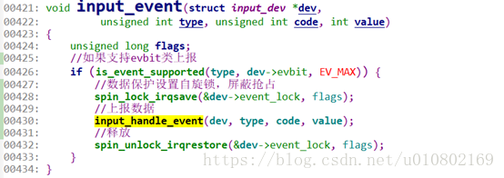

我们数据上报是在device层，其中上报的一个入口是调用input_event(dev, EV_KEY, code, !!value);那么，那么首先在在其中做的判断是是否支持evbit，什么意思呢？我们还记得在module_init中会做一个初始化设置：设置了当前设备能够产生按键数据--将某个bit置1，和当前设备能够产生的输入按键类型，比如power键，音量up键等。设置方法如下：

__set_bit(EV_KEY, inputdev->evbit);

__set_bit(KEY_POWER, inputdev->keybit);

那么就在这个时候用到了初始化的一些信息，如果没有初始化，表示不支持，条件is_event_supported不成立，那么所有下面数据上报的过程都不会去做了，具体具体在input_event(dev, EV_KEY, code, !!value)中作的是设置自旋锁（其中spin_lock_irqsave屏蔽了cpu抢占和中断抢占，有的地方还会涉及线程抢占），上报数据，释放锁：



下面看看staticvoid input_handle_event(struct input_dev *dev,unsigned int type, unsigned intcode, int value)是如何上报数据的，我们上报的数据是type,code,value,那么这些数据是存在哪里的呢，其实是暂存在一个struct input_value的结构体中的，并由其结构体指针vals指向，所以在后续的处理中，这个指针一直传递到最终上报的函数handler中的event()或者events。下面是内核中具体实现过程：


```c
static void input_handle_event(struct input_dev *dev,unsigned int type, unsigned int code, int value)
{
	int disposition;
disposition = input_get_disposition(dev, type, code, value);
if ((disposition & INPUT_PASS_TO_DEVICE) && dev->event)

	dev->event(dev, type, code, value);
if (!dev->vals)
	return;
// 如果将数据交给input handler去处理
if (disposition & INPUT_PASS_TO_HANDLERS) {

	struct input_value *v;
		if (disposition & INPUT_SLOT) {//这里可能是触摸类设备数据存储
		//将input device获取到数据暂存到input value
		v = &dev->vals[dev->num_vals++];
		v->type = EV_ABS;
		v->code = ABS_MT_SLOT;
		v->value = dev->mt->slot;
	}
	v = &dev->vals[dev->num_vals++];
	v->type = type;
	v->code = code;
	v->value = value;
}
if (disposition & INPUT_FLUSH) {
	if (dev->num_vals >= 2)
		input_pass_values(dev, dev->vals, dev->num_vals);
	dev->num_vals = 0;
} else if (dev->num_vals >= dev->max_vals - 2) {
	dev->vals[dev->num_vals++] = input_value_sync;
	input_pass_values(dev, dev->vals, dev->num_vals);
	dev->num_vals = 0;
}
}
```


input_pass_values---->>


```c
static void input_pass_values(struct input_dev *dev,
			      struct input_value *vals, unsigned int count)
{
	struct input_handle *handle;
	struct input_value *v;
if (!count)
	return;
rcu_read_lock();
handle = rcu_dereference(dev->grab);
if (handle) {
	count = input_to_handler(handle, vals, count);
} else {
	// 从input device中获取到input handle
	list_for_each_entry_rcu(handle, &dev->h_list, d_node)
		if (handle->open)
			count = input_to_handler(handle, vals, count);
}
rcu_read_unlock();

add_input_randomness(vals->type, vals->code, vals->value);

/* trigger auto repeat for key events */
for (v = vals; v != vals + count; v++) {
	if (v->type == EV_KEY && v->value != 2) {
		if (v->value)
			input_start_autorepeat(dev, v->code);
		else
			input_stop_autorepeat(dev);
	}
}
}
```


总结-->

最终上班数据还是回到了handle层，是通过input_to_handler中会通过container_of找到handler，然后调用event或者events来做数据（通过指针一直传递数据）填充，最终使用input_sync(inputdev)唤醒队列，完成数据上报。
