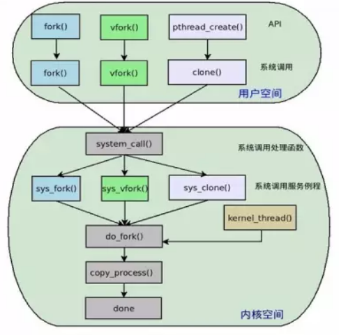

## task_struct

```c
struct task_struct {
    volatile long state;    /* -1 unrunnable, 0 runnable, >0 stopped */
	...
};
```


### task_struct的角色扮演

- 在linux内核中，内核将进程、线程和内核线程一视同仁，即内核使用唯一的数据结构 task_struct 来分别表示他们；内核使用相同的调度算法对这三者进行调度；并且他们在内核中均通过do_fork()分别创建。
- 这样处理对内核来说简单方别，内核在统一处理这三者之余并没有失去他们本身所具有的特性

**既然linux内核使用task_struct统一来描述进程、线程和内核线程。那么，内核在统一处理这三者之余如何不失去他们本身具有的特性呢？**

- 对于普通进程来说，进程描述符中每个字段都代表进程的属性
- 线程: 进程A创建了线程B,则B线程会在内核中对应一个轻量级进程。这个轻量级进程很自然的对应一个进程描述符，只不过B线程的进程描述符中的某些代表资源指针会和A进程中对应的字段指向同一个数据结构，这样就实现了多线程之间的资源共享。
- 内核线程：由于内核线程只运行于内核态，并且只能由其他内核线程创建，所以内核线程并不需要和普通进程那样的独立地址空间。因此内核线程的进程描述符中的mm指针即为NULL.内核线程是否共享父内核线程的某些资源，则通过向内核线程创建函数 kernel_thread()传递参数来决定



**最终都是调用了内核中的　do_fork()函数去创建**


## do_fork

```c
long do_fork(unsigned long clone_flags,
          unsigned long stack_start,
          unsigned long stack_size,
          int __user *parent_tidptr,
          int __user *child_tidptr)
```

- clone_flags: 进程各种特性的标志。低字节指定子进程结束时发送给父进程的信号代码，一般为 SIGCHLD信号，剩余三个字节是若干个标志或者运算的结果。
- stack_start: 子进程用户态堆栈指针，该参数会被赋值给子进程的esp寄存器。
- regs: 指向通用寄存器值的指针，当进程从用户态切换到内核态时通用寄存器中的值会被保存到内核态堆栈中。
- stack_size: 未被使用，默认值为0
- parent_tidptr: 该子进程的父进程用户态变量的地址，仅当CLONE_PARENT_SETTID被设置时有效。
- child_tidptr:该子进程用户态变量的地址，仅当CLONE_CHILD_SETTID被设置时有效

### 多样性

- 进程、线程和内核线程在内核中都是通过do_fork()完成创建的，do_fork()是如何体现其功能的多样性?
  - clone_flags 参数在这里起到了关键的作用，通过选取不同的标志，从而保证了 do_fork()函数可以创建进程、线程和内核线程。clone_flags参数可取的标志很多，下面只介绍几个和本文相关的标志。
    - CLONE_VM: 子进程共享父进程内存描述符和所有的页表
    - CLONE_FS: 子进程共享父进程所在文件系统的根目录和当前工作目录
    - CLONE_FILES: 子进程共享父进程打开的文件。　(父进程打开的fd 可以在子进程中使用)
    - CLONE_SIGHAND: 子进程共享父进程的信号处理程序、阻塞信号和挂起信号。使用该标志必须同时设置CLONE_VM标志
    - 如果创建子进程时设置了上述标志，那么子进程会共享这些标志所代表的父进程资源。

```c
pid_t kernel_thread(int (*fn)(void *), void *arg, unsigned long flags)
{
    return do_fork(flags|CLONE_VM|CLONE_UNTRACED, (unsigned long)fn,                                                                                  
        (unsigned long)arg, NULL, NULL);
}

SYSCALL_DEFINE0(fork)
{                                        
    return do_fork(SIGCHLD, 0, 0, NULL, NULL);
}

SYSCALL_DEFINE0(vfork)
{
    return do_fork(CLONE_VFORK | CLONE_VM | SIGCHLD, 0,
            0, NULL, NULL);
}

SYSCALL_DEFINE5(clone, unsigned long, clone_flags, unsigned long, newsp,
         int __user *, parent_tidptr,
         int __user *, child_tidptr,
         int, tls_val)
{                                                                                                                                                     
    return do_fork(clone_flags, newsp, 0, parent_tidptr, child_tidptr);
}

```

