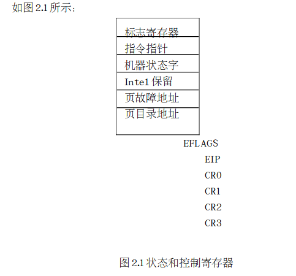
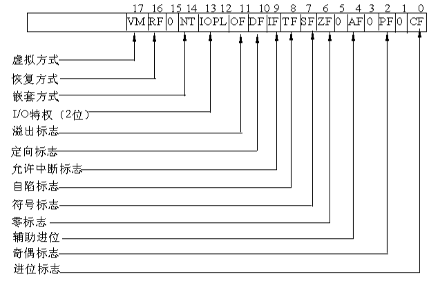
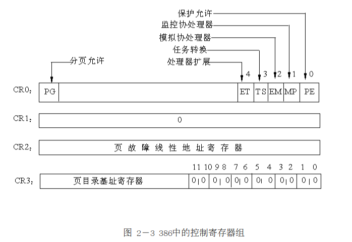
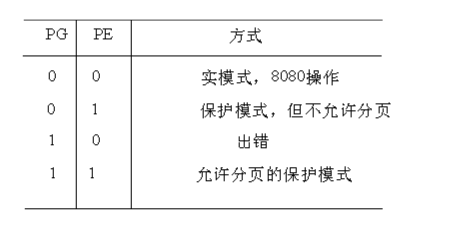
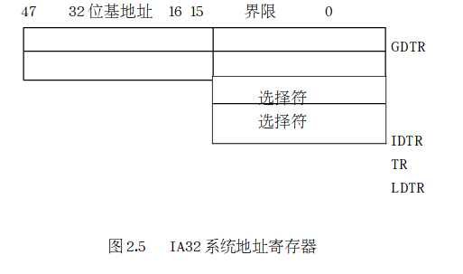
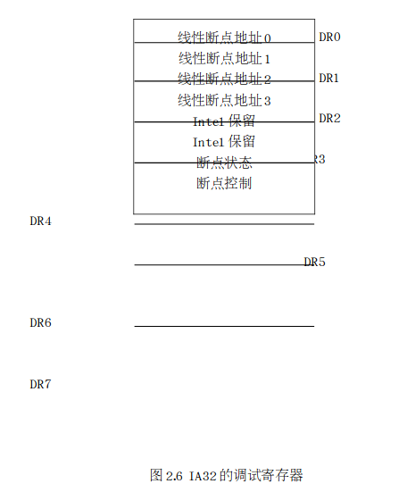

## 段寄存器

8086中有4个16位的段寄存器：CS、DS、SS、ES，分别用于存放可执行代码的代码段、数据段、堆栈段和其他段的基地址。在IA32中，有6个16位的段寄存器，但是，这些段寄存器中存放的不再是某个段的基地址，而是某个段的选择符（Selector）。因为16位的寄存器无法存放32位的段基地址，段基地址只好存放在一个叫做描述符表（Descriptor）的表中。因此，**在IA32中，我们把段寄存器叫做选择符。**下面给出6个段寄存器的名称和用途：

CS  代码段寄存器

DS  数据段寄存器

SS  堆栈段寄存器

ES、FS及GS  附加数据段寄存器

有关段选择符、描述符表及系统表地址寄存器将在段机制一节进行详细描述。

## 状态和控制寄存器

状态和控制寄存器是由标志寄存器EFLAGS、指令指针EIP和4个控制寄存器组成

### 1.指令指针寄存器和标志寄存器

令指针寄存器EIP中存放下一条将要执行指令的偏移量（offset ），这个偏移量是相对于目前正在运行的代码段寄存器CS而言的。偏移量加上当前代码段的基地址，就形成了下一条指令的地址。EIP中的低16位可以分开来进行访问，给它起名叫指令指针IP寄存器，用于16位寻址。

志寄存器EFLAGS存放有关处理器的控制标志，如图2.2所示。标志寄存器中的第1、3、5、15位及18～31位都没有定义。

这些标志位中，我们只介绍在Linux内核代码中常用且重要的几个标志位

第8位TF（Trap Flag）是自陷标志，当将其置1时则可以进行单步执行。当指令执行完后，就可能产生异常1的自陷（参看第四章）。**也就是说，在程序的执行过程中，每执行完一条指令，都要由异常1处理程序 （在Linux内核中叫做debug()）进行检验。**当将第8位清0后，且将断点地址装入调试寄存器DR0～DR3时，才会产生异常1的自陷。 （也就是说，单步执行和设置断点都会产生异常1处理程序）

第12、13位IOPL是输入输出特权级位，这是保护模式下要使用的两个标志位。由于输入输出特权级标志共两位，它的取值范围只可能是0、1、2和3共4个值，恰好与输入输出特权级0～3级相对应。但Linux内核只使用了两个级别，即0和3级，0表示内核级，3表示用户级。在当前任务的特权级CPL（Current Privilege Level）高于或等于输入输出特权级时，就可以执行像IN、OUT、INS、OUTS、STI、CLI和LOCK等指令而不会产生异常13（即保护异常）。在当前任务特权级CPL为0时，POPF（从栈中弹出至标志 位）指令和中断返回指令IRET可以改变IOPL字段的值。

第9位IF（Interrupt Flag）是中断标志位，是用来表示允许或者禁止外部中断（参看第四章）。若第9位IF被置为1，则允  许CPU接收外部中断请求信号；若将IF位清0，则表示禁止外部中断。在保护模式下，只有当第12、13位指出当前CPL为最高特权级时，才允 许将新值置入标志寄存器EFLAGS以改变IF位的值。

第10位DF（Direction Flag）是定向标志。DF位规定  了在执行串操作的过程中，对源变址寄存器ESI或目标变址寄存器EDI是增值还是减 值。如果DF为1，则寄存器减 值；若DF为0，则寄存器值增加。

第14位NT是嵌 套任务标志位。在保护模式下常使用这个标志。当IA32在发生 中断和执行CALL指令时就有可能引起任务切换。 若是由于中断或由于执行CALL指令而出现了任务切 换，则将NT置为1。若没有任务切换，则将NT位清0。

第17位VM （Virtual 8086 Mode Flag）是虚拟8086方式标志，是IA32新设置的一个标志位。表示IA32CPU是在虚拟8086环境中运行。如果IA32CPU是在保护模式下运行，而VM为又被置成1，这时IA32就转换成虚拟8086操作方式，使全部段操作就像是在8086CPU上运行一样。VM位只能由两种方式中的一种方式给予设置，即或者是在保护模式下，由最高特权级（0）级代码段的中断返回指令IRET设置，或者是由任务转换进行设置。Linux内核实现了虚拟8086方式，但在本书中我们不准备对此进行详细讨  论

### 2.控制寄存器

状态和控制寄存器组除了EFLAGS、EIP，还有四个32位的控制寄存器，它们是CR0，CR1，CR2和CR3。现在  我们详细看看它们的结构，如图2－3所示。

这几个寄存器中保存全局性和任务无关的机器状态。

CR0中包含了6个预定 义标志，0位是保护允许位PE(ProtedtedEnable)，用于启动保护模式，如果PE位置1，则保护模式启动，如果PE=0，则在实模式下运行。1位是监控协处理位MP(Monitercoprocessor)，它与第3位一起决定：当TS=1时操作码WAIT是否产生一个“协处理器不能使用”的出错信号。第3位是任务转换位(TaskSwitch)，当一个任务转换完成之后，自动将它置1。随着TS=1，就不能使用协处理器。CR0的第2位是模拟协处理器位EM(Emulatecoprocessor)，如果EM=1，则不能使用协处理器，如果EM=0，则允  许使用协处理器。第4位是微处理器的扩展类型位ET(ProcessorExtensionType)，其内保存着处理器扩展类型的信息，如果ET=0，则标识系统使用的是287协处理器，如果ET=1，则表示系统使用的是387浮点协处理器。CR0的第31位是分页允许位(PagingEnable)，它表示芯片上的分页部件是否允许工作，下一节就会讲到。  由PG位和PE位定义的操作方式如图2.4所示。

CR1是未 定义的控制寄存器，供  将来的处理器使用。CR2是页故障线性地址寄存器，保存最后一次出现页 故障的全32位线性 地址。CR3是页目录基址寄存器，保存页目录表的物理地址，页目录表总是放在 以4K字节为单位的存储器边 界上 ，因此，它的地址的低12位总为0，不起作用，即使写上内容，也不会被理会。     这几个寄存器是与分页机制密切相关的，因此，在进程管理及虚拟内存管理中会涉及到这几个寄存器，读者要记住CR0、CR2及CR3这三个寄存器的内容。

## 系统地址寄存器

这4个专用寄存器用于引用在保护模式下所需要的表和段，它们的名称和作用如下：·全局描述符表寄存器GDTR（Global Descriptor Table Register ），是48位寄存器，用来保存全局描述符表（GDT）的32位基地址和16为GDT的界限 。·中断描述符表寄存器IDTR（Interrupt Descriptor Table Register），是48位寄存器，用来保存中断描述符表（IDT）的32位基地址和16为IDT的界限 。·局部描述符表寄存器LDTR（Global Descriptor Table Register ），是16位寄存器，保存局部描述符表LDT段的选择符。·任务状态寄存器TR（Task State Register）是16位寄存器，用于保存任务状态段TSS段的16位选择符。    用以上4个寄存器给目前正在执行的任务（或进程）定义任务环境、地址空  间和中断向量空  间。有关全局描述符表GST、中断描述符表IDT、局部描述符表LDT及任务状态段TSS的具 体内容将在稍后进 行详细描述。

## 调试寄存器和测试寄存器

### 1.调试寄存器

IA32为调试提供了硬 件支撑  。在IA32芯片内有8个32位的调试寄存器DR0~DR7，如

这些寄存器可以使系统程序设计人员定义４个断点，用它们可以规定指令执行和数据读写的任何组合。DR0~DR3是线性断点地址寄存器，其中保存着４个断点地址。DR5、DR6是两个备用的调试寄存器，目前尚未定义。DR6是断点状态寄存器，其低序位是指示符位。当允许故障调试并检查出故障而进入异常调试处理程序debug时，由硬件把指示符位置１，调试异常处理程序在退出之前必须把这几位清０．DR7是断点控制寄存器，它的高序半个字被分为4个字段，用来规定断点字段的长度是１个字节、２个字节、４个字节以及规定将引起断点的访问类型，低序半个字的位字段用于允许断点和允许所选择的调试条件。

### 2.测试寄存器

IA21 用两个３２位的测试寄存器　TR6 和TR7. 这两个寄存器用于在转换旁视缓冲器　中测试随机存储器(RAM)和　相联存储器CAM. TR6 是测试命令寄存器，其内存存放测试控制命令。TR7是数据寄存器，其内保存转换旁路缓冲器测试的数据。

