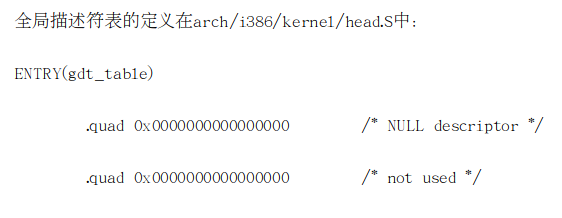

# 段机制以及linux 的实现

段是虚拟地址空间的基本单位，段机制必须把虚拟地址空间的一个地址转换为线性地址空间的一个线性地址。

## 1. 段机制

为了实现这种映射，仅仅用段寄存器来确定一个基地址是不够的，至少还得描述段的长度，并且还需要段的一些其他信息，比如访问权之类。所以，这里需要的是一个数据结构，这个结构包括三个方面的内容。

(1) 段的基地址(base address): 在线性地址空间中段的起始地址。

(2)段的界限(limit): 在虚拟地址空间中，段内可以使用的最大偏移量。

(3)段的保护属性(Attribute): 表示段的特性。例如，该段是否可被读出或写入，或者该段是否作为一个程序来执行，以及段的特权级等等。

如图2.5所示，虚拟地址空间中偏移量从0到limit范围内的一个段，映射到线性地址空间中就是从Base 到　Base+Limit


把图2.5用一个表描述则如图2.6


这样的表就是段描述符表(或段表)　，其中的表项叫做段描述符(segment descriptor)

## 2. 段描述符

所谓描述符(Descriptor)，就是描述段的属性的一个8字节存储单元。在实模式下，段的属性不外乎是代码段、堆栈段、数据段、段的起始地址、段的长度等等，而在保护模式下则复杂一些。IA32将它们结合在一起用一个8字节的数表示，称为描述符 。IA32的一个通用的段描述符的结构如图2.10所示


从图可以看出，一个段描述符指出了段的32位基地址和20位段界限(即段长)。

第六个字节的G位是粒度位，当G=0时，段长表示段格式的字节长度，即一个段最长可达1M字节。当G=1时，段长表示段的以４k字节为一页的页的数目，即一个段最长可达1Mx4K = 4G字节。

D位表示缺省操作数的大小，如果D=0,操作数为16位，如果D=1,操作数为32位。第六个字节的其余两位为0,这是为了和将来的处理器兼容而必须设置为0的位。


第7位P位(Present) 是存在位，表示段描述符描述的这个段是否在内存中，如果在内存中。P=1；如果不在内存中，P=0。

DPL(Descriptor Privilege Level)，就是描述符特权级，它占两位，其值为0～3，

用来确定这个段的特权级即保护等级。

S位(System)表示这个段是系统段还是用户段。如果S=0，则为系统段，如果S=1，则为用户程序的代码段、数据段或堆栈段。系统段与用户段有很大的不同，后面会具体介绍。

类型占3位，第三位为E位，表示段是否可执行。当E=0时，为数据段描述符，这时的第2位ED表示扩展方向。当ED=0时，为向地址增大的方向扩展，这时存取数据段中的数据的偏移量必须小于等于段界限，当ED=1时，表示向地址减少的方向扩展，这时偏移量必须大于界限。当表示数据段时，第1位(W)是可写位，当W=0时，数据段不能写，W=1时，数据段可写入。**在IA32中，堆栈段也被看成数据 段，因  为它本质上就是特殊的数据段。当描述堆栈段时，ED=0，W=1,即堆栈段朝地址增大的方向扩展。**


也就是说，当段为数据段时，存取权字节的格式如图2.12所示


取权字节的第0位A位是访问位，用于请求分段不分页的系统中，每当该段被访问时，将A置1。对于分页系统，则A被忽略未用。 

## 3. 描述符表

各种各 样的用户描述符和系统描述符，都放在对应的全局描述符表、局 部描述 符表和中断描述符表中。

描述符表(即段表)定义了IA32系统的所有段的情况。所有的描述符表本身都占据一个字节为8的倍 数的存储器空间，空间大小在8个字节(至少含一个描述符)到64K字节(至多含8K)个描述符之间。

### 1.全局描述符表

全局描述符表GDT(Global Descriptor Table)，除了任务门，中断门和陷阱门描述符外，包含着系统中所有任务都共用的那些段的描述符。它的第一个8字节位置没有使用。

### 2. 中断描述符表

中断描述符表IDT(Interrupt Descriptor Table)，包含256个门描述 符。**IDT中只 能包含任务门、中断门和陷阱门描述符，虽然IDT表最长也可   以为64K字节，但只  能存 取2K字节以内的描述符，即256个描述符，**这个数字是为了和8086保持兼容。

### 3. 局部描述 符表(LDT)

局部描述 符表LDT(local Descriptor Table)，包含了与一个给定 任务有关的描述符，每个任务各自有一个的LDT。有了LDT，就可以使给定  任务的代码、数据与别的任务相隔离。

每一个任务的局部描述 符表LDT本身也用一个描述符来表示，称为LDT描述符，它包含了有关局部描述 符表的信息，**被放在全局描述符表GDT中。**

## 4. Linux中段的实现

Intel微处理器的段机制是从8086开始提出的， 那时引入的段机制解决了从CP U内部16位地址到20位实地址的转换。为了保持这种兼容性，386仍然使用段机制，但比以前复杂得多。   因此，Linux内核 的设计并没有全部采用Intel所提供 的段方案，仅仅有限度地使用了一下分段机制。这不仅简化了Linux内核 的设计，而且为把Linux移植到其他平台创造了条件，因为很多RI SC处理器并不支持段机制。但是，对段机制相关知识的了解是进入Linux内核 的必经之路。

从2.2版开始，Linux让所有的进程（或叫任务）都使用相同的逻辑地址空间，因此就没有必要使用局部描述符表LDT。但内核中也用到LDT，那只是在VM86模式中运行Wine，因 为就是说在Linux上模拟运行Winodws软件或DOS软件的程序时才使用。

在IA32上任意给出   的地址都是一个虚拟地址，即任意一个地址都是通过“选择符:偏移量”的方式给出的，这是段机制存访问模式的基本特点。所以在IA32上设计操作系统时无法 回避使用段机制。一个虚拟地址最终会通过 “段基地址＋偏移量”的方式转化为一个线性地址。但是，由于绝大多数硬件平台都不支持段机制，只 支持分页机制，所以为了让Linux具有更 好的可 移植性  ，我们需要去掉段机制而只 使用分页机制。

但不幸的是，IA32规定段机制是不可禁止的，因此不可能绕过它直接给出线性地址空间的地址。万般无奈之下，Linux的设计人员干脆让段的基地址为0，而段的界限为4GB，这时任意给出一个偏移量，则等式为“0+偏移量=线性地址”，也就是说“偏移量＝线性地址”。另外由于段机制规定“偏移量 < 4GB”，所以偏移量的范围为0H～FFFFFFFFH，这恰好是线性地址空间范围，也就是说虚拟地址直接映射到了线性地址，我们**以 后所提到的虚拟地址和线性地址指的也就是同一地址。**看来，Linux在没有回避  段机制的情 况下巧 妙地把段机制给绕过去了。

另外，由于IA32段机制还规定 ，必须为代码段和数据段创 建不同的段，所以Linux必须为代码段和数据段分别创建一个 基地址为0，段界限为4GB的段描述符。不仅如此，由于Linux内核运行在特权级0，而用户程序运行在特权级别3，根据IA32的段保护机制规定，特权级3的程序是无法访问特权级为0的段的，所以Linux必须为内核和用户程序分别创建其代码段和数据段。这就意味着Linux必须创  建4个段描述符——特权级0的代码段和数据段，特权级3的代码段和数据段。

linux 在启动的过程中设置了段寄存器的值和全局描述符表GDT的内容，段的定义在

```c
// linux-2.6.0$ vim ./include/asm-i386/segment.h
//                         索引号 TI RPL
#define __KERNEL_CS (0x60) 01100 0  00 // 索引号:12 TI:0 权限:0
#define __KERNEL_DS (0x68) 01101 0  00 // 索引号:13 TI:0 权限:0  

#define __USER_CS (0x73) 01110 0 11 // 索引号:14 TI:0 权限:3
#define __USER_DS (0x7b) 01111 0 11 // 索引号:15 TI:0 权限:0

// linux-2.6.0$ vim ./arch/i386/kernel/head.S
ENTRY(cpu_gdt_table)
    .quad 0x0000000000000000    /* NULL descriptor */
    .quad 0x0000000000000000    /* 0x0b reserved */
    .quad 0x0000000000000000    /* 0x13 reserved */
    .quad 0x0000000000000000    /* 0x1b reserved */
    .quad 0x0000000000000000    /* 0x20 unused */
    .quad 0x0000000000000000    /* 0x28 unused */
    .quad 0x0000000000000000    /* 0x33 TLS entry 1 */
    .quad 0x0000000000000000    /* 0x3b TLS entry 2 */
    .quad 0x0000000000000000    /* 0x43 TLS entry 3 */
    .quad 0x0000000000000000    /* 0x4b reserved */
    .quad 0x0000000000000000    /* 0x53 reserved */
    .quad 0x0000000000000000    /* 0x5b reserved */
	// 这个索引值就是　12
    .quad 0x00cf9a000000ffff    /* 0x60 kernel 4GB code at 0x00000000 */  
    .quad 0x00cf92000000ffff    /* 0x68 kernel 4GB data at 0x00000000 */
    .quad 0x00cffa000000ffff    /* 0x73 user 4GB code at 0x00000000 */
    .quad 0x00cff2000000ffff    /* 0x7b user 4GB data at 0x00000000 */

    .quad 0x0000000000000000    /* 0x80 TSS descriptor */
    .quad 0x0000000000000000    /* 0x88 LDT descriptor */
    
    ...
#ifdef CONFIG_SMP
    .fill (NR_CPUS-1)*GDT_ENTRIES,8,0 /* other CPU's GDT */
#endif
    
//小结:
// 这些都是段选择子（段选择符）,是往段寄存器中放的值,里面放的是　索引值，　
__KERNEL_CS
__KERNEL_DS
__USER_CS
__USER_DS
// 他们索引的是　cpu_gdt_table　全局描述符中的值
```


从定义看 出，没有定义堆栈段，实际上，Linux内核 不区分数据段和堆栈段，这也体现了Linux内核尽量减少段的使用。因为没有使用LDT，因此，TI=0,并把这4个段都放在GDT中, index就是某个段在GDT表中的下标。内核代码段和数据段具有最高特权，因此其RP L为0，而用户代码段和数据段具有最低特权，因此其RP L为3。可以看出，Linux内核 再次简化了特权级的使用，使用了两个特权级而不是4个。




从代码可以看出，GDT放在 数组变量gdt_t able中。按Intel规定 ，GDT中的第一项为空，这是为了防止加电后段寄存器未 经初始化就进 入保护模式而使用GDT的。第二项也没用。从下标2到5共4项对应于前面的4种段描述符值。从描述符的数值可以得出：

段的基地址全部为0x00000000·

段的上  限全部为0xffff·

段的粒度G为1，即段长单位为4KB·

段的D位为1，即对这四个段的访问都为32位指令·

段的P位为1，即四个段都在  内存。

从逻辑上说，Linux巧妙地绕过了逻辑地址到线性地址的映射，但实质上还得应付Intel所提供 的段机制。只不过 ，Linux把段机制变得相当简单 ，它只  把段分为两种：用户态（RP L＝3）的段和内核态（RP L=0）的段，因此，描述符投影寄存器的内容很少发生变化，只 在进程从用户态切换到内核态或者 反之时才发生变化。另外，用户段和内核段的区别也仅仅在其RP L不同，因此内核根本无需访问描述符投影寄存器，当然也无需访问GDT，而仅从段寄存器的最低两位就可以获取RP L的信息。Linux这样设计所带来的好处是显而易见的，Intel的分段部件对Linux性能造成的影响可以忽略不计。

在上面描述的GDT表中，紧接着那四个段描述的两个描述符被保留，然后是四个高级电源 管理（APM）特征描述符，对此不进行详细讨论。

按Intel的规定，每个进程有一个任务状态段（TSS）和局部描述符表LDT，但Linux也没有完全遵循Intel的设计思路。  如前 所述，Linux的进 程没有使用LDT，而对TSS的使用也非常有限，每 个CPU仅使用一个TSS。

通过上面的介绍可以看出，Intel的设计可谓周全细致，但Linux的设计者并没有完全陷入这种沼泽，而是选择了简洁而有效的途径，以完成所需功能并达到较好的性能为目标。


## 5. 其他

- 分段和分页都可以划分进程的物理地址空间。分段可以给每一个进程分配不同的线性地址空间，**而分页可以把同一线性地址空间映射到不同的物理空间**。
- linux 更喜欢使用分页方式，因为：
  - 当所有进程使用相同的段寄存器值时，内存管理变得更加简单，也就是说他们能共享同样的一组线性地址
  - linux 设计目标之一是可以把它移植到绝大多数流行的处理器平台上。然而，RISC体系结构对分段的支持很有限


为啥会有四个段?


