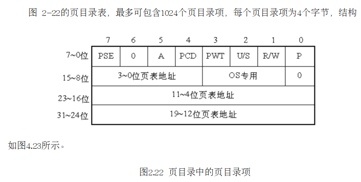
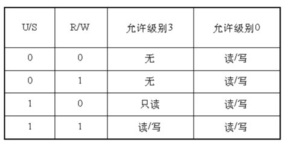

# 第五讲 分页机制及Linux中的初步表示

​	分页机制在段机制之后进行，以完成线性—物理地址的转换过程。段机制把逻辑地址转换为线性地址，分页机制进一步把该线性地址再转换为物理地址。

​	分页机制由CR0中的PG位启用。如PG=1，启用分页机制，并使用本节要描述的机制，把线性地址转换为物理地址。如PG=0，禁用分页机制，直接把段机制产生的线性地址当作物理地址使用。分页机制管理的对象是固定大小的存储块，**称之为页(page)。**分页机制把整个线性地址空间及整个物理地址空间都看成由页组成，在线性地址空间中的任何一页，可以映射为物理地址空间中的任何一页（我们把物理空间中的一页叫做一个**页面或页框(pageframe)）。**


图 2-20示出分页机制如何把线性地址空间及物理地址空间划分为页，以及如何在这两个地址空间进行映射。图2.10的左边是线性地址空间，并将其视为一个具有一页大小的固定块的序列。图2.20的右边是物理地址空间，也将其视为一个页面的序列。图中，用箭头把线性地址空间中的页，与对应的物理地址空间中的页面联系起来。在这里，线性地址空间中的页，与物理地址空间中的页面是随意地对应起来。

IA32使用4K字节大小的页。每一页都有4K字节长，并在4K字节的边界上对齐，即每一页的起始地址都能被4K整除。因此，IA32把4G字节的线性地址空间，划分为1G个页面，每页有4K字节大小。分页机制通过把线性地址空间中的页，重新定位到物理地址空间来进行管理，因为每个页面的整个4K字节作为一个单位进行映射，并且每个页面都对齐4K字节的边界，因此，线性地址的低12位经过分页机制直接地作为物理地址的低12位使用。

线性—物理地址的转换，可将其意义扩展为允许将一个线性地址标记为无效，而不是实际地产生一个物理地址。有两种情况可能使页被标记为无效：其一是线性地址是操作系统不支持的地址；其二是在虚拟存储器系统中，线性地址对应的页存储在磁盘上，而不是存储在物理存储器(内存)中。在前一种情况下，程序因产生了无效地址而必须被终止。对于后一种情况，该无效的地址实际上是请求操作系统的虚拟存储管理系统，把存放在磁盘上的页传送到物理存储器中，使该页能被程序所访问。由于无效页通常是与虚拟存储系统相联系的，这样的无效页通常称为未驻留页，并且用页表属性位中叫做存在位的属性位进行标识。未驻留页是程序可访问的页，但它不在主存储器中。对这样的页进行访问，形式上是发生异常，实际上是通过异常进行缺页处理。

## 一、 分页机构

如前所述，分页是将程序分成若干相同大小的页，每页4K个字节。如果不允许分页(CR0的最高位置0)，那么经过段机制转化而来的32位线性地址就是物理地址。但如果允许分页(CR0的最高位置1)，就要将32位线性地址通过一个两级表格结构转化成物理地址。

### 1. 两级页表结构

为什么采用两级页表结构呢？在IA32中页表共含1M个表项，每个表项占4个字节。如果把所有的页表项存储在一个表中，则该表最大将占4M字节连续的物理存储空间。**为避免使页 表占有如此巨额的物理存储器资源，故对页表采用了两级表的结构**，而且对线性地址的高20位的线性—物理地址转化也分为两部完成，每一步各使用其中的10位。

两级表结构的第一级称为页目录，存储在一个4K字节的页面中。页目录表  共有1K个表项，每个表项为4个字节，并指向第二级表。线性地址的最高10位(即位31~位22)用来产生第一级的索引，由索引得到的表项中，指定并选择了1K个二级表中的一个表。

两级表结构的第二级称为页表，也刚好存储在一个4K字节的页面中，包含1K个字节的表项，每个表项包含一个页的物理基地址。第二级页表由线性地址的中间10位(即位21~位12)进行索引，以 获得包含页的物理地址的页表项，这个物理地址的高20位与线性地址的低12位形成了最后的物理地址，也就是页转化过程输出 的物理地址，具体转化过程稍后会讲到，如图2-21 为两级页表结构。


### 2. 页目录项



第31~12位是20位页表地址，由于页表地址的低12位总为0，所以用高20位指出32位页表地址就可以了。因此，一个页目录最多包含1024个页表地址。

第0位是存在位，如果P=1，表示页表地址指向的该页在内存 中，如果P=0，表示不在内存 中

第1位是读/写位，第2位是用户/管理员位，这两位为页目录项提供硬件保护。   当特权级为3的进程要想访问页面时，需要通过页保护检查，而特权级为０的进程就可以绕过页保护，如图2.23所示



第3位是PWT（Page Write-Through）位，表示是否采用写透方式，写透方式就是既写内存（RAM）也写高速缓存,该位为1表示采用写透方式

第4位是PCD（Page Cache Disable）位，表示是否启用高速缓存,该位为1表示启用高速缓存。

第5位是访问位，当对页目录项进行访问时，A位=1。

第7位是Page Size标志，只适用于页目录项。  如果置为1，页目录项指的是4MB的页面，请看后面的扩展分页。

第9~11位由操作系统专用，Linux也没有做特殊之用。

### 3. 页面项

IA32的每个页目录项指向一个页表，页表最多含有1024个页面项，每项4个字节，包含页面的起始地址和有关该页面的信息。页面的起始地址也是4K的整数倍，所以页面的低12位也留作它用，如图2.24所示


第31~12位是20位物理页面地址，除第6位外第0～5位及9~11位的用途和页目录项一样，第6位是页面项独有的，当对涉及的页面进行写操作时，D位被置1。

4GB的存储器只有一个页目录，它最多有1024个页目录项，每个页目录项又含有1024个页面项，因此，存储器一共可以分成1024×1  024=1M个页面。由于每个页面为4K个字节，所以，存储器的大小正好最多为4GB。

### 4. 线性地址到物理地址的转换

当访问一个操作单元时，如何由分段结构确定  的32位线性地址通过分页操作转化成32位物理地址呢？过程如图2.25所示。


第一步，CR3包含着页目录的起始地址，用32位线性地址的最高10位A31~A22作为页目录的页目录项的索引，将它乘以4，与CR3中的页目录的起始地址相加，形成相应页表的地址。

第二步，从指定的地址中取出32位页目录项，它的低12位为0，这32位是页表的起始地址。用32位线性地址中的A21~A12位作为页表中的页面的索引，将它乘以4，与页表的起始地址相加，形成32位页面地址。

第三步  ，将A11~A0作为相对于页面地址的偏移量，与32位页面地址相加，形成32位物理地址。

### 5. 扩展分页

从奔腾处理器开始,Intel微处理器引进了扩展分页,它允许页的大小为4MB，在扩展分页的情况下,分页机制把32位线性地址分成两个域：最高10位的目录域和其余22位的偏移量。

## 二、 Linux中的分页机制

如前所述，Linux主要采用分页机制来实现虚拟存储器管理。这是因为:

- linux 的分段机制使得所有的进程都使用相同的段寄存器值，这就使得内存管理变得简单，也就是说，所有的进程都使用同样的线性地址空间(0~4G).
- linux 设计目标之一就是能够把自己移植到绝大多数流行的处理器平台。但是，许多RISC处理器支持的段功能非常有限

为了保持可移植性  ，Linux采用三级分页模式而不是两级，这是因为许多处理器（如康柏的Alpha，Sun的UltraSPARC，Intel的Itanium）都采用64位结构的处理器，在这种情况下，两级分页就不适合了，必须采用三级分页。图2.28为三级分页模式，为此，Linux定义了三种类型的页表：

- 总目录PGD（Page Global Directory）

- 中间目录PMD（Page Middle Derectory）

- 页表PT（Page Table）


尽管Linux采用的是三级分页模式，但我们的讨论还是以Intel奔腾处理器的两级分页模式为主，因此，Linux忽略中间目录层，以后，我们把总目录就叫页目录。

## （一） 与页相关的数据结构及宏的定义

一节讨论的分页机制是硬件对分页的支持，这是虚拟内存管理的硬件基础。要想使这种硬件机制 充分发挥其功能，必须有相应软件的支持，我们来看一下Linux所定义的一些主要数据结构，其分布在include/asm-i386/目录下的page.h，pgtable.h及pgtable-2level.h三个 文件中。

#### 1. 表项的定义

如上所述，PGD、PMD及PT表的表项都占4个字节，因此，把它们定义为无符号长整数，分别叫做pgd_t、pmd_t及pte_t(pte 即Page table Entry)，在page.h中定义如下：

```c
typedef struct { unsigned long pte_low; } pte_t;
typedef struct { unsigned long pmd; } pmd_t;
typedef struct { unsigned long pgd; } pgd_t;
typedef struct { unsigned long pgprot; } pgprot_t;
```

以看出，**Linux没有把这几个类型直接定义长整数而是定义为一个结构，这是为了让gcc在编译时进行更严格的类型检查。**另外，还定义了几个宏来访问这些结构的成分，这也是一种面向对象思想的体现：

