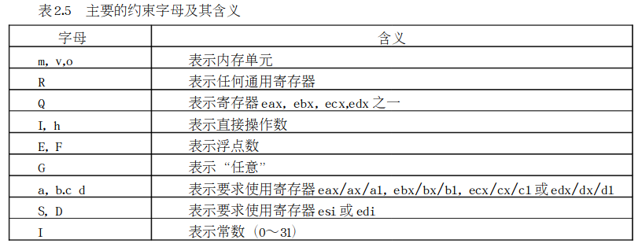
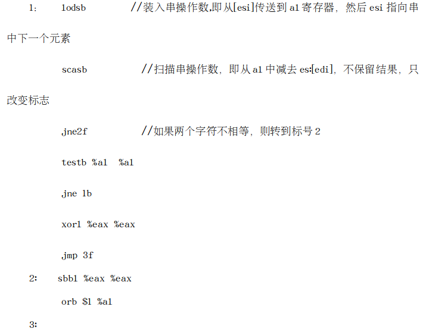

		在阅读Linux源代码时，你可能碰到一些汇编语言片段，有些汇编语言出现在以.S为扩展名的汇编文件中，在这种文件中，整个程序全部由汇编语言组成。有些汇编命令出现在以.c为扩展名的C文件中，在这种文件中，既有C语言，也有汇编语言，我们把出现在C代码中的汇编语言叫所“嵌入式”汇编。不管这些汇编代码出现在哪里，它在一定程度上都成为阅读源代码的拦路虎。

尽管C语言已经成为编写操作系统的主要语言，但是，在操作系统与硬件打交道的过程中，在需要频繁调用的函数中以及某些特殊的场合中，C语言显得力不从心，这时，繁琐但又高效的汇编语言必须粉墨登场。因此，在了解一些硬件的基础上，必须对相关的汇编语言知识也所有了解。

 读者可能有过在DOS操作系统下编写汇编程序的经历,也具备一定的汇编知识。但是，在Linux的源代码中，你可能看到了与Intel的汇编语言格式不一样的形式，这就是AT&T的386汇编语言。

# 一、AT&T与Intel汇编语言的比较

我们知道，Linux是Unix家族的一员，尽管Linux的历史不长，但与其相关的很多事情都发源于Unix。就Linux所使用的386汇编语言而言，它也是起源于Unix。Unix最初是为PDP－11开发的，曾先后被移植到VAX及68000系列的处理器上，这些处理器上的汇编语言都采用的是AT&T的指令格式。当Unix被移植到i386时，自然也就采用了AT&T的汇编语言格式，而不是Intel的格式。尽管这两种汇编语言在语法上有一定的差异，但所基于的硬件知识是相同的，因此，如果你非常熟悉Intel的语法格式，那么你也可以很容易地把它“移植“到AT&T来。下面我们通过对照Intel与AT&T的语法格式，以便于你把过去的知识能很快地“移植”过来。

## 1. 前缀

   在Intel的语法中，寄存器和和立即数都没有前缀。但是在AT&T中，寄存器前冠以“％”，而立即数前冠以“$”。在Intel的语法中，十六进制和二进制立即数后缀分别冠以“h”和“b”，而在AT&T中，十六进制立即数前冠以“0x”，表2.2给出几个相应的例子。


## 2. 操作数的方向

Intel与AT&T操作数的方向正好相反。在Intel语法中，第一个操作数是目的操作数，第二个操作数源操作数。而在AT&T中，第一个数是源操作数，第二个数是目的操作数。由此可以看出，AT&T 的语法符合人们通常的阅读习惯。


## 3. 内存单元操作数

上面的例子可以看出，内存操作数也有所不同。在Intel的语法中，基寄存器用“［］”括起来，而在AT&T中，用“（）”括起来。


## 4. 间接寻址方式

与Intel的语法比较，AT&T间接寻址方式可能更晦涩难懂一些。Intel的指令格式是segreg:[base+index*scale+disp]，而AT&T的格式是%segreg:disp(base,index,scale)。其中index/scale/disp/segreg全部是可选的，完全可以简化 掉。 如果没有指定scale而指定了index，则scale的缺省值为1。segreg段寄存器依赖于指令以及应用程序是运行在实模式还是保护模式下，在实模式下，它依赖于指令，而在保护模式下，segreg是多余的。在AT&T中，当立即数用在scale/disp中时，不应当在其前冠以“$”前缀，表2.3给出其语法及几个相应的例子。


从表中可以看出，AT&T的语法比较晦涩难懂，因为[base+index*scale+disp]一眼就可以看出其含义，而disp(base,index,scale)则不可 能做到这点。

这种寻址方式常常用在访问数据结构数组中某个特定元素内的一个字段，其中，base为数组的起始地址，scale为每个数组元素的大小，index为下标。如果数组元素还是一个结构，则disp为具体字段在结构中的位移。

## 5. 操作码的后缀

在上面的例子中你可能已注意到，在AT&T的操作码后面有一个后缀，其含义就是指出操作码的大小。“l”表示长整 数（32位）， “w”表示字（16位）， “b”表示字节（8位）。 而在Intel的语法中，则要在内存单元操作数的前面加上byte ptr、 word ptr,和dword ptr，“dword”对应“long”。表2.4给出几个相应的例子。


# 二、 AT&T汇编语言的相关知识

在Linux源代码中，以.S为扩展名的文件是“纯”汇编语言的文件。这里，我们结合具体的例子再介绍一些AT&T汇编语言的相关知识。

## 1. GNU汇编程序GAS（GNU Assembly和连 接程序

当你编写了一个程序后，就需要对其进行汇编（assembly）和连  接。在Linux下有两种方式，一种是使用汇编程序GAS和连 接程序ld，一种是使用gcc。我们先来看一下GAS和ld：

GAS把汇编语言源文件（.S）转换为目标文件（.o），其基本语法如下：

```shell
as filename.s -o filename.o
```

一旦创建了一个目标文件，就需要把它连接并执行，连接一个目标文件的基本语法为：

```shell
ld filename.o -o filename
```

这里 filename.o是目标文件名，而filename 是输出(可执行) 文件。

GAS使用的是AT&T的语法而不是Intel的语法，这就再次说明了AT&T语法是Unix世界的标准，你必须熟悉它。

如果要使用GNC的C编译器gcc，就可以一步 完成汇编和连接，例如：

```shell
gcc -o example example.S
```

  这里，example.S是你的汇编程序，输出文件（可执行文件）名为example。其中，扩展名必须为大写的S，这是因为，大写的S可以使gcc自动识别汇编程序中的C预处理命令，像#include、#define、#ifdef、 #endif等，**也就是说，使用gcc进行编译，你可以在汇编程序中使用C的预处理命令。**

## 2. AT&T中的节（Section）

  在AT&T的语法中，一个节由.section关键词来标识，当你编写汇编语言程序时，至少需要有以下三种节:

.section .data： 这种节包含程序已初始化的数据，也就是说，包含具有初值的那些变量，例如：


.section .bss: 这个节包含程序还没有初始化的数据，也就是说，包含没有初值的那些变量。当操作系统装入这个程序时将把这些变量都置为0, 例如：


当这个程序被装入时，name 和 name_len都被置为0。如果你在.bss节不小心给一个变量赋了初值，这个值也会  丢失，并且变量的值仍为0。

使用.bss比使用.data的优 势在于，.bss节不占用磁盘的空 间。在磁盘上，一个长整数就足以  存放.bss节。 **当程序被装入到内存时，操作系统也只分配 给这个节4个字节的内存大小。**

注意：编译程序把.data和.bss在4字节上对齐（align），例如，.data总共有34字节，那 么编译程序把它对其在36字节上 ，也就是说，实际给它36字节的空  间。

.section .text ：这个节包含程   序的代码，它是只读节，而.data 和.bss是读／写节。

## 3. 汇编程序指令（Assembler Directive）

上面介绍的.section就是汇编程序指令的一种，GNU汇编程序提供 了很多这样的指令（directiv），这种指令都是以句点（.）为开头，后跟指令名（小写字母），在此，我们只 介绍在  内核 源代码中出现的几个指令（以arch/i386/kernel/head.S中的代码为例）。


### 1.  .ascii "string"...

.ascii 表示零个或多个（用逗号隔开）字符串，并把每个字符串（结尾不自动加“0“字节）中的字符放在 连续的地址单元。

还有一个与.ascii类似的.asciz，z代表“0“，即每个字符串结尾自动加一个”0“字节，例如：


### 2. .byte 表达式

.byte表示零或多个表达式（用逗号隔开），每个表达式被放在下一个字节单 元

### 3. .fill 表达式

式：.fill repeat , size , value

其中，repeat、size 和value都是常量表达式。Fill的含义是反复拷贝size个字节。Repeat可以大于等  于0。size也可以大于等  于0，但不能超过8，如果超过8，也只  取8。把repeat个字节以8个为一组，每组的最高4个字节内容为0，最低4字节内容置为value。

Size和 value为可选项。 如果第二个逗号和value值不存 在，则假定value为0。如果第一个逗号和size不存在，则假定size为1。

如，在Linux初始化 的过程中，对全局描述符表GDT进行设置的最后一句为:

```assembly
.fill NR_CPUS*4,8,0             /* space for TSS's and LDT's */
```

因为每 个描述符正好占8个字节，因 此，.fill给每 个CPU留有存 放4个描述符的位置。

### 4. .globl symbol

.globl使得连接程序（ld）能够看到symbl。如果你的局部程序中定义了symbl，那么，与这个局部程序连 接的其他局部程序也能存取symbl，例如：

```assembly
.globl SYMBOL_NAME(idt)

.globl SYMBOL_NAME(gdt)
```

定义idt和gdt为全局符号。

### 5. .quad bignums

.quad 表示零个或多个　bignums(用逗号分隔)，　对于每个 bignum, 其缺省值是8字节整数。如果bignum超过8字节，则打印一个警告信息；并只取bignum 最低8字节。

例如，对全局描述符表的填充就用到这个指令：

```assembly
.quad 0x00cf9a000000ffff        /* 0x10 kernel 4GB code at 0x00000000 */
.quad 0x00cf92000000ffff        /* 0x18 kernel 4GB data at 0x00000000 */
.quad 0x00cffa000000ffff        /* 0x23 user   4GB code at 0x00000000 */
.quad 0x00cff2000000ffff        /* 0x2b user   4GB data at 0x00000000 */
```

### 6. .rept count

把.rept 指令和.endr指令之间的行重复count次，例如

```assembly
.rept 3
.long 0
.endr
```

相当于：

```assembly
.long 0
.long 0
.long 0
```

### 7. .space size, fill

这个指令保留size个字节的空间，每个字节的值为fill。　size和fill 都是常量表达式。如果逗号和fill被省略，则假定fill为0,例如在 arch/i386/bootl/setup.S　中有一句：

```assembly
.space 1024
; 表示保留　1024 字节的空间，并且每个字节的值为0
```

### 8. .word expressions

这个表达式表示任意一节中的一个或多个表达式(用逗号分开); 表达式的值占两个字节，例如：

```assembly
gdt_descr:
	.word GDT_ENTRIES*8 - 1
; 表示　变量 gdt_descr 的值为　GDT_ENTRIES * 8 - 1
```

### 9. .long expressions

这与　.word 类似：

### 10. .org new-lc, fill

把当前节的位置计数器提前到 new-lc(new location counter). new-lc 或者是一个常量表达式，或者是一个与当前子节处于同一节的表达式。也就是说，你不能用.org 横跨节：

​	如果new-lc 是个错误的值，则.org 被忽略。 .org 只能增加位置计数器的值，或者让其保持不变；但绝不能用.org来让位置计数器倒退。

​	注意,位置计数器的起始值是相对于一个节的开始的，而不是子节的开始。当位置计数器被提升后，中间位置的字节被填充值fill(这也是一个常量表达式)。如果逗号和fill都省略，则fill的缺省值为0.

```assembly
.org 0x2000
	ENTRY(pg0)
; 表示把位置计数器置为0x2000, 这个位置存放的就是临时页表pg0.
```

# 三、  Gcc嵌入式汇编

在Linux的源代码中，有很多C语言的函数中嵌入一段汇编语言程序段，这就是gcc提供的“asm”功能，例如在include/asm-i386/system.h中定义的，读控制寄存器CR0的一个宏read_cr0()：

```c
#define read_cr0() ({ \
	unsigned int __dummy; \
	__asm__( \
		"movl %%cr0,%0\n\t" \
		:"=r" (__dummy)); \
		__dummy; \
})
```

这种形式看起来比较陌生，这是因为这不是标准C所定义的形式，而是gcc 对C语言的扩充。其中_ _dummy为C函数所定义的变量；关键词_ _asm_ _表示汇编代码的开始。括弧中第一个引号中为汇编指令movl，紧接着有一个冒号，这种形式阅读起来比较复杂。

一般而言，嵌入式汇编语言片段比单纯的汇编语言代码要复杂得多，因为这里存在怎样分配  和使用寄存器，以及把C代码中的变量应该存放在 哪个寄存器中。为了达到这个目的，就必须对一般的C语言进行扩充，增加对编译器的指导作用，因此，嵌入式汇编看起来晦涩而难以读懂.

## 1. 嵌入式汇编的一般形式：

```assembly
__asm__ __volatile__ ("<asm routine>" : output : input : modify);
```

其中，__asm__表示汇编代码的开始，其后可以跟__volatile__（这是可选项），其含义是避免“asm”指令被删除、移动或组合；然 后就是小括弧，括弧中的内容是我们介绍的重点:

- "<asm routine>"为汇编指令部分，例如，"movl %%cr0,%0\n\t"。数字 前加前 缀“％“，如％1，％2等表示使用寄存器的样板操作数。可以使用的操作数总数取决于具体CPU中通用寄存器的数量，如Intel可以有8个。指令中有几个操作数，就说明有几个变量需要与寄存器结合，由gcc在编译时根据后面输出部分和输入部分的约束条件进行相应的处理。由于这些样板操作数的前缀使用了”％“，因此，在用到具体的寄存器时就在前面加两个“％”，如%%cr0。

- 输出部分（output），用以规定对输出变量（目标操作数）如何与寄存器结合的约束（constraint）,输出 部分可以有多个约束，互相以逗号分开。每个约束以“＝”开头，接着用一个字母来表示操作数的类型，然后是关于变量结合的约束 。例如，上例中：

```assembly
:"=r" (__dummy)
```

​	“＝r”表示相应的目标操作数（指令部分的%0）可以使用任何一个通用寄存器，并且变量__dummy 存放在 这个寄存器中，但如果是：

```assembly
：“＝m”（__dummy）
```

“＝m”就表示相应的目标操作数是存放在 内存单元__dummy中。

表示约束条件的字  母很多，表2－5 给出几个主要的约束字母及其含义：



- 输入部分（Input）：输入部分与输出部分相似，但没有“＝”。如果输入部分一个操作数所要求使用的寄存器，与前面输出部分某个约束所要求的是同一个寄存器，那就把对应操作数的编号（如“1”，“2”等）放在约束条件中，在后面的例子中我们会  看到这种情况。
- 修改部分（modify）:这部分常常以“memory”为约束条件，以表示操作完成后内存中的内容已有改变，如果原来某个寄存器的内容来自内存，那么现在内存中这个单元的内容已经改变。

注意，指令 部分为必选项，而输入部分、输出 部分及修改部分为可选项，当 输入部分存在，而输出部分不存在时，分号“：“要保留，当“memory”存在时，三个分号都要保留，例如system.h中的宏定义__cli()：

```c
#define __cli()                 __asm__ __volatile__("cli": : :"memory")
```

## 2. Linux源代码中嵌入式汇编举例

Linux源代码中，在arch目录下的.h和.c文件中，很多文件都涉及嵌入式汇编，下面以system.h中的C函数为例，说明嵌入式汇编的应用。

### 1.简单应用

```c
#define __save_flags(x)         __asm__ __volatile__("pushfl ; popl %0":"=g" (x):/* no input */)
    
#define __restore_flags(x)      __asm__ __volatile__("pushl %0 ; popfl": /* no output */ :"g" (x):"memory", "cc")
```

第一个宏是保存标志寄存器的值，第二个宏是恢复标志寄存器的值。第一个宏中的pushfl指令是把标志寄存器的值压栈。而popl是把栈顶的值（刚压入栈的flags）弹出  到x变量中，这个变量可  以存放在 一个寄存器或内存中。这样，你可以很容易地读懂第二个宏。

### 2. 较复 杂应用

```c
static inline unsigned long get_limit(unsigned long segment){
    unsigned long __limit;
    __asm__("lsll %1,%0":
            "=r" (__limit):
            "r" (segment));
    return __limit+1;
}
```

这是一个设置段界限的函数，汇编代码段中的输出参数为__limit（即%0），输入参数为segment（即%1）。Lsll是加载段界限的指令，即把segment段描述符中的段界限字段装入某个寄存器（这个寄存器与__limit结合），函数返回__limit加1，即段长。

### 3. 复杂使用

​    在Linux内核代码中，有关字符串操作的函数都是通过嵌入式汇编完成的，因为内核及用户程序对字符串函数的调用非常频繁，因此，用汇编代码实现主要是为了提高效率（当 然是以牺牲可  读性 和可维护性为代价的）。在此，我们仅列举一个字符串比较函数strcmp，其代码在arch/i386／string.h中。

```assembly
static inline int strcmp(const char * cs,const char * ct){
	int d0, d1;
	register int __res;
	
	__asm__ __volatile__(
		"1:\tlodsb\n\t"
		"scasb\n\t"
		"jne 2f\n\t"
		"testb %%al,%%al\n\t"
		"jne 1b\n\t"
		"xorl %%eax,%%eax\n\t"
		"jmp 3f\n"
		"2:\tsbbl %%eax,%%eax\n\t"
		"orb $1,%%al\n"
		"3:"
		:"=a" (__res), "=&S" (d0), "=&D" (d1)
		:"1" (cs),"2" (ct)
	);
	
	return __res;
	
}
```

其中的“\n”是换行符，“\t”是tab符，在每条命令的结束加这两个符号，是为了让gcc把嵌入式汇编代码翻译成一般的汇编代码时能够保证换行和留有一定的空 格。例如，上面的嵌入式汇编会被翻译成：



这段代码看起来非常熟悉，读起来也不困难。其中1f 表示往前  （forword）找到第一个标号为1的那一行 ，相应地，1b表示往后找。其中嵌入式汇编代码中输出和输入部分的结 合情况为：

返回值__res，放在al寄存器中，与%0相结 合；

局部变量d0，与％1相结合，也与输入部分的cs参数相对应，也存放在寄存器ESI中，即ESI中存放源 字符串的起始地址。

局部变量d1， 与％2相结合，也与输入部分的ct参数相对应，也存放在寄存器EDI中，即EDI中存放目的字符串的起始地址。

通过对这段代码的分析我们应当体会到，万变不离其本，嵌入式汇编与一般汇编的区别仅仅是形式，本质依然 不变。  因此，全面掌握Intel 386 汇编指令乃突破阅读低层代码之根本。

