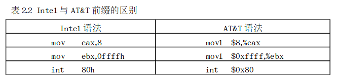
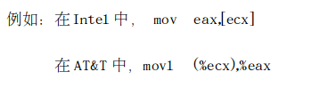
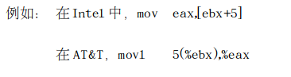
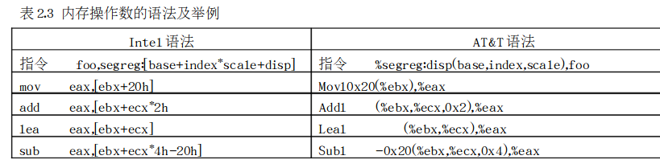
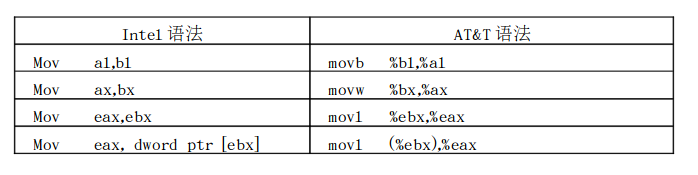
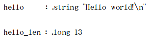
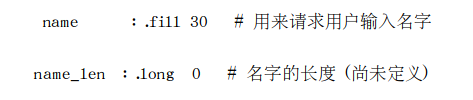
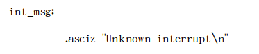

​		在阅读Linux源代码时，你可能碰到一些汇编语言片段，有些汇编语言出现在以.S为扩展名的汇编文件中，在这种文件中，整个程序全部由汇编语言组成。有些汇编命令出现在以.c为扩展名的C文件中，在这种文件中，既有C语言，也有汇编语言，我们把出现在C代码中的汇编语言叫所“嵌入式”汇编。不管这些汇编代码出现在哪里，它在一定程度上都成为阅读源代码的拦路虎。

尽管C语言已经成为编写操作系统的主要语言，但是，在操作系统与硬件打交道的过程中，在需要频繁调用的函数中以及某些特殊的场合中，C语言显得力不从心，这时，繁琐但又高效的汇编语言必须粉墨登场。因此，在了解一些硬件的基础上，必须对相关的汇编语言知识也所有了解。

 读者可能有过在DOS操作系统下编写汇编程序的经历,也具备一定的汇编知识。但是，在Linux的源代码中，你可能看到了与Intel的汇编语言格式不一样的形式，这就是AT&T的386汇编语言。

# 一、AT&T与Intel汇编语言的比较

我们知道，Linux是Unix家族的一员，尽管Linux的历史不长，但与其相关的很多事情都发源于Unix。就Linux所使用的386汇编语言而言，它也是起源于Unix。Unix最初是为PDP－11开发的，曾先后被移植到VAX及68000系列的处理器上，这些处理器上的汇编语言都采用的是AT&T的指令格式。当Unix被移植到i386时，自然也就采用了AT&T的汇编语言格式，而不是Intel的格式。尽管这两种汇编语言在语法上有一定的差异，但所基于的硬件知识是相同的，因此，如果你非常熟悉Intel的语法格式，那么你也可以很容易地把它“移植“到AT&T来。下面我们通过对照Intel与AT&T的语法格式，以便于你把过去的知识能很快地“移植”过来。

## 1. 前缀

   在Intel的语法中，寄存器和和立即数都没有前缀。但是在AT&T中，寄存器前冠以“％”，而立即数前冠以“$”。在Intel的语法中，十六进制和二进制立即数后缀分别冠以“h”和“b”，而在AT&T中，十六进制立即数前冠以“0x”，表2.2给出几个相应的例子。



## 2. 操作数的方向

Intel与AT&T操作数的方向正好相反。在Intel语法中，第一个操作数是目的操作数，第二个操作数源操作数。而在AT&T中，第一个数是源操作数，第二个数是目的操作数。由此可以看出，AT&T 的语法符合人们通常的阅读习惯。



## 3. 内存单元操作数

上面的例子可以看出，内存操作数也有所不同。在Intel的语法中，基寄存器用“［］”括起来，而在AT&T中，用“（）”括起来。



## 4. 间接寻址方式

与Intel的语法比较，AT&T间接寻址方式可能更晦涩难懂一些。Intel的指令格式是segreg:[base+index*scale+disp]，而AT&T的格式是%segreg:disp(base,index,scale)。其中index/scale/disp/segreg全部是可选的，完全可以简化 掉。 如果没有指定scale而指定了index，则scale的缺省值为1。segreg段寄存器依赖于指令以及应用程序是运行在实模式还是保护模式下，在实模式下，它依赖于指令，而在保护模式下，segreg是多余的。在AT&T中，当立即数用在scale/disp中时，不应当在其前冠以“$”前缀，表2.3给出其语法及几个相应的例子。



从表中可以看出，AT&T的语法比较晦涩难懂，因为[base+index*scale+disp]一眼就可以看出其含义，而disp(base,index,scale)则不可 能做到这点。

这种寻址方式常常用在访问数据结构数组中某个特定元素内的一个字段，其中，base为数组的起始地址，scale为每个数组元素的大小，index为下标。如果数组元素还是一个结构，则disp为具体字段在结构中的位移。

## 5. 操作码的后缀

在上面的例子中你可能已注意到，在AT&T的操作码后面有一个后缀，其含义就是指出操作码的大小。“l”表示长整 数（32位）， “w”表示字（16位）， “b”表示字节（8位）。 而在Intel的语法中，则要在内存单元操作数的前面加上byte ptr、 word ptr,和dword ptr，“dword”对应“long”。表2.4给出几个相应的例子。



# 二、 AT&T汇编语言的相关知识

在Linux源代码中，以.S为扩展名的文件是“纯”汇编语言的文件。这里，我们结合具体的例子再介绍一些AT&T汇编语言的相关知识。

## 1. GNU汇编程序GAS（GNU Assembly和连 接程序

当你编写了一个程序后，就需要对其进行汇编（assembly）和连  接。在Linux下有两种方式，一种是使用汇编程序GAS和连 接程序ld，一种是使用gcc。我们先来看一下GAS和ld：

GAS把汇编语言源文件（.S）转换为目标文件（.o），其基本语法如下：

```shell
as filename.s -o filename.o
```

一旦创建了一个目标文件，就需要把它连接并执行，连接一个目标文件的基本语法为：

```shell
ld filename.o -o filename
```

这里 filename.o是目标文件名，而filename 是输出(可执行) 文件。

GAS使用的是AT&T的语法而不是Intel的语法，这就再次说明了AT&T语法是Unix世界的标准，你必须熟悉它。

如果要使用GNC的C编译器gcc，就可以一步 完成汇编和连接，例如：

```shell
gcc -o example example.S
```

  这里，example.S是你的汇编程序，输出文件（可执行文件）名为example。其中，扩展名必须为大写的S，这是因为，大写的S可以使gcc自动识别汇编程序中的C预处理命令，像#include、#define、#ifdef、 #endif等，**也就是说，使用gcc进行编译，你可以在汇编程序中使用C的预处理命令。**

## 2. AT&T中的节（Section）

  在AT&T的语法中，一个节由.section关键词来标识，当你编写汇编语言程序时，至少需要有以下三种节:

.section .data： 这种节包含程序已初始化的数据，也就是说，包含具有初值的那些变量，例如：



.section .bss: 这个节包含程序还没有初始化的数据，也就是说，包含没有初值的那些变量。当操作系统装入这个程序时将把这些变量都置为0, 例如：



当这个程序被装入时，name 和 name_len都被置为0。如果你在.bss节不小心给一个变量赋了初值，这个值也会  丢失，并且变量的值仍为0。

使用.bss比使用.data的优 势在于，.bss节不占用磁盘的空 间。在磁盘上，一个长整数就足以  存放.bss节。 **当程序被装入到内存时，操作系统也只分配 给这个节4个字节的内存大小。**

注意：编译程序把.data和.bss在4字节上对齐（align），例如，.data总共有34字节，那 么编译程序把它对其在36字节上 ，也就是说，实际给它36字节的空  间。

.section .text ：这个节包含程   序的代码，它是只读节，而.data 和.bss是读／写节。

## 3. 汇编程序指令（Assembler Directive）

上面介绍的.section就是汇编程序指令的一种，GNU汇编程序提供 了很多这样的指令（directiv），这种指令都是以句点（.）为开头，后跟指令名（小写字母），在此，我们只 介绍在  内核 源代码中出现的几个指令（以arch/i386/kernel/head.S中的代码为例）。


### 1.  .ascii "string"...

.ascii 表示零个或多个（用逗号隔开）字符串，并把每个字符串（结尾不自动加“0“字节）中的字符放在 连续的地址单元。

还有一个与.ascii类似的.asciz，z代表“0“，即每个字符串结尾自动加一个”0“字节，例如：



### 2. .byte 表达式

.byte表示零或多个表达式（用逗号隔开），每个表达式被放在下一个字节单 元

### 3. .fill 表达式

式：.fill repeat , size , value

其中，repeat、size 和value都是常量表达式。Fill的含义是反复拷贝size个字节。Repeat可以大于等  于0。size也可以大于等  于0，但不能超过8，如果超过8，也只  取8。把repeat个字节以8个为一组，每组的最高4个字节内容为0，最低4字节内容置为value。

Size和 value为可选项。 如果第二个逗号和value值不存 在，则假定value为0。如果第一个逗号和size不存在，则假定size为1。

如，在Linux初始化 的过程中，对全局描述符表GDT进行设置的最后一句为:

```assembly
.fill NR_CPUS*4,8,0             /* space for TSS's and LDT's */
```


