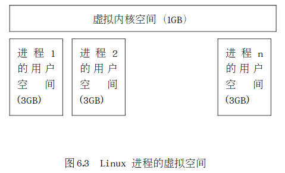
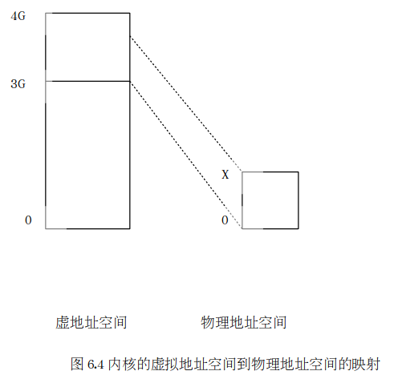
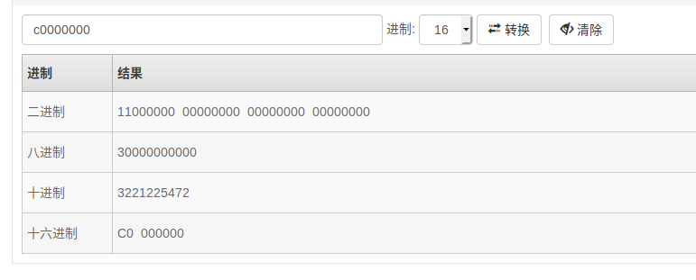

以上几讲我们知道，Linux简化了分段机制，使得虚拟地址与线性地址总是一致，因此，Linux的虚拟地址空间也为0～4G。Linux内核将这4G字节的空间分为两部分。将最高的1G字节（从虚拟地址0xC0000000到0xFFFFFFFF），供内核使用，称为“内核空间”。而将较低的3G字节（从虚拟地址0x00000000到0xBFFFFFFF），供各个进程使用，称为“用户空间）。因为每个进程可以通过系统调用进入内核，因此，Linux内核由系统内的所有进程共享。于是，从具体进程的角度来看，每个进程可以拥有4G字节的虚拟空间。图 6.3 给出了进程虚拟空间示意图。



Linux使用两级保护机制：0级供内核使用，3级供用户程序使用。从图中可以看出，每个进程有各自的私有用户空间（0～3G），这个空间对系统中的其他进程是不可见的。最高的1GB字节虚拟内核空间则为所有进程以及内核所共享。

## 1. 虚拟内核空间到物理空间的映射

​	内核空间中存放的是内核代码和数据，而进程的用户空间中存放的是用户程序的代码和数据。不管是内核空间还是用户空间，它们都处于虚拟空间中。读者会问，系统启动时，内核的代码和数据不是被装入到物理内存吗？它们为什么也处于虚拟内存中呢？这和编译程序有关，后面我们通过具体讨论就会明白这一点。

虽然内核空间占据了每个虚拟空间中的最高1GB字节，但映射到物理内存却总是从最低地址（0x00000000）开始。如图6.4所示，对内核空间来说，其**地址映射是很简单的线性映射**，**0xC0000000就是物理地址与线性地址之间的位移量**，在Linux代码中就叫做PAGE_OFFSET。



我们来看一下在include/asm-i386/page.h中对内核空间中地址映射的说明及定义：

```c
// page.h 
/*
 * This handles the memory map.. We could make this a config
 * option, but too many people screw it up, and too few need
 * it. 它处理内存映射。。我们可以把它设为配置选项，但太多人搞砸了，太少人需要它。
 *
 * A __PAGE_OFFSET of 0xC0000000 means that the kernel has
 * a virtual address space of one gigabyte, which limits the
 * amount of physical memory you can use to about 950MB. 
 *页面偏移量0xc000000意味着内核的虚拟地址空间为1 GB，这将可以使用的物理内存量限制在950MB左右。
 
 
 * If you want more physical memory than this then see the CONFIG_HIGHMEM4G
 * and CONFIG_HIGHMEM64G options in the kernel configuration.                            如果需要更多的物理内存，请参阅内核配置中的CONFIG_HIGHMEM4G和CONFIG_HIGHMEM64G选项。
 
 */


#define __PAGE_OFFSET       (0xC0000000)

#define PAGE_OFFSET     ((unsigned long)__PAGE_OFFSET)

// x 为虚拟地址　　　　　　虚拟地址　- 3G  就是物理地址 (映射关系)
#define __pa(x)         ((unsigned long)(x)-PAGE_OFFSET)                         

// x 为物理地址			物理地址　+ 3G 就是虚拟地址
#define __va(x)         ((void *)((unsigned long)(x)+PAGE_OFFSET))

```



0xc000 0000 == 3G

源代码的注释中说明，如果你的物理内存大于950MB，那么在编译内核时就需要加CONFIG_HIGHMEM4G和CONFIG_HIGHMEM64G选项，这种情况我们暂不考虑。如果物理内存小于950MB，则对于内核空间而言，给定一个虚地址x，其物理地址为“x-PAGE_OFFSET”，给定一个物理地址x，其虚地址为“x+ PAGE_OFFSET”。

这里再次说明，宏__pa()仅仅把一个内核空间的虚地址映射到物理地址，而决不适用于用户空间，用户空间的地址映射要复杂得多。

## 2. 内核映像

下面的描述中，我们把内核的代码和数据就叫内核映像（kernel image）。当系统启动时，Linux内核映像被安装在物理地址0x00100000开始的地方，即1MB开始的区间(低1M留作它用)。然而，在正常运行时， 整个内核映像应该在虚拟内核空间中，因此，连接程序(编译链接的链接ld)在连接内核映像时，在所有的符号地址上加一个偏移量PAGE_OFFSET，这样，内核映像在内核空间的起始地址就为0xC0100000。

例如，进程的页目录PGD（属于内核数据结构）就处于内核空间中。在进程切换时，要将寄存器CR3设置成指向新进程的页目录PGD，而该目录的起始地址在内核空间中是虚地址，但CR3所需要的是物理地址，这时候就要用__pa()进行地址转换。在mm_context.h中就有这么一行语句：

```assembly
asm volatile(“movl %0,%%cr3”: :”r” (__pa(next->pgd));
```

这是一行嵌入式汇编代码，其含义是将下一个进程的页目录起始地址next_pgd，通过__pa()转换成物理地址，存放在某个寄存器中，然后用mov指令将其写入CR3寄存器中。经过 这行语句的处理，CR3就指向新进程next的页目录表PGD了。

