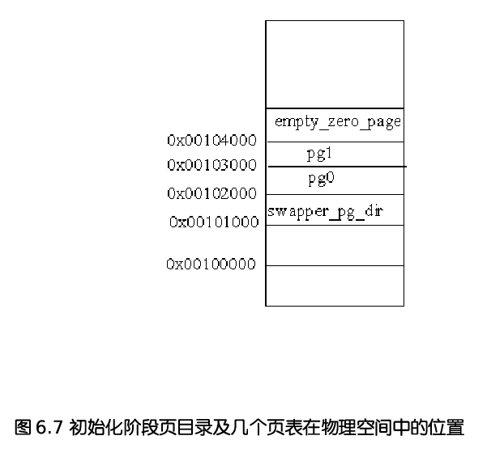

在内存管理(MM)的各种机制介绍之前，首先需要对ＭＭ的初始化过程有所了解，以下介绍的内容是以分段和分页机制为基础的，因此，读者应该先温习前几讲相关的内容。因为在嵌入式操作系统的开发中，内存的初始化是重点关注的内容之一，因此本讲对内存的初始化给予详细的讲解。

# 1. 启用分页机制

当linux启动时，首先运行在实模式下，随后就要转到保护模式下运行。因为在第二章段机制中，我们已经介绍了linux对段的设置，在此我们主要讨论与分页机制相关的问题。

linux内核代码的入口点在　arch/i386/kernel/head.S 中　startup_32

## 1. 页表的初始化：

```c
/*
 * The page tables are initialized to only 8MB here - the final page
 * tables are set up later depending on memory size.
 */
.org 0x2000
ENTRY(pg0)                                                                                                                                            

.org 0x3000
ENTRY(pg1)
    
    
/*
 * empty_zero_page must immediately follow the page tables ! (The
 * initialization loop counts until empty_zero_page)                                                                                                  
 */

.org 0x4000
ENTRY(empty_zero_page)   
    
 //------------------------------------
 /*
 * Initialize page tables
 */
#define INIT_PAGE_TABLES \
    movl $pg0 - __PAGE_OFFSET, %edi; \
    /* "007" doesn't mean with license to kill, but PRESENT+RW+USER */ \
    movl $007, %eax; \
2:  stosl; \ 
/*将　eax中的值，自动保存在　ES:EDI指向的地址中，　若设置了EFLAGS中的方向位置位(即在STOSL指令前使用STD指令)则EDI自减4，否则(使用CLD指令)EDI自增4；*/

    add $0x1000, %eax; \
    cmp $empty_zero_page - __PAGE_OFFSET, %edi; \
    jne 2b;　/*不相等才跳转*/
```

内核的这段代码执行时，因为页机制还没有启用，还没有进入保护模式，因此指令寄存器EIP中的地址还是物理地址，但因为pg0中存放的是虚拟地址(想想gcc编译内核以后形成的符号地址是虚拟地址)，因此"$pg0 - __PAGE_OFFSET" 获得pg0的物理地址，可见pg0存放在相对于内核代码起点为0x2000的地方，即物理地址为0x00102000, 而pg1的物理地址则为0x00103000。 （内核的img，被搬移物理地址1M的地方）。　pg0 和 pg1 这两个页表中的页项则依次被设置为0x007 0x1007 0x2007 等。其中最低的三位均为1, 表示这两个页为用户页，可写，且页的内容中(参见图2.24)。　所映射的物理页的基地址则为　0x0、　0x1000、　0x2000等，也就是物理内存中的页面0 1 2 3 等等，共映射2k个页面，即8MB的存储空间。由此可以看出，linux内核对物理内存的最低要求为8MB.紧接着存放的是empty_zero_page页(即零页)，零页存放的是系统启动参数和命令行参数，具体内容参见第十三章。

## 2. 启用分页机制

```assembly
; arch/i386/kernel/head.S:385


/*
 * This is initialized to create an identity-mapping at 0-8M (for bootup
 * purposes) and another mapping of the 0-8M area at virtual address
 * PAGE_OFFSET.
 */
.org 0x1000
ENTRY(swapper_pg_dir)                                                                                                                                                                                              
    .long 0x00102007
    .long 0x00103007
    .fill BOOT_USER_PGD_PTRS-2,4,0
    /* default: 766 entries */
    .long 0x00102007
    .long 0x00103007
    /* default: 254 entries */
    .fill BOOT_KERNEL_PGD_PTRS-2,4,0


/*
 * Enable paging
 */
3:
    movl $swapper_pg_dir-__PAGE_OFFSET,%eax
    movl %eax,%cr3      /* set the page table pointer.. */
    movl %cr0,%eax
    orl $0x80000000,%eax
    movl %eax,%cr0      /* ..and set paging (PG) bit */
    jmp 1f          /* flush the prefetch-queue */
1:
    movl $1f,%eax
    jmp *%eax       /* make sure eip is relocated */
1:
    /* Set up the stack pointer */
    lss stack_start,%esp

```

​	我们先看这段代码的功能。这段代码就是把页目录 swapper_pg_dir 的物理地址装入控制器cr3，并把cr0中的最高位设置为1,这就开启了分页机制。

​	但是启动了分页机制，并不说明linux内核真正进入保护模式，因此此时，指令寄存器 EIP 中的地址还是物理地址，而不是虚拟地址。　"jmp 1f" 指令从逻辑上说不起什么作用，但是，从功能上说它起到丢弃　指令流水中内容的作用(这是intel 在i386技术资料中所建议的)，因为这是一个短跳转， EIP中还是物理地址。紧接着的mov 和　jmp　指令把第二个标号为1的地址装入　EAX 寄存器并跳转到那儿。在这两条指令执行的过程中，EIP　还是指向物理地址　"1MB + 某处"。因为编译程序使所有的符号地址都在虚拟内存空间中，因此，第二个标号1 的地址就在虚拟内存空间的某处((PAGE_OFFSET + 某处))，于是，jmp指令执行以后，EIP就指向虚拟内核空间的某个地方，这就使cpu转入了内核空间，从而完成了从实模式到保护模式的平稳过度。

​	然后再看页目录swapper_pg_dir 中的内容。从前面的讨论我们知道pg0　和 pg1 这两个页表的起始物理地址风别为　0x0010 2000 和 0x0010 3000 。从图2.22可知，页目录项的最低12 位用来描述页表的属性。因此，在swapper_pg_dir 中的第0和第1个目录项0x00102007 0x00103007, 就表示pg0和pg1这两个页表是用户页表、可写且页表的内容在内存。

​	接着，把swapper_pg_dir 中的　第 2~767 共766个目录项全部设置为0。因为一个页表的大小为4KB,每个表项占4个字节，即每个页表含有1024个表项，每个页的大小也为4kb, 因此这768个目录项所映射的虚拟空间为 768x1024x4k = 3G  (768个页表项，每个页表项代表一个页表，每个页表（二级页表）中又有1024个页表，每个页表表示4kb 大小)。也就是swapper_pg_dir表中的前768个目录项映射的是用户空间。

​	最后，在第768和769个目录项中又存放pg0和pg1这两个页表的地址和属性，而把第770~1024共254个目录项设置为0。这256个目录项所映射的虚拟地址空间为256x1024x4k = 1G, 也就是swapper_pg_dir表中的后256个目录项映射的是内核空间。

​	由此可以看出，在初始的页目录swapper_pg_dir中，用户空间和内核空间都只映射了开头的两个目录，即8MB的空间，而且有着相同的映射，如图6.6所示。


​	读者会问，内核开始运行后运行在内核空间，那么，为什么把用户空间的低区(8M)也进行映射，而且和内核空间低区的映射相同? 简而言之，是为了从实模式到保护模式的平稳过渡。具体地说，当cpu进入内核代码的起点　startup_32后，是以物理地址来取指令的。在这种情况下，如果页目录只映射内核空间，而不映射用户空间的低区，则一旦开启页映射机制以后，就不能继续执行了，这是因为，此时cpu中的指令寄存器EIP任指向低区，任会以物理地址取指令，直到以某个符号地址为目标作绝地转移或调用子程序为止。所以，linux内核就采取了上述的解决办法。

​	但是，在cpu转入内核空间以后，应该把用户空间低区的映射清除掉。后续读者会看到，页目录swapper_pg_dir经扩充后就成为所有内核线程的页目录。在内核线程的正常运行中，处于内核态的cpu是不应该通过用户空间的虚拟地址访问内存的。清除了低区的映射以后，如果发生cpu在内核中通过用户空间的虚拟地址访问内存，就可以因为产生页面异常而捕获这个错误。

## 3. 物理内存的初始分布

​	经过这个阶段的初始化，初始化阶段页目录及几个页表在物理空间中的位置如图6.7所示：



​	其中empty_zero_page 中存放的是在操作系统的引导过程中所收集的一些数据，叫引导参数。因为这个页面开始的内容全为0,所以叫做零页，代码中常常通过宏定义ZERO_PAGE来引用这个页面。不过，这个页面要到初始化完成，系统转入正常运行时才会用到。为了后面内容介绍的方便，我们看一下复制到这个页面中的命令行参数和引导参数。这里假定这些参数已被复制到"零页",在setup.c中定义里引用这些参数的宏：

```shell
include/asm-i386/pgtable.h:32:
#define ZERO_PAGE(vaddr) (virt_to_page(empty_zero_page))
```

```c
// linux-2.6.0$ vim include/asm-i386/setup.h +31
/*
 * This is set up by the setup-routine at boot-time
 */
#define PARAM   ((unsigned char *)empty_zero_page)
#define SCREEN_INFO (*(struct screen_info *) (PARAM+0))
#define EXT_MEM_K (*(unsigned short *) (PARAM+2))
#define ALT_MEM_K (*(unsigned long *) (PARAM+0x1e0))
#define E820_MAP_NR (*(char*) (PARAM+E820NR))
#define E820_MAP    ((struct e820entry *) (PARAM+E820MAP))
#define APM_BIOS_INFO (*(struct apm_bios_info *) (PARAM+0x40))
#define IST_INFO   (*(struct ist_info *) (PARAM+0x60))
#define DRIVE_INFO (*(struct drive_info_struct *) (PARAM+0x80))
#define SYS_DESC_TABLE (*(struct sys_desc_table_struct*)(PARAM+0xa0))           

#define MOUNT_ROOT_RDONLY (*(unsigned short *) (PARAM+0x1F2))
#define RAMDISK_FLAGS (*(unsigned short *) (PARAM+0x1F8))
#define VIDEO_MODE (*(unsigned short *) (PARAM+0x1FA))
#define ORIG_ROOT_DEV (*(unsigned short *) (PARAM+0x1FC))
#define AUX_DEVICE_INFO (*(unsigned char *) (PARAM+0x1FF))
#define LOADER_TYPE (*(unsigned char *) (PARAM+0x210))
#define KERNEL_START (*(unsigned long *) (PARAM+0x214))
#define INITRD_START (*(unsigned long *) (PARAM+0x218))
#define INITRD_SIZE (*(unsigned long *) (PARAM+0x21c))
#define EDID_INFO   (*(struct edid_info *) (PARAM+0x440))
#define EDD_NR     (*(unsigned char *) (PARAM+EDDNR))
#define EDD_BUF     ((struct edd_info *) (PARAM+EDDBUF))
#define COMMAND_LINE ((char *) (PARAM+2048))
#define COMMAND_LINE_SIZE 256
```

​	其中宏 PARAM 就是　empty_zero_page 的起始位置，随着代码的阅读，读者会逐渐理解这些参数的用途。这里要特别对宏　E820_MAP 进行说面。　E820_MAP 是个　struct e820 entry 数据结构的指针，存放在参数块中位移为0x2d0 的地方。这个数据结构定义在　

include/i386/e820.h 中:

```c
#define E820MAX 128     /* number of entries in E820MAP */ 
#define E820_X_MAX E820MAX
#define E820NR  0x1e8       /* # entries in E820MAP */


struct e820entry {                                    
    __u64 addr; /* start of memory segment */
    __u64 size; /* size of memory segment */
    __u32 type; /* type of memory segment */
} __attribute__((packed));

struct e820map {
    __u32 nr_map;
    struct e820entry map[E820_X_MAX];
};
```

​	其中　E820MAX 被定义为128. 从这个数据结构的定义可以看出，每个e820entry都是对一个物理区间的描述，并且一个物理区间必须是同一类型。如果有一片地址连续的物理内存空间，其一部分是RAM, 而另外一部分是ROM,那就要分成两个区间。即使同属RAM, 如果其中一部分要保留用于特殊目的，那也属于不同的一个分区。在e820.h　文件中定义了4种不同的类型：

```c
#define E820_RAM    1                                       
#define E820_RESERVED   2
#define E820_ACPI   3
#define E820_NVS    4
#define E820_UNUSABLE   5
#define E820_PMEM   7


#define HIGH_MEMORY (1024*1024)
```

E820_NVS 表示　"Non-volatile storage", 即 "不挥发"存储器，包括ROM、EPROM、Flash 存储器等。

​	在pc中，　对于最初1MB存储空间的使用是特殊的。　开头640kb（0x0 ~ 0x9FFFF 为RAM）, 从0xA0000 开始的空间则用于CGA、EGA、VGA等图形卡。现在已经很少使用这些图形卡，但是不管是什么图形卡，开机时总是工作于　EGA或VGA模式。从0xF0000开始到0xFFFFF, 即最高的4KB ,就是在EPROM或Flash存储器中的BIOS.所以，只要有BIOS存在，就至少有两个区间，如果nr_map小于２，那就一定出错了。由于BIOS的存在，本来连续的RAM空间就不连续了。当然，现在已经不存在这样的存储结构了。1MB的边界早已被突破，但因为历史的原因，把1MB以上的空间定义为　"HIGH_MEMORY", 这个称呼一直沿用到现在，于是代码中的常数 HIGH_MEMORY 就定义为 1024x1024. 现在，配备了　128MB的内存已经是很普遍了。但是，为了保持兼容，就得留出最初1MB的空间。

​	这个阶段初始化后，物理内存中内核镜像的分布如图6.8所示：


​	符号 _text 对应物理地址　0x0010 0000, 表示内核代码的第一个字节的地址。内核代码的结束位置用另一个类似的符号 _etext 表示。内核数据被分为两组：初始化过的数据和未初始化过的数据。初始化过的数据在 _etext　后开始，在 _edata 处结束，紧接着是未初始化过的数据，其结束符为 _end, 这也是整个内核镜像的结束符号

​	图中出现的符号是由编译程序在编译内核时产生的。你可以在 System.map　文件中　找到这些符号的线性地址(或叫虚拟地址)，　System.map 是编译内核以后所创建的。