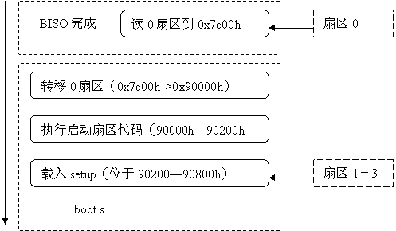
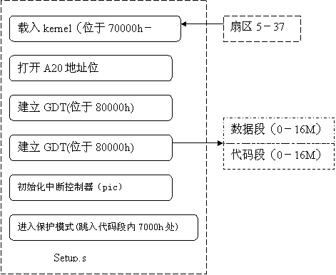
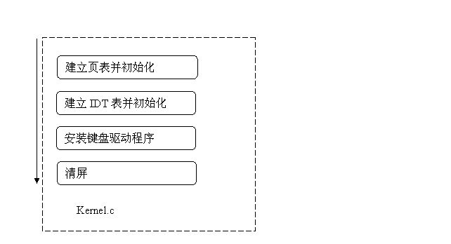

# I386体系结构（下）

上半期我们一起学习了I386体系结构，下半期我们的主要目标是实现一个能启动而且可以进入保护模式的简易操作系统。所以本期首先来分析一下计算机的启动流程，然后着手学习开发一个基于I386体系的可启动系统。

 

## 一、启动流程

​    我们先来分析系统的启动流程吧！

### 1．硬件准备

计算机加电的瞬间，整个系统包括RAM在内的几乎所有部件，都处于一种随机的混乱状态，所以根本谈不上做什么实际工作。因此，启动机器首先得将系统带出这种黑暗和混乱的状态。。

硬件在这个时候必须责无旁贷，挺身而出。启动一开始，硬件系统(是主板吧!)就会给CPU的Reset的管脚发送一个信号，促使CPU将自己的主要寄存器(包括cs和eip)设置为启动状态──实际上就是把这些寄存器的内容设置成一些预定值（cs=F00h,eip=FFF0h）。我们都知道指令寄存器(eip)决定系统下一步要执行什么，所以指令寄存器被预置成一个固定值，那么该固定位置上的指令就会被执行――在这里eip指向了位于物理地址0xFFFFFFF0上的指令，所以该指令便作为系统加电后执行第一条指令了。

硬件系统通常会把一个只读芯片的存储区映射到这个位置上（0xFFFFFFF0）──这种芯片一般来说就是ROM。所以ROM中存放的程序就会被调用执行――换句话说就是机器加电后首先执行ROM中存放的程序，传统上称该程序为BIOS(Basic   Input/Output System)。

### 2．BIOS的作用

按照启动流程，该谈谈BIOS了。

BIOS是固化在机器ROM芯片中的一小片程序，在机器启动后会首先执行这片代码。那么这段代码到底是做什么的呢？为何要首先执行它呢？

​     

​     要回答这个问题，就要想想计算机的启动过程。也许你会不加思索地回答说，启动就是计算机从磁盘里调入操作系统，然后开始运行它。豪无疑问，你的回答是正确的，但是你忽略了一点――机器发现磁盘，找到操作系统在磁盘中位置这个“小”过程。显然，这个过程不能借助于磁盘中的程序来完成，因为还没找到磁盘啦，所以机器自己必须“留一手”，用本身“自带”的程序来找磁盘，读磁盘数据。这一手就是BISO中的程序片。

​     别小看这小片程序，它可是关系到系统能否正常启动的关键数据呀，所以必须保护它不会被篡改，这也正是为什么要把它固化在 ROM中的原因。一般情况下BIOS中的数据不会被破坏，但也有些特例，比如陈英豪搞的CIH病毒，这个可恶的病毒会破坏BISO数据(只能破坏那些可写入的几款BISO)，造成你的系统无法启动。      

​    具体地讲，BISO 中的程序包含POST(加电自检)、开机菜单设置、装载引导扇区和 BISO中断等几部分程序片。

l          POST会在开机后首先运行，去检测内存大小和初始化硬件设备。对于基于PCI总线的体系结构，这个过程很关键，因为只能通过这个过程来保证所有的硬件设备不会因为中断或I/O端口等资源发生冲突。这个过程完成时，会在屏幕上显示系统中PCI设备的清单。

l          接着启动菜单(setup menu)被执行。启动菜单程序为用户提供设置系统参数(如时钟，启动设备等)的配置界面(多数情况下,用户开机时按下”DEL”键盘,会进入配置界面)。

l          再下来就是从启动设备中装载**引导扇区****(****第0****个扇区****),****即加载第****0****个扇区****,**载入位置固定在0000:7C00处（这是个默认的规定）。

l          而ROM中的 BISO中断程序则是用来控制屏幕、键盘、磁盘驱动、串口等简单驱动设备的。引导扇区被载入时就会很频繁地调用这些中断来读取磁盘扇区数据  (这些中断在系统启动后,不一定再继续被使用,比如Linux系统中就会重写这些中断程序,不过也有系统仍然使用BISO中断,比如DOS系统)。 

​    总结一下，BISO首先会执行自检程序,然后可按用户需要进入启动菜单进行系统配置;如果不需要配置则去启动设备载入引导扇区。到此BISO的任务完成了,剩下的启动任务都交接给引导扇区中程序去继续完成吧。总而言之,BISO要做的就是找到启动设备(启动分区所在设备),然后从中读取第0个扇区(启动扇区了)就OK了。 

现在问题到了启动扇区了。启动扇区安排在磁盘(软盘或硬盘)的第一个扇区,大小为512个字节,它的标志是末尾两位是0x55和0xAA――**BISO当检测到这两个字节时,**就会跳转到0000:7C00处执行（如果没检测到，自然不跳了）。 

从0000:7C00地址开始,启动任务交给了启动装载(boot loader)程序继续完成,该程序负责将操作系统内核载入系统并完成必须的初始化工作,再把执行权交给操作系统运行。

启动程序包含两部分内容：

l    启动扇区程序(boot sector   program)

存于启动设备第0个扇区中的代码被称为启动扇区程序,它占有512个字节,最后两个字为0x55和0xAA，512字节内未用部分填充0。这片程序很小,所以功能只限于抛砖引玉――加载**下一****阶段程序**（通常情况,不绝对! 有时会加载另一个启动扇区程序,比如MBR里的引导扇区；有时可以直接载入紧接着启动扇区的内核,即位于第1个扇区的内核）

l           第二阶段程序[[1\]](http://www.kerneltravel.net/journal/ii/part2.htm#_ftn1)(second stage program)

第二阶段程就是上面所提到的下一阶段程序，它一般紧跟着启动扇区程序存放(编译时指定)在磁盘。当它被载入内存后,接着就会被执行。第二阶段程序主要负责――加载内核到内存――然后――进行必要的初始化工作，为内核运行做准备。具体要做的工作主要是为进入保护模式作初始化工作。       

### 3．进入保护模式

到了谈谈进入保护模式的时候了！

保护模式并不是你想进就能进入的，在进入之前你必须作些准备：

\1.         建立一个可用的全局描述符号表GDT，这个表里最好能填入系统所要使用的代码和数据段描述符号。

\2.       关闭中断。别在进入保护模式时被外界打断。

\3.      将GDT装入GDTR寄存器（原因自己去看书吧）。

\4.     设置机器状态寄存器MSW   的PE位，表示开启保护模式。

\5.       将数据段和堆栈段选择子装入到DS段寄存器中。

\6.       进行一个远跳转(装入CS 和IP/EIP) 来将32位的代码选择子装入CS,至此进入保护模式。

 

​     进行跳转是为了清除芯片上的预取指令及译码序列,因为PE置位后,机器从实地址方式转入了保护方式,而预取及译码的指令不再有效,为了避免机器错误寻址,必须进行一条段间跳转指令,来废弃预取的译码序列。

 

到此为止，内核运行环境才被真正建立起来了，内核主程序要做的事情剩下初始化页表（启动分页机制，映射内存）、初始化系统中断\异常表等（建造IDT，设置中断、异常入口）、初始化设备（注册设备驱动程序，初始化外设）、启动网络、文件系统等等，总之是为运行应用程序继续做准备工作（有关内核启动后的工作可参见第一期的第四部分中初始化基本的操作环境一节）。

 

## 二.简易操作系统代码

好了，多说无益，我们一定要把上面的概念反映到代码里来理解！下面我们就来看看怎样开发一个可启动的操作系统吧！ 

我们参照Linux系统的代码组织结构来开发一个小小的操作系统（准确地说它不是操作系统，它仅仅走了一个简易的系统启动流程），它能带你进入保护模式，完成一些系统需要的初始化工作，然后能给你一个启动后通常能见到的假界面――因为该界面还不能和你交互，所以说是个假界面（没有实现SHELL等功能）――我们希望通过该系统能让大家实地感受一下系统启动的过程，也希望通过这个过程能让大家认识操作系统的原始开发过程。 

和Linux一样我们将试验系统（就叫它SagaLinux吧）的启动部分代码分为boot.s(引导扇区中的汇编代码[[2\]](http://www.kerneltravel.net/journal/ii/part2.htm#_ftn2)，负责载入setup.s到内存――就是**启动扇区程序**)和setup.s（负责继续载入内核，并进行一定初始化和进入保护模式――就是***第二阶段程序***）两部分，而且将它们置于boot目录下；也和linux一样，我们将内核代码仍叫作kernel.c，并将它置于目录kernel下，它的功能弱得只能用来演示流程，而没有任何实际用途――它建立了4个页表，映射16M空间；初始化了中断表；注册了键盘中断，使得可响应键盘命令；然后清屏幕(洗了脸来等你看它,呵呵)。

 代码在这里不详细分析了，这里仅仅给出它的执行过程图   

|      |                                      |
| ---- | ------------------------------------ |
|      |  |

​              boot.s流程图

|      |                                                              |      |                                      |
| ---- | ------------------------------------------------------------ | ---- | ------------------------------------ |
|      |  |      |  |
|      |                                                              |      |                                      |

​                 setup.s流程图

 

​               kernel.c流程图

 

   就到这吧，有空去看看试验代码。结合上面的讲解，好好琢磨琢磨源代码，我相信你一定能领会操作系统启动过程和I386体系的特点。

   要想试试这个系统，就去找个软盘插入软驱，然后执行make ; make bootdisc就会在软盘中写入系统了。去试试用该软盘启动系统吧，看看会有什么结果。

​     感谢Faik Yalcin Uygur ！我们的启动试验代码就是借用他的系统源代码――我仅仅修改了名字。

------

​       [[1\]](http://www.kerneltravel.net/journal/ii/part2.htm#_ftnref1)对于可动态配置的启动程序，比如lilo和grub，在加载内核前还包含一个用户接口程序，提供用户选择启动选项的能力。 

[[2\]](http://www.kerneltravel.net/journal/ii/part2.htm#_ftnref2) 因为启动扇区被装载到内存时,CPU是处于实模式的,因此程序规模等受到极大限制,访问空间被限制在1MB之内。但是GCC并不关心程序是在实模式还是在保护模式，用它编译出来的程序很难在实模式下运行，因此多数代码都使用汇编代码完成。

## 三. 源码：

### boot.S

```assembly
[BITS 16]
[ORG 0]

jmp start
	
BOOTSEG EQU 0x07c0
INITSEG EQU 0x9000
SETUP	EQU 0x9020
SYSSEG  EQU 0x1000
	
bootmsg		db	'Loading',0
dot		db	'.',0

			
start:                                   ;将启动扇区从0x07c0处至0x9000处，并跳转，执行启动扇区程序.
	mov	[bootdrive], dl
	mov	ax, BOOTSEG
	mov	ds, ax
	mov	ax, INITSEG
	mov	es, ax
	xor	di, di
	xor	si, si
	mov	cx, 0x0200                  ; Bootsector is 512 bytes.
	cld
	rep
	movsb
	jmp	INITSEG:go                  
	
go:                                       ;进行必要初始化,载入第二阶段程序（setup.s)，跳转，执行.
	mov	ax, INITSEG
	mov	ds, ax
	mov	es, ax
	cli		
	mov	ss, ax
	mov	sp, 0xeeee
	sti

	mov	si, bootmsg
	call	write_message


	mov	ax, INITSEG
	mov	es, ax
	mov	bx, 0x0200
	call	reset_drive
	call	start_loading
	
	
	jmp	INITSEG: 0x0200		    ; setup loaded at 0x90200


reset_drive:
	
	push	ax
	mov	ah, 0
	int	0x13
	pop	ax
        ret

start_loading:	
	mov	ah, 0x02		    ; ah = read function at int 13h
	mov	al, 0x03		    ; al = the number of sectors to read
        mov	ch, 0			    ; ch = track number
	mov	cl, 0x02		    ; cl = starting sector
        mov	dl, [bootdrive]		    ; dl = drive number
        mov	dh, 0                       ; dh = head number

read_one_sector:
	push	ax
	mov	al, 0x1
	mov	ah, 0x2
	int	0x13
	push	bx
 	mov	si, dot
	call	write_message
	pop	bx
	pop	ax
	
	inc	cl               	    ; increment sector value
	dec	al			    ; decrement the number of sectors to read
	add	bx, 0x200		    ; increment the offset
	cmp	al, 0			    ; check al if all the sectors read
	je	load_finished
	call	reset_drive
	jmp	read_one_sector		    ; read next sector

load_finished:
	call    reset_drive
	ret


; -------------------------------------------------------------
	
write_message:
	lodsb			; DS:[SI] is read to al
	cmp	al, 0x0
	jz	end_message
	mov	ah, 0x0E	; teletype Mode
	mov	bx, 0007	; white on black attribute
	int	0x10
	jmp	write_message
	
end_message:
	ret
	
; -------------------------------------------------------------	


	bootdrive db 0


	times 510-($-$$) db 0           ;填充文件 0.
	dw 0xAA55                       ;以AA55结束.
	
	
	
```

