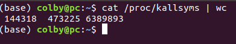
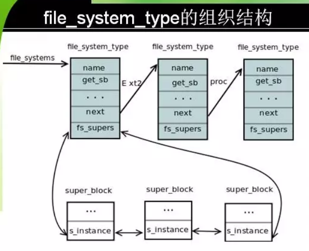
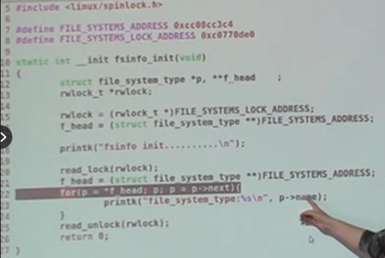
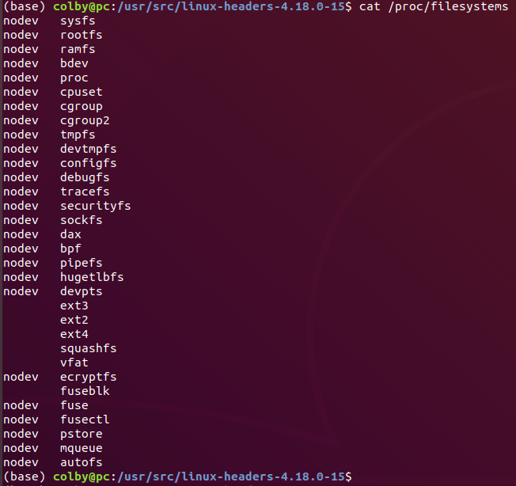

 内核　中的符号和函数：





这里的　file_systems　虽然是一个　全局变量，但是并没有导出符号，所以在其他地方用不了这个全局变量。但是我们可以用下面的这种办法去使用：

1. 首先从符号表中　找到，这个符号的地址

```shell
 sudo cat /proc/kallsyms | grep file_systems
 
 ffffffff944f5f88 b file_systems  # 0xffffffff944f5f88 这个地址是　3G~4G地址空间的值，是用于内核中的
```

2. 知道了符号的地址，此时，用强制类型转换，转换成　file_systems就可以使用这个地址中的内容了
3. 这个地址不是一个固定的地址，每个机器编译出来地址都不一样



这个代码就实现了　上述所说的这个功能。　不过此时的file_systems的地址是 0xc0770de0

```c
#include <linux/spinlock.h>
#include <linux/init.h>
#include <linux/module.h>
#include <linux/fs.h>

#define FILE_SYSTEMS_ADDRESS 0xffffffff944f5f88
#define FILE_SYSTEMS_LOCK_ADDRESS 0xffffffff944f5f80

static int __init fsinfo_init(void){
    struct file_system_type *p, **f_head;
    rwlock_t *rwlock;

    rwlock = (rwlock_t *) FILE_SYSTEMS_LOCK_ADDRESS;
    f_head = (struct file_system_type **)FILE_SYSTEMS_LOCK_ADDRESS;

    printk("fsinfo init ................\n");
    
    read_lock(rwlock);
    f_head = (struct file_system_type **)FILE_SYSTEMS_LOCK_ADDRESS;
    for(p = *f_head; p; p = p->next){
        printk("file_system_type: %s\n", p->name);
    }
    read_unlock(rwlock);
    return 0;
}

static __exit void fsinfo_exit(void)
{
    printk(KERN_ALERT"fsinfo module exit\n") ;
}

module_init(fsinfo_init);
module_exit(fsinfo_exit);
```

查看filesystems



## fuse

: 是用户文件系统,在用户态,下创建的文件系统。

