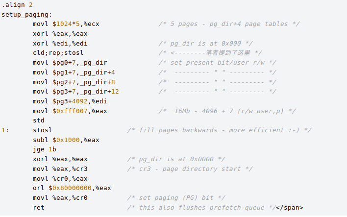

1.AT&T的X86汇编指令；
2.STOSL指令相当于将EAX中的值保存到ES:EDI指向的地址中，若设置了EFLAGS中的方向位置位(即在STOSL指令前使用STD指令)则EDI自减4，否则(使用CLD指令)EDI自增4；
3.在linux0.12内核的head.s文件中，有如下汇编代码：

其中在Intel官方文档《Volume 2A Instruction Set Reference (A-M)》中提到cld指令
CLD:
Description
Clears the DF flag in the EFLAGS register. When the DF flag is set to 0, string operations
increment the index registers (ESI and/or EDI). Operation is the same in all
non-64-bit modes and 64-bit mode.

cld;rep;stosl
cld设置edi或同esi为递增方向，rep做(%ecx)次重复操作，stosl表示edi每次增加4,这条语句达到按4字节清空前5*1024*4字节地址空间的目的。
