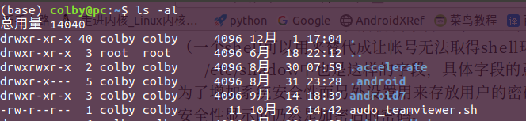
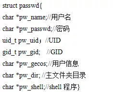
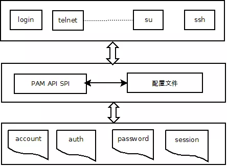

# **1 总体描述**

## **1.1 概述**

Linux身份鉴别机制是保护操作系统安全的重要机制之一，是防止恶意用户进入系统的一个重要环节。早期的身份鉴别机制就是传统的UNIX身份鉴别机制，它采用口令加密并与原密码进行对比的方式来对用户身份进行鉴别。但是这种加密方式过于单一，在一个服务中用户的帐号密码泄露会涉及到多个服务的安全性，所以为了增强系统的安全性，出现了许多其他的身份鉴别机制，如指纹认证、USB认证等。但是这样导致了一个问题，为了应用这些认证机制，就需要重新编写并编译应用程序（如系统登陆服务login）。为了解决这个问题，1995年Sun公司的Vipin Samar和 Charlie Lai提出了PAM(Pluggable Authentication Modules)身份鉴别机制，它采用模块化设计和插件功能，使得系统在更改认证机制时不再需要修改应用程序，极大的提高了认证机制的灵活性。本报告对Linux各用户帐号的权限区别进行了分析，对传统UNIX身份鉴别机制的实现过程进行了研究，重点对PAM身份鉴别机制的实现过程进行了研究与分析，最后通过一个具体的PAM策略演示场景实现了身份鉴别机制的执行过程，研究结果也发现Linux身份鉴别机制是在Linux用户态下实现的，并不涉及内核的具体实现。 

## **1.2 涉及到的源码范围说明**

由于Linux身份鉴别机制是在用户态下实现，本报告涉及的源码包括Linux-PAM-1.1.6、openpam和Linux su命令的实现。具体范围说明如下：

Linux-PAM-1.1.6/moudles/pam_access.c：登录认证模块的实现源码。

Linux-PAM-1.1.6/libpam：PAM所用的头文件。

openpam/lib/pam_acct_mgmt.c：账号管理接口函数实现。

Linux su命令：Linux系统命令源码包。

## **1.3** **技术方案及原理**

Linux身份鉴别机制就是对请求服务的用户身份进行鉴别，并且赋予相应的权限的过程。本文通过查阅资料，分析Linux系统中对各用户帐号的管理及其权限分配，分析传统的UNIX身份鉴别机制，以su命令的代码实现来进行说明，着重分析PAM身份鉴别机制，并对其代码实现来进行分析说明。

### **1.1.1   Linux中用户帐号管理**

在Linux系统中，系统设置了多个帐号和组来进行管理，每个帐号都具有不同的权限，例如超级用户root就具有最大的权限，对所有的文件具有读写执行的权限，但是普通用户对某些文件只具有读有时甚至连读的权限都没有。Linux操作系统并不是以帐号名称来识别用户的，而是以标识符UID和GID来辨别用户的，这些帐号的信息都存放在/etc/passwd文件当中，该文件中记录的每个帐号信息是以行来表现的，如下所示：

root：x：0：0：root：/root：/bin/bash

每行是以7个字段来描述的，每个字段以冒号来进行分隔，其中对应字段的依次解释如下：

1. 帐号名称：用来对应UID。

2. 密码：所有的用户都有对该文件的访问权限，为了防止密码窃取，就将这个字段的密码数据改放到/etc/shadow中了，所以这里显示的是X。

3. UID：用户标识符，表1-1列出了redhat系统中UID号的限制。

【1】

| Id范围             | 该用户ID特性                                                 |
| ------------------ | ------------------------------------------------------------ |
| 0（系统管理员）    | 当UID为0时，代表这个帐号是“系统管理员”！所以当你要让其他的帐号名称也具有root权限时，将该帐号的UID改为0即可。一个系统上面的系统管理员不见得只有root.不过不建议有多个。 |
| 1～499（系统帐号） | 保留给系统使用的ID，其实除了0之外，其他的UID权限与特性并没有不一样。默认500以下的数字让给系统作为保留帐号只是一个习惯。1～99：由distributions自行创建的系统帐号；100～499：若用户有系统帐号需求时，可以使用的帐号UID。 |
| 500～65535         | 给一般用户使用的                                             |

4. GID：用户组标识符，具体信息存放在/etc/group中。

5. 用户信息说明列：解释这个帐号的意义。

6. 主文件夹：即用户的主文件夹。

7. Shell:当用户登录系统后就会取得一个shell来与系统的内核通信以进行用户的操作任务（一个shell可以用来替代成让帐号无法取得shell环境的登录操作/sbin/nologin）。

/etc/shadow中也是这样的字段，具体字段的意义这里不再做详细解释，这个文件主要是为了增加系统安全性而另外设置用来存放用户的密码，只有root用户才有权限访问，但是为了安全性显示的仍然是加密后的密码。

系统是通过UID、GID来对不同的帐号进行区分的，但是系统中是如何对应实现具体的权限设置的呢？这里就从文件的权限来进行说明。执行ls -al命令后，结果如图1-1所示。

每行显示内容分为七列：第一列代表这个文件的类型与权限，第二列表示有多少文件名链接到这个节点，第三列表示这个文件的所有者的帐号，第四列表示这个文件的所属用户组，第五列表示这个文件的容量大小，默认单位为B，第六列为该文件的创建文件日期或者是最近的修改日期，第七列为该文件名。

第一列中总共有10个字符，这10个字符解释如下：

1. 第一个字符为[d],表示为目录，为[-]则是文件，为[l]则是链接文件，为[b]则表示设备文件里面的可供存储的接口设备，为[c]则表示设备文件里面的串行端口设备，比如键盘、鼠标等。

2. 接下来都是以三个字符为一组，一共有三组，且每组都是以“rwx”这样的形式组合，其中[r]代表可读，[w]代表可写，[x]代表可执行，如果没有该权限则会用[-]来表示。第一组是文件所有者的权限，第二组为同组的权限，第三组为其他非本用户组的权限。这样就把文件的可读属性与不同用户帐号的权限对应起来了。

### **1.1.2**  **传统的UNIX身份鉴别机制原理**

传统的UNIX身份鉴别即口令认证方式，它主要通过识别用户的用户名或者UID号获取在/etc/shadow中存放的对应用户密码密文等信息，然后获取用户输入密码并采用crypt()函数对获得的输入密码进行加密，当然加密方式是与原用户密码的加密方式是一致的，然后将这两个密文进行比较，如果一致则通过验证，如果不一致则拒绝赋予权限。接下来以登录Linux系统为例，说明登录过程中传统UNIX认证方式对用户帐号的鉴别过程。Linux用户在登录主机时会出现一个输入账号及密码的界面，Linux会先找寻 /etc/passwd 里面是否有这个账号，如果拒绝用户登录请求，如果有的话则将该账号对应的 UID 、GID、该账号的主目录与shell设定 一并读出，接着就是将用户输入密码进行加密，然后读取/etc/shadow 中存放的密码，将这个密码与用户输入并加密的密码进行核对，如果核对成功，则进入系统。

Linux 提供getpwnam()来获取用户登录的相关信息，返回的是一个passwd型的结构体,该结构体就包含了用户帐号的各种信息，该结构体如下所示。

### **1.1.3**  **PAM身份鉴别机制原理**

PAM（Pluggable Authentication Modules）即可插拔验证模块，它是一个非常完善的身份验证机制，它采用模块化设计和插件功能，从而可以轻易的在应用程序中插入新的鉴别模块或者替换原来的组件，而不必对应用程序做任何修改，从而使软件的定制、维持和升级更加轻松。PAM 的易用性较强，它对上层屏蔽了鉴别的具体细节，用户不必详细知道各种鉴别机制是如何实现的，它还实现了多鉴别机制的集成问题。

#### **1.1.3.1**   **PAM框架**

PAM 为了实现其插件功能和易用性，采取了分层设计思想。就是让各鉴别模块从应用程序中独立出来，然后通过 PAM的API、 SPI作为两者联系的纽带，这样应用程序就可以根据需要灵活地在其中“插入”所需要的鉴别功能模块，从而真正实现了在认证和鉴别基础上的随需应变。PAM框架如下图所示：

                         图1-2 PAM框架图

其中的配置文件(etc/pam.d)是由系统管理员来设置的，用以制定认证策略。当应用程序调用 PAM 的API 时，应用接口层按照 PAM 配置文件的定义来加载相应的认证鉴别模块，然后把请求（即从应用程序那里得到的参数）传递给底层的认证鉴别模块，这时认证鉴别模块就可以根据要求执行具体的认证鉴别操作了。当认证鉴别模块执行完相应的操作后，再将结果返回给应用接口层，然后由接口层根据配置的具体情况将来自认证鉴别模块的应答返回给应用程序。

上面简单描述了PAM的运作方式，下面对它的三个层次加以介绍：

1.最上层为应用程序层：使用PAM 机制的应用程序（如login、su等），调用PAM接口库的上层接口API来实现认证功能；

2.中间为应用接口层：连接应用程序和服务模块的中间层，它根据配置文件中的设置加载相应的服务模块，将请求传递到具体的服务模块，向应用程序的开发者提供API使用各种鉴别模块，向鉴别模块的开发者提供SPI来挂载新的鉴别模块；

3.最下层为服务模块：服务模块中都为动态链接库，它给应用程序提供具体的认证用户服务，应用程序可以使用几个服务模块。PAM所支持的四种任务管理：account 类型表示账户管理，它执行账户管理，它主要用来限制/允许用户对某个服务的访问时间，当前有效的系统资源(最多可以有多少个用户)，限制用户的位置(例如：root用户只能从控制台登录)；auth类型表示认证管理，对用户进行认证。让应用程序提示用户输入密码或者其它的标记，确认用户的合法性；通过它的凭证许可权限，设定组成员关系或者其它优先权；password类型表示口令管理，用于更新与用户相关的认证特性，如更改用户密码；session类型表示会话管理，用于进入给定的服务之前，或者离开给定的服务之后，需要进行的会话操作，如：存储关于与用户交换数据的log信息、挂接目录等。【3】

#### **1.1.3.2**  **PAM的配置文件**

应用PAM的服务例程是通过读取PAM的配置文件初始化pam_handle这个句柄，用来记录整个PAM的过程信息例如服务名、接口传递参数等，定义服务的配置文件存放在/etc/pam.d中，/etc/pam.conf也是pam的配置文件，该配置文件是老版本的配置文件，目前所安装的版本当中，如果有pam.d这个文件就首要读取这个文件，若没有再读取pam.conf这个文件，另外若所读服务不存在相应配置文件，此时系统会读取other这个配置文件的信息，other这个配置文件是所有服务的缺省选项。pam.d中的配置文件的语法形式如下：

module-type control-flag mudle-path arguments【3】

1.module-type：linux PAM 所提供的四种服务模块，包括auth、account、session、password；

2.control-flag：控制标志用来设置验证成功或者失败后PAM需要做出的反应，有四个关键词如下所示：

required：表示即使某个模块对用户的验证失败，也要等所有的模块执行完成，PAM才可以返回错误信息，如此用户就不知道被哪个模块拒绝了。

requisite：一旦模块对用户的验证失败，PAM立马返回出错信息。

sufficient：一旦模块对用户的验证成功，PAM立马返回成功信息，并把控制权交给用户。

optional：PAM会忽略这个模块所产生的验证错误，继续执行下一个模块。

3.module-path：PAM验证模块的路径；

4.arguments：传递给模块的参数。参数是可选择的，可以是读取另外配置文件的路径信息，也可以是各种模块所需的传递参数。以下列出pam_unix模块的参数信息：

 

表1-2 pam_unix模块参数【3】

| 参数           | 说明                                                         |
| -------------- | ------------------------------------------------------------ |
| debug          | 打开调试信息，通过syslog写入日志系统                         |
| audit          | 比debug记录更为详细的调试信息                                |
| nullok         | 默认值下，如果用户输入的口令为空，则不允许用户访问服务，该参数覆盖率这个默认值，即使不输入口令就可以获得服务 |
| nodelay        | 取消延迟，默认是2秒为延迟时间                                |
| try_first_pass | 提示用户使用前面模块认证通过的口令，只适用于auth 类型        |
| use_first_pass | 强制使用前面模块认证通过的口令，只适用于auth password类型    |
| not_authok     | 当口令改变时，强制模块设置新口令到以前模块提供的口令         |
| md5            | 当用户下次改变他们的口令时，使用md5算法加密口令              |
| shadow         | 维护shadow口令，即使用/etc/shadow存储口令                    |
| unix           | 当用户更改密码时，密码被放置在/etc/passwd中                  |
| bigcrype       | 当用户下次改变口令时，使用DEC C2算法加密口令                 |
| nis            | 使用NISRPC（远程过程调用）设置新口令                         |
| Remember=x     | 将每个用户最后x个口令存储在/etc/security/opasswd文件中,用于强制口令更改历史，以免用户频繁使用同一个口令 |
| broken_shadow  | 在account管理模块中读取shadow口令时忽略错误                  |

pam_conf配置文件的写法与pam.d中的配置文件没有太大的出入，只是在最前面多了一行具体的服务名称，例如login，而pam.d中是将各种模块分开来写，这样更便于控制。

#### **1.1.3.3**  **PAM接口函数**

PAM提供了多种接口函数以供用户使用，其中包括框架API【4】、服务类型的API和服务模块SPI。

框架API：

每个支持PAM机制的应用程序在使用PAM机制之前必须调用函数pam_start()初始化PAM上下文和PAM事务，使用完后调用pam_end()来结束PAM机制，通过pam_get_item、pam_set_item()来读写PAM事物的状态信息，通过pam_get_data()、pam_set_data()来取得和设置PAM模块及会话的相关信息，通过pam_putenv()、pam_getenv()、pam_getenvlist()来读写环境变量，通过pam_strerror()返回相关的错误信息；

服务类型的API：

1.认证管理模块通过pam_authenticate()对用户名和密码进行认证，通过pam_setcred()用来修改用户的信任参数，建立数字认证；

2.账户管理模块通过pam_acct_mgmt()来检查用户本身是否具有权限登录系统、账户是否过期、账户是否有登录时间限制等；

3.密码管理模块通过pam_chauthtok()来修改用户的密码；

4.会话管理模块通过pam_open_session()来开始会话，以pam_close_session()来结束会话；

PAM中的API与SPI详细解释如表1-3所示。

表1-3 PAM中API以及SPI【3】

| 服务管理类型        | PAM   API             | PAM  SPI                                                | 说明                                   |
| ------------------- | --------------------- | ------------------------------------------------------- | -------------------------------------- |
| account             | pam_acct_mgmt()       | pam_sm_acct_mgmt()                                      | 检查认证特性、账户有效期和验证访问控制 |
| authentication      | pam_authenticate()    | pam_sm_authenticate()                                   | 根据认证特征认证用户                   |
| pam_setcred()       | pam_sm_setcred()      | 在认证后会话前调用，用来修改用户的信任参数，如：uid gid |                                        |
| passwd              | pam_chauthtok()       | pam_sm_chauthtok()                                      | 用于改变给定用户的认证特征             |
| session             | pam_open_session()    | pam_sm_open_session()                                   | 为认证成功的用户建立会话               |
| pam_close_session() | pam_sm_open_session() | 结束会话                                                |                                        |

文章的参考文献：

【1】鸟哥的私房菜.人民邮电出版社.2010.

【2】Linux安全策略与实例.李洋等.机械工业出版社.2009.

【3】Linux安全体系分析与编程.倪继利.电子工业出版社.2007.11

【4】The Linux-PAM Application Developers' Guide