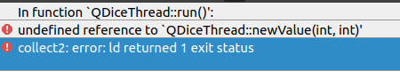

# 论Q_OBJECT 的重要性

当我们在一个自己定义的C++ 类中，例如使用发射信号，如果在类的声明中不加，会报错的。

```c++
class QDiceThread : public QThread
{
...
public:
    QDiceThread();

signals:
    void newValue(int seq, int diceValue); // 产生新点数的信号
};
```

如果不加，会报错的：



解决办法，加　Q_OBJECT

```c++
class QDiceThread : public QThread
{
    Q_OBJECT
    // 如果要引用qt中的特性，　就要在最开始的地方，添加　Q_OBJECT　很关键的
public:
    QDiceThread();

signals:
    void newValue(int seq, int diceValue); // 产生新点数的信号
};
```

然后将　build-samp13_1_cbx-Desktop_Qt_5_12_3_GCC_64bit-Debug目录下面的东西全部清理掉。

