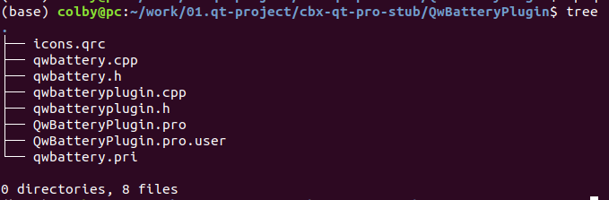
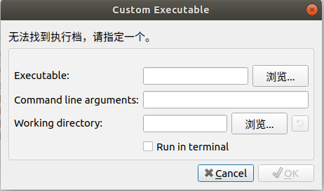

1. 从插件的debug 模式下编译的目录下cp

```shell
cp libqwbatteryplugin.so /home/colby/work/qt5.12/Tools/QtCreator/lib/Qt/plugins/designer/
```

2.如下是源码目录



3. 从源码中拷贝如下文件

```shell
cp qwbattery.* ../samptestcao/
```

拷贝到　将要用这个插件的的新工程目录下面

4. 删除 QDESIGNER_WIDGET_EXPORT 和　#include <QDesignerExportWidget>

   删除后的代码如下：　qwbattery.h

```c++
#ifndef QWBATTERY_H                                                                                                                                                                                                
#define QWBATTERY_H
#include <QDesignerExportWidget>
#include <QWidget>
#include <QColor>
class QDESIGNER_WIDGET_EXPORT QwBattery : public QWidget
{
    Q_OBJECT

public:
    QwBattery(QWidget *parent = 0); 

    // 自定义属性
    Q_PROPERTY(int powerLevel READ powerLevel WRITE setPowerLevel NOTIFY powerLevelChanged
               DESIGNABLE true)

private:
    QColor mColorBack = Qt::white; // 背景色
    QColor mColorBorder = Qt::black; // 电池边框颜色
    QColor mColorPower = Qt::green; // 电量柱颜色
    QColor mColorWarning = Qt::red; // 电量短缺时的颜色

    int mPowerLevel = 60; // 电量 0 ~ 100
    int mWarnLevel = 20; // 电量低警示阀值

protected:
    void paintEvent(QPaintEvent *event) Q_DECL_OVERRIDE;

public:
    void setPowerLevel(int pow); // 设置当前电量
    int powerLevel();
    void setWarnLevel(int warn); // 设置电量低阀值
    int warnLevel();
    QSize sizeHint(); // 报告缺省大小

signals:
    void powerLevelChanged(int);
public slots:

};

#endif // QWBATTERY_H
```

5. 如果构建的时候，始终弹出如下对话框



解决方法是：【构建】-> 【重新构建该工程】

6. 在新建的项目的.pro文件中添加下面代码

   ```
   include(qwbattery.pri)
   ```

