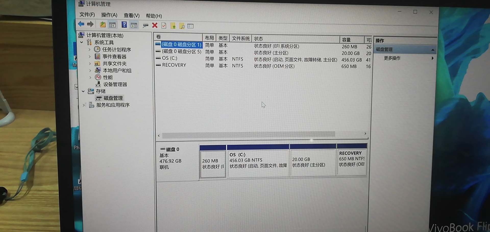
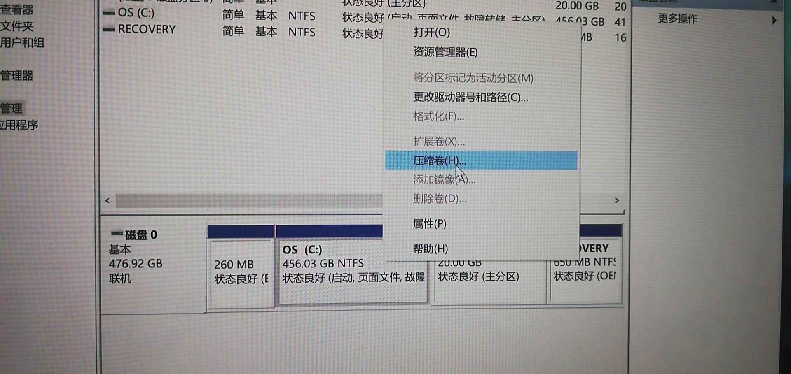
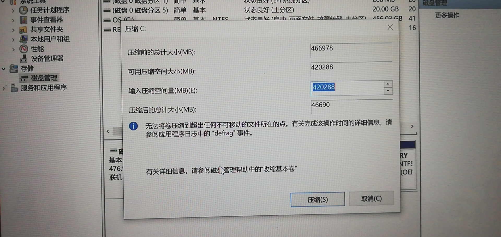

# env:

当前 windows 下 c 盘 剩余 120GB的空间(打开文件夹 点击属性可以看到)，此时我们还是将 ubuntu 安装到 c 盘中：

# 分配空间：

点开磁盘管理，这里可以看到 我已经 安装将要表述的方法， 分配好了20GB, 并且已经成功安装ubuntu

选择 OS(c:)然后 右键 -> 压缩卷

此时填充 20480 MB （20GB）

此时，点击压缩，  返回之后，就会看到 有 20GB 的空闲分区。

# 安装：

此时用 u盘 安装 ubuntu 系统,在安装的时候，留意，选择， [正常安装] -> [特殊安装（ps 不记得了）] -> 然后选择这 20GB的空闲分区   ext4   作为 /     , 然后点击 安装。

此时就可以安装成功了。le

  