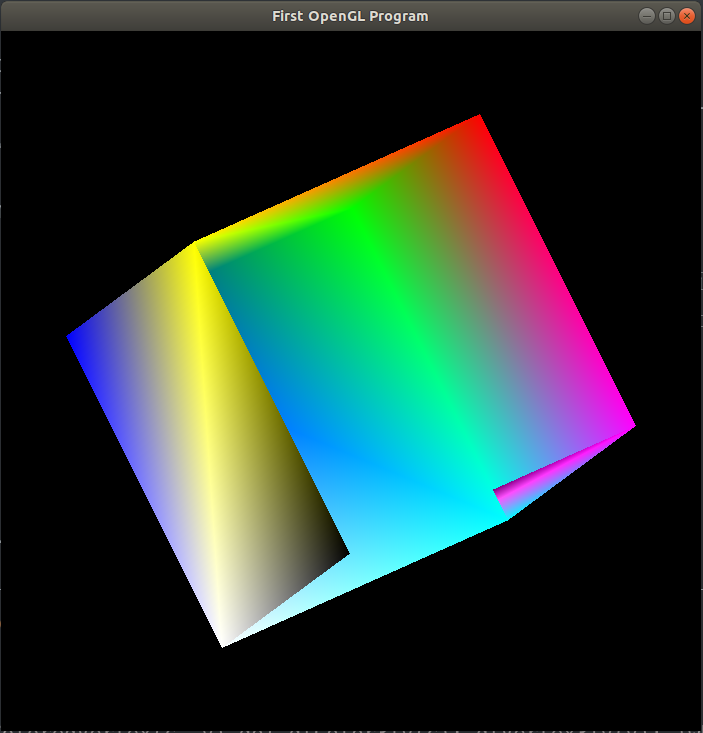

首先安装OpenGl库：

 

1. 建立基本编译环境
首先不可或缺的，就是编译器与基本的函式库，如果系统没有安装的话，请依照下面的方式安装：

$ sudo apt-get install build-essential

 

安装OpenGL Library
接下来要把我们会用到的 Library 装上去，首先安装 OpenGL Library
$sudo apt-get install libgl1-mesa-dev

 

安装OpenGL Utilities
OpenGL Utilities 是一组建构于 OpenGL Library 之上的工具组，提供许多很方便的函式，使 OpenGL 更强大且更容易使用。接下来我们安装OpenGL Utilities

$sudo apt-get install libglu1-mesa-dev

 

安装OpenGL Utility Toolkit
OpenGL Utility Toolkit 是建立在 OpenGL Utilities 上面的工具箱，除了强化了 OpenGL Utilities 的不足之外，也增加了 OpenGL 对于视窗介面支援。

$sudo apt-get install libglut-dev

注意在这一步的时候，可能会出现以下情况，shell提示：正在读取软件包列表... 完成正在分析软件包的依赖关系树      正在读取状态信息... 完成      E: 未发现软件包 libglut-dev如果出现上述情况，请输入将上述$sudo apt-get install libglut-dev命令改成$sudo apt-get install freeglut3-dev就行拉，
设定编译参数与编译

 

测试实例（Test.cpp文件），可以使用gedit编辑或者使用vi编辑。

```c++
//Test.cpp
#include <GL/glut.h>
 
#define ColoredVertex(c, v) do{ glColor3fv(c); glVertex3fv(v); }while(0)
static int angle = 0;
static int rotateMode = 0;
 
void myDisplay16(void)
{
	static int list = 0;
	if (list == 0)
	{
		GLfloat
			PointA[] = { 0.5f, 0.5f, -0.5f },
			PointB[] = { 0.5f, -0.5f, -0.5f },
			PointC[] = { -0.5f, -0.5f, -0.5f },
			PointD[] = { -0.5f, 0.5f, -0.5f },
			PointE[] = { 0.5f, 0.5f, 0.5f },
			PointF[] = { 0.5f, -0.5f, 0.5f },
			PointG[] = { -0.5f, -0.5f, 0.5f },
			PointH[] = { -0.5f, 0.5f, 0.5f };
		GLfloat
			ColorA[] = { 1, 0, 0 },
			ColorB[] = { 0, 1, 0 },
			ColorC[] = { 0, 0, 1 },
			ColorD[] = { 1, 1, 0 },
			ColorE[] = { 1, 0, 1 },
			ColorF[] = { 0, 1, 1 },
			ColorG[] = { 1, 1, 1 },
			ColorH[] = { 0, 0, 0 };
 
		list = glGenLists(1);
		glNewList(list, GL_COMPILE);
		
		// 面1
		glBegin(GL_POLYGON);
		ColoredVertex(ColorA, PointA);
		ColoredVertex(ColorE, PointE);
		ColoredVertex(ColorH, PointH);
		ColoredVertex(ColorD, PointD);
		glEnd();
		
		// 面2
		glBegin(GL_POLYGON);
		ColoredVertex(ColorD, PointD);
		ColoredVertex(ColorC, PointC);
		ColoredVertex(ColorB, PointB);
		ColoredVertex(ColorA, PointA);
		glEnd();
		
		// 面3
		glBegin(GL_POLYGON);
		ColoredVertex(ColorA, PointA);
		ColoredVertex(ColorB, PointB);
		ColoredVertex(ColorF, PointF);
		ColoredVertex(ColorE, PointE);
		glEnd();
		
		// 面4
		glBegin(GL_POLYGON);
		ColoredVertex(ColorE, PointE);
		ColoredVertex(ColorH, PointH);
		ColoredVertex(ColorG, PointG);
		ColoredVertex(ColorF, PointF);
		glEnd();
		
		// 面5
		glBegin(GL_POLYGON);
		ColoredVertex(ColorF, PointF);
		ColoredVertex(ColorB, PointB);
		ColoredVertex(ColorC, PointC);
		ColoredVertex(ColorG, PointG);
		glEnd();
		
		// 面6
		glBegin(GL_POLYGON);
		ColoredVertex(ColorG, PointG);
		ColoredVertex(ColorH, PointH);
		ColoredVertex(ColorD, PointD);
		ColoredVertex(ColorC, PointC);
		glEnd();
		glEndList();
 
		glEnable(GL_DEPTH_TEST);
	}
	
	// 已经创建了显示列表，在每次绘制正四面体时将调用它
	glClear(GL_COLOR_BUFFER_BIT | GL_DEPTH_BUFFER_BIT);
	glPushMatrix();
	glRotatef(angle / 10, 1, 0.5, 0.0);
	glCallList(list);
	glPopMatrix();
	glutSwapBuffers();
}
 
void myIdle6(void)
{
	++angle;
	if (angle >= 3600.0f)
	{
		angle = 0.0f;
	}
	myDisplay16();
}
 
int main(int argc, char *argv[])
{
	glutInit(&argc, argv);
	glutInitDisplayMode(GLUT_RGBA | GLUT_DOUBLE);
	glutInitWindowPosition(100, 100);
	glutInitWindowSize(700, 700);
	glutCreateWindow("First OpenGL Program");
	
	glutDisplayFunc(&myDisplay16);
	glutIdleFunc(&myIdle6);     //空闲调用
 
	glutMainLoop();
 
	return 0;
}
```

```makefile
all:
	gcc env.c  -l GL -l GLU -l glut
```


编译连接生成：

 

C++编译器编译生成：$g++ Test.cpp -o test  -l GL -l GLU -l glut

 

C编译器编译生成     ：$gcc Test.cpp -o test  -l GL -l GLU -l glut

编译成功会输出名为test的执行文件， 接下来可以执行test文件： $ ./test

补充：

在CentOS中安装库的安装命令：

$yum install -y mesa*

$yum install -y freeglut*

注：

绘制时，添加面时注意点的顺序，这会影响显示效果。

到此整个流程就全部结束。OK！！下面是运行效果图！

编译连接生成：

 

C++编译器编译生成：$g++ Test.cpp -o test  -l GL -l GLU -l glut

 

C编译器编译生成     ：$gcc Test.cpp -o test  -l GL -l GLU -l glut

编译成功会输出名为test的执行文件， 接下来可以执行test文件： $ ./test

补充：

在CentOS中安装库的安装命令：

$yum install -y mesa*

$yum install -y freeglut*

注：

绘制时，添加面时注意点的顺序，这会影响显示效果。

到此整个流程就全部结束。OK！！下面是运行效果图！

